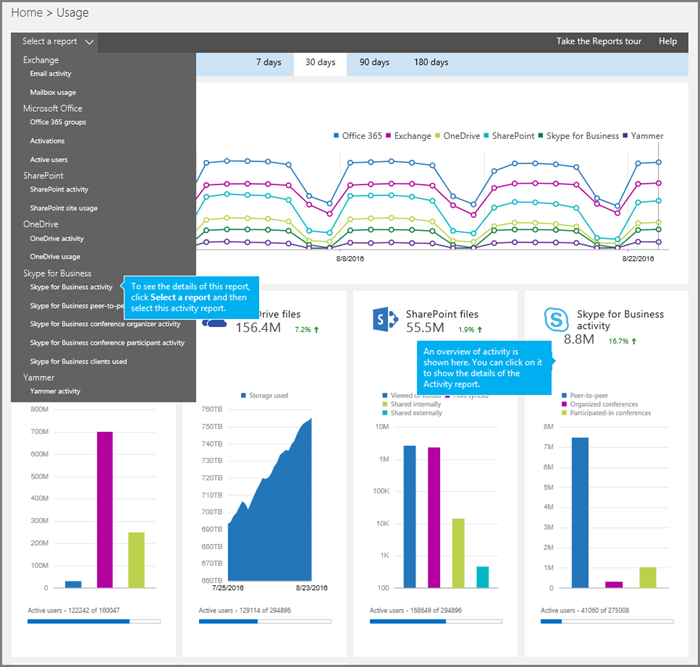
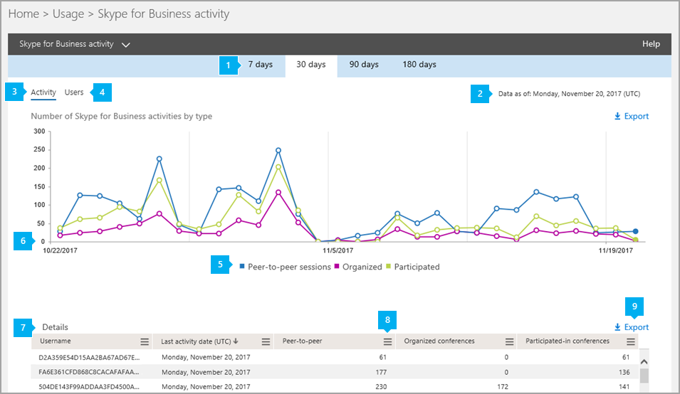

# Activity report

The new Office 365 **Reports** dashboard shows you the activity overview across the Office 365 products in your organization. It enables you to drill in to individual product-level reports to give you more granular insight about the activities within each product. For example, you can use the **Skype for Business activity** report to see how much your users are using peer-to-peer or organized conferencing sessions, or how much they're participating in conferencing sessions. 

Check out the [Reports overview](https://support.office.com/article/0d6dfb17-8582-4172-a9a9-aed798150263) to learn more.
  
This report, along with the other Skype for Business reports, gives you details on activity across your organization. These details are very helpful when you are investigating, planning, and making other business decisions for your organization.
  
> [!NOTE]
> You can see all of the Skype for Business reports when you log on as an administrator in the Microsoft 365 admin center. 
  
## How to get to the Skype for Business activity report

1. Go to the admin center > **Reports** > **Usage**.
    
2. On the **Usage** page, click **Skype for Business activity** on the **Select a report list** on the left, or click the **Skype for Business activity** widget.
    
     
  
    > [!IMPORTANT]
    > Depending on the Office 365 subscription you have, you might not see all the products and reports shown here. 
  
## Interpret the Skype for Business activity report

You can get a view into your user's Skype for Business activity by looking at the **Activity** and **Users** charts.
  

  
***
 
The **Skype for Business Activity**  email activity report can be viewed for trends over the last 7 days, 30 days, 90 days, or 180 days. However, if you click into a particular day in the report, the table (see number 7) will show data for up to 28 days from the current date (not the date the report was generated).

> [!NOTE]
> If you click into the details of a specific day, the table will only show data for the 30 days up to the date when the report was generated.

***
 
Each report has a date for when this report was generated. The reports usually reflect a 24- to 48-hour latency from time of activity. 
***
 
Use the interactive chart data on the **Activity** chart to understand usage trends and to see the number of conference activities that are being held in your organization. It will show you the total number and types of **Peer-to-peer sessions**, **Organized** and **Participated** in conference sessions across your organization. 
***
 
Use the interactive chart data on the **Users** chart to understand usage trends and to see the number of unique users that are participating in conference activities that are being held in your organization. It will show you the total number of users along with the types of **Peer-to-peer sessions**, **Organized**, and **Participated** in conference sessions.
***
 
You can filter the series you see on the chart by clicking on an item in the legend. For example, on the **Activity** chart, click or tap **Peer-to-peer sessions**, **Organized**, or **Participated** to see only the info related to each one. Changing this selection doesn't change the info in the grid table. 
***
 
Each chart has an 'X' (horizontal) and 'Y' (vertical) axis.
*    On the **Activity** chart, the Y axis is the total number of peer-to-peer, organized, and participated in conference sessions that are held.
*    On the **Users** activity chart, the Y axis is the number of unique users attending in each type of peer-to-peer, organized, and participated in conference.

The X axis on both charts is the selected date range for this specific report. 
***
 
The table shows you a breakdown of all the conferencing activities per user. This shows all users who have Skype for Business assigned to them and their conferencing activities. You can add additional columns to the table.
* **Username** is the name of the user.
* **Deleted** indicates that the user's license was removed.  
  > [!NOTE]
  > Activity for a deleted user will still display in a report as long as he or she was licensed at some time during the selected time period. The **Deleted** column helps you to note that the user may no longer be active, but contributed to the data in the report.
     
* **Deleted date** is the date on which the user's license was removed.
* **Last activity date (UTC)** is the latest time the user engaged in a peer to peer session, or organized a conference or participated in a conference.
* **Peer-to-peer** shows the total number of peer-to-peer conference sessions that the user used.
* **Organized conferences** shows the total number of conferences that were organized by that user.
* **Participated-in conferences** shows the total number of conferences that this user participated in.
* **Product assigned** is the Office 365 products that are assigned to this user. 

If your organization's policies prevent you from viewing reports where user information is identifiable, you can change the privacy setting for all these reports. Check out the **Hide user details in the reports** section in the [Activity Reports in the admin center](https://support.office.com/article/0d6dfb17-8582-4172-a9a9-aed798150263).
***
 
Click or tap the **Columns** icon in any of the columns to add or remove columns from the report.             
***
 
You can also export the report data into an Excel .csv file, by clicking or tapping **Export**.               This exports data of all users and enables you to do simple sorting and filtering for further analysis. If you have fewer than 2000 users, you can sort and filter within the table in the report itself. If you have more than 2000 users, in order to filter and sort, you will need to export the data. 
   
## Want to see other Skype for Business reports?

- [Skype for Business device usage report](device-usage-report.md) You can to see the devices, including Windows-based operating systems and mobile devices, that have the Skype for Business app installed and are using it for IM and meetings.
    
- [Skype for Business conference organizer activity report](conference-organizer-activity-report.md) You can see how much your users are organizing conferences that use IM, audio/video, application sharing, Web, dial-in/out - 3rd party, and dial-in/out - Microsoft.
    
- [Skype for Business peer-to-peer activity report](peer-to-peer-activity-report.md) You can see how much your users are using IM, audio/video, application sharing, and transferring files.
    
- [Skype for Business users blocked report](users-blocked-report.md) You can see the users in your organization that have been blocked from making PSTN calls.
    
- [Skype for Business PSTN usage report](pstn-usage-report.md) You can see the number of minutes spent in inbound/outbound calls and cost for these calls.

- [Skype for Business PSTN minute pools report](pstn-minute-pools-report.md) you can see the number of minutes consumed during the current month within your organization.

- [Skype for Business session details report](session-details-report.md) You can see details about individual user's call experiences.

    
## Related topics
[Activity Reports in the admin center](https://support.office.com/article/0d6dfb17-8582-4172-a9a9-aed798150263)

  
 
