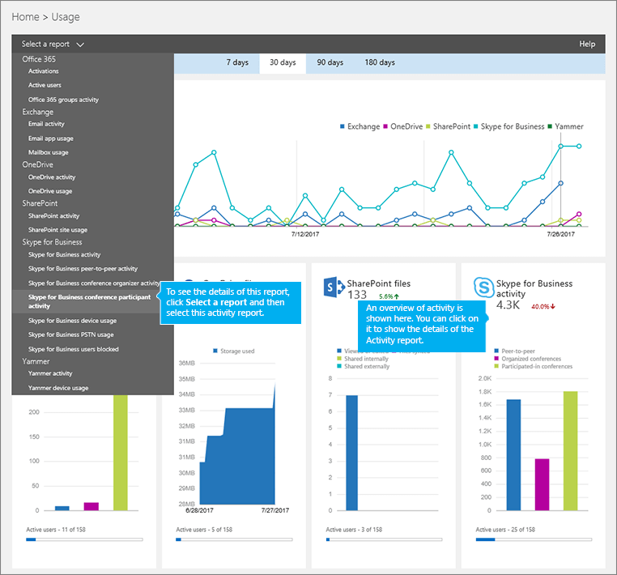
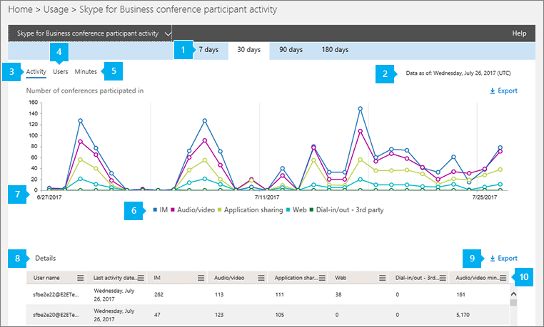

# Conference participant activity report

As an Office 365 admin, the new **Reports** dashboard shows you data on the usage of the Office 365 products within your organization. You can use the **Skype for Business conference participant activity** report to see how many IM, audio/video, application sharing, Web and dial-in/out conferences are being participated in by users in your organization.

Check out the [Reports overview](https://support.office.com/article/0d6dfb17-8582-4172-a9a9-aed798150263) to learn more.
  
This report, along with the other Skype for Business reports, gives you details on conferencing activity across your organization. These details are very helpful when you are investigating, planning, and making other business decisions for your organization.
  
> [!NOTE]
> You can see all of the Skype for Business reports when you log on as an administrator to the Microsoft 365 admin center. 
  
## How to get to the Skype for Business conference participant report

1. Go to the admin center > **Reports** > **Usage**.
    
2. On the **Usage** page, click **Skype for Business conference participant activity** on the **Select a report list** on the left. Or, click the **Skype for Business activity** widget and then click **Skype for Business conference participant activity** on the **Skype for Business activity** list.
    
     
  
    > [!IMPORTANT]
    > Depending on the Office 365 subscription you have, you might not see all the products and activity reports shown here. 
  
## Interpret the Skype for Business conference participant activity report

  
***
 The **Skype for Business Conference Participant Activity** report can be viewed for trends over the last 7 days, 30 days, 90 days, or 180 days. However, if you click into a particular day in the report, the table (see number 7) will show data for 30 days, up to the date (see number 2) for when the report was generated.
> [!NOTE]
> If you click into the details of a specific day, the table will only show data for the 30 days up to the date when the report was generated.
     
***
 Each report has a date for when this report was generated. The reports usually reflect a 24- to 48-hour latency from time of activity. 
***
 Use the interactive chart data on the **Activity** chart to understand usage trends and to see the total number of conferences that were participated in and the type of conferences that are being held in your organization. It will show you the total number and types of **IM**, **Audio/video**, **Application sharing**, **Web**, and **Dial-in/out - 3rd party** conferences that were participated in across your organization.
***
 Use the interactive chart data on the **Users** chart to understand usage trends and to see the number of unique users that have participated in conferences that are being held in your organization. It will show you the total number of users along with the types of **IM**, **Audio/video**, **Application sharing**, **Web**, and **Dial-in/out - 3rd party** of conferences that were organized.
***
 Use the interactive chart data on the **Minutes** chart to understand usage trends and to see the number of minutes that are used by users when they organize a conference using audio/video, and dial-in and dial-out - Microsoft as their audio conferencing provider. It will show you the total number of minutes of **Audio/video** that are used during conferences that were participated in.
***
 You can filter the series you see on the chart by clicking on an item in the legend. For example, on the **Activity** chart, click or tap **IM**, **Audio/video**, **Application sharing**, **Web**, and **Dial-in/out - 3rd party** to see only the info related to each one. Changing this selection doesn't change the info in the grid table. 
***
 Each chart has an 'X' (horizontal) and 'Y' (vertical) axis.  
*    On the **Activity** activity chart, the Y axis is the total number of IM, audio/video, application sharing, Web, and dial-in/out 3rd party conferences your users in your organization participated in. 
*    On the **Users** activity chart, the Y axis is the total number users that held IM, audio/video, application sharing, Web, and dial-in/out 3rd party conferences your users in your organization participated in.
*    On the **Minutes** activity chart, the Y axis is the total number of minutes that audio/video was used for conferences that your users in your organization participated in.

The X axis on both charts is the selected date range for this specific report.
***
 The table shows you a breakdown of the participated in conference activities per user. This shows all users that have Skype for Business assigned to them and conferences that they participated in. You can add additional columns to the table.
*    **User name** is the name of the user. 
*    **Deleted** indicates that the user's license was removed.     **Note:**  Activity for a deleted user will still display in a report as long as he or she was licensed at some time during the selected time period. The **Deleted** column helps you to note that the user may no longer be active, but contributed to the data in the report.      
*    **Deleted date** is the date on which the user's license was removed. 
*    **Last activity date (UTC)** is the last activity date (UTC) for that user.
*    **IM** shows the total number of IM conferences that were participated in. 
*    **Audio/video** shows the total number of audio/video conferences that were participated in.
*    **Application sharing** shows the total number of application sharing conferences that were participated in.
*    **Web** shows the total number of Web conferences that were participated in. 
*    **Dial-in/out - 3rd party** shows the total number of dial-in/out conferences that were organized that use a 3rd party audio conferencing provider. 
*    **Audio/video minutes** shows the total number of minutes used when used participated in conferences that used audio/video. 

If your organization's policies prevents you from viewing reports where user information is identifiable, you can change the privacy setting for all these reports. Check out the **How do I hide user level details?** section in the [Activity Reports in the admin center](https://support.office.com/article/0d6dfb17-8582-4172-a9a9-aed798150263).
***
 You can also export the report data into an Excel .csv file, by clicking or tapping **Export**.              This exports data of all users and enables you to do simple sorting and filtering for further analysis. If you have less than 2000 users, you can sort and filter within the table in the report itself. If you have more than 2000 users, in order to filter and sort, you will need to export the data.
***
 Click or tap **Columns** to add or remove columns from the report.             
   
## Want to see other Skype for Business reports?

- [Skype for Business activity report](activity-report.md) You can see how much your users are using peer-to-peer, organized, and participated in conferencing sessions.
    
- [Skype for Business device usage report](device-usage-report.md) You can to see the devices including Windows-based operating systems and mobile devices that have the Skype for Business app installed and are using it for IM and meetings.
    
- [Skype for Business conference organizer activity report](conference-organizer-activity-report.md) You can see how much your users are organizing conferences that use IM, audio/video, application sharing, Web, dial-in/out - 3rd party, and dial-in/out - Microsoft.
    
- [Skype for Business peer-to-peer activity report](peer-to-peer-activity-report.md) You can see how much your users are using IM, audio/video, application sharing and transferring files.
    
- [Skype for Business users blocked report](users-blocked-report.md) You can see the users in your organization that have been blocked from making PSTN calls.
    
- [Skype for Business PSTN usage report](pstn-usage-report.md) You can see the number of minutes spent in inbound/outbound calls and cost for these calls.
    
- [Skype for Business PSTN minute pools report](pstn-minute-pools-report.md) you can see the number of minutes consumed during the current month within your organization.

- [Skype for Business session details report](session-details-report.md) You can see details about individual user's call experiences.
    
## Related topics
[Activity Reports in the admin center](https://support.office.com/article/0d6dfb17-8582-4172-a9a9-aed798150263)

  
 