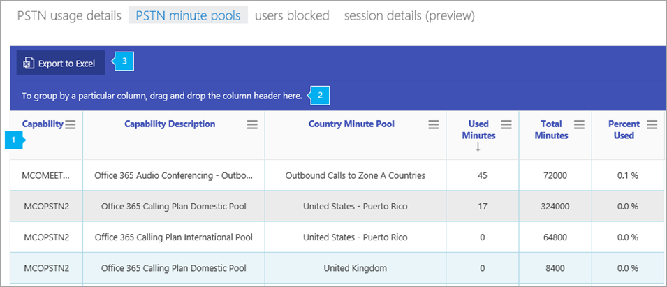

# PSTN minute pools report

>[!NOTE]
>This report is only available to preview customers.

The new Skype for Business Admin Center **Reports** area shows you calling and audio conferencing activity in your organization. It enables you to drill into reports to give you more granular insight about the activities of each user. For example, you can use the **Skype for Business PSTN minute pools** report to see the number of minutes consumed during the current month within your organization.
  
Check out the [Reports overview](https://support.office.com/article/0d6dfb17-8582-4172-a9a9-aed798150263) for more reports that are available.
  
This report, along with the other Skype for Business reports, gives you details on activity across your organization. These details are very helpful when investigating, planning, and making other business decisions for your organization and for setting up [Communications Credits](/microsoftteams/what-are-communications-credits)
  
> [!NOTE]
> You can see all of the Skype for Business reports when you log on as an administrator to the Microsoft 365 admin center. 
  
## How to get to the Skype for Business PSTN minute pools report

 **Using the Skype for Business admin center**

- Go to the admin center > **Admin centers** > **Skype for Business admin center** > **Reports** > **PSTN minute pools**.
    
> [!NOTE]
> Depending on the Office 365 subscription you have, you might not see all the same details shown here. 
  
## Interpret the Skype for Business PSTN minute pools report

You can get a view into your user's Skype for Business minute pools by looking at each of the columns that are displayed.
  
This is what the report looks like.
  
## 

  
***
 The table shows you a breakdown of minute pools by license (capability) and usage location. 
*    **Capability** is the license/service plan used for the call. The license/service plans you may see in this report include:
     * MCOPSTN1 - Domestic Calling Plan (3000-minute US/1200-minute EU plans
     * MCOPSTN2 - Domestic & International Calling Plan from which you will see a domestic pool (3000-minute US/Canada/PR, 1200-minute European countries) and an international pool (600-minutes). Minute cap is reached whenever the domestic -OR- international cap is reached within the calendar month. 
     * MCOPSTN5 - Domestic Calling Plan (120-minute calling plan)
     * MCOPSTN6 - Domestic Calling Plan (240-minute calling plan)
     * MCOMEETADD - Audio Conferencing
*    **Capability Description** is a description of the license type utilized for the call.
*    **Country Minute Pool** is the license usage location of the user(s) who share the minute pool. 
*    **Used Minutes** is the number of minutes used each month.
*    **Total Minutes** is the total number of minutes available for the month. 
*    **Percent Used** is the percent of minutes used for the month. 
***
 Click to drag a column to **To group by a particular column, drag and drop the column header here** if you want to create a view that groups all of the data in one or more columns. 
***
 You can also export the report data into an Excel .csv file, by clicking or tapping the **Export to Excel** button.    This exports data of all users and enables you to do simple sorting and filtering for further analysis. If you have fewer than 2000 users, you can sort and filter within the table in the report itself. If you have more than 2000 users, in order to filter and sort, you will need to export the data.
   
## Want to see other Skype for Business reports?

- [Skype for Business activity report](activity-report.md) You can see how much your users are using peer-to-peer, organized, and participated in conferencing sessions.
    
- [Skype for Business device usage report](device-usage-report.md) You can to see the devices including Windows-based operating systems and mobile devices that have the Skype for Business app installed and are using it for IM and meetings.
    
- [Skype for Business conference organizer activity report](conference-organizer-activity-report.md) You can see how much your users are organizing conferences that use IM, audio/video, application sharing, Web, /dial out - 3rd party, and /dial out - Microsoft.
    
- [Skype for Business conference participant activity report](conference-participant-activity-report.md) You can see how many IM, audio/video, application sharing, Web and dial out audio conferences are being participated in.
    
- [Skype for Business peer-to-peer activity report](peer-to-peer-activity-report.md) You can see how much your users are using IM, audio/video, application sharing and transferring files.
    
- [Skype for Business users blocked report](users-blocked-report.md) You can see the users in your organization that have been blocked from making PSTN calls.

- [Skype for Business session details report](session-details-report.md) You can see details about individual user's call experiences.
    
## Related topics
[Activity Reports in the admin center](https://support.office.com/article/0d6dfb17-8582-4172-a9a9-aed798150263)

  
   
