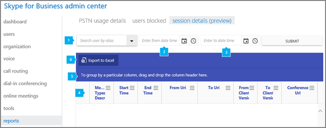

# Session details report

The new Office 365 **Reports** dashboard shows you the activity overview across the Office 365 products in your organization. It enables you to drill in to individual product level reports to give you more granular insight about the activities within each product. For example, you can use the **Skype for Business Session details** report to see details about individual user's call experiences.
  
Check out [Reports overview](https://support.office.com/article/0d6dfb17-8582-4172-a9a9-aed798150263) for more reports that are available.
  
This report, along with the other Skype for Business reports give you details on activity including session details across your organization. These details are very helpful when you investigating, planning, and making other business decisions for your organization and for setting up [Communications Credits](/microsoftteams/what-are-communications-credits).
  
> [!NOTE]
> You can see all of the Skype for Business reports when you log on as an administrator to the Office 365 admin center. 
  
## How to get to the Skype for Business Session details report

1. Go to the **Office 365 admin center** > **Reports**
    
2. Select **Reports** from the left menu, and then click **Usage**.
    
3. In the list under **Select a report**, click **Skype for Business Session details**.
    
    > [!TIP]
    > If you don't see this report listed, go to **Skype for Business admin center** > **Reports** > **Session details**. 
  
    > [!IMPORTANT]
    > Depending on the Office 365 subscription you have, you might not see all the products and reports that are shown here. 
  
## Interpret the Skype for Business Session details report

You can get a view into your user's Skype for Business session details by looking at each of the columns that are displayed.
  
This is what the report looks like.
  

  
***
 **Search user by alias** lets you search for a single user and displays all of the user's session details in the table below. 
***
 **Enter from date time** lets you put in the start date. You can use the calendar to select the date or enter the date manually. This field must be populated.
***
 **Enter to date time** lets you put in the end date. You can use the calendar to select the date or enter the date manually. If no end date is set, the default is 30 days from the start date.
***
 The table shows you a breakdown of the all session details per user. This shows all users that have Skype for Business assigned to them and their session information. You can add/remove columns to the table.   The table has the following columns for each session:
*    **Dialog ID** is the ID for unique identifier of the SIP session.
*    **Media types description** describes whether the session is a conference call or a P2P session and the type of media used (Audio/Video/Application Sharing).
*    **Start time** is the time when the session started.
*    **End time** is  the time when the session ended.
*    **From URI** is the URI of the user or service that initiated the session. May be blank if the user initiated the session from a PSTN phone.
*    **To URI** is the URI of the user or service that was the target of the session initiation. In the case of the conference, this is the organizer's URI. May be blank if the target of the session was a PSTN phone number.
*    **From client version** tells you the User Agent and version of the client used by the user or service that initiated the session.
*    **To client version** tells you the User Agent and version of the client used by the user or service that was the target of the session initiation.
*    **Conference URL** is the SIP URL for the conference, if the session was a conference call. All users in the same conference call will have the same Conference URL. 
*    **From Tel number** is the telephone number that was the target of the session, if applicable. The last digits of the phone number may be replaced with 'x' to protect user privacy.
*    **To Tel number** is the telephone number that was the target of the session, if applicable. The last digits of the phone number may be replaced with 'x' to protect user privacy.
*    **From Endpoint Id** is a unique GUID of the endpoint used by the From user. Used to identify whether user is communicating multiple sessions from same endpoint. May be blank if user is using a PSTN phone or if the session was initiated from a service.
*    **To Endpoint Id** is a unique GUID of the endpoint used by the To user. Used to identify whether user is communicating multiple sessions from same endpoint. May be blank if user is using a PSTN phone, if the session was initiated from a service, or a session failed to establish.
*    **Conf Instance** is a unique GUID for the instance of the conference using the Conference URL. Recurring meetings will have the same Conference URL, but each instance of the meeting will have a difference Conf Instance.
*    **On Behalf Of URI** is the URI of the delegator on whose behalf the session is being established.   **Referred By URI** is the URI of the user who referred the establishment of a session.
*    **Response Code** is the SIP response code for the establishment of the session that indicates if the session was successfully established.

For each session, there is a sub table with different data available depending on the scenario. The following lists the tabs available in the sub table for the From and To user or services.
*    SESSION tab shows data about the machines and operating systems.
*    MEDIALINES tab shows network connectivity information and device information.
*    AUDIOSTREAMS tab shows network performance data about the audio streams involved in session.
*    AUDIOCLIENTEVENTS tab shows data about client detected issues impacting the audio experience.
*    AUDIOSIGNALS tab shows data about the audio signal processing for the session.
*    APPSHARINGSTREAMS tab shows network performance data about the application sharing or desktop sharing streams involved in session.
*    VIDEOCLIENTEVENTS tab shows data about client detected issues impacting the video experience.
*    VIDEOSTREAMS tab shows network performance data about the video streams involved in session.
*    TRACEROUTES tab shows the network hops collected via traceroute during the session. The actual media path used for the session may vary and this data is only available when there is audio in the session.
*    FEEDBACKREPORTS tab shows any end of call survey data provided by the users in the session.
***
 Click to drag a column to **To group by a particular column, drag and drop the column header here** if you want to create a view that groups all of the data in one or more columns. 
***
 You can also export the report data into an Excel .csv file, by clicking or tapping the **Export to Excel** button.    This exports data of all users and enables you to do simple sorting and filtering for further analysis. If you have less than 2000 users, you can sort and filter within the table in the report itself. If you have more than 2000 users, in order to filter and sort, you will need to export the data.  
   
## Want to see other Skype for Business reports?

- [Skype for Business activity report](activity-report.md) You can see how much your users are using peer-to-peer, organized, and participated in conferencing sessions.
    
- [Skype for Business device usage report](device-usage-report.md) You can to see the devices including Windows-based operating systems and mobile devices that have the Skype for Business app installed and are using it for IM and meetings.
    
- [Skype for Business conference organizer activity report](conference-organizer-activity-report.md) You can see how much your users are organizing conferences that use IM, audio/video, application sharing, Web, dial-in/out - 3rd party, and dial-in/out - Microsoft.
    
- [Skype for Business conference participant activity report](conference-participant-activity-report.md) You can see how many IM, audio/video, application sharing, Web and dial-in/out conferencing conferences are being participated in.
    
- [Skype for Business peer-to-peer activity report](peer-to-peer-activity-report.md) You can see how much your users are using IM, audio/video, application sharing and transferring files.
    
- [Skype for Business PSTN usage report](pstn-usage-report.md) You can see the number of minutes spent in inbound/outbound calls and cost for these calls.

- [Skype for Business users blocked report](users-blocked-report.md) You can see the users in your organization that have been blocked from making PSTN calls.

- [Skype for Business PSTN minute pools report](pstn-minute-pools-report.md) you can see the number of minutes consumed during the current month within your organization.
    
## Related topics
[Activity Reports in the Office 365 admin center](https://support.office.com/article/0d6dfb17-8582-4172-a9a9-aed798150263)

  
 