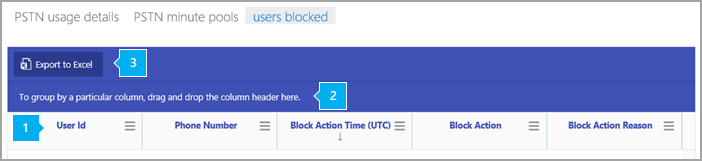

# Users blocked report

The new Skype for Business **Reports** dashboard shows you the activity overview across the Skype for Business products in your organization. It enables you to drill in to individual product-level reports to give you more granular insight about the activities within each product. For example, you can use the **Skype for Business users blocked** report to see the users in your organization that have been blocked from making PSTN calls. This report, along with other Skype for Business reports, gives you details on activity, including PSTN usage across your organization.
  
 Check out the [Reports overview](https://support.office.com/article/0d6dfb17-8582-4172-a9a9-aed798150263) for more reports that are available.
  
> [!NOTE]
> You can see all of the Skype for Business reports when you sign in as an administrator to the Microsoft 365 admin center. 
  
## How to get to the Skype for Business users blocked report

 **Using the Skype for Business admin center**

- Go to the admin center > **Admin centers** > **Skype for Business admin center** > **Reports** > **Users blocked**.
    
## Interpret the Skype for Business users blocked report

You can get a view into blocked users by looking at each of the columns displayed.
  
This is what the report looks like. 
  

The table shows you a breakdown of the all of the users that are blocked from making calls. This shows all users who have Phone System or Audio Conferencing assigned to them. You can add/remove columns to the table.
***

*   **User ID** is the user's sign-in.
*   **Phone number** is the number that is assigned to a user. 
*   **Block action time** is the time (UTC) that the user was blocked from making calls.
*   **Block action** is the type of action that was taken to block the user.
*   **Block action reason** is the reason the user has been blocked from making calls.
***
 
Click to drag a column to **To group by a particular column, drag and drop the column header here** if you want to create a view that groups all of the data in one or more columns.
***
 
You can also export the report data into an Excel .csv file, by clicking or tapping the **Export to Excel** button.

This exports data of all users and enables you to do simple sorting and filtering for further analysis. If you have fewer than 2000 users, you can sort and filter within the table in the report itself. If you have more than 2000 users, in order to filter and sort, you will need to export the data.
***

## Want to see other Skype for Business reports?

- [Skype for Business activity report](activity-report.md) You can see how much your users are using peer-to-peer, organized, and participated in conferencing sessions.
    
- [Skype for Business device usage report](device-usage-report.md) You can to see the devices including Windows-based operating systems and mobile devices that have the Skype for Business app installed and are using it for IM and meetings.
    
- [Skype for Business conference organizer activity report](conference-organizer-activity-report.md) You can see how much your users are organizing conferences that use IM, audio/video, application sharing, Web, dial-in/out - 3rd party, and dial-in/out - Microsoft.
    
- [Skype for Business conference participant activity report](conference-participant-activity-report.md) You can see how many IM, audio/video, application sharing, Web and dial-in/out conferencing conferences are being participated in.
    
- [Skype for Business peer-to-peer activity report](peer-to-peer-activity-report.md) You can see how much your users are using IM, audio/video, application sharing and transferring files.
    
- [Skype for Business PSTN usage report](pstn-usage-report.md) You can see the number of minutes spent in inbound/outbound calls and cost for these calls.

- [Skype for Business PSTN minute pools report](pstn-minute-pools-report.md) you can see the number of minutes consumed during the current month within your organization.

- [Skype for Business session details report](session-details-report.md) You can see details about individual user's call experiences.
   
## Related topics
[Activity Reports in the admin center](https://support.office.com/article/0d6dfb17-8582-4172-a9a9-aed798150263)

  
 