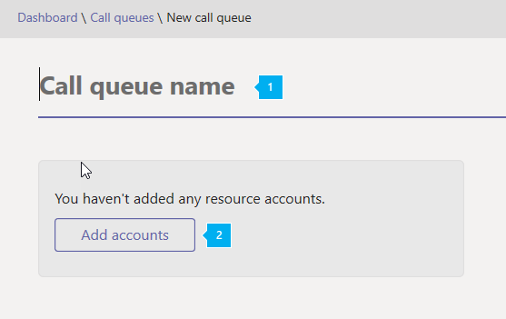
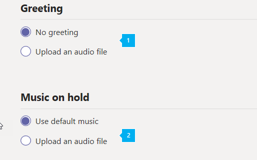
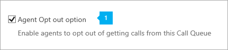
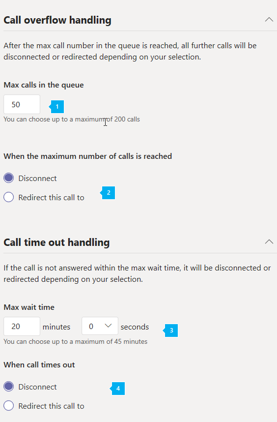

# Create a Phone System call queue

Phone System call queues include greetings that are used when someone calls in to a phone number for your organization, the ability to automatically put the calls on hold, and the ability to search for the next available call agent to handle the call while the people who call are listening to music on hold. You can create single or multiple call queues for your organization.
  
Phone System call queues can provide:
  
- An organizational greeting.
- Music while people are waiting on hold.
- Redirecting of calls to call agents in mail-enabled distribution lists and security groups.
- Making settings for call queue maximum size, timeout, and call handling options.

When someone calls in to a phone number that is set up with a call queue, they will hear a greeting first (if any is set up), and then they will be put in the queue and wait for the next available call agent. The person calling in will hear music while they are on hold waiting, and the calls will be offered to the call agents in the  *First In, First Out*  (FIFO) manner.
  
All calls waiting in the queue will be distributed using an attendant routing mode or serial routing mode:
  
- With attendant routing, the first call in the queue will ring all agents at the same time.
- With serial routing, the first call in the queue will ring all call agents one by one.

    > [!NOTE]
    > Call agents who are **Offline**, have set their presence to **Do not Disturb,** or have opted out of the call queue won't be called.
  
- Only one incoming call notification (for the call at the head of the queue) at a time will be sent to the call agents.
- After a call agent accepts the call, the next incoming call in the queue will start ringing call agents.

## Step 1 - Getting started

To get started using call queues, it's important to remember a few things:
  
- Your organization must have (at a minimum) an Enterprise E3 plus **Phone System** license or an Enterprise E5 license. The number of **Phone System** user licenses that are assigned affects the number of service numbers that are available to be used for call queues. The number of call queues you can have is dependent on the number of **Phone System** and **Audio Conferencing** licenses that are assigned in your organization. To learn more about licensing, go [here](../skype-for-business-and-microsoft-teams-add-on-licensing/skype-for-business-and-microsoft-teams-add-on-licensing.md).

    > [!NOTE]
    > To redirect calls to people in your organization who are Online, they must have a **Phone System** license and be enabled for Enterprise Voice or have Office 365 Calling Plans. See [Assign Skype for Business and Microsoft Teams licenses](../skype-for-business-and-microsoft-teams-add-on-licensing/assign-skype-for-business-and-microsoft-teams-licenses.md). To enable them for Enterprise Voice, you can use Windows PowerShell. For example run:  `Set-CsUser -identity "Amos Marble" -EnterpriseVoiceEnabled $true`
  
- To learn more about Office 365 Calling Plans, see [Phone System and Calling Plans](/microsoftteams/calling-plan-landing-page) and [Calling Plans for Office 365](/microsoftteams/calling-plans-for-office-365).

    > [!NOTE]
    > Users hosted on-premises using Lync Server 2010 aren't supported as a Call Queue Agents. 
  
- You can only assign toll and toll-free service phone numbers that you got in the **Skype for Business admin center** or transferred from another service provider to Phone System call queues. To get and use toll-free service numbers, you need to set up Communications Credits.

    > [!NOTE]
    > User (subscriber) phone numbers can't be assigned to call queues - only service toll or toll-free phone numbers can be used. 
  
- When you are distributing the incoming calls from an Phone System call queue, these clients are supported for call agents:

  - Skype for Business desktop client 2016 (32 and 64-bit versions)

  - Lync desktop client 2013 (32 and 64-bit versions)

  - All IP phone models supported for Skype for Business Online. See [Getting phones for Skype for Business Online](getting-phones-for-skype-for-business-online/getting-phones-for-skype-for-business-online.md).

  - Mac Skype for Business Client (version 16.8.196 and later) 

  - Android Skype for Business Client (version 6.16.0.9 and later)

  - iPhone Skype for Business Client (version 6.16.0 and later)

  - iPad Skype for Business Client (version 6.16.0 and later)

  - Microsoft Teams Windows client (32 and 64-bit versions)

  - Microsoft Teams Mac client

  - Microsoft Teams iPhone app

  - Microsoft Teams Android app

## Step 2 - Getting or transferring toll or toll-free service phone numbers

Before you can create and set up your call queues, you will need to get or transfer your existing toll or toll-free service numbers. After you get the toll or toll-free service phone numbers, they will show up in **Skype for Business admin center** > **Voice** > **Phone numbers**, and the **Number type** listed will be listed as **Service - Toll-Free**. To get your service numbers, see [Getting service phone numbers for Skype for Business and Microsoft Teams](getting-service-phone-numbers.md) or if you want to transfer and existing service number, see [Transfer phone numbers to Office 365](/microsoftteams/transfer-phone-numbers-to-office-365).
  
> [!NOTE]
> If you are outside the United States, you can't use the Skype for Business admin center to get service numbers. Go to [Manage phone numbers for your organization](/microsoftteams/manage-phone-numbers-for-your-organization) instead to see how to do it from the outside of the United States.
  
## Step 3 - Create a new Call Queue

 **Using the Microsoft Teams admin center**

In the **Microsoft Teams admin center**, click  **Legacy Portal** >  **Call routing** > **Call queues**, then click **+ Add new**:
  
### Set the call queue display name, phone number and domain (if any)


***
<br/>
**Name** Enter a descriptive display name for the call queue. This is required and can contain up to 64 characters, including spaces. <br/> This name will be displayed in the notification for the incoming call.
***
<br/>**Phone number** Select a service toll or toll-free phone number for the call queue. This is optional. <br/> If there aren't any listed, you need to get service numbers before you can create this call queue. To get your service numbers, see [Getting service phone numbers for Skype for Business and Microsoft Teams](getting-service-phone-numbers.md)
***
<br/>**Domain** If this is available, choose the Office 365 domain you want to use. This is only available if you have more than one domain being used with Office 365. If you have more than one, you must chose the domain name from the list. <br/> For example, you could have a domain like:  _contoso.com or redmond.contoso.com_

### Set the greeting and music played while on hold


  
***
<br/>**Greeting** is optional. This is the greeting that is played for people who call in to the call queue number. <br/> You can upload an audio file (.wav, .mp3, or .wma formats).
***
<br/>**Music on hold** You can either use the default Music on Hold provided with the call queue, or you can upload an audio file in .wav, mp3, or .wma formats to use as your custom Music on Hold.

### Select the call distribution method


  
***
<br/>**Call distribution method** You can choose either **Attendant** or **Serial** for your call queue distribution method. All new and existing call queues will have attendant routing selected by default. To use serial routing, you must explicitly choose the **Serial** routing option in UI and cmdlets. <br/><br/> When serial routing is chosen and the call queue is saved, the calls from the queue will ring your agents one by one, starting from the beginning of the agent list. If an agent dismisses or does not pick up a call, the call will ring the next agent on the list and will try all agents one by one until it is picked up or times out waiting in the queue.   

> [!NOTE]
> Serial routing will skip agents who are **Offline**, have set their presence to **Do not Disturb**, or have **opted out** of getting calls from this queue. 

### Select an agent opt out option


  
***
<br/>**Agent Opt out option** You can choose to allow call queue agents to opt out of taking calls from a particular queue by selecting **Agent Opt out option**.  <br/> Enabling this option allows all agents in this queue to start or stop receiving call from this call queue at will. You can revoke the agent opt-out privilege at any time by clearing the check box, causing agents to become automatically opted in for this queue again (the default setting for all agents).  <br/><br/> To access the opt-out option, agents can do the following:
 1. Open **Options** in their desktop Skype for Business client. 
 2. On the **Call Forwarding** tab, click the **Edit settings online** link.
 3. On the user settings page, click **Call Queues**, and then clear the check boxes for any queues for which they want to opt out.

    > [!NOTE] 
    > Agents using Mac, mobile, or Lync 2013 clients, or Hybrid Voice users who are hosted on-premises using Skype for Business 2015 server, can go to [https://aka.ms/cqsettings](https://aka.ms/cqsettings) to access the opt out option.

### Add call agents to a call queue


  
***
<br/><br/>Call agents (200 maximum) can be:
* An Online user with a **Phone System** license and enabled for Enterprise Voice or with a Calling Plan. <br/><br/> **Note:**  To redirect calls to people in your organization who are Online, they must have a **Phone System** license and be enabled for Enterprise Voice or have a Calling Plan. See [Assign Skype for Business and Microsoft Teams licenses](../skype-for-business-and-microsoft-teams-add-on-licensing/assign-skype-for-business-and-microsoft-teams-licenses.md). To enable them for Enterprise Voice, you can use Windows PowerShell. For example run:  `Set-CsUser -identity "Amos Marble" -EnterpriseVoiceEnabled $true` <br/><br/>
* Online users with a **Phone System** license and a Calling Plan that are added to an Office 365 Group, a mail-enabled Distribution List, or a Security Group. It might take up to 30 minutes for a new agent added for a distribution list or a security group to start receiving calls from a call queue. A newly created distribution list or security group might take up to 48 hours to become available to be used with call queues. Newly created Office 365 Groups are available almost immediately. <br/> 

  > [!NOTE] 
  > Users hosted on-premises using Lync Server 2010 aren't supported.

### Set the maximum queue size and maximum wait time


  
***
<br/><br/>**Maximum calls in the queue** Use this to set the maximum calls that can wait in the queue at the same time. The default is 50, but it can range from 0 to 200.When this limit is reached, the call will be handled in way you have set on the **When the maximum number of calls is reached** setting below.
***
<br/><br/>**When the maximum number of calls is reached** When the call queue reaches its maximum size (set using the **Maximum calls in the queue** setting), you can choose what happens to new incoming calls.
* **Disconnect with a busy signal** The call will be disconnected.
* **Forward this call to** When you choose this, you will have these options:
  * **Person in your company** An Online user with a **Phone System** license and be enabled for Enterprise Voice or have a Calling Plan. You can set it up so the person calling in can be sent to voicemail. To do this, select a **Person in your company** and set this person to have their calls forwarded directly to voicemail. <br/> <br/>To learn about licensing required for voicemail, see [Set up Cloud Voicemail](/microsoftteams/set-up-phone-system-voicemail). 

    > [!Note]
    > Users hosted on-premises using Lync Server 2010 aren't supported.<br/>

  * **Call Queue** You must have already created another call queue, but after you do, you can select that call queue.
  * **Auto Attendant** You must have already created an auto attendant, but after you do, you can select that auto attendant. See [Set up a Phone System auto attendant](set-up-a-phone-system-auto-attendant.md).
***
<br/><br/>**How long a call can wait in the queue** You can also decide how much time a call can be on hold in the queue before it times out and needs to be redirected or disconnected. Where it will be redirected is based on how you set the **When a call times out** setting. You can set a time from 0 to 45 minutes. <br/><br/> The timeout value can be set in seconds, at 15-second intervals. This allows you to manipulate the call flow with finer granularity. For example, you could specify that any calls that are not answered by an agent within 30 seconds go to a Directory Search Auto Attendant. 

***
<br/><br/>**When a call times out** When the call reaches the limit you set on the **How long a call can wait in the queue** setting, you can choose what happens to this call:
* **Disconnect** The call will be disconnected.
* **Forward this call to** When you choose this, you will have these options:
  * **Person in your company** An Online user with a **Phone System** license and be enabled for Enterprise Voice or have Calling Plans. You can set it up so the person calling in can be sent to voicemail. To do this, select a **Person in your company** and set this person to have their calls forwarded directly to voicemail. </br><br/>  To learn about licensing required for voicemail, see [Set up Cloud Voicemail](/microsoftteams/set-up-phone-system-voicemail). 

    > [!Note]
    > Users hosted on-premises using Lync Server 2010 aren't supported.<br/>

  * **Call Queue** You must have already created another call queue, but after you do, you can select that call queue.
  * **Auto Attendant** You must have already created an auto attendant, but after you do, you can select that auto attendant. See [Set up a Phone System auto attendant](set-up-a-phone-system-auto-attendant.md).
   
## Changing the user's Caller ID to be a call queue's phone number

You can protect a user's identity by changing their caller ID for the outbound calls to a call queue instead by creating a policy using the **New-CallingLineIdentity** cmdlet.
  
To do this, run:
  
```
New-CsCallingLineIdentity -Identity "UKSalesQueue" -CallingIdSubstitute "Service" -ServiceNumber 14258828080 -EnableUserOverride $False -Verbose
```

Then apply the policy to the user using the **Grant-CallingLineIdentity** cmdlet. To do this, run:
  
```
Grant-CsCallingLineIdentity -PolicyName UKSalesQueue -Identity "AmosMarble@contoso.com"
```

You can get more information on how to make changes to caller ID settings in your organization [here](../what-are-calling-plans-in-office-365/how-can-caller-id-be-used-in-your-organization.md).
  
## Want to know more?

You can also use Windows PowerShell to create and set up call queues.
  
### Call queue cmdlets

Here are the cmdlets that you need to manage a call queue.
  
- [New-CsHuntgroup](https://technet.microsoft.com/en-us/library/mt796459.aspx)

- [Set-CsHuntgroup](https://technet.microsoft.com/en-us/library/mt796457.aspx)

- [Get-CsHuntgroup](https://technet.microsoft.com/en-us/library/mt796458.aspx)

- [Remove-CsHuntgroup](https://technet.microsoft.com/en-us/library/mt796456.aspx)

### More about Windows PowerShell

- Windows PowerShell is all about managing users and what users are allowed or not allowed to do. With Windows PowerShell, you can manage Office 365 and Skype for Business Online using a single point of administration that can simplify your daily work, when you have multiple tasks to do. To get started with Windows PowerShell, see these topics:

  - [An introduction to Windows PowerShell and Skype for Business Online](https://go.microsoft.com/fwlink/?LinkId=525039)

  - [Why you need to use Office 365 PowerShell](https://go.microsoft.com/fwlink/?LinkId=525041)

- Windows PowerShell has many advantages in speed, simplicity, and productivity over only using the Office 365 admin center such as when you are making setting changes for many users at one time. Learn about these advantages in the following topics:

  - [Best ways to manage Office 365 with Windows PowerShell](https://go.microsoft.com/fwlink/?LinkId=525142)

  - [Using Windows PowerShell to manage Skype for Business Online](https://go.microsoft.com/fwlink/?LinkId=525453)

  - [Using Windows PowerShell to do common Skype for Business Online management tasks](https://go.microsoft.com/fwlink/?LinkId=525038)

## Related topics
[Here's what you get with Phone System in Office 365](/MicrosoftTeams/here-s-what-you-get-with-phone-system)

[Getting service phone numbers for Skype for Business and Microsoft Teams](getting-service-phone-numbers.md)

[Country and region availability for Audio Conferencing and Calling Plans](/microsoftteams/country-and-region-availability-for-audio-conferencing-and-calling-plans/country-and-region-availability-for-audio-conferencing-and-calling-plans)
