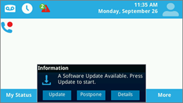

# Deploying Skype for Business Online phones

This is deployment guide will help you deploy Skype for Business Online IP phones.
  
In all types of businesses, having a phone number allows users to make and get voice calls, and it is an important requirement to do business. Users who have phone numbers will be able to make voice calls across all Skype for Business devices including IP phones, PCs, and mobile devices. You can learn more about Skype for Business IP phones by reading [Getting phones for Skype for Business Online](getting-phones-for-skype-for-business-online.md).
  
## Deployment steps for IP phones

### Step 1 - Download the manufacturer's administrator guides and phone manuals

Before you get started, it's a good idea to download the phone manufacturer's administration guides and phone user manuals.
  
- For Polycom phones, see the [Polycom Deployment Guide](http://www.polycom.com/voice-conferencing-solutions/desktop-ip-phones.html).
    
- For Yealink phones, see [Yealink Skype for Business HD SIP Phones Solution](http://www.yealink.com/products_top_2.html).
    
- For AudioCodes phones, see the [Audiocodes Provisioning Management Guide](https://www.audiocodes.com/solutions-products/products/products-for-microsoft-365/ip-phones-room-solutions).
    
### Step 2 - Make sure you're purchasing or migrating a Skype for Business Supported IP phone and firmware

A Skype for Business Online supported phone and firmware is compatible for Skype for Business Server as well, but the opposite isn't always true. To make sure you are buying or provisioning a supported phone and firmware, see [Getting phones for Skype for Business Online](getting-phones-for-skype-for-business-online.md).
  
### Step 3 - Checking that the right firmware is installed and update the firmware if required

Check the firmware version on your phones. For:
  
- **Polycom VVX phones**, go to **Settings** > **Status** > **Platform** > **Application** > **Main**.
    
- **Yealink phones**, go to **Status** on the main phone screen.
    
- **AudioCodes phones**, go to **Menu** > **Device Status** > **Firmware version** from the start screen.
    
    > [!NOTE]
    > For remote access to phone details, refer to manufacturer administration guides. See the links above for the user guides and phone manuals. 
  
- **Lync Phone Edition (LPE) phones**, go to **Menu** > **System Information** from the start screen.
    
### Step 4 - Device Update Considerations

> [!NOTE]
> Polycom firmware prior to 5.5.1.X had a manufacturer-specific device-lock mechanism that is replaced with a Skype for Business implementation "Phone-Lock." Upgrading a phone from 5.4.X.X that was secured with "Device-Lock" to 5.5.1.X with "Phone-Lock" won't inherit the PIN code from "Device-Lock," which can leave the phone unsecured. Users who have activated "Device-Lock" need to enable the following Polycom Device Profile parameter to give users control of time of upgrade (lync.deviceUpdate.popUpSK.enabled=1). 
  
Firmware updates are managed by the Skype for Business Service. Every Skype for Business certified phone's firmware is uploaded to the Skype for Business Update server, and device update is enabled on all phones by default. Depending on the inactivity time on the phone and polling intervals, phones will automatically download and install the latest certified builds. You can disable the device update settings by using the [Set-CsIPPhonePolicy](https://technet.microsoft.com/en-us/library/mt629497.aspx) cmdlet and setting the _EnableDeviceUpdate_ parameter to `false`.
  

  
When a new firmware is available and ready for download and install, the phone will notify the user. Polycom phones will notify the user and provide them with an option to **Update** or **Postpone**.
  

  
For a Polycom phone, you can update the firmware on the phone by selecting **SwUpdate**.
  

  
You can also choose to manage firmware updates using a partner provisioning system. For partner provisioning system management including advanced phone customization, refer to manufacturer administration guides.
  
> [!CAUTION]
> Make sure to have a single device update authority (In-band device update or a third-party provisioning server) to avoid update loops. 
  
### Step 5 - Configuration and infrastructure phone settings

You can set up the most commonly used phone options and policies using Skype for Business In-band management Windows PowerShell cmdlets. See [Set-CsIPPhonePolicy](https://technet.microsoft.com/en-us/library/mt629497.aspx) for details of those parameters and settings.
  
For network infrastructure planning, see [Skype Operations Framework](https://www.skypeoperationsframework.com/).
  
### Step 6 - Preparing for users to sign in

To enable users to successfully sign in to a Skype for Business Online phone and make calls, you need to make sure users are assigned the correct licenses. At a minimum, you will need to assign a Phone System license and a Calling Plan. For additional information, you can see [Skype for Business and Microsoft Teams add-on licensing](../../skype-for-business-and-microsoft-teams-add-on-licensing/skype-for-business-and-microsoft-teams-add-on-licensing.md) and [Assign Skype for Business and Microsoft Teams licenses](../../skype-for-business-and-microsoft-teams-add-on-licensing/assign-skype-for-business-and-microsoft-teams-licenses.md).
  
You can find out more about Calling Plans by reading [Phone System and Calling Plans](/microsoftteams/calling-plan-landing-page)
  
- **Sign-in options** that are available for Online users are:
    
  - Users with **Polycom VVX 5XX/6XX** phones will see:
    
     
  
  - Users with **Yealink T48G/T46G** phones will see:
    
     
  
    For details on sign-in options supported by the manufacturer, see [Getting phones for Skype for Business Online](getting-phones-for-skype-for-business-online.md).
    
- **User ID** Using the phone's keypad or on-screen keyboard (if available), users can use their organization's user name and password to sign in to the phone. For example, they should use the UPN format like <em>amosm@contoso.com</em>  for their user name.
    
     
  
    > [!NOTE]
    > PIN authentication isn't supported for Skype for Business Online for LPE and Partner IP phones. 
  
- **Using a PC** When Better Together over Ethernet (BToE) software is installed on user's PC and enabled, users can log in to their phones using the authentication window on their Windows Skype for Business App. See [Step 7 (optional) - If you have device pairing and Better Together over Ethernet (BToE)](deploying-skype-for-business-online-phones.md#BK_BTOE) for other information.
    
  > [!NOTE]
  > Users are required to use their organization's user name and password to sign in to the phone. For example, they should use the UPN format like  <em>amosm@contoso.com</em>  for their user name.
  
     
  
- **Using a Web Sign-in**: This is a new way for Online users to authenticate using a standard web browser. Users will be provided with a set of instructions to follow when they use a browser to sign in.
    
  - Users with **Polycom VVX 5XX/6XX** phones will see:
    
     
  
  - Users with **Yealink T48G/T46G** phones will see:
    
     
  
    The code that is generated will expire in 15 minutes. When it expires, the user will have to click **Retry** or **OK** to generate a new code, depending on the phone.
    
  - Users with **Polycom VVX 5XX/6XX** phones will see:
    
     
  
  - Users with **Yealink T48G/T46G** phones will see:
    
     
  
    Using a browser, navigate to the address displayed on the phone and enter your Skype for Business username.
    
     
  
    Enter the code shown on the phone.
    
     
  
    Verify that the site shows "[Phone Manufacturer name] **Skype for Business Certified Phone**," and click **Continue**.
    
     
  
    Click the user's credentials or click **Use another account**:
    
     
  
    When the following page is displayed, it is safe to close the browser.
    
     
  
    > [!NOTE]
    > LPE phones for Skype for Business Online support sign-in through USB tethering only. 
  
- **Supported deployments** The table below shows the supported authentication types for the currently supported deployment models including Exchange Integration, Modern authentication with Multi-factor Authentication (MFA), and Skype for Business Online and on-premises.
    
|||||||
|:-----|:-----|:-----|:-----|:-----|:-----|
|**Skype for Business**   |**Exchange**   |**Phone Sign-In method**   |**Skype for Business access**   |**Exchange Access with Modern Auth and MFA disabled**   |**Exchange Access with Modern Auth and MFA enabled**   |
|Online    |Online    |Web Sign-in    |Yes    |Yes    |Yes    |
|Online    |Online    |Username/Password    |Yes    |Yes    |No    |
|Online    |On-premises    |Web Sign-in    |Yes    |No    |No    |
|Online    |On-Premises    |Username/Password    |Yes    |Yes    |No    |
|On-premises    |Online/On-Premises    |PIN Authentication    |Yes    |No    |No    |
|On-premises    |Online/On-Premises    |Username/Password    |Yes    |Yes    |N/A    |
|On-premises    |Online/On-Premises    |Sign-in via PC (BTOE)    |Yes    |Yes    |N/A    |
   
- **Phone features** The feature set may vary slightly based on the IP phone partner. For the complete feature set and for more information on the features for each phone manufacturer, see [Getting phones for Skype for Business Online](getting-phones-for-skype-for-business-online.md).
    
- **Phone-Lock** is a recently introduced feature in Skype for Business certified phones that is used to secure a phone. If enabled, users will be asked to create a PIN upon successful authentication. Once created, phones will lock when the idle-timeout that you define expires, a user manually locks their phone, or they sync their phone-lock with their PC lock using Phone Pairing. If the phone-lock PIN is entered wrong several times, the phone will either sign the user out or require an administrator's code to unlock the phone, but this will vary depending on the phone partner. The user's PIN should be between 6 and 15 digits.
    
    You can disable Phone-Lock for your organization (which is enabled by default), change the idle-timeout, and choose whether users can make phone calls while they are locked or not using inband-settings. See [Set-CsUCPhoneConfiguration](https://technet.microsoft.com/en-us/library/mt629497.aspx) for more details on those settings.
    
## Step 7 (optional) - If you have device pairing and Better Together over Ethernet (BToE)

BToE is a phone paining mechanism for Partner IP phones that pairs a user's phone with their Windows Skype for Business app. BToE enables users to:
  
- Sign in to their IP phone using their Skype for Business desktop app (using a PC)
    
- Synchronize Phone-Lock with PC lock
    
- Click to call
    
BToE can be configured to operate in two modes:  *Auto*  (default) and *Manual*  . It can also be enabled (default)/disabled for users using Skype for Business in-band settings. When operating in *Manual*  mode, users will have to take an additional step to pair their phone with their Windows app.
  
 **To deploy BToE to users**
  
1. Connect their PC to their phone using the PC port.
    
     
  
2. Download and install the latest BToE software from the manufacturer website from the links below. For a better user experience, you can distribute and install the BToE software using an admin distribution solution such as System Center Configuration Manager (SCCM). For help using SCCM, See [Packages and programs in System Center Configuration Manager](https://docs.microsoft.com/sccm/apps/deploy-use/packages-and-programs).
    
   - [Polycom BToE Software Download site](http://www.polycom.com/voice-conferencing-solutions/microsoft-phones.html)
    
   - [Yealink BToE Software Download](http://www.yealink.com/products_list_10.html)
    
   - [AudioCodes BToE Software Downloads](https://www.audiocodes.com/solutions-products/solutions/skype-for-business-microsoft-teams/skype-for-business-online)
    
3. The server setting for BToE is set to **Enabled** and **Auto mode** by default. To change those settings, see [Set-CsIPPhonePolicy](https://technet.microsoft.com/en-us/library/mt629497.aspx).
    
> [!NOTE]
> BToE isn't currently supported on Mac and VDI platforms. 
  
## Related topics
[Getting service phone numbers for Skype for Business and Microsoft Teams](../../what-is-phone-system-in-office-365/getting-service-phone-numbers.md)

[Here's what you get with Phone System in Office 365](/MicrosoftTeams/here-s-what-you-get-with-phone-system)

[Country and region availability for Audio Conferencing and Calling Plans](/microsoftteams/country-and-region-availability-for-audio-conferencing-and-calling-plans/country-and-region-availability-for-audio-conferencing-and-calling-plans)

  
 
