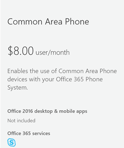
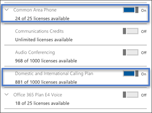
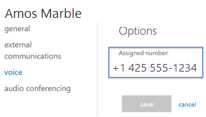

# Set up common area phones
A common area phone (CAP) is typically placed in an area like a lobby or another area that is available to a lot of people. For example, a reception area phone, door phone or meeting room phone, CAPs are set up as devices rather than users and automatically sign into a network. In the steps below, we’ll help you set up an account for Phone System with Calling Plans so you can deploy these types of phones for your organization.

## Prerequisites for common area phones

The first thing you need to do is to confirm that you have the following:

- Purchase Common Area Phone license and a Calling Plan.
- Search for and buy approved phones (view the list [here](deploying-skype-for-business-online-phones.md)).
- Update the firmware on your phones (See supported firmware [in this topic](getting-phones-for-skype-for-business-online.md)).  You can check the firmware on you phone by doing this:
  - **Polycom VVX phones**: Go to **Settings** > **Status** > **Platform** > **Application** > **Main**.
  - **Yealink phones**: Go to **Status** on the main phone screen.
  - **AudioCodes phones**: Go to **Menu** > **Device Status** > **Firmware version** from the start screen.
  - **Lync Phone Edition (LPE) phones**: Go to **Menu** > **System Information** from the start screen.

    Firmware updates are managed by the Skype for Business Service. Every Skype for Business certified phone's firmware is uploaded to the Skype for Business Update server, and device update is enabled on all phones by default.

    Depending on the inactivity time on the phone and polling intervals, phones will automatically download and install the latest certified builds. You can disable the device update settings by using the  [Set-CsIPPhonePolicy](https://docs.microsoft.com/powershell/module/skype/set-csipphonepolicy) cmdlet and setting the *EnableDeviceUpdate* parameter to `false`.

## Setting up a Common Area Phone
You will need to follow these steps:

### Step 1 - Buy the licenses
1. In the Office 365 admin center, go to **Billing** > **Purchase services**, and add **Other plans**.

    
2. Click on **Common Area Phone** > **Buy now** > on the **Checkout** page click on **Buy now**.
3. Click on to expand **Add-on subscriptions** and then click on to buy a Calling Plan. Choose either the **Domestic Calling Plan** or **Domestic and International Calling Plan**.

> [!Note]
> You don't need a Phone System license. It's included with the **Common Area Phone** license.

For more info on licenses, see [Skype for Business and Microsoft Teams add-on licensing](../../skype-for-business-and-microsoft-teams-add-on-licensing/skype-for-business-and-microsoft-teams-add-on-licensing.md).

### Step 2 - Create a new user account for the phone and assign the licenses
1. In the Office 365 admin center, go to **Users** > **Active Users** > **Add a user**.
2. Put in a **User name** like “Main" for the first name and "Reception” for the second name.
3. Put in a **Display name** if it doesn't autogenerate one like "Main Reception".
4. Put in a **User name** like "MainReception" or "Mainlobby".
5. For common area phones, you might want to set a password manually or have the same password for all of you common area phones. Also, you might think about unselecting **Make this user change their password when they first sign in**.
6. If you are still there, assign the licenses to this user. On the same page, click to expand **Product licenses**. Turn on the following:
   - Common Area Phone
   - Then you need to pick either a **Domestic Calling Plan** or a Domestic and **International Calling Plan**.

     Assigning the licenses will look like:

     

     > [!Note]
     > Just so you know, Skype for Business Plan 2 is included with the **Common Area Phone** license.

For more details, see [Add a user](https://support.office.com/article/1970f7d6-03b5-442f-b385-5880b9c256ec).

### Step 3 - Assign a phone number to the Common Area Phone user account

 Assign a phone number to the user using the **Skype for Business admin center**

1. In the Office 365 admin center > **Admin centers** > **Skype for Business**.
2. In the **Skype for Business admin center** >  **Voice** > **Phone numbers**.
3. Select a number from the list of phone numbers and click **Assign**.
4. On the **Assign** page, in the **Voice user** box enter the name of the user that is used for the phone then select the user in the **Select a voice user** drop down.
5. While you're there you will need to add an emergency address. Once you search, look under the **Select emergency address** to pick the right one for you.
6. Click **Save** and your user should look like this:

    

   > [!Note]
   > Users will only show up if they have a **Phone System** licence applied. If you just did this, then sometimes it takes a bit for the user to show up in the list.

For more stuff, see [Getting phone numbers for your users](/microsoftteams/getting-phone-numbers-for-your-users).

If you're wondering, you can also take your phone number that you have with another carrier and "*port*" or transfer them over to Office 365. See, [Transfer phone numbers to Office 365](/microsoftteams/transfer-phone-numbers-to-office-365).

### Step 4 - Setting up your phone

**Setting the mode on a phone**

The phone or phones you have must have the **Common Area Phone mode** turned on. You might want to check on that to make sure they do.

**Here's an example for how to set up a Polycom VVX phone**

- Enable Common Area Phone mode for the Polycom VVX by following these steps:
    1. In your browser, connect to the web interface so that you can enable CAP mode.
    2. Then go to **Setting**  and in the **Skype for Business Setting** option, select **Common Area Phone**.
    3. Click **Yes** to save your settings.

- Now that CAP mode is enabled, set up the phone using the phone's display. The display should show **CaAP is enabled**. Then do the following:

    1. Click **Settings**.
    2. Select **Advanced**.
    3. Enter the password.
    4. In **Administration settings**, select **Common Area Phone Settings**.
    5. Enable **CAP** and **CAP Admin Mode**.
    6. Click **Save Config**.

- Ok, now your phone is ready so you can sign in on the home screen.

    1. Sign in by selecting **Settings** > **Features** > **Skype for Business.**
    2. Select **User Credentials**, and select **web sign-in (CAP)** to generate a code.
    3. Go to the [provisioning portal](https://aka.ms/skypecap), and sign in as **admin**.
    4. Enter the display name (for example, Main Reception).

       > [!Note]
       > If **Search for Common Area Phones only** is checked, clear the checkbox and search again.

    5. In the pairing code window, enter the code displayed on the phone and click **Provision**.

        Following this last step, the phone should sign in automatically.

> [!NOTE]
> The CAP provisioning site states it will reset the CAP account's password to a random password. Take note that the account the CAP is referring is the Azure Active Directory (AAD) account. If you created the account in AAD only then the process is straightforward. If you have synced an on premises Active Directory to AAD and you use a third-party IDP or ADFS, CAP provisioning will fail. In this case, you need to use an Office 365/Azure Active Directory account only (for example, an account with **onmicrosoft.com** domain) for CAP provisioning to work.

### Related topics

- Learn more about available phones at [Deploying Skype for Business Online phones](deploying-skype-for-business-online-phones.md).
- [Getting phones for Skype for Business Online](getting-phones-for-skype-for-business-online.md)

