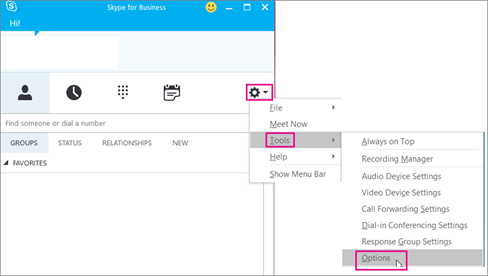
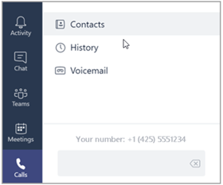

# Setting up your Phone System

The following is a step-by-step guide for setting up Phone System in Office 365. Links to additional, detailed information are available at the end of each step.  

## Step 1: Make sure that Phone System is available for your country or region

1.	Go to [Country and region availability for Audio Conferencing and Calling Plans](..//country-and-region-availability-for-audio-conferencing-and-calling-plans/country-and-region-availability-for-audio-conferencing-and-calling-plans.md), and select your country or region from the list at the top of the page. 
2.	Under **Phone System**, review the list of features and details. 
3.	If Phone System is available, proceed to step 2. 

To learn more about regional availability of Phone System and Audio Conferencing, see [Country and region availability for Audio Conferencing and Calling Plans](../country-and-region-availability-for-audio-conferencing-and-calling-plans/country-and-region-availability-for-audio-conferencing-and-calling-plans.md). 

## Buy and assign Phone System and Calling Plan licenses

To assign a Phone System and Calling Plan license to a single user, the steps are the same as assigning an Office 365 license. See [Assign or remove licenses for Office 365 for business](http://support.office.com/article/997596b5-4173-4627-b915-36abac6786dc).
To assign Phone System and Calling Plan licenses to multiple users, do the following:
1.	Install the **Microsoft Online Services Sign-In Assistant for IT Professionals RTW**. Don't have the module installed? See [Microsoft Online Services Sign-In Assistant for IT Professionals RTW](https://go.microsoft.com/fwlink/?LinkId=625123) to download it.
2.	Install the **Windows Azure Active Directory Module**. Don't have the module installed? See [Manage Azure AD using Windows PowerShell](https://go.microsoft.com/fwlink/p/?LinkId=320628) for download instructions and cmdlet syntax.
3.	Once you get the modules installed, use the Windows PowerShell command prompt and the following syntax to assign the licenses to your users:

    This example assigns an **Enterprise E3 license** along with a **Phone System** and a **Domestic Calling Plan** license.

    The name of the licenses or product names in the script are listed in italics text (see **Phone System and Calling Plan product names or SKUs used for scripting**, after the example). 

    ```
      #Create a text file with a single row containing list of UserPrincipalName (UPN) of users to license. The MSOLservice uses UPN to license user accounts in Office 365.
  
      #Example of text file:
      #user1@domain.com
      #user2@domain.com
  
      #Import Module
      ipmo MSOnline
      #Authenticate to MSOLservice.
      Connect-MSOLService
      #File prompt to select the userlist txt file.
      [System.Reflection.Assembly]::LoadWithPartialName("System.windows.forms") | Out-Null
      $OFD = New-Object System.Windows.Forms.OpenFileDialog
      $OFD.filter = "text files (*.*)| *.txt"
      $OFD.ShowDialog() | Out-Null
      $OFD.filename
      If ($OFD.filename -eq '')
      {
        Write-Host "You did not choose a file. Try again" -ForegroundColor White -BackgroundColor Red
      }
      #Create a variable of all users.
      $users = Get-Content $OFD.filename
      #License each user in the $users variable.
      #Use MCOPSTN1 for PSTN Domestic Calling and MCOPSTN2 for Domestic and 
      International Calling.
      for each ($user in $users)
        {
        Write-host "Assigning License: $user"
        Set-MsolUserLicense -UserPrincipalName $user -AddLicenses "companyname:ENTERPRISEPACK " -ErrorAction SilentlyContinue
        Set-MsolUserLicense -UserPrincipalName $user -AddLicenses "companyname:MCOEV " -ErrorAction SilentlyContinue
        Set-MsolUserLicense -UserPrincipalName $user -AddLicenses "companyname:MCOPSTN1 " -ErrorAction SilentlyContinue
       } 
      ```
       ### Phone System and Calling Plans product names or SKUs used for scripting

    |**Product name**|**SKU part name**|
    |:-----|:-----|
    |Enterprise E5 (with Phone System)  <br/> |ENTERPRISEPREMIUM  <br/> |
    |Enterprise E3  <br/> |ENTERPRISEPACK  <br/> |
    |Enterprise E1  <br/> |STANDARDPACK  <br/> |
    |Skype for Business Online Standalone Plan 2  <br/> |MCOSTANDARD  <br/> |
    |Phone System  <br/> |MCOEV  <br/> |
    |International Calling Plan  <br/> |MCOPSTN2  <br/> |
    |Domestic Calling Plan  <br/> |MCOPSTN1  <br/> |
    |Communications Credits  <br/> |MCOPSTNPP  <br/> |

For additional information and tips about assigning licenses, see [Assign Skype for Business and Microsoft Teams licenses](../skype-for-business-and-microsoft-teams-add-on-licensing/assign-skype-for-business-and-microsoft-teams-licenses.md).

## Step 3: Get phone numbers for your users

Before you can set up users in your organization to make and receive phone calls, you must get phone numbers for them. 

You have two ways of getting numbers for your users: 
- Get new numbers using the Skype for Business admin center.
- Port or transfer your existing numbers from your current service provider or phone carrier to Office 365.

You must use the **Add new user numbers** page to see, search, acquire, and reserve those numbers. You can search by Country/Region, State, and City, and then enter the number of phone numbers you will need for your users. 

> [!NOTE]
> If you need help setting up phone numbers for your organization, you can [Contact support for business products - Admin Help](https://support.office.com/article/32a17ca7-6fa0-4870-8a8d-e25ba4ccfd4b). 

 **Get new phone numbers for your users**
  
1. Sign in to Office 365 with your work or school account.
    
2. Go to the **Office 365 admin center** > **Skype for Business**.
    
3. In the left navigation go to **Voice** > **Phone numbers**, click **Add new number** , and then click **New user numbers**.
    
    **IMPORTANT**: For you to see the **Voice** option in the left navigation in the Skype for Business admin center, you must first buy at least one **Enterprise E5 license**, one **Phone System** add-on license, or one **Audio Conferencing** add-on license.
    
4. On the **Add new user numbers** page, choose the following:
    
  - **Country/Region**
    
  - **State/Region**
    
  - **City**
    
5. Under **Quantity**, enter the number of phone numbers that you want for your organization and click **Add** to create a reservation. You have 10 minutes to select your phone numbers; if you take more than 10 minutes, the phone numbers will be returned to the pool of numbers.
    
    > [!NOTE]
    > You can see the number of phone numbers, which is based on the number of licenses, listed next to **Total user numbers you can acquire**. For details, see [How many phone numbers can you get?](how-many-phone-numbers-can-you-get.md)
  
6. You can click **Show numbers** to see the full list of phone numbers. This is helpful is you don't want to select a specific phone number in the list.
    
7. Select the phone numbers you want, and then click **Acquire numbers**.
    
    > [!IMPORTANT]
    > The number of phone numbers for users (subscribers) is equal to the total number of **Domestic Calling Plan** and/or **Domestic and International Calling Plan** licenses you have assigned multiplied by 1.1, plus 10 additional phone numbers. For example, if you have 50 users in total with a Domestic Calling Plan and/or Domestic and International Calling Plan, you can acquire **65** phone numbers **(50 x 1.1 + 10)**. For details, see [How many phone numbers can you get?](how-many-phone-numbers-can-you-get.md). If you need to get more telephone numbers than this, please contact [Contact support for business products - Admin Help](https://support.office.com/article/32a17ca7-6fa0-4870-8a8d-e25ba4ccfd4b). 
  
 **Port or transfer phone numbers from your service provider or phone carrier**
  
- If you need 999 or fewer phone numbers for your users, you can use the **New Local Number Port Order** wizard in the Skype for Business admin center. Follow the steps found in [Transfer phone numbers to Office 365](transfer-phone-numbers-to-office-365.md) to transfer your phone numbers over to Skype for Business Online.
    
- If you need to port more than 999 phone numbers, see [Manually submit a custom service request](manually-submit-a-custom-service-request.md) to submit a port order service request or order to get all of these phone numbers ported over to Office 365. 

For more information, see [Getting phone numbers for your users](../what-are-calling-plans-in-office-365/getting-phone-numbers-for-your-users.md). 

## Step 4: Get service phone numbers (audio conferencing, call queues, auto attendants)

In addition to getting phone numbers for your users from Office 365, you can search and acquire toll or toll-free phone numbers for services such as audio conferencing (for conference bridges), auto attendants, and call queues (also called service numbers). Service phone numbers have a higher concurrent calling capacity than user or subscriber phone numbers. For example, a service number can handle 100s of calls simultaneously, whereas a user's phone number can only handle a few calls simultaneously.

### Get new service numbers

1. Sign in to Office 365 with your work or school account.
    
2. Go to the **Office 365 admin center** > **Skype for Business**.
    
3. In the left navigation go to **Voice** > **Phone numbers** > **Add new number**, and then click **New service numbers**.
    
    > [!IMPORTANT] 
    > For you to see the **Voice** option in the left navigation in the Skype for Business admin center, you must first buy at least one **Enterprise E5 license**, one **Phone System** add-on license, or one **Audio Conferencing** add-on license.
    
4. On the **Add new service numbers** page, choose the following:
    
  - **Country/Region**
    
  - **State/Region**
    
  - **City**
    
5. Under **Quantity**, enter the number of phone numbers that you want for your organization and click **Add** to create a reservation. You have 10 minutes to select your phone numbers; if you take more than 10 minutes, the phone numbers will be returned to the pool of phone numbers.
    
    > [!NOTE]
    > You can see the number of phone numbers, which is based on the number of licenses, listed next to **Total Service numbers your can acquire**. For details, see [How many phone numbers can you get?](../what-are-calling-plans-in-office-365/how-many-phone-numbers-can-you-get.md)
  
6. You can click **Show numbers** to see the full list of phone numbers. This is helpful if you don't want to select a specific phone number in the list.
    
7. Select the phone numbers you want, and then click **Acquire numbers**.
    
### Assign service numbers

Once you have your service numbers, they can then be assigned to an audio conferencing bridge. To do this, see [Change the toll or toll free numbers on your Audio Conferencing bridge](../audio-conferencing-in-office-365/change-the-phone-numbers-on-your-audio-conferencing-bridge.md).
  
### Port or transfer existing service numbers

If you want to transfer service numbers from your current service provider or carrier, you need to manually submit a port order to Microsoft. You have to submit separate port orders for each type of service number (toll vs. toll-free) that you will be transferring using a Letter of Authorization (LOA). In the Letter of Authorization (LOA), you must select the correct type of service number. When contacting Microsoft support, please make sure you specify that you are transferring a service number (*and not a user or subscriber number*), or the concurrent calling capacity may not be enough to handle call volumes. If you want to transfer phone numbers or do other things with your phone numbers, see [Manage phone numbers for your organization](../what-are-calling-plans-in-office-365/manage-phone-numbers-for-your-organization/manage-phone-numbers-for-your-organization.md).

> [!NOTE]
> If you need to get more telephone numbers than this, please [contact support for business products - Admin Help](https://support.office.com/en-us/article/32a17ca7-6fa0-4870-8a8d-e25ba4ccfd4b). 

For more details about service numbers, see [Getting service phone numbers](getting-service-phone-numbers.md).

## Step 5: Set up Calling Plans

You have already bought and assigned Phone System and licenses and a Calling Plan (step 2) and gotten phone numbers for your users (step 3), so your calling plan is already mostly set up. Follow these procedures to complete the setup of your Calling Plan.

### Add emergency addresses and locations for your organization

1. On the **Voice** page, choose **Emergency locations** > **Add new address**.
    
2. In the **New address** pane, enter a name for your address, and then complete the remaining boxes.
    
     
  
    > [!TIP]
    > For English customers, if the street name is a number, be sure to include "st" or "th" at the end, as shown in the above picture. 
  
3. Choose **Validate**.
    
    If needed, you'll be prompted to make corrections to the address. 
    
    > [!CAUTION]
    > Validating a street or civic address involves making sure that it is legitimate and correctly formatted. It is possible that a partially correct emergency address, such as if you mistyped the name of the city, may still pass validation. Even though it's misspelled and passed validation, the combination of the misspelled name of city along with the other correct parts of the address are enough information to route the call to the appropriate emergency dispatch center. 
  
    > [!TIP]
    > If the address needs to be corrected for emergency response, a green banner will appear notifying you that the address was updated. 
  
4. After the address is validated, choose **Save**.
    
### Assign phone numbers and emergency addresses to users

> [!TIP]
> If you add more people to your business right before doing this step, it may take **several hours** for them to appear on the **Voice users** page. There's a latency.
  
1. On the **Voice users** page, select the people who you want to assign a phone number and emergency address to.
    
2. In the Action pane, click **Assign number**.
    
3. On the **Assign number** page, in the **Select number to assign** list, select the phone number for the user.
    
4. To select an emergency address, enter name of the city in the box and choose **Search**.
    
    > [!IMPORTANT]
    > If you are outside the United States, your numbers already have an emergency address, but you can change it now. See [Assign or change an emergency address for a user](assign-or-change-an-emergency-address-for-a-user.md). 
  
5. After you assign both the phone number and emergency address, choose **Save**.
    
### Tell your users about their new phone numbers


We recommend sending mail or using your business's preferred communication method to tell the people about their new phone numbers. 

Here's how they can see that phone number in their **Skype for Business** app:
  
1. Sign in to Skype for Business on your desktop.
    
2. Choose **Settings** > **Tools** > **Options**. 
    
     
  
3. Then choose **Phones**. 
    
    
 
In **Microsoft Teams**, users can see their phone number by clicking **Calls** in the left navigation. The phone number is shown above the dial pad.



For more detailed information about all of the steps involved in setting up a Calling Plan, see [Set up Calling Plans](../what-are-calling-plans-in-office-365/set-up-calling-plans.md).

## Step 6: Set up audio conferencing (optional)

Sometimes people in your organization will need to use a phone to call in to a meeting. Skype for Business and Microsoft Teams include the audio conferencing feature for just this situation! People can call in to Skype for Business or Microsoft Teams meetings using a phone, instead of using the Skype for Business or Microsoft Teams app on a mobile device or PC. 
  
You only need to set up Audio Conferencing for people who plan to schedule or lead meetings. Meeting attendees who dial in don't need any licenses assigned to them or other setup.
  
For frequently asked questions about Audio Conferencing, see [Audio Conferencing common questions](audio-conferencing-common-questions.md).
  

You must be an [Office 365 admin](https://support.office.com/article/da585eea-f576-4f55-a1e0-87090b6aaa9d) to perform this step.
  
1. Find out if Audio Conferencing in Office 365 is available in your country/region. [Country and region availability for Audio Conferencing and Calling Plans](../country-and-region-availability-for-audio-conferencing-and-calling-plans/country-and-region-availability-for-audio-conferencing-and-calling-plans.md). 
    
2. Learn which licenses you need to buy for Audio Conferencing, and how much they will cost. See [Skype for Business and Microsoft Teams add-on licensing](../skype-for-business-and-microsoft-teams-add-on-licensing/skype-for-business-and-microsoft-teams-add-on-licensing.md), and buy the licenses. 
    
3. [Assign or remove licenses for Office 365 for business](https://support.office.com/article/997596b5-4173-4627-b915-36abac6786dc) you purchased to the people in your organization who are going to schedule or lead meetings.
    
4. If you purchased **Audio Conferencing** add-on licenses and Communications Credits licenses, assign them too. For instructions, see [Assign Skype for Business and Microsoft Teams licenses](../skype-for-business-and-microsoft-teams-add-on-licensing/assign-skype-for-business-and-microsoft-teams-licenses.md).

    Decide on your audio conferencing provider. An audio conferencing provider supplies an audio conferencing bridge. The conferencing bridge sets your dial-in phone numbers, PINs, and conference IDs for meetings. Decide whether to use Microsoft or a third-party audio conferencing provider: 

    > [!NOTE]
    > Microsoft Teams users can't user a third-party audio conferencing provider. 
  
- **Microsoft as your audio conferencing provider**: If you want the easiest solution for audio conferencing, choose Microsoft as your audio conferencing provider.
    
- **Third party as your audio conferencing provider**: If you are in a country where Audio Conferencing in Office 365 isn't available, the service quality isn't great because of its location, or you have an existing contract, choose a third-party audio conferencing provider. To find a provider, go to [Microsoft PinPoint](http://go.microsoft.com/fwlink/?LinkId=797530).
 
5.	Assign the audio conferencing provider to people who lead or schedule meetings. Do one of the following: 

- [Assign Microsoft as the audio conferencing provider](assign-microsoft-as-the-audio-conferencing-provider.md).
    
- [Assign a third-party as the audio conferencing provider](assign-a-third-party-as-the-audio-conferencing-provider.md).

6. Set up meeting invitations. The following steps are optional, but a lot of admins like to do them: 
  
    1. [Customize meeting invitations](../set-up-skype-for-business-online/customize-meeting-invitations.md). The dial-in numbers that are set for the user will be automatically added to the meeting invitations that are sent to attendees. However, you can add your own help and legal links, a text message, and small company graphic.
    
    2. [Set the Audio Conferencing phone numbers for meeting organizers that are included on invites](set-the-phone-numbers-included-on-invites.md). This is the phone number that will show up in the meeting that is scheduled by the user.
    
    3. [Set auto attendant languages for Audio Conferencing](set-auto-attendant-languages-for-audio-conferencing.md) that the audio conferencing auto attendant uses to greet a caller when they dial in to an Audio Conferencing phone number. This step only applies if you're using Microsoft as your audio provider.
    
    4. [Set the length of the PIN for Audio Conferencing meetings](set-the-pin-length-for-audio-conferencing-meetings.md).
    
    > [!NOTE]
    > This feature is not yet available to customers using Office 365 operated by 21Vianet in China. To learn more, see [Learn about Office 365 operated by 21Vianet](https://support.office.com/article/A8AB5061-3346-4DA0-BB7C-5260822B53AE). 

For more information about Audio Conferencing, see [Set up Audio Conferencing for Skype for Business and Microsoft Teams](../audio-conferencing-in-office-365/set-up-audio-conferencing.md).

## Step 7: Set up a call queue (optional)

Phone System call queues include greetings that are used when someone calls in to a phone number for your organization, the ability to automatically put the calls on hold, and the ability to search for the next available call agent to handle the call while the people who call are listening to music on hold. You can create single or multiple call queues for your organization.

Before you can create and set up your call queues, you will need to get or transfer your existing toll or toll-free service numbers. After you get the toll or toll-free service phone numbers, they will show up in **Skype for Business admin center** > **Voice** > **Phone numbers**, and the **Number type** listed will be listed as **Service - Toll-Free**. To get your service numbers, see [Getting service phone numbers for Skype for Business and Microsoft Teams](getting-service-phone-numbers.md) or if you want to transfer and existing service number, see [Transfer phone numbers to Office 365](../what-are-calling-plans-in-office-365/transfer-phone-numbers-to-office-365.md).
  
> [!NOTE]
> If you are outside the United States, you can't use the Skype for Business admin center to get service numbers. Go to [Manage phone numbers for your organization](../what-are-calling-plans-in-office-365/manage-phone-numbers-for-your-organization/manage-phone-numbers-for-your-organization.md) instead to see how to do it from the outside of the United States.

To create a new call queue, in the **Skype for Business admin center**, click **Call routing** > **Call queues**, click **Add new**, and then follow the instructions in **Step 3** of  [Create a Phone System call queue]( create-a-phone-system-call-queue.md#step-3---create-a-new-call-queue).

For more details about call queues, see [Create a Phone System call queue]( create-a-phone-system-call-queue.md).

## Step 8: Set up a Phone System auto attendant (optional)

Auto attendants let people that call in to your organization and navigate a menu system to get them to the right department, call queue, person, or the operator. You can create an auto attendant for your organization by using the Skype for Business admin center. 

To create a new auto attendant, in the Skype for Business admin center, click **Call routing** > **Auto attendants**, click **Add new**, and then follow the instructions for each page in **Step 2** of [Set up a Phone System auto attendant](set-up-a-phone-system-auto-attendant.md).

For more details about Phone System auto attendants, see [Set up a Phone System auto attendant](set-up-a-phone-system-auto-attendant.md).

## Step 9: Set up Communications Credits for your organization

You will need to set up Communications Credits if you would like to use toll-free numbers with Skype for Business and Microsoft Teams. Also, we recommend that you set up Communications Credits for your Calling Plans (Domestic or International) and Audio Conferencing users who need the ability to dial out to **any destination**. Many countries/regions are included, but some destinations may not be included in your Calling Plan or Audio Conferencing subscriptions. If you don't set up Communications Credits billing and assign a **Communications Credits** license to your users and you run out minutes for your organization (depending on your Calling Plan or Audio Conferencing plan in your country/region), those users won't be able to make calls or dial out from Audio Conferencing meetings. You can get more information, including recommended funding amounts, by reading [What are Communications Credits?](what-are-communications-credits.md)
  
> [!NOTE]
> To find out how much it costs, [see the rates here](https://go.microsoft.com/fwlink/p/?LinkId=799523 ). 

### Set up Communications Credits for your organization

1. Sign in to Office 365 with your work or school account.
    
2. In the left navigation of the Office 365 admin center, go to **Billing** > **Subscriptions** > **Add-ons** > **Buy add-ons**, and then choose **Communications Credits** > **Buy now**.
    
3. On the **Communications Credits** subscription page, fill in your information, and then click **Next**:
    
  - **Add funds** Enter the amount that you want to add to your account. If you don't enable auto-recharge, once these funds are depleted, calling capabilities that are enabled using Communications Credits will be disrupted (such as inbound toll-free service). To avoid having to manually replenish your Communications Credits balance each time your balance reaches 0 (zero), we recommend you enable the auto-recharge feature.
    
  - **Auto-recharge** Enabling auto-recharge will automatically refill your account when the balance falls below the threshold that you set.
    
    It's recommended that you use the **Auto-recharge** setting to avoid any disruption of service should your Communications Credits balance reach 0 (zero). You will be sent an email when recharge transactions succeed, when recharge transactions fail (such as an expired credit card), and when your Communications Credits balance reaches 0 (zero).
    
  - **Recharge amount** Enter the amount in the **Recharge with** box that you want added to your account once it reaches the trigger amount below.
    
  - **Trigger amount** Enter the amount in **When the balance falls below** box that will be used to ' *trigger*  ' the auto-recharge. Once your balance falls below this amount, the recharge amount will be added automatically to your account.

      > [!NOTE]
    > Funds will be applied only to Communications Credits at Microsoft published rates when the services are used. Any funds not used within 12 months of the purchase date will expire and be forfeited. 
    
4. Enter your payment information and click **Place order**.
    >[!IMPORTANT]
    >If you are a volume licensing customer, you may choose your enterprise agreement number for payment. If you have multiple enterprise agreement numbers, you will be able to select which enterprise agreement you would like to use for payment. You will also be given an opportunity to specify a purchase order number to associate with the enterprise agreement number (if applicable).
    
Each organization will have a different usage of Calling Plan volume and rates to consider. You will need to get this type of usage data from your current service provider. Organizations already using Skype for Business Online already as their service provider can get usage data by reviewing it in the **Skype for Business admin center** > **Reports** > **PSTN usage details** report.
  
When you are setting up Communications Credits, you will need to investigate call usage for your organization to determine the amounts that you will need to put in. You can get call usage information by reviewing the **PSTN usage details** report. This report lets you export the call data records to Excel if you want to export the data for storage or create custom reports. To see usage, see [Skype for Business PSTN usage report](../skype-for-business-online-reporting/pstn-usage-report.md)
  
### Assign a Communications Credits license to users

1. Sign in to Office 365 with your work or school account.
    
2. In the left navigation of the Office 365 admin center, go to **Users** > **Active users**, and then select a user or users from the list.
    
3. In the Action pane under **Product licenses**, click **Edit**.
    
4. On the **Product licenses** page, toggle ** Communications Credits** to **On** to assign this license, and then click **Save**.
    
    > [!NOTE]
    > Even if you have users who are assigned an **Enterprise E5** license, it's still recommended that you do this.

For more information about Communications Credits, see [Set up Communications Credits for your organization](../skype-for-business-and-microsoft-teams-add-on-licensing/set-up-communications-credits-for-your-organization.md).