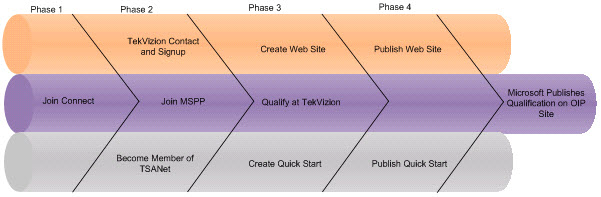
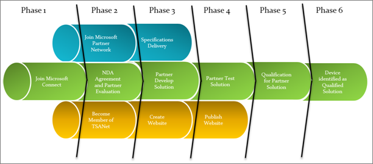

# Partner qualification processes

## Infrastructure
With the launch of Skype for Business, we will no longer qualify solutions for Lync Server. Instead, see the  [infrastructure certified for Skype for Business](../certification/infra.md).

## Lync Services
E911 service provider and other services vendors interested in qualifying their offering for Lync Server or Exchange Server must meet both technical and marketing requirements. Participation in the program is solely at Microsoft’s discretion. Upon successful completion, the product, service, and firmware combinations tested will be listed on this site.

With the launch of Lync Server, there will no longer be qualifying solutions with Office Communications Server 2007 or 2007 R2.

### Technical requirements for qualification
- Be an IP-PBX, SIP-PSTN gateway, SIP trunking, E911 service provider and survivable branch appliance vendor.  This program is not open to system integrators utilizing 3rd party hardware.
- For Direct SIP, comply to the Lync Server 2010 SIP-PSTN gateway or IP-PBX specification.
- For SIP trunking services, comply to the Lync Server 2010 SIP trunking specification.
- For service providers using an Acme Packet SBC, please refer to the document "Microsoft Communications Server "14" SIP Trunking with the Acme Packet Net-Net Session Director", available for [download](https://www.microsoft.com/downloads/details.aspx?FamilyID=3ec8a7cb-488c-4ea3-bba1-c00d59295f9c).

### Program requirements for qualification
- Company must have a standard NDA signed with Microsoft.
- Join Microsoft Connect to obtain specifications and test plans (see below).
- Join [Microsoft Partner Program](https://partners.microsoft.com/).
- Become member of [TSANet](http://www.tsanet.org/).
- Successfully meet technical Qualification Program requirements at [TekVizion](http://microsoftuc.tekvizionlabs.com/) or WIPRO labs for the respective qualification level.
- Provide Quick Start Guide for configuration steps for Lync Server or Exchange Server.
- Provide dedicated website for Lync Server or Exchange Server supported products, including support, ordering, and technical documentation.

Once all of these criteria have been met the UCOIP administrators will be aware of the status and will then place the information on the UCOIP web site.

If you have any questions on the program please contact the MSUCOIP Administrators at msucoip@microsoft.com.

### Approximate timeline for qualification
The timeline that follows shows the approximate timeline for the qualification process. The timeline diagram also indicates tasks that can be performed concurrently as well as suggested order of precedence. The times are not guaranteed since scheduling could preempt the flow.

***Partner qualification timeline for Microsoft Partner Program***

To begin the process, vendors should:
- Download the trial versions of the product.
- Register to join the Microsoft Unified Communications Open Interoperability Program by visiting Microsoft Connect, logging in with their Passport account, click Invitations on the left navigation, and use this Invitation code: oip-YJ3X-7FK4

> [!NOTE]
> You must use a Passport account that matches your corporate email address.
> - Fill out the survey and click Submit. To be approved, you must provide your corporate email address from an enterprise telephony infrastructure vendor.

Upon approval into the program (please allow 4-5 business days), Microsoft will provide access to the technical specifications, documentation on the program requirements and information on how to engage with tekVizion.

## Lync Video Interoperability Program

The Microsoft Lync Video Interoperability Program tests and qualifies partners’ video solutions to provide interoperability with Microsoft Office Communications Server 2007 R2 and Microsoft Lync Server 2010 and to provide a premium experience for customers. Microsoft Lync provides interoperability with three different types of video solutions:
- **Video teleconference (VTC)**&nbsp;&nbsp;&nbsp;A video endpoint registers directly with Microsoft Office Communications Server 2007 R2 and Microsoft Lync Server 2010 and provides a seamless user experience so that Lync users can connect to the VTC systems as if it were another contact. The VTC system will appear with presence information and allow user to one click initiate video calls to the VTC.
- **Multipoint control unit (MCU)**&nbsp;&nbsp;&nbsp;A multipoint control unit allows for multi-party conferencing by providing users the use of virtual room or video bridge where multiple parties can connect and conduct video conferencing. These virtual rooms/video bridges will appear in the OCS and Lync contact list to allow those users to connect and participate in multiparty video calls.
- **Gateway (GW)**&nbsp;&nbsp;&nbsp;A gateway allows connection with different network and provides Microsoft Lync access to different protocols to make video calls. Microsoft Lync uses SIP for signaling and H.263 and RTVideo as the video codec. Gateways provide access to other protocols such as H.323, H.261 and H.264. ‘Optimized for’ – IP phones, headsets, conference room systems and other devices that offer a rich and integrated experience giving customers the power to get the most out of their Lync experience and return on investment.

### ‘Optimized for'
The *Optimized for Lync Logo* is designed to help partners bring premium communication experiences to the market.

Lync users can trust the logo as an assurance that the devices have been tested to provide the quality, compatibility, and reliability that ensures the best Lync experience.

Only products and solutions that pass the stringent requirements can participate in the Lync logo program. The logo program requirements lead to an excellent experience for the customer and improved interoperability with Lync client and server software. Video solutions that meet the requirements are eligible for many benefits, such as being featured on Microsoft webpages and in marketing collateral, and license to use the logo word mark.

### Program requirements for qualification
Partners interested in joining the Microsoft Lync Video Interoperability Program and obtaining qualification for their video solutions must meet the following criteria:

- A long-term interest in developing product lines for the Microsoft Lync platform.
- A proven record of developing and marketing enterprise grade systems.
- Established global enterprise sales channels.
- Company must have a Standard NDA signed with Microsoft.
- Join Microsoft Connect to obtain specification and test plans.
- Join Microsoft Partner Program. To register, go to the [Microsoft Partner Program Sign In](https://partners.microsoft.com/partnerprogram/Welcome.aspx) page and click Sign Up Now. Join at a level that aligns with your business strategies.
- Obtain [Communications Competency](https://mspartner.microsoft.com/en/us/pages/membership/communications-competency.aspx).
- Become a member of TSANet. To learn about becoming a TSANet member, see the [Technical Support Alliance Network](http://www.tsanet.org/) website.
- Successfully meet technical Qualification Program requirements documented in specification and test plan.
- Provide dedicated website for Lync support products, including support, ordering, and technical documentation.

### Technical requirements of qualification
The specific details of qualification will be provided from Microsoft to the partner once the partner has formally been accepted to the program.  In general, partner solution will need to meet this level of functionality to be qualified:
- 720p HD video quality
- Wideband audio quality
- Multiparty video conferencing with Microsoft Lync AVMCU
- Firewall Traversal capability
- Encrypted and Secure video and audio calls
- Presence capability  for video endpoints
- Provide access to other protocols such as H.323, H.261 and H.264

### Approximate timeline for qualification

The diagram that follows displays the approximated timeline for the qualification process. The timeline shows tasks that can be performed concurrently as well as suggested order of precedence. The times are not guaranteed since scheduling could preempt the flow.

***Technical qualifications timeline***

### How to engage
Currently video qualification tests are performed by Microsoft Lync logo team. To introduce yourself and obtain more specifics, email LyncLogo.

## Compatible Devices Program
The Compatible Devices Program currently qualifies devices for Lync 2013 client on Windows-based machines. For non-windows clients Microsoft recommends that you evaluate the USB consumer product lines offered by the device manufacturers that are part of the Compatible Devices Program. IP phones can also be used in non-windows based environments, excluding the PC pairing functionalities.
**‘Optimized for’**&nbsp;&nbsp;&nbsp;IP phones, headsets, conference room systems and other devices that offer a rich and integrated experience giving customers the power to get the most out of their Lync experience and return on investment.
**Other compatible IP phones**&nbsp;&nbsp;&nbsp;IP phones tested to provide interoperability and quality of experience without gateways.

### ‘Optimized for'
The Optimized for Microsoft Lync Logo is designed to help partners bring premium communication experiences to the market. Microsoft Lync users trust the logo as an assurance that the devices have been tested to provide the quality, compatibility, and reliability that ensures the best Microsoft Lync experience.

Only products that pass the stringent requirements can participate in the Lync logo program. The logo program requirements lead to an excellent experience for the customer and improved device interoperability with Lync client software.  Devices which meet the requirements are eligible for many benefits, such as being featured on Microsoft webpages and marketing collaterals, and license to use the logo word mark. Partners interested in qualifying devices for the 'Optimized' for program must have:
- A long-term interest in developing product lines for the Microsoft Lync platform.
- A proven record of developing and marketing enterprise grade systems.
- Established global enterprise sales channels.
- Microsoft Partner Program membership at the Certified or Gold Certified membership level, as such terms are defined in the applicable Microsoft Partner Program documentation.
- TSANet membership for product support.

#### USB Peripherals, PCs, and Meeting Room Devices
This program qualifies partner developed and designed USB headsets, handsets, webcams, PCs, and meeting room devices and systems to work with Lync. At a high-level, the partner must follow these steps to submit a device for qualification to the Lync logo program:
- Meet the above criteria to be in the partner program;
- Complete contract and product addendums;
- Download test specifications;
- Conduct testing for candidate device at one of the approved independent test labs (see next bullet list);
- Submit sample device along with testing results from the approved test lab to Microsoft;
- Obtain final approval from Lync logo team.

Functional testing for meeting room devices is conducted by Microsoft. Audio and video testing for Optimized for Lync Devices (USB peripherals, PCs and Meeting room devices) is conducted at one of two independent test labs that have been trained and validated to perform testing according to the Lync Logo standards. The approved independent labs are:
- [AST Technology Labs](http://www.asttechlabs.com/certifications/Microsoft-Lync.aspx)
- [PAL (Taipei, Taiwan)](http://www.pal-acoustics.com/index.php?a=services&id=132&lang=en)

Learn more about logo requirements for devices on the USB Peripherals and Lync PC Test Specifications page.

For clarifications on joining the program, please e-mail lynclogo@microsoft.com.
#### IP and USB Phones
'Optimized for' IP and USB phones require ground up hardware development according to Microsoft Lync specs, details of this programs can be obtained under NDA only. Please e-mail lynclogo@microsoft.com for more information.

### Other compatible IP phones
This program qualifies partner developed and designed IP phones that interoperate with Lync based on a combination of publicly available Windows Protocols (WSPP) and Microsoft Office Protocols. Device manufacturers interested in qualifying devices must have:
- A long-term interest in developing product lines for the Microsoft Lync platform.
- A proven record of developing and marketing enterprise grade IP phones.
- Established global enterprise sales channels.
- Microsoft Partner Program membership at the Certified or Gold Certified membership level, as such terms are defined in the applicable Microsoft Partner Program documentation. Join at a level that aligns with your business strategies.
- TSANet membership for product support.

Partners meeting these criteria can email lynclogo@microsoft.com for more information.

### Video Interoperability
The Unified Communication Specification for H.264 AVC and SVC Encoder Implementation is published by Microsoft as a result of Microsoft’s participation in the Unified Communications Interoperability Forum (UCIF) H.264/MPEG4 AVC/SVC Task Group. It defines and constrains the H.264 AVC/SVC levels, configurations, and tools used for video communication scenarios. This specification can be used for designing an end-to-end video communication system, or for designing an H.264 AVC/SVC encoder (such as a Webcam) for real-time communication purposes.

Download the [Unified Communication Specification for H.264 AVC and SVC Encoder Implementation](https://download.microsoft.com/download/A/F/B/AFBF8CBE-3A45-472A-93F3-AD8521FBD502/UC_Specification_for_H264_AVC_and_SVC_encoder.pdf).