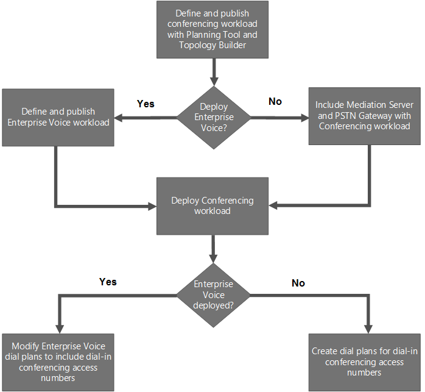

# Deploy conferencing in Skype for Business Server 2015
[]
 **Summary:** Read this topic to learn how to deploy conferencing in Skype for Business Server 2015.
  
There are four types of conferencing available in Skype for Business Server: web conferencing, audio and video (A/V) conferencing, dial-in conferencing, and instant message (IM) conferencing. You can choose to enable all conferencing types, or to use only one type, depending on your needs. 
  
When you deploy Skype for Business Server, IM conferencing capabilities are automatically deployed. When you create and publish a new topology by using Topology Builder, you specify whether to deploy web, A/V, and dial-in conferencing, as described in the following checklists: 
  
- [Deployment checklist for web and audio/video conferencing](deploy-conferencing.md#BKMK_ChecklistWebConferencing)
    
- [Deployment flowchart and checklist for dial-in conferencing](deploy-conferencing.md#BKMK_DialinConferencing)
    
Before you deploy conferencing, you should read the following planning topics:
  
- [Plan for conferencing in Skype for Business Server 2015](../../plan-your-deployment/conferencing/conferencing.md)
    
- [Hardware and software requirements for conferencing in Skype for Business Server 2015](../../plan-your-deployment/conferencing/hardware-and-software-requirements.md)
    
- [Plan your conferencing topology for Skype for Business Server 2015](../../plan-your-deployment/conferencing/conferencing-topology.md)
    
- [Plan for dial-in conferencing in Skype for Business Server 2015](../../plan-your-deployment/conferencing/dial-in-conferencing-0.md)
    
- [Plan for large meetings in Skype for Business Server 2015](../../plan-your-deployment/conferencing/large-meetings.md)
    
## Deployment checklist for web and audio/video conferencing

The following table provides an overview of the steps required to deploy web and audio/video conferencing into an existing topology. Links to the associated planning and procedural documentation are included. 
  
|**Phase**|**Steps**|**Roles and group memberships**|**Documentation**|
|:-----|:-----|:-----|:-----|
|**Install required hardware and software**   |Conferencing runs on Front End Servers of a Front End pool and Standard Edition servers. See the server and environmental requirements for Front End Servers.    If you are enabling web conferencing, you will need to ensure that Skype for Business Server can communicate with Office Web Apps Server, which is used to handle sharing and rendering of PowerPoint presentations.    For web conferencing, you also need to specify a file share to be used as the file store.    Do you want to enable external users with Skype for Business clients to join conferences? If so, you need to deploy Edge Servers.    |Domain user who is a member of the local Administrators group    |[Server requirements for Skype for Business Server 2015](../../plan-your-deployment/requirements-for-your-environment/server-requirements.md)   [Environmental requirements for Skype for Business Server 2015](../../plan-your-deployment/requirements-for-your-environment/environmental-requirements.md)   [Hardware and software requirements for conferencing in Skype for Business Server 2015](../../plan-your-deployment/conferencing/hardware-and-software-requirements.md)   [Configure integration with Office Web Apps Server in Skype for Business Server 2015](office-web-app-server.md)   [Create a file share in Skype for Business Server 2015](../../deploy-1/install-0/create-a-file-share.md)   [Plan for Edge Server deployments in Skype for Business Server 2015](../../plan-your-deployment/edge-server-deployments/edge-server-deployments.md)   [Deploy Edge Server in Skype for Business Server 2015](../../deploy-1/deploy-edge-server/deploy-edge-server.md)   |
|**Create the appropriate internal topology to support conferencing**   |You need to run Topology Builder to add conferencing to the topology, and then publish the topology.    |To define a topology, an account that is a member of the local Users group    To publish the topology, an account that is a member of the Domain Admins group and RTCUniversalServerAdmins group, and that has full control permissions (read/write/modify) on the file share to be used for the Skype for Business Server file store (so that Topology Builder can configure the required DACLs)    |[Create and publish new topology in Skype for Business Server 2015](../../deploy-1/install-0/create-and-publish-new-topology.md)   |
|**Configure conferencing policies and configuration settings**   |Use Skype for Business Server Control Panel or Skype for Business Server Management Shell to configure conferencing policies and configuration settings.    |RTCUniversalServerAdmins group (Windows PowerShell only) or assign users to the CSAdministrator role    |[Manage conferencing policies in Skype for Business Server 2015](../../manage/conferencing-0/conferencing-policies.md)   [Manage meeting configuration settings in Skype for Business Server 2015](../../manage/conferencing-0/meeting-configuration-settings.md)   [New-CsConferencingPolicy](../../manage/management-shell/new-csconferencingpolicy.md)   [Set-CsConferencingPolicy](../../manage/management-shell/set-csconferencingpolicy.md)   [New-CsConferencingConfiguration](../../manage/management-shell/new-csconferencingconfiguration.md)   [Set-CsConferencingConfiguration](../../manage/management-shell/set-csconferencingconfiguration.md)   [New-CsMeetingConfiguration](../../manage/management-shell/new-csmeetingconfiguration.md)   [Set-CsMeetingConfiguration](../../manage/management-shell/set-csmeetingconfiguration.md)   |
   
## Deployment flowchart and checklist for dial-in conferencing

 Dial-in conferencing allows users to dial in from the public switched telephone network (PSTN) to join an audio/video conference.
  
Some of the components required for dial-in conferencing are also used for Enterprise Voice. For example, if you are deploying Enterprise Voice, you must also deploy a Mediation Server and a PSTN gateway--components that are also required for dial-in conferencing. How you deploy dial-in conferencing, therefore, depends on whether you are also deploying an Enterprise Voice solution. 
  
The dial-in conferencing flowchart shows the steps you must follow depending on whether you are also deploying an Enterprise Voice solution. The table following the flowchart provides an overview of steps required and recommended for deploying dial-in conferencing. Links to the associated planning and procedural documentation are also included. For more information about planning a complete Enterprise Voice solution, see [Plan your Enterprise Voice solution in Skype for Business Server 2015](../../plan-your-deployment/enterprise-voice-solution/enterprise-voice-solution.md).
  
**Dial-in conferencing flowchart**

  
**Dial-in conferencing deployment checklist**

|**Phase**|**Steps**|**Roles and group membership**|**Documentation**|
|:-----|:-----|:-----|:-----|
|**Install required hardware and software**   | Conferencing runs on Front End Servers of a Front End pool and Standard Edition servers. See the server and environmental requirements for Front End Servers.    You need to ensure that the following are installed before configuring dial-in conferencing:    Mediation Server    PSTN gateway    Unified Communications Application Service (UCAS) (called the Application service)    Conferencing Attendant application    Conferencing Announcement application   |Domain user who is a member of the local Administrators group    |[Server requirements for Skype for Business Server 2015](../../plan-your-deployment/requirements-for-your-environment/server-requirements.md)   [Environmental requirements for Skype for Business Server 2015](../../plan-your-deployment/requirements-for-your-environment/environmental-requirements.md)   [Hardware and software requirements for conferencing in Skype for Business Server 2015](../../plan-your-deployment/conferencing/hardware-and-software-requirements.md)   [Plan for dial-in conferencing in Skype for Business Server 2015](../../plan-your-deployment/conferencing/dial-in-conferencing-0.md)   [Mediation Server component in Skype for Business Server 2015](../../plan-your-deployment/enterprise-voice-solution/mediation-server.md)   [Deploy a Mediation Server in Topology Builder in Skype for Business Server 2015](../../deploy-1/deploy-enterprise-voice/deploy-a-mediation-server.md)   [Define a gateway in Topology Builder in Skype for Business Server 2015](../../deploy-1/deploy-enterprise-voice/define-a-gateway.md)   |
|**Create a topology that includes the Conferencing workload, including a Mediation Server and PSTN gateway, and deploy the Front End pool or Standard Edition server**   |1. Run Topology Builder to configure your topology. While configuring the topology, select the dial-in conferencing option.    2. Publish the topology and deploy the Front End pool or Standard Edition server.    3. If necessary, create a stand-alone Mediation Server and associate it with a PSTN gateway.    **Note:** This step is required only if you do not deploy Enterprise Voice and do not collocate the Mediation Server with the Enterprise Edition Front End Server or Standard Edition server. If you deploy Enterprise Voice, you install and configure Mediation Servers and PSTN gateways as part of the Enterprise Voice deployment. If you collocate the Mediation Server, you install and configure the Mediation Server as part of the Front End pool or Standard Edition server deployment.   |Domain Admins    RTCUniversalServerAdmins    Administrator    |[Create and publish new topology in Skype for Business Server 2015](../../deploy-1/install-0/create-and-publish-new-topology.md)   [Deploy a Mediation Server in Topology Builder in Skype for Business Server 2015](../../deploy-1/deploy-enterprise-voice/deploy-a-mediation-server.md)   [Define a gateway in Topology Builder in Skype for Business Server 2015](../../deploy-1/deploy-enterprise-voice/define-a-gateway.md)   |
|**Configure dial plans**   |A dial plan is a set of phone number normalization rules that translate phone numbers dialed from a specific location to a single standard (E.164) format for purposes of phone authorization and call routing. The same phone number dialed from different locations can, based on the respective dial plans, resolve to different E.164 numbers, as appropriate to each location. If you deploy Enterprise Voice, you set up dial plans as part of that deployment, and you need to make sure that the dial plans also accommodate dial-in conferencing. If you do not deploy Enterprise Voice, you need to set up dial plans for dial-in conferencing.    Use Skype for Business Server Control Panel or Skype for Business Server Management Shell to set up dial plans as follows:    1. Create one or more dial plans for routing dial-in access phone numbers.    2. Assign a default dial plan to each pool. Set the **Dial-in conferencing region** to the geographic location to which the dial plan applies. The region associates the dial plan with dial-in access numbers.   |RTCUniversalServerAdmins    CsVoiceAdministrator    CsServerAdministrator    CsAdministrator    |[Configure dial-in conferencing in Skype for Business Server 2015](dial-in-conferencing-2.md)   [Create or modify a dial plan in Skype for Business Server 2015](../../deploy-1/deploy-enterprise-voice/dial-plans.md)   [New-CsDialPlan](../../manage/management-shell/new-csdialplan.md)   |
|**Make sure that dial plans are assigned regions**   |Run the **Get-CsDialPlan** and **Set-CsDialPlan** cmdlets to make sure that all dial plans have a region assigned.   |RTCUniversalServerAdmins    CsVoiceAdministrator    CsServerAdministrator    CsAdministrator    |[Configure dial-in conferencing in Skype for Business Server 2015](dial-in-conferencing-2.md)   [Create or modify a dial plan in Skype for Business Server 2015](../../deploy-1/deploy-enterprise-voice/dial-plans.md)   [Get-CsDialPlan](../../manage/management-shell/get-csdialplan.md)   [Set-CsDialPlan](../../manage/management-shell/set-csdialplan.md)   |
|**Configure conferencing policy to support dial-in conferencing**   | Use Skype for Business Server Control Panel or Skype for Business Server Management Shell to configure **Conferencing Policy** settings. Specify whether:    PSTN conference dial-in is enabled.    Users can invite anonymous participants.    Unauthenticated users can join a conference by using dial-out phoning. With dial-out phoning, the conference server calls the user, and the user answers the phone to join the conference.   |RTCUniversalServerAdmins    CsServerAdministrator    CsAdministrator    |[Manage conferencing policies in Skype for Business Server 2015](../../manage/conferencing-0/conferencing-policies.md)   [New-CsConferencingPolicy](../../manage/management-shell/new-csconferencingpolicy.md)   [Set-CsConferencingPolicy](../../manage/management-shell/set-csconferencingpolicy.md)   |
|**Configure dial-in access numbers**   |Use Skype for Business Server Control Panel or Skype for Business Server Management Shell to set up dial-in access numbers that users call to dial in to a conference, and specify the regions that associate the access number with the appropriate dial plans. The first three access numbers for the region specified by the organizer's dial plan are included in the conference invitation. All access numbers are available on the Dial-in Conferencing Settings page.    **Note:** After you create dial-in access numbers, you can use the **Set-CsDialInConferencingAccessNumber** cmdlet to modify the display name of the Active Directory contact objects so that users can more easily identify the correct access number.   |RTCUniversalServerAdmins    CsServerAdministrator    CsAdministrator    |[Create or modify a dial plan in Skype for Business Server 2015](../../deploy-1/deploy-enterprise-voice/dial-plans.md)   [Manage dial-in conferencing access numbers in Skype for Business Server 2015](../../manage/conferencing-0/access-numbers.md)   [New-CsDialInConferencingAccessNumber](../../manage/management-shell/new-csdialinconferencingaccessnumber.md)   [Set-CsDialInConferencingAccessNumber](../../manage/management-shell/set-csdialinconferencingaccessnumber.md)   |
|**Assign a Line URI to a user account**   |Use Skype for Business Server Control Panel or Skype for Business Server Management Shell to configure the telephony **Line URI** as a unique, normalized phone number (for example, tel:+14255550200).   |RTCUniversalServerAdmins    CsAdministrator    CsUserAdministrator    |[Assign a Line URI to a user account](dial-in-conferencing-2.md#BKMK_AssignaLineURI)   |
|**(Optional) Verify or modify user personal identification number (PIN) requirements**   |Use Skype for Business Server Control Panel or Skype for Business Server Management Shell to view or modify the Conferencing **PIN Policy**. You can specify minimum PIN length, maximum number of logon attempts, PIN expiration, and whether common patterns are allowable.    |RTCUniversalServerAdmins    CsServerAdministrator    CsAdministrator    |[Manage PIN policies for dial-in conferencing in Skype for Business Server 2015](../../manage/conferencing-0/pin-policies.md)   [Get-CsPinPolicy](../../manage/management-shell/get-cspinpolicy.md)   [Set-CsPinPolicy](../../manage/management-shell/set-cspinpolicy.md)   |
|**(Optional) Modify key mapping of DTMF commands**   |Use the **Set-CsDialinConferencingDtmfConfiguration** cmdlet to modify the keys used for dual-tone multi-frequency (DTMF) commands, which participants can use to control conference settings (such as mute and unmute or lock and unlock).   |RTCUniversalServerAdmins    CsServerAdministrator    CsAdministrator    |[Manage key mapping for DTMF commands in Skype for Business Server 2015](../../manage/conferencing-0/key-mapping-for-dtmf-commands.md)   [Set-CsDialInConferencingDtmfConfiguration](../../manage/management-shell/set-csdialinconferencingdtmfconfiguration.md)   |
|**(Optional) Modify conference join and leave announcement behavior**   |Use the **Set-CsDialinConferencingConfiguration** to change how announcements work when participants join and leave conferences.   |RTCUniversalServerAdmins    CsServerAdministrator    CsAdministrator    |[Manage conference join and leave announcements in Skype for Business Server 2015](../../manage/conferencing-0/join-and-leave-announcements.md)   [Set-CsDialInConferencingConfiguration](../../manage/management-shell/set-csdialinconferencingconfiguration.md)   |
|**(Recommended) Configure conference directories**   |Use the **New-CsConferenceDirectory** cmdlet to create one conference directory for every 999 users in the pool.   |RTCUniversalServerAdmins    |[(Recommended) Create Conference Directories](http://technet.microsoft.com/library/787f4c94-1c96-468a-a74d-e06b7bd4b8a3.aspx)   [New-CsConferenceDirectory](../../manage/management-shell/new-csconferencedirectory.md)   |
|**(Optional) Verify dial-in conferencing settings**   |Use the **Get-CsDialinConferencingAccessNumber** cmdlet to search for dial plans that have a dial-in conferencing region that is not used by any access number and for access numbers that have no region assigned.   |RTCUniversalServerAdmins    CsServerAdministrator    CsAdministrator    CsViewOnlyAdministrator    CsHelpDesk    |[Configure dial-in conferencing in Skype for Business Server 2015](dial-in-conferencing-2.md)   [Test dial-in conferencing in Skype for Business Server 2015](../../manage/conferencing-0/tests.md)   [Get-CsDialInConferencingAccessNumber](../../manage/management-shell/get-csdialinconferencingaccessnumber.md)   |
|**(Optional) Verify dial-in conferencing**   |Use the **Test-CsDialInConferencing** cmdlet to test that the access numbers for the specified pool work correctly.   |RTCUniversalServerAdmins    CsServerAdministrator    CsAdministrator    |[Test dial-in conferencing in Skype for Business Server 2015](../../manage/conferencing-0/tests.md)   [Test-CsDialInConferencing](../../manage/management-shell/test-csdialinconferencing.md)   |
|**(Optional) Welcome users to dial-in conferencing and set the initial PIN**   |Use the **Set-CsPinSendCAWelcomeMail** script to set users' initial PINs and send a welcome email that contains the initial PIN and a link to the Dial-in Conferencing Settings page.   |RTCUniversalServerAdmins    |[Send welcome email to dial-in users in Skype for Business Server 2015](../../manage/conferencing-0/welcome-emails.md)   |
   

