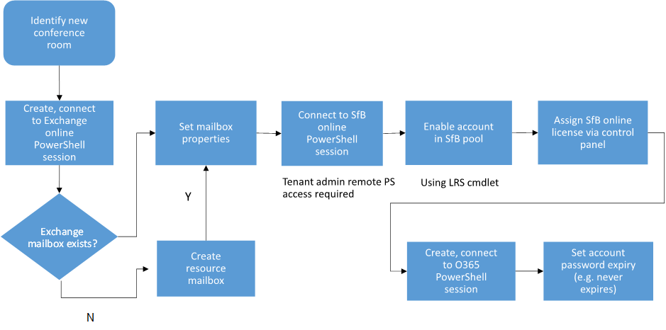

# Provisioning Skype Room System accounts in Microsoft 365 and Office 365
 
Read this topic to learn about provisioning Skype Room System accounts in Microsoft 365 or Office 365.
  
The following section covers Skype Room System account provisioning.
  
## Microsoft 365 and Office 365 prerequisites

Your online tenant must meet the following requirements:
  
- The Microsoft 365 or Office 365 plan must include Skype for Business Online Plan 2, or Office 365 E1, E3 or E5. <br/>For details on Skype for Business Online Plans, see the [Skype for Business Online Service Description](/office365/servicedescriptions/skype-for-business-online-service-description/skype-for-business-online-service-description).
    
- Your tenant must have the conferencing capability of Skype for Business enabled.
    
- Your tenant must have Exchange Online enabled. 
    
- Your tenant remote administrator must have the following PowerShell access:
    
  - Exchange Remote PowerShell access
    
  - Skype for Business Online Remote PowerShell access
    
  - Windows Azure Active Directory Module for Windows PowerShell to access Microsoft 365 or Office 365 directory access
    
For the Skype Room account, the following licensing is required:
  
- A Skype for Business Online Plan 2 or Office 365 E1 or E3 license is required to enable Skype Meetings.
    
- To entitle the room with the Enterprise Voice capability so the room can be enabled with a phone number, a Skype for Business Online Plan 2 with the Phone System license or Office 365 E5 is required (1).
    
- If you need dial-in capabilities from a meeting, you will need an audio conferencing and Phone System license.  If you need dial-out capabilities from a meeting, you will need a domestic or domestic and international Calling Plan. 
    
- An Exchange Online license is not required for the Skype Room account because the account should be configured as a resource mailbox account.
    
## Provisioning overview

The following diagram provides an overview of the Skype Room System account provisioning flow.
  

  
## Identify a new conference room

You may already have a resource room mailbox in Exchange that provides the scheduling feature, or you may be creating a resource mailbox for the first time to facilitate Skype Room System deployment. In any case, you must identify a room account to be used in your tenant. The Exchange Online Provision and Skype for Business Provision sections provide guidance for both kinds of accounts. For example, let's say you have the following two rooms, and you would like to deploy Skype Room System for both of them:
  
- Existing Resource Mailbox Account: confrm1@contoso.onmicrosoft.com
    
- New Resource Mailbox Account: confrm2@contoso.onmicrosoft.com
    
## Exchange Online provisioning

First, connect to Exchange Online PowerShell by following the instructions in the topic, [Connect to Exchange Online PowerShell](/powershell/exchange/connect-to-exchange-online-powershell).
  
To set an existing resource room mailbox account for Skype Room System, run the following commands in Exchange Online PowerShell:
  
```powershell
$rm="confrm1@contoso.onmicrosoft.com"
$newpass='pass@word1'
Set-Mailbox -Identity $rm  -EnableRoomMailboxAccount $true -RoomMailboxPassword (ConvertTo-SecureString $newpass -AsPlainText -Force)
```

To create a new Exchange resource mailbox account for Skype Room System, run the following commands in Exchange Online PowerShell:
  
```powershell
$rm="confrm2@contoso.onmicrosoft.com"
$newpass='pass@word1'
New-Mailbox -Name "Conf Room 2" -MicrosoftOnlineServicesID $rm -Room  -EnableRoomMailboxAccount $true -RoomMailboxPassword (ConvertTo-SecureString $newpass -AsPlainText -Force)
```

The previous commands set up or create a new Exchange resource mailbox account for Skype Room System usage by enabling the account.
  
After creating the mailbox, you can use the Set-CalendarProcessing cmdlet in Exchange Online PowerShell to configure the mailbox. Refer to steps 3 through 6 under Single forest on-premises deployments for more details

## Assigning a Skype for Business Online license

Now you can assign a Skype for Business Online (Plan 2) or Skype for Business Online (Plan 3) license by using the Microsoft 365 administrative portal as described in [Assign or remove licenses for Microsoft 365 for business](https://support.office.com/article/Assign-or-remove-licenses-for-Office-365-for-business-997596b5-4173-4627-b915-36abac6786dc?ui=en-US&amp;rs=en-US&amp;ad=US) or in [Skype for Business add-on licensing](https://support.office.com/article/Skype-for-Business-add-on-licensing-3ed752b1-5983-43f9-bcfd-760619ab40a7). 
  
After you assign a license for Skype for Business Online, you will be able to log in and validate that the account is active using any Skype for Business client.
  
## Skype for Business Online provisioning

After a resource room mailbox account has been created and enabled as shown previously, and you have licensed the account for Skype For Business Online the account will synchronize from the Exchange Online forest to Skype for Business Online forest by using the Windows Azure Active Directory forest. The following steps are required to provision the Skype Room System account in the Skype for Business Online pool. These steps are the same for both an existing resource mailbox account or a newly created account (confrm1 or confrm2), because once they are enabled in Exchange Online, both of these accounts will be synchronized to Skype for Business Online in the same way:
  
1. Create a Remote PowerShell session. Note that you will need to download [Teams PowerShell module](/microsoftteams/teams-powershell-install).
    
  ```powershell
  # When using Teams PowerShell Module

   Import-Module MicrosoftTeams
   $credential = Get-Credential
   Connect-MicrosoftTeams -Credential $credential
  ```

2. To enable an Skype Room System account for Skype for Business, run the following command:
    
   ```powershell
   Enable-CsMeetingRoom -Identity $rm -RegistrarPool "sippoolbl20a04.infra.lync.com" -SipAddressType EmailAddress
   ```

    You can obtain the RegistrarPool address where your Skype for Business users are homed from one of your existing accounts by using the following command to returns this property:
    
   ```powershell
   Get-CsOnlineUser -Identity 'alice@contoso.onmicrosoft.com'| fl *registrarpool*
   ```

>[!NOTE] 
>Multi-Factor Authentication (MFA) isn't supported for Skype Room System accounts. 

## Password expiration

In Microsoft 365 or Office 365, the default password expiration policy for all of your user accounts is 90 days unless you configure a different password expiration policy. For Skype Room System accounts, you can select the Password never expires setting with the following steps.
  
1. Create a Windows Azure Active Directory session by using your tenant global administrator credentials.
    
    ```powershell
    $cred=Get-Credential admin@$org
    Connect-MsolService -Credential $cred
    ```

2. Set the Password never expires setting for the Skype Room System room account created previously by using the following command:
    
   ```powershell
   Set-MsolUser -UserPrincipalName confrm1@skypelrs.onmicrosoft.com -PasswordNeverExpires $true
   ```

For more information, see [Set up your computer for Windows PowerShell](../../../SfbOnline/set-up-your-computer-for-windows-powershell/set-up-your-computer-for-windows-powershell.md).
  
## Validate

For validation, you should be able to use any Skype for Business client to sign in to the account you created.