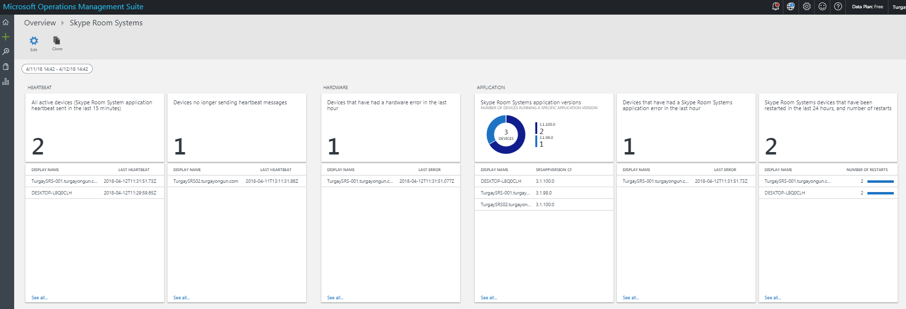
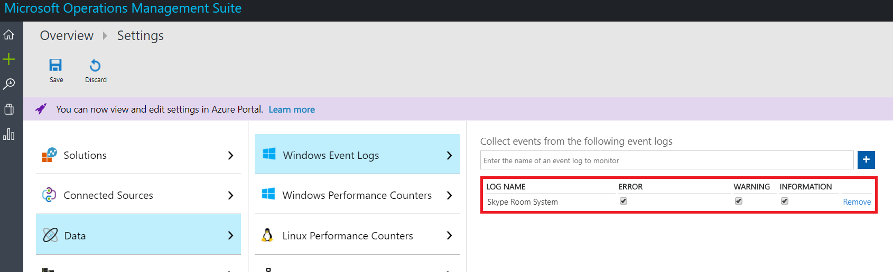
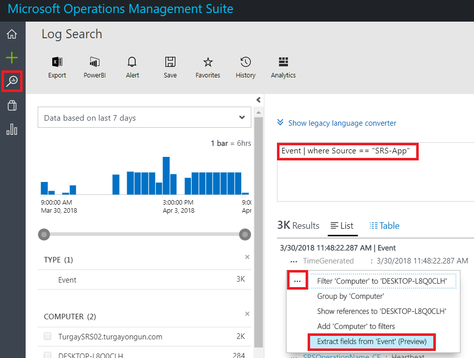
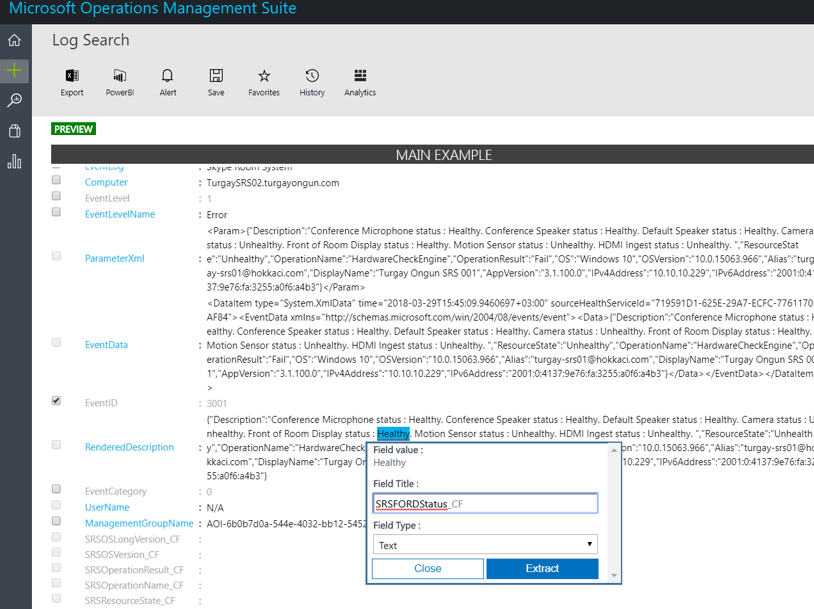
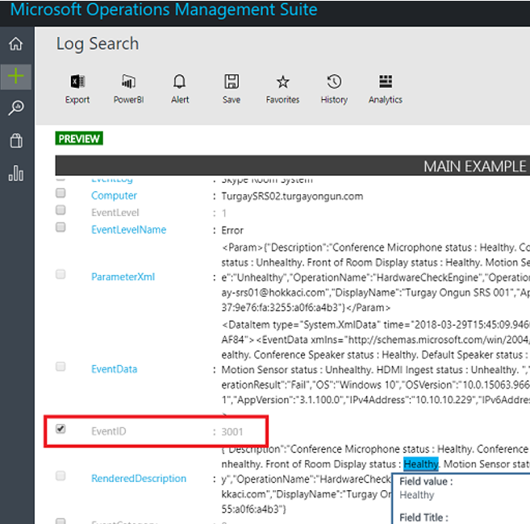
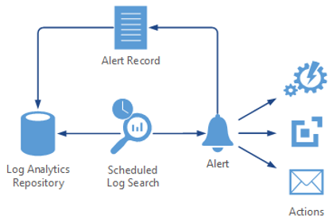
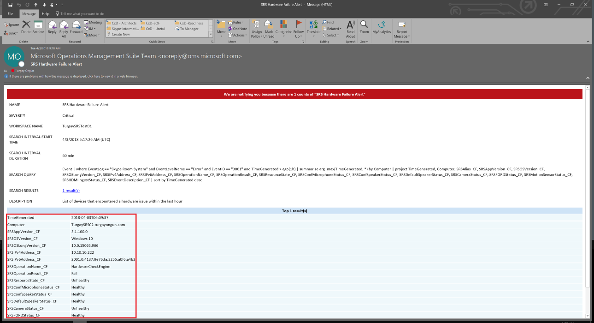
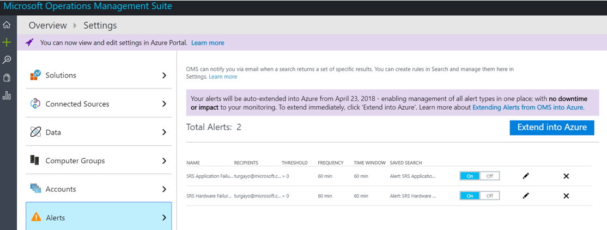
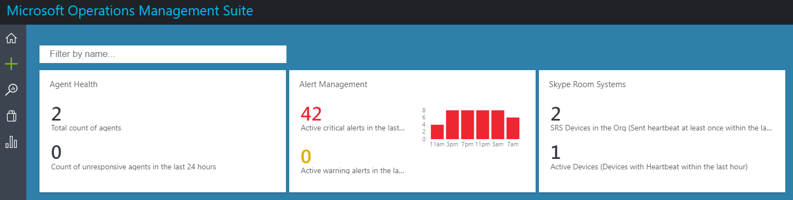

# Deploy Skype Room Systems v2 management with OMS

This article discusses how to set up and deploy integrated, end-to-end management of Skype Room Systems v2 devices by using Microsoft Operations Management Suite.

You can configure Microsoft Operations Management Suite to provide basic telemetry and alerts that will help you manage Skype meeting room devices. As your management solution matures, you might decide to deploy additional data and management capabilities to create a more detailed view of device availability and performance.

By following this guide, you can use a dashboard like the following example to get detailed status reporting for device availability, application and hardware health, and Skype Room Systems v2 application version distribution.



At a high level, you need to perform the following tasks:


1.  [Validate Operations Management Suite configuration](with-oms.md#validate_OMS)
2.  [Configure test devices for Operations Management Suite management setup](with-oms.md#configure_test_devices)
3.  [Map custom fields](with-oms.md#Custom_fields)
4.  [Define the Skype Room Systems v2 views in Operations Management Suite](with-oms.md#Define_Views)
5.  [Define alerts](with-oms.md#Alerts)
6.  [Configure all devices for Operations Management Suite](with-oms.md#configure_all_devices)
7.  [Configure additional Operations Management Suite solutions](with-oms.md#Solutions)

> [!IMPORTANT]
> Although with minimal configuration, the Operations Management Suite can monitor a computer running a Windows operating system, there are still some Skype Room Systems v2–specific steps that you need to take before you start deploying agents to all Skype Room Systems devices.
> Therefore, we highly recommend you perform all configuration steps in the right order for a controlled setup and configuration. The quality of the end result very much depends on the quality of the initial configuration.

## Validate Operations Management Suite configuration
<a name="validate_OMS"> </a>

You need to have an Operations Management Suite workspace to start collecting logs from Skype Room Systems v2 devices. A workspace is a unique Log Analytics environment with its own data repository, data sources, and solutions. If you already have an existing Log Analytics workspace, you might use it to monitor your Skype Room Systems v2 deployment or you can create a dedicated Log Analytics workspace specific to your Skype Room Systems v2 monitoring needs.

If you need to create a new Log Analytics workspace, follow the instructions in the article [Create a Log Analytics workspace in the Azure portal](https://docs.microsoft.com/azure/log-analytics/log-analytics-quick-create-workspace)

> [!NOTE]
> To use Log Analytics with Operations Management Suite, you need to have an active Azure subscription. If you don’t have an Azure subscription, you can create [a free trial subscription](https://azure.microsoft.com/free) as a starting point.


### Configure Operations Management Suite to collect Skype Room Systems v2 event logs

Log Analytics only collects events from the Windows event logs that are specified in the settings. For each log, only the events with the selected severities are collected.

You need to configure Operations Management Suite to collect the logs required to monitor Skype Room Systems v2 device and application status. Skype Room Systems v2 devices use the **Skype Room System** event log.

To configure Operations Management Suite to collect the Skype Room Systems v2 events, see [Windows event log data sources in Log Analytics](https://docs.microsoft.com/azure/log-analytics/log-analytics-data-sources-windows-events)




> [!IMPORTANT]
> Select the **Skype Room System** event log, and then select the **Error**, **Warning**, and **Information** check boxes.

## Configure test devices for Operations Management Suite setup
<a name="configure_test_devices"> </a>

You need to prepare Operations Management Suite to be able to monitor Skype Room Systems v2–related events. To start with, you need to deploy Operations Management Suite agents to just one or two Skype Room Systems v2 devices that you have physical access to and have those test devices generate some data and push it to the Log Analytics workspace.

### Install Operations Management Suite agents to test devices

Deploy the Operations Management Suite agent to the test devices by using the instructions provided in [Connect Windows computers to the Log Analytics service in Azure](https://docs.microsoft.com/azure/log-analytics/log-analytics-agent-windows). This article gives detailed information about the steps for deploying Microsoft Monitoring Agent for Windows, instructions for obtaining the Operations
Management Suite *Workspace ID* and the *primary key* to get Skype Room Systems v2 devices connected to your Operations Management Suite deployment, and steps to verify agent connectivity to Log Analytics.

### Generate sample Skype Room Systems events

After the Operations Management Suite agent is deployed onto the test devices, verify that the required event log data is collected by Log Analytics.

1.  Sign in to the [Microsoft Operations Management Suite portal](https://aka.ms/omsportal).

2.  List the events generated by a Skype Room Systems v2 device:
    1.  Go to **Log Search** and use a query to retrieve the records that will have the custom field.
    2.  Sample query: `Event | where Source == "SRS-App"`

3.  Make sure that the query returns log records that include successful heartbeat events.

4.  Generate a hardware issue, and validate that the required events are logged in Operations Management Suite.
    1.  Unplug one of the peripheral devices on the test Skype Room Systems v2 system. This could be the camera, speakerphone, microphone, or Front Room Display
    2.  Wait 10 minutes for the event log to be populated in Operations Management Suite.
    3.  Use a query to list hardware error events: `Event | where EventID == 3001`

5.  Generate an application issue, and validate that the required events are logged.
    1.  Modify Skype Room Systems v2 application configuration, and type an incorrect Session Initiation Protocol (SIP) address/password pair.
    2.  Wait 10 minutes for the event log to be populated in Operations Management Suite.
    3.  Use a query to list application error events: `Event | where EventID == 2001`

> [!IMPORTANT]
> These sample event logs are required before custom fields can be configured. Don’t proceed to the next step until you have collected the required event logs.

## Map custom fields
<a name="Custom_fields"> </a>

You use custom fields to extract specific data from the event logs. You need to define custom fields that will be used later with your tiles, dashboard views, and alerts. See [Custom fields in Log Analytics](https://docs.microsoft.com/azure/log-analytics/log-analytics-custom-fields) and become familiar with the concepts before you start creating your custom fields.

To extract your custom fields out of the captured event logs, follow these steps:

1. Sign in to the [Microsoft Operations Management Suite portal](https://aka.ms/omsportal).

2. List the events generated by a Skype Room Systems v2 device:
   1.  Go to **Log Search** and use a query to retrieve the records that will have the custom field.
   2.  Sample query: `Event | where Source == "SRS-App"`

3. Select one of the records, select the button to the left, and start the field extraction wizard.

   

4. Highlight the data you’d like to extract from the RenderedDescription and provide a Field Title. The field names that you should use are provided in Table 1.

   

5. Use the mappings shown in *Table 1*. Operations Management Suite will automatically add the **\_CF** string when you define the new field.

> [!IMPORTANT]
> Remember that all JSON and Operations Management Suite fields are case-sensitive.
> 
> Pay attention to the state of the EventID check box in the table below. Be sure you confirm the state of this check box for Operations Management Suite to successfully extract custom field values.
> 
> 

**Table 1**

| JSON field                   | OMS custom field           | Event ID        |
|:-----------------------------|:---------------------------|:----------------|
| Description                  | SRSEventDescription_CF     | Not selected    |
| ResourceState                | SRSResourceState_CF        | Not selected    |
| OperationName                | SRSOperationName_CF        | Not selected    |
| OperationResult              | SRSOperationResult_CF      | Not selected    |
| OS                           | SRSOSVersion_CF            | Not selected    |
| OSVersion                    | SRSOSLongVersion_CF        | Not selected    |
| Alias                        | SRSAlias_CF                | Not selected    |
| DisplayName                  | SRSDisplayName_CF          | Not selected    |
| AppVersion                   | SRSAppVersion_CF           | Not selected    |
| IPv4Address                  | SRSIPv4Address_CF          | Not selected    |
| IPv6Address                  | SRSIPv6Address_CF          | Not selected    |
| Front of Room Display status | SRSFORDStatus_CF           | 3001            |
| Camera status                | SRSCameraStatus_CF         | 3001            |
| Conference Microphone status | SRSConfMicrophoneStatus_CF | 3001            |
| Conference Speaker status    | SRSConfSpeakerStatus_CF    | 3001            |
| Default Speaker status       | SRSDefaultSpeakerStatus_CF | 3001            |
| Motion Sensor status         | SRSMotionSensorStatus_CF   | 3001            |
| HDMI Ingest status           | SRSHDMIIngestStatus_CF     | 3001            |


## Define the Skype Room Systems v2 views in Operations Management Suite
<a name="Define_Views"> </a>

After data is collected and custom fields are mapped, you can use Operations Management Suite View Designer to develop a dashboard containing various tiles to monitor Skype Room Systems v2 events. Use View Designer to create the following tiles. For more information, see [Use View Designer to create custom views in Log Analytics](https://docs.microsoft.com/azure/log-analytics/log-analytics-view-designer)

> [!NOTE]
> Earlier steps in this guide should have been completed for the dashboard tiles to work properly.


### Create a Skype Room Systems v2 dashboard by using the import method

You can import an Operations Management Suite dashboard and start monitoring your devices immediately. Take the following steps to import the dashboard:

1.  Get the [SkypeRoomSystems_v2.omsview](https://go.microsoft.com/fwlink/?linkid=835675) dashboard file.
2.  Sign in to the [Microsoft Operations Management Suite portal](https://aka.ms/omsportal).
3.  Open **View Designer**.
4.  Select **Import**, and then select the **SkypeRoomSystems_v2.omsview** file.
5.  Select **Save**.

### Create a Skype Room Systems v2 dashboard manually

Alternatively, you can create your own dashboard and add only the tiles that you wish to monitor.

#### Configure the Overview Tile
1.  Open **View Designer**.
2.  Select **Overview Tile**, and then select **Two numbers** from the gallery.
3.  Name the tile **Skype Room Systems v2**.
4.  Define the **First Tile**:<br>
    **Legend:** Devices that sent a heartbeat at least once within the last month<br>
    **Query:** ```Event | where EventLog == "Skype Room System" and TimeGenerated > ago(30d) | summarize TotalSRSDevices = dcount(Computer)```
5.  Define the **Second Tile**:<br>
    **Legend:** Active devices that sent a heartbeat within the last hour<br>
    **Query:** ```Event | where EventLog == "Skype Room System" and SRSOperationName_CF == "Heartbeat" and TimeGenerated > ago(1h) | summarize TotalSRSDevices = dcount(Computer)```
6.  Select **Apply**.

### Create a tile that displays active devices
1.  Select **View Dashboard** to start adding your tiles.
2.  Select **Number & list** from the gallery
3.  Define the **General** properties:<br>
    **Group Title:** Heartbeat Status<br>
    **New Group:** Selected
4.  Define the **Tile** properties:<br>
    **Legend:** Active devices (heartbeat sent in the last 20 minutes)<br>
    **Tile Query:** ```Event | where EventLog == "Skype Room System" and SRSOperationName_CF == "Heartbeat" and TimeGenerated > ago(20m) | summarize AggregatedValue = count() by Computer | count```
5.  Define the **List** properties:<br>
    **List Query:** ```Event | where EventLog == "Skype Room System" and SRSOperationName_CF == "Heartbeat" and TimeGenerated > ago(20m) | summarize TimeGenerated = max(TimeGenerated) by Computer | order by TimeGenerated```
6.  Define **Column Titles**:<br>
    **Name:** Display Name<br>
    **Value:** Last Heartbeat
7.  Define **Navigation Query**.<br>
    ```search {selected item} | where EventLog == "Skype Room System" and SRSOperationName_CF == "Heartbeat" | summarize arg_max(TimeGenerated, *) by Computer | project TimeGenerated, Computer, SRSAlias_CF, SRSAppVersion_CF, SRSOSVersion_CF, SRSOSLongVersion_CF, SRSIPv4Address_CF, SRSIPv6Address_CF, SRSOperationName_CF, SRSOperationResult_CF, SRSResourceState_CF, SRSEventDescription_CF```
8.  Select **Apply**, and then **Close**.

### Create a tile that displays devices that have connectivity issues
1.  Select **Number & list** from the gallery, and then add a new tile.
2.  Define the **General** properties:<br>
    **Group Title:** Leave empty<br>
    **New Group:** Not Selected
3.  Define the **Tile** properties:<br>
    **Legend:** Inactive Devices (no heartbeat message sent in the last 20 minutes)<br>
    **Tile Query:** ```Event | where EventLog == "Skype Room System" and SRSOperationName_CF == "Heartbeat" | summarize LastHB = max(TimeGenerated) by Computer | where LastHB < ago(20m) | count```
4.  Define the **List** properties:<br>
    **List Query:** ```Event | where EventLog == "Skype Room System" and SRSOperationName_CF == "Heartbeat" | summarize TimeGenerated = max(TimeGenerated) by Computer | where TimeGenerated < ago(20m) | order by TimeGenerated```
5.  Define **Column Titles**:<br>
    **Name:** Display Name<br>
    **Value:** Last Heartbeat
6.  Define **Navigation Query**:<br>
    ```search {selected item} | where EventLog == "Skype Room System" and SRSOperationName_CF == "Heartbeat" | summarize arg_max(TimeGenerated, *) by Computer | project TimeGenerated, Computer, SRSAlias_CF, SRSAppVersion_CF, SRSOSVersion_CF, SRSOSLongVersion_CF, SRSIPv4Address_CF, SRSIPv6Address_CF, SRSOperationName_CF, SRSOperationResult_CF, SRSResourceState_CF, SRSEventDescription_CF```
7.  Select **Apply**, and then **Close**.

### Create a tile that displays devices that have a hardware error

1.  Select **Number & list** from the gallery, and then add a new tile.
2.  Define the **General** properties:<br>
    **Group Title:** Hardware Status<br>
    **New Group:** Selected
3.  Define the **Tile** properties:<br>
    **Legend:** Devices that experienced a hardware error in the last hour <br>
    **Tile Query:** ```Event | where EventLog == "Skype Room System" and EventLevelName == "Error" and EventID == "3001" and TimeGenerated > ago(1h) | summarize AggregatedValue = count() by Computer | count```
4.  Define the **List** properties:<br>
    **List Query:** ```Event | where EventLog == "Skype Room System" and EventLevelName == "Error" and EventID == "3001" and TimeGenerated > ago(1h) | summarize TimeGenerated = max(TimeGenerated) by Computer```
5.  Define **Column Titles**:<br>
    **Name:** Display Name<br>
    **Value:** Last Error
6.  Define **Navigation Query**:<br>
    ```search {selected item} | where EventLog == "Skype Room System" and EventID == 3001 and EventLevelName == "Error" | summarize arg_max(TimeGenerated, *) by Computer | project TimeGenerated, Computer, SRSAlias_CF, SRSAppVersion_CF, SRSOSVersion_CF, SRSOSLongVersion_CF, SRSIPv4Address_CF, SRSIPv6Address_CF, SRSOperationName_CF, SRSOperationResult_CF, SRSResourceState_CF, SRSConfMicrophoneStatus_CF, SRSConfSpeakerStatus_CF, SRSDefaultSpeakerStatus_CF, SRSCameraStatus_CF, SRSFORDStatus_CF, SRSMotionSensorStatus_CF, SRSHDMIIngestStatus_CF, SRSEventDescription_CF | sort by TimeGenerated desc```
7.  Select **Apply**, and then **Close**.

### Create a tile that displays Skype Room Systems v2 Operating System versions

1.  Select **Donut & list** from the gallery, and then add a new tile.
2.  Define the **General** properties:<br>
    **Group Title:** Operating Syetem details <br>
    **New Group:** Selected
3.  Define the **Header** properties:<br>
    **Title:** Operating System versions<br>
    **Subtitle:** Devices running specific OS versions
4.  Define the **Donut** properties:<br>
    **Query:** ```Event | where EventLog == "Skype Room System" and SRSOperationName_CF == "Heartbeat" | summarize OS_Version = max(SRSOSLongVersion_CF) by Computer | summarize AggregatedValue = count() by OS_Version | sort by OS_Version asc```<br>
    **Center Text:** Devices<br>
    **Operation:** Sum
5.  Define the **List** properties.<br>
    **List Query:** ```Event | where EventLog == "Skype Room System" and SRSOperationName_CF == "Heartbeat" | summarize SRSOSLongVersion_CF = max(SRSOSLongVersion_CF) by Computer | sort by Computer asc```<br>
    **Hide Graph:** Selected<br>
    **Enable Sparklines:** Not selected
6.  Define **Column Titles**.<br>
    **Name:** Display Name<br>
    **Value:** Leave Empty
7.  Define **Navigation Query**.<br>
    ```search {selected item} | where EventLog == "Skype Room System" and SRSOperationName_CF == "Heartbeat" | summarize arg_max(TimeGenerated, *) by Computer | project TimeGenerated, Computer, SRSDisplayName_CF, SRSAlias_CF, SRSAppVersion_CF, SRSOSVersion_CF, SRSOSLongVersion_CF, SRSIPv4Address_CF, SRSIPv6Address_CF, SRSOperationName_CF, SRSOperationResult_CF, SRSResourceState_CF, SRSEventDescription_CF```
8.  Select **Apply** and then **Close**.

### Create a tile that displays Skype Room Systems v2 application versions

1.  Select **Donut & list** from the gallery, and then add a new tile.
2.  Define the **General** properties:<br>
    **Group Title:** Skype Room Systems v2 application details <br>
    **New Group:** Selected
3.  Define the **Header** properties:<br>
    **Title:** Application versions<br>
    **Subtitle:** Devices running specific application versions
4.  Define the **Donut** properties:<br>
    **Query:** ```Event | where EventLog == "Skype Room System" and SRSOperationName_CF == "Heartbeat" | summarize App_Version = max(SRSAppVersion_CF) by Computer | summarize AggregatedValue = count() by App_Version | sort by App_Version asc```<br>
    **Center Text:** Devices<br>
    **Operation:** Sum
5.  Define the **List** properties.<br>
    **List Query:** ```Event | where EventLog == "Skype Room System" and SRSOperationName_CF == "Heartbeat" | summarize SRSAppVersion_CF = max(SRSAppVersion_CF) by Computer | sort by Computer asc```<br>
    **Hide Graph:** Selected<br>
    **Enable Sparklines:** Not selected
6.  Define **Column Titles**.<br>
    **Name:** Display Name<br>
    **Value:** Leave Empty
7.  Define **Navigation Query**.<br>
    ```search {selected item} | where EventLog == "Skype Room System" and SRSOperationName_CF == "Heartbeat" | summarize arg_max(TimeGenerated, *) by Computer | project TimeGenerated, Computer, SRSAlias_CF, SRSAppVersion_CF, SRSOSVersion_CF, SRSOSLongVersion_CF, SRSIPv4Address_CF, SRSIPv6Address_CF, SRSOperationName_CF, SRSOperationResult_CF, SRSResourceState_CF, SRSEventDescription_CF```
8.  Select **Apply** and then **Close**.

### Create a tile that displays devices that have an application error

1.  Select **Number & list** from the gallery, and then add a new tile.
2.  Define the **General** properties.<br>
    **Group Title:** Leave empty<br>
    **New Group:** Not Selected
3.  Define the **Tile** properties.<br>
    **Legend:** Devices that experienced an application error in the last hour<br>
    **Tile Query:** ```Event | where EventLog == "Skype Room System" and EventLevelName == "Error" and EventID == "2001" and TimeGenerated > ago(1h) | summarize AggregatedValue = count() by Computer | count```
4.  Define the **List** properties.<br>
    **List Query:** ```Event | where EventLog == "Skype Room System" and EventLevelName == "Error" and EventID == "2001" and TimeGenerated > ago(1h) | summarize TimeGenerated = max(TimeGenerated) by Computer | order by TimeGenerated```
5.  Define **Column Titles**.<br>
    **Name:** Display Name<br>
    **Value:** Last Error
6.  Define **Navigation Query**.<br>
    ```search {selected item} | where EventLog == "Skype Room System" and EventID == 2001 and EventLevelName == "Error" | summarize arg_max(TimeGenerated, *) by Computer | project TimeGenerated, Computer, SRSAlias_CF, SRSAppVersion_CF, SRSOSVersion_CF, SRSOSLongVersion_CF, SRSIPv4Address_CF, SRSIPv6Address_CF, SRSOperationName_CF, SRSOperationResult_CF, SRSResourceState_CF, SRSEventDescription_CF | sort by TimeGenerated desc```
7.  Select **Apply** and then **Close**.

### Create a tile that displays devices that have been restarted

1.  Select **Number & list** from the gallery, and then add a new tile.
2.  Define the **General** properties.<br>
    **Group Title:** Leave empty<br>
    **New Group:** Not Selected
3.  Define the **Tile** properties.<br>
    **Legend:** Devices where the application was restarted in the last 24 hours, and number of restarts<br>
    **Tile Query:** ```Event | where EventLog == "Skype Room System" and EventID == "4000" and TimeGenerated > ago(24h) | summarize AggregatedValue = count() by Computer | count```
4.  Define the **List** properties.<br>
    **List Query:** ```Event | where EventLog == "Skype Room System" and EventID == "4000" and TimeGenerated > ago(24h) | order by TimeGenerated | summarize AggregatedValue = count(EventID) by Computer```
5.  Define **Column Titles**.<br>
    **Name:** Display Name<br>
    **Value:** Number of Restarts
6.  Define **Navigation Query**.<br>
    ```search {selected item} | where EventLog == "Skype Room System" and EventID == "4000" and TimeGenerated > ago(24h) | project TimeGenerated, Computer, SRSAlias_CF, SRSAppVersion_CF, SRSOSVersion_CF, SRSOSLongVersion_CF, SRSIPv4Address_CF, SRSIPv6Address_CF, SRSOperationName_CF, SRSOperationResult_CF, SRSResourceState_CF, SRSEventDescription_CF```
7.  Select **Apply** and then **Close**.
8.  Select **Save** to save your dashboard.

Now you’ve completed creating your views.

You can use the Microsoft Operations Management Suite portal or Operations Management Suite mobile clients for [Windows Phone](https://www.microsoft.com/en-us/store/p/microsoft-operations-management-suite/9wzdncrfjz2r), [iOS](https://itunes.apple.com/us/app/microsoft-operations-management-suite/id1042424859), or [Android](https://play.google.com/store/apps/details?id=com.microsoft.operations.AndroidPhone) to access your views.

## Configure Alerts in Operations Management Suite
<a name="Alerts"> </a>
When a Skype Room Systems v2 device encounters an issue, Microsoft Operations Management Suite can raise alerts to notify the administrators with the details of the issue.

Operations Management Suite includes a built-in alerting mechanism that runs through scheduled log searches at regular intervals. If the results of the log search match some particular criteria, an alert record is created.



The rule can then automatically run one or more actions to proactively notify you of the alert or invoke another process. The possible options with Operations Management Suite alerts are:
-   Sending an email
-   Invoking an external process through an HTTP POST request
-   Starting a runbook in Azure Automation service

See [Understanding alerts in Log Analytics](https://docs.microsoft.com/azure/log-analytics/log-analytics-alerts) to learn more about the alerts in Operations Management Suite.

> [!NOTE]
> The following examples send email alerts when a Skype Room Systems v2 device generates a hardware or an application error.


### Configure an email alert for Skype Room Systems v2 hardware issues

Configure an alert rule that checks for Skype Room Systems v2 devices that have had hardware issues within the last hour.
1.  Sign in to the [Microsoft Operations Management Suite portal](https://aka.ms/omsportal).

2.  Select **Log Search**.

3.  Enter the following query, and then select **Run**.<br>
    ```
    Event
    | where EventLog == "Skype Room System" and EventLevelName == "Error" and EventID == "3001" and TimeGenerated > ago(1h)
    | summarize arg_max(TimeGenerated, *) by Computer
    | project TimeGenerated, Computer, SRSAlias_CF, SRSAppVersion_CF, SRSOSVersion_CF, SRSOSLongVersion_CF, SRSIPv4Address_CF, SRSIPv6Address_CF, SRSOperationName_CF, SRSOperationResult_CF, SRSResourceState_CF, SRSConfMicrophoneStatus_CF, SRSConfSpeakerStatus_CF, SRSDefaultSpeakerStatus_CF, SRSCameraStatus_CF, SRSFORDStatus_CF, SRSMotionSensorStatus_CF, SRSHDMIIngestStatus_CF, SRSEventDescription_CF
    |sort by TimeGenerated desc
    ```

4.  After the query is executed, select **Alert**. This will open the **Add Alert Rule** page.

5.  Configure alert settings by using the information below:<br>
    **Rule Name:** Skype Room Systems v2 Hardware Failure Alert<br>
    **Description:** List of devices that encountered a hardware issue within the last hour<br>
    **Severity:** Critical<br>
    **Query:** Use the prepopulated search query<br>
    **Time Window:** 1 hour<br>
    **Alert Frequency:** 1 hour<br>
    **Number of results:** Greater than 0<br>
    **Email Subject:** Skype Room Systems v2 Hardware Failure Alert<br>
    **Recipients:** Include the email addresses, using semicolons as separators<br>

6.  Select **Save**.

### Configure an email alert for Skype Room Systems v2 application issues

Configure an alert rule, that checks for Skype Room Systems v2 devices that have had application issues within the last hour.
1.  Select **Log Search**.

2.  Enter the following query, and then select **Run**.<br>
    ```
    Event
    | where EventLog == "Skype Room System" and EventLevelName == "Error" and EventID == "2001" and TimeGenerated > ago(10h)
    | summarize arg_max(TimeGenerated, *) by Computer
    | project TimeGenerated, Computer, SRSAlias_CF, SRSAppVersion_CF, SRSOSVersion_CF, SRSOSLongVersion_CF, SRSIPv4Address_CF, SRSIPv6Address_CF, SRSOperationName_CF, SRSOperationResult_CF, SRSResourceState_CF, SRSEventDescription_CF
    | sort by TimeGenerated desc
    ```

3.  After the query is executed, select **Alert**. This will open the **Add Alert Rule** page.

4.  Configure alert settings by using the information below:<br>
    **Rule Name:** Skype Room Systems v2 Application Failure Alert<br>
    **Description:** List of devices that encountered an application issue within the last hour<br>
    **Severity:** Critical<br>
    **Query:** Use the prepopulated search query<br>
    **Time Window:** 1 hour<br>
    **Alert Frequency:** 1 hour<br>
    **Number of results:** Greater than 0<br>
    **Email Subject:** Skype Room Systems v2 Application Failure Alert<br>
    **Recipients:** Include the email addresses, using semicolons as separators

5.  Select **Save**.

Now you’ve completed defining alerts. You can define additional alerts by using the examples above.

When an alert is generated, you’ll get an email that lists the devices that encountered an issue within the last hour.



You use an alert settings page to modify an existing alert configuration, or to disable or remove an alert.



> [!NOTE]
> You might need to use the Azure portal to add or modify Operations Management Suite alerts if your Operations Management Suite workspace is configured to extend the Operations Management Suite alerts into Azure. For more details, see [Extend alerts from OMS portal into Azure](https://docs.microsoft.com/azure/monitoring-and-diagnostics/monitoring-alerts-extend).

## Configure all devices for Operations Management Suite
<a name="configure_all_devices"> </a>
After the dashboards and alerts are configured, you can set up and configure Operations Management Suite agents on all Skype Room Systems v2 devices to complete your monitoring deployment.

Although you can install and configure the Operations Management Suite agents manually on each device, we highly recommend you leverage existing software deployment tools and methods.

If you’re building your Skype Room Systems v2 devices for the first time, you might want to include the Operations Management Suite agent setup and configuration steps as part of your build process. For more information, see [Install the agent using the command line](https://docs.microsoft.com/azure/log-analytics/log-analytics-agent-windows#install-the-agent-using-the-command-line).

### Deploying Operations Management Suite agents by using a Group Policy Object

If you already deployed your Skype Room Systems v2 devices before you implement Operations Management Suite, you can use the provided script to set up and configure the agents by using Active Directory group policies.

1.  Create a shared network path and grant read access to **Domain Computers** group.

2.  Download the 64-bit version of the Operations Management Suite Agent for Windows from <https://go.microsoft.com/fwlink/?LinkID=517476>

3.  Extract the contents of the setup package into the network share.
    1.  Open a Command Prompt window, and then execute **MMASetup-AMD64.exe /c**
    2.  Specify the share you just created, and extract the content.

4.  Create a new Group Policy Object and assign it to the organizational unit where Skype Room Systems v2 machine accounts are located.

5.  Configure PowerShell execution policy:
    1.  Edit the newly created Group Policy Object and navigate to Computer Configuration \\ Policies \\ Administrative Templates \\ Windows Components \\ Windows PowerShell
    2.  Enable the **Turn on Script Execution** and set **Execution Policy** to **Allow Local Scripts**.

6.  Configure the startup script:
    1.  Copy the following script and save it as Install-OMSAgent.ps1.
    2.  Modify WorkspaceId, WorkspaceKey, and SetupPath parameters to match your configuration.
    3.  Edit the same Group Policy Object and navigate to Computer Configuration \\ Policies \\ Windows Settings \\ Scripts (Startup/Shutdown)
    4.  Double-click to select **Startup**, and then select **PowerShell Scripts**.
    5.  Select **Show Files**, and then copy the **Install-OMSAgent.ps1** file to that folder.
    6.  Select **Add**, and then **Browse**.
    7.  Select the ps1 script you just copied.

7.  Skype Room Systems v2 devices should install and configure the Microsoft Monitoring agent with the second reboot.


~~~
```
# Install-OMSAgent.ps1
<#
Date:        04/20/2018
Script:      Install-OMSAgent.ps1
Version:     1.0
#>

# Set the parameters
$WorkspaceId = "<your workspace id>"
$WorkspaceKey = "<your workspace key>"
$SetupPath = "\\Server\Share"

$SetupParameters = "/qn NOAPM=1 ADD_OPINSIGHTS_WORKSPACE=1 OPINSIGHTS_WORKSPACE_AZURE_CLOUD_TYPE=0 OPINSIGHTS_WORKSPACE_ID=$WorkspaceId OPINSIGHTS_WORKSPACE_KEY=$WorkspaceKey AcceptEndUserLicenseAgreement=1"

# $SetupParameters = $SetupParameters + " OPINSIGHTS_PROXY_URL=<Proxy server URL> OPINSIGHTS_PROXY_USERNAME=<Proxy server username> OPINSIGHTS_PROXY_PASSWORD=<Proxy server password>"

# Start PowerShell logging
Start-Transcript -Path C:\OMSAgentInstall.Log

# Check if the Microsoft Monitoring Agent is installed
$mma = New-Object -ComObject 'AgentConfigManager.MgmtSvcCfg'

# Check if the Microsoft Monitoring agent is installed
if (!$mma)
{
    #Install agent
    Start-Process -FilePath "$SetupPath\Setup.exe" -ArgumentList $SetupParameters -ErrorAction Stop -Wait
}

# Check if the agent has a valid configuration
$CheckOMS = $mma.GetCloudWorkspace($WorkspaceId).AgentId
if (!$CheckOMS)
{
    # Apply new configuration
    $mma.AddCloudWorkspace($WorkspaceId, $WorkspaceKey)
    $mma.ReloadConfiguration()
}

Stop-Transcript

```
~~~

> [!NOTE]
> You can refer to the article [Managing and maintaining the Log Analytics agent](https://docs.microsoft.com/azure/log-analytics/log-analytics-agent-manage) when you need to reconfigure an agent, move it to a different workspace, or modify proxy settings after the initial installation.

## Additional Solutions
<a name="Solutions"> </a>

Operations Management Suite provides built-in solutions through its [solution gallery](https://docs.microsoft.com/azure/log-analytics/log-analytics-add-solutions) to further help you monitor your environment. We highly recommend that you add [Alert Management](https://docs.microsoft.com/azure/log-analytics/log-analytics-solution-alert-management) and [Agent Health](https://docs.microsoft.com/azure/operations-management-suite/oms-solution-agenthealth) solutions to your Operations Management Suite workspace as well.



> [!NOTE]
> The Agent Health solution can help you identify outdated or broken Operations Management Suite agents within your environment, and the Alert Management solution provides details about the alerts that have been raised within a given period.

## See also

[Plan Skype Room Systems v2 management with OMS](../../plan-your-deployment/clients-and-devices/oms-management.md)

[Manage Skype Room Systems v2 devices with OMS](../../manage/skype-room-systems-v2/oms.md)
