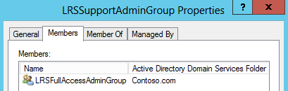
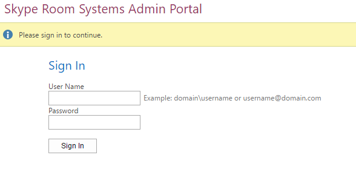
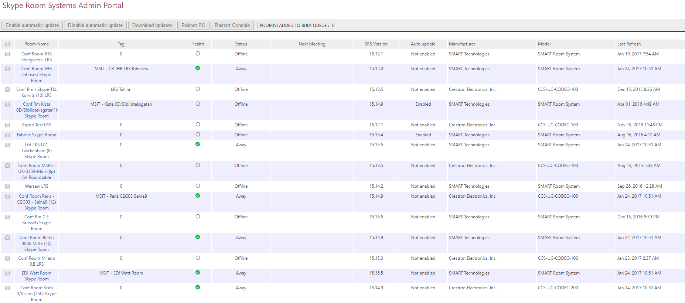
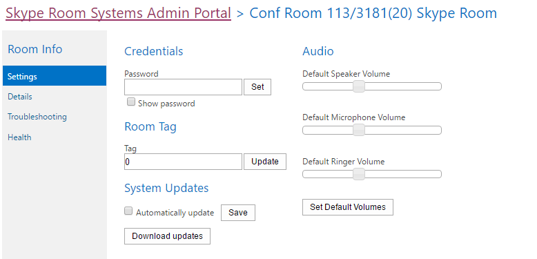
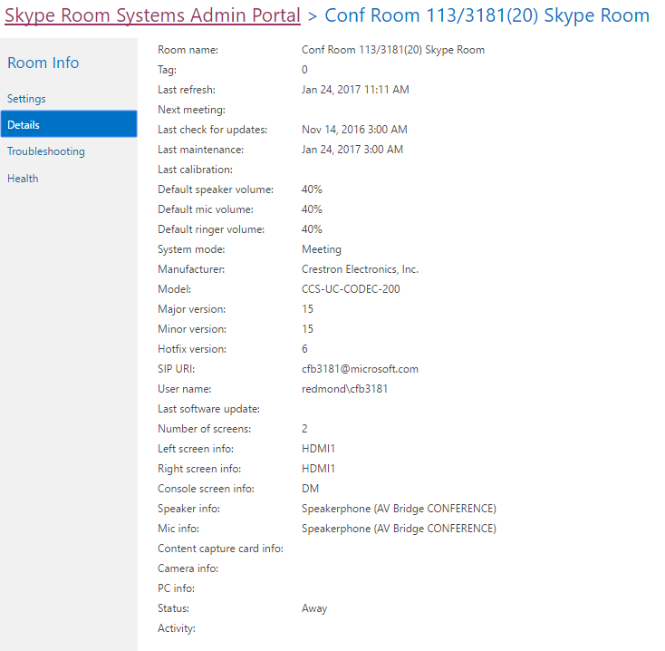

# Deploy SRS v1 Administrative Web Portal in Skype for Business Server

The Skype for Business Server Skype Room Systems v1 (SRS v1, formerly known as Lync Room System) Administrative Web Portal is a web portal that organizations can use to maintain their Skype Room Systems conference rooms. Administrators can use the SRS v1 Administrative Web Portal to monitor device health, for example by monitoring audio/video devices. With this portal, administrators can remotely collect diagnostic information to monitor conference room health.

To use this feature, the SRS v1 Administrative Web Portal needs to be deployed on every Skype for Business Server Front End Server. This guide provides instructions for administrators on how to install and configure the SRS Administrative Web Portal. It is intended for administrators who have knowledge of Skype for Business Server administration, and who have administrator user rights to modify the Skype for Business Server topology.

After the SRS v1 Administrative Web Portal is deployed on the server, administrators can check the status SRS v1 devices by logging on to the site from their own computers or laptops.

> [!IMPORTANT]
> Download the [Microsoft Skype Room Systems v1 Administrative Web Portal for Skype for Business Server 2015](https://www.microsoft.com/en-us/download/details.aspx?id=46906).

In this topic:

- [Configure your environment for the SRS v1 Administrative Web Portal](room-system-v1-administrative-web-portal.md#Config_Env)

- [Install the SRS v1 Administrative Web Portal](room-system-v1-administrative-web-portal.md#Install_SRS)

- [Use the SRS Administrative Web Portal](room-system-v1-administrative-web-portal.md#Use_Portal)

## Configure your environment for the SRS v1 Administrative Web Portal
<a name="Config_Env"> </a>

To use the SRS v1 Administrative Web Portal, you will need to install or configure the following prerequisites.

> [!IMPORTANT]
> If the server is configured with both Kerberos and NTLM authentication, and SRS is running on a computer that is not joined to the domain, Kerberos authentication will fail and the user will not see the status of SRS in the administrative portal. To resolve this issue, configure the server with NTLM authentication or both NTLM and TLS-DSK authentication (without Kerberos), or join the SRS computer to the domain.

1. Install Skype for Business Server Cumulative Updates in the Skype for Business Server topology.

    To get the update or see what's included with it, see [Updates for Skype for Business Server 2015](https://support.microsoft.com/en-us/help/3061064/updates-for-skype-for-business-server-2015).

2. Create a SIP-enabled Active Directory user.

    The SRS v1 Administrative Web Portal uses these credentials to query information from Skype for Business Server. The username in the examples given is LRSApp.

3. Create an Active Directory security group with name LRSSupportAdminGroup.

    Create the group with Group Scope as Global and Group Type as Security. SIP enabled users who are added to this group will be authorized to see the list of rooms and execute certain commands, such as collecting logs.

4. Create an Active Directory security group with name LRSFullAccessAdminGroup.

    Create the group with Group Scope as Global and Group Type as Security.SIP enabled users who are added to this group are authorized to use all admin portal functionality on a single Skype room. To include support for bulk management of Skype rooms, refer to step 5.

     

5. Create an Active Directory security group with name LRSPowerUserAdminsGroup.

    Create the group with Group Scope as Global and Group Type as Security. SIP enabled users who are added to this group are authorized to use all admin portal functionality including bulk management of Skype for Business rooms.

6. Add LRSFullAccessAdminGroup as a member of LRSSupportAdminGroup.

     

7. Create a SIP enabled Active Directory user with name LRSSupport. Add this user to LRSSupportAdminGroup.

     

8. Install [ASP.NET MVC 4 for Visual Studio 2010 SP1 and Visual Web Developer 2010 SP1](https://go.microsoft.com/fwlink/p/?LinkId=323967).

## Install the SRS v1 Administrative Web Portal
<a name="Install_SRS"> </a>

Download the [Microsoft Skype Room Systems v1 Administrative Web Portal for Skype for Business Server 2015](https://www.microsoft.com/en-us/download/details.aspx?id=46906).

To install the SRS v1 Administrative Web Portal, use the following steps.

1. Configure the Trusted Application Port by running the following cmdlet in Skype for Business Server Management Shell:

   ```
   Set-CsWebServer -Identity POOLFQDN -MeetingRoomAdminPortalInternalListeningPort 4456 -MeetingRoomAdminPortalExternalListeningPort 4457
   ```

2. To install the Meeting Room Portal, download **MeetingRoomPortalInstaller.msi** and then run it as an administrator.

3. Open the Web.config file from the following location:

    %Program Files%\Skype for Business Server 2015\Web Components\Meeting Room Portal\Int\Handler\

4. In the Web.Config file, change the PortalUserName to the username created in Step 2 under the section "[Configure your environment for the SRS v1 Administrative Web Portal](room-system-v1-administrative-web-portal.md#Config_Env)" (the recommended name in the step is LRSApp):

    ```
    <add key="PortalUserName" value="sip:LRSApp@domain.com" />
    ```

5. Because the SRS v1 Admin Portal is a trusted application, you do not need to provide the password in the portal configuration. If this user is using a different registrar than local registrar, you need to specify the registrar for it by adding the following line in the Web.Config file:

   ```
   <add key="PortalUserRegistrarFQDN" value="pool-xxxx.domain.com" />
   ```

6. If the port used is other than 5061, add the following line in the Web.Config file:

   ```
   <add key="PortalUserRegistrarPort" value="5061" />
   ```

### Verify Installation of the SRS Administrative Web Portal

To verify installation of the SRS v1 Administrative Web Portal, do the following:

1. On a Front End server, browse to the following URL:

    https://\<fe-server\>/lrs

    You should not see any errors, as shown in the following image:

     

2. If you do not see any errors, try accessing the following URL from any other computer in the topology:

    https://\<fe-server\>/lrs

    To access the page, you will need to add the DNS records as described in "[Required DNS Records for Automatic Client Sign-In](https://go.microsoft.com/fwlink/p/?LinkId=318056)."

## Use the SRS Administrative Web Portal
<a name="Use_Portal"> </a>

After you deploy SRS on the server, you can check the status of all SRS rooms by signing into the SRS v1 Administrative Web Portal from a browser.

### Sign in

1. Browse to the following URL:

    https://\<fe-server\>/lrs

2. Enter the credentials for the LRSSupport account or an account that was added to the LRSSupportAdminGroup security group.


### SRS Administrative Web Portal Summary Page

The summary page provides the following information for all of the SRS rooms deployed on the server:

- **Tag** The custom name that the administrator gives to the room. The Tag can be set in the portal by clicking on the room name.

- **Health** The health status of the room, which is derived from the Aggregate Health status of the room, which is shown under the Health section of the Room Settings page.

- **Next Meeting** The date and time the next meeting is scheduled.

- **SRS Version, Manufacturer, Model** These values are preset in SRS. Depending on the manufacturer, these fields might be left blank.

- **Last Refresh** Displays the last time the web page was refreshed.



> [!NOTE]
> You will only see the Bulk Management menu if you are part of the LRSPowerUserAdminsGroup security group.

### SRS Room Information

The Room Info section of the portal allows you to view and configure individual SRS rooms. It contains four sections: Settings, Details, Logging, and Health.

#### Settings

In the Settings section, you can set the password, room tag, and default volume levels for the room. If you configure these settings, the changes are replicated only after you restart the SRS console. You will only see System Updates settings for SRS devices using release 15.12 and later.



#### Details

The Details section provides a read-only summary of the SRS room's settings, including: the time of last refresh; next meeting; last updates, maintenance and calibration; default speaker, mic, and ringer settings; version; SIP URI; number of screens and details about each screen; status, and activity.



#### Troubleshooting

The Troubleshooting section can be used to remotely collect logs and save them to a specified location. You can also restart the SRS console (SRS user interface) or restart the entire system. To collect logs, provide a folder path in the specified format and make sure that the folder has write permissions given to the SRS machine account. If the log size is too big, it can take up to 5 minutes to finish collecting logs. Refreshing the page will give you the latest status.

#### Health

The Health section gives a visual indication of the health of the Skype for Business Server connection, audio device, video device, resiliency state, and screen device.


### Additional Notes about the Administrative Web Portal

> [!NOTE]
>  Setting changes are applied only after the SRS system is restarted.>  If the LRSApp account password expires, you will not be able to see the status of the rooms. Configure the LRSAppuser account password so that it never expires, or be sure to update the password when it is near expiration.>  The SRS administrative web portal is supported for on-premises deployments only.

### Bulk management

Bulk management of SRS rooms is a feature designed for advanced IT administrators, to simplify their workflow, and enable them with a time-saving convenient tool to remotely manage multiple rooms in a bulk fashion.

In order to see this functionality, the user need to be provisioned as a member of the special security group, **LRSPowerUserAdminsGroup**.

There is no limit to the number of SRS rooms you can select for bulk management. However, you can perform only one bulk management operation at a time.

To perform a bulk management operation, select the rooms you want to monitor, and click on the Bulk management menu.

### Frequently asked questions

#### Why can't I sign in to the administrative web portal?

When you open https://localhost/lrs, you will be able to see the sign in page, but when you type in your credentials, you cannot sign in. In this case, you must open https://FQDNofFEserver/SRS to sign in to the administrative web portal.

#### Why can't I see SRS v1 in the administrative web portal?

- Make sure you have SRS accounts in your deployment and that they are created according to the SRS Administrative Web Portal deployment recommendations. Make sure the SRS accounts are provisioned using Enable-CsMeetingRoom, not Enable-CsUser, on the Skype for Business Server.

- If you have created SRS accounts and cannot see the accounts in administrative web portal, collect the server logs by using the Skype for Business Server Logging tool with the **MeetingPortal** component selected, and then send them to your SRS support contact.

- If you have created SRS accounts and cannot see the accounts in administrative web portal, collect the client logs using Fiddler, and also copy the console log from the browser development tools, and then send them to your SRS support contact. You can also modify the trace level value in the Web.config to get a more detailed log.

  ```
  <system.diagnostics>
    <switches>
      <!--
      This switch controls logging message levels. 0 implies
      logging is turned off. 1 implies only errors are logged,
      2 implies errors &amp; warnings. 4 is the most detailed.
      -->
      <add name="TraceLevelSwitch" value="3" />
    </switches>
  </system.diagnostics>
  ```

#### Why can't I see the status of SRS in the administrative web portal?

- Make sure that the LRSApp user account is SIP-enabled.

- If you are still having issues, collect the **Trace.log** file in the SRS system from D:\Tracing\LRSAdminLogs\, and then send it to your SRS support contact.

#### Why can't I see the bulk management menus for SRS in the administrative web portal?

Make sure that the LRSApp user account is SIP-enabled, and is part of the LRSPowerUserAdminsGroup security group.

#### Does the SRS v1 administrative web portal work with Microsoft Teams Rooms?

No.


