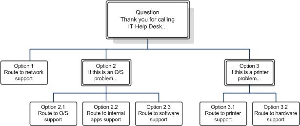

# Designing and creating response group workflows in Skype for Business

Design and create Response Group workflows, in Skype for Business Server Enterprise Voice. Both hunt group workflows and interactive workflows are covered.

A workflow defines the behavior of a call from the time that the phone rings to the time that someone answers the call. The workflow specifies the queue to use for holding the call, and specifies the routing method to use for hunt group workflows or the questions and answers to use for interactive response group workflows.

A workflow also defines settings such as a welcome message, music on hold, business hours, and holidays.

> [!NOTE]
> You must create agent groups and queues before you create a workflow that uses them.

## Creating or modifying a hunt group workflow

### To use Response Group Configuration Tool to create or modify a hunt group workflow

1. Log on as a member of the RTCUniversalServerAdmins group, or as a member of one of the predefined administrative roles that support Response Group.

2. Open a browser window, and then enter the Admin URL to open the Skype for Business Server Control Panel.

3. In the left navigation bar, click **Response Groups**, and then click **Workflow**.

4. On the **Workflow** page, click **Create or edit a workflow**.

5. In the **Select a Service** search field, type all or part of the name of the **ApplicationServer** service that hosts the workflow that you want to create or change. In the resulting list of services, click the service that you want, and then click **OK**.

    > [!NOTE]
    > The Response Group Configuration Tool opens. You can also open the Response Group Configuration Tool directly from a web browser by typing the following URL: https://\<webPoolFqdn\>/RgsConfig.

6. Do one of the following:

   - Under **Create a New Workflow**, next to **Hunt Group**, click **Create**.

   - Under **Manage an Existing Workflow**, locate the workflow you want to change, and then under **Action**, click **Edit**.

7. If you are ready for users to start calling the workflow, select **Activate the workflow**.

    > [!NOTE]
    >  If you are creating a managed workflow, you need to select **Activate the workflow**. After you save the active, managed workflow, you can then modify and deactivate it.

8. To allow federated users to call the group, select the **Enable for federation** check box. You must also have an external access policy that applies to the Response Group application configured for federation.

    > [!NOTE]
    > The global external access policy applies to the Response Group application. You can configure the global policy for response group federation by using Skype for Business Server Control Panel or by using the **Set-CsExternalAccessPolicy** cmdlet to set the EnableOutsideAccess parameter to True. Keep in mind that global policy settings apply to all users unless they are assigned a site or user policy. Therefore, before changing this setting for response groups, make sure that the federation setting meets the requirements of your organization. For details about how policies apply to users, see [Manage External Access Policy for Your Organization](https://technet.microsoft.com/library/5571811e-34c8-443a-b94c-1ab5d4275581.aspx). For details about the federation setting, see [Set-CsExternalAccessPolicy](https://docs.microsoft.com/powershell/module/skype/set-csexternalaccesspolicy?view=skype-ps).

    > [!NOTE]
    > Users who are hosted in Skype for Business Online can't place calls to response groups that are hosted in an on-premises deployment. This is true in both hybrid deployments and in cases where an on-premises deployment is federated with a Skype for Business Online deployment.

9. To hide the identity of agents during calls, select the **Enable agent anonymity** check box.

    > [!NOTE]
    > Anonymous calls cannot start with instant messaging (IM) or video, although the agent or the caller can add IM and video after the call is established. An anonymous agent can also put calls on hold, transfer calls (both blind and consultative transfers), and park and retrieve calls. Anonymous calls do not support conferencing, application sharing and desktop sharing, file transfer, whiteboarding and data collaboration, and call recording. Agents using the Lync VDI Plugin can receive incoming calls anonymously, but they cannot make outgoing calls anonymously.

10. Under **Enter the address of the group that will receive the calls**, type the primary SIP uniform resource identifier (URI) address of the group that will answer calls to the workflow.

    > [!NOTE]
    > The primary URI for a workflow is how the workflow is identified and referenced. The SIP URI that you enter is created as a contact object in Active Directory Domain Services. To create the URI, the object must be unique in Active Directory.

11. In **Display name**, type the name that you want to display for the workflow (for example, Sales Response Group).

    > [!NOTE]
    > Do not include the "<" or ">" characters in the display name. Do not use the following display names because they are reserved: **RGS Presence Watcher** or **Announcement Service**.

12. Under **Telephone number**, type the line URI for the response group (for example, +14255550165).

13. In **Display number**, type the number as you want it to appear for the response group (for example, +1 (425) 555-0165).

14. (Optional) In **Description**, type a description for the workflow as you want it to appear on the contact card in Skype for Business.

15. In **Workflow Type**, select **Managed** if this workflow will be managed by a Response Group Manager. Do the following to assign Response Group Managers to the workflow:

    a. Type the SIP URI of a manager for this workflow, and click **Add**.

    b. Type the SIP URI of additional managers to add to the workflow, and click **Add**.

    > [!IMPORTANT]
    > Every user who is designated as a manager of a response group must be assigned the CsResponseGroupManager role. If users are not assigned this role, they cannot manage response groups.

16. Under **Step 2 Select a Language**, click the language that you want to use for speech recognition and text-to-speech.

17. If you want to configure a welcome message, under **Step 3 Configure a Welcome Message**, select the **Play a welcome message** check box, and then do one of the following:

    - To enter the welcome message as text that is converted to speech for callers, click **Use text-to-speech**, and then type the welcome message in the text box.

    > [!NOTE]
    > Do not include HTML tags in the text you enter. If you include HTML tags, you will receive an error message.

    - To use a wave (.wav) or Windows Media audio (.wma) file recording for the welcome message, click **Select a recording**. If you want to upload a new audio file, click the **a recording** link. In the new browser window, click **Browse**, select the audio file that you want to use, and then click **Open**. Click **Upload** to load the audio file.

    > [!NOTE]
    > All user-provided audio files must meet certain requirements. For details about supported file formats, see [Technical Requirements for Response Groups](https://technet.microsoft.com/library/477488bd-124f-437b-9327-732a0d7271ca.aspx).

18. Under **Step 4 Specify Your Business Hours**, in **Your time zone**, click the time zone for the workflow.

    > [!NOTE]
    > The time zone is the time zone where the callers and agents of the workflow reside. It is used to calculate the open and close hours. For example, if the workflow is configured to use the North American Eastern Time zone and the workflow is scheduled to open at 7:00 A.M. and close at 11:00 P.M., the open and close times are assumed to be 7:00 Eastern Time and 23:00 Eastern Time respectively. (You must enter the times in 24-hour time notation.)

19. Select the type of business hours schedule you want to use by doing one of the following:

    - To use a predefined schedule of business hours, click **Use a preset schedule**, and then select the schedule you want to use from the drop-down list.

      > [!NOTE]
      > You must have defined at least one preset schedule previously to be able to select this option. You define preset schedules by using the **New-CSRgsHoursOfBusiness** cmdlet. For details, see [(Optional) Define Response Group business hours in Skype for Business](optional-define-response-group-business-hours.md).

      > [!NOTE]
      > When you select a preset schedule, **Day**, **Open**, and **Close** are automatically filled with the days and hours that the response group is available.

    - To use a custom schedule that applies only to this workflow, click **Use a custom schedule**.

20. If you are creating a custom schedule for this workflow, click the check boxes for the days of the week that the response group is available.

21. If you are creating a custom schedule, type the **Open** and **Close** hours for each day of the week that the response group is available.

    > [!NOTE]
    > The **Open** and **Close** hours must be in 24-hour time notation. For example, if your office works a 9-to-5 work day and closes at noon for lunch, the business hours are specified as **Open** 9:00, **Close** 12:00, **Open** 13:00, and **Close** 17:00.

22. If you want to play a message when the office is not open, select the **Play a message when the response group is outside of business hours** check box, and then specify the message to play by doing one of the following:

    - To enter the message as text that is converted to speech for the caller, click **Use text-to-speech**, and then type the message in the text box.

      > [!NOTE]
      > Do not include HTML tags in the text you enter. If you include HTML tags, you will receive an error message.

    - To use an audio file recording for the message, click **Select a recording**. If you want to upload a new audio file, click the **a recording** link. In the new browser window, click **Browse**, select the file that you want to use, and then click **Open**. Click **Upload** to load the audio file.

      > [!NOTE]
      > All user-provided audio files must meet certain requirements. For details about supported audio file formats, see [Technical Requirements for Response Groups](https://technet.microsoft.com/library/477488bd-124f-437b-9327-732a0d7271ca.aspx).

23. Specify how to handle calls after the message is played (if a message is configured):

    - To disconnect the call, click **Disconnect Call**.

    - To forward the call to voice mail, click **Forward to voice mail**, and then type the voice mail address. The format for the voice mail address is  *\<username\>*@*\<domainName\>* (for example, bob@contoso.com).

    - To forward the call to another user, click **Forward to SIP URI**, and then type a user address. The format for the user address is  _\<username\>_@_\<domainName\>_.

    - To forward the call to another telephone number, click **Forward to telephone number**, and then type the telephone number. The format for the telephone number is  *\<number\>*@*\<domainName\>* (for example, +14255550121@contoso.com). The domain name is used to route the caller to the correct destination.

24. Under **Step 5 Specify Your Holidays**, click the check boxes for one or more sets of holidays that define the days when the response group is closed for business.

    > [!NOTE]
    > You need to define holidays and holiday sets before you configure the workflow. Use the **New-CsRgsHoliday** and **New-CsRgsHolidaySet** cmdlets to define holidays and holiday sets. For details, see [(Optional) Define Response Group holiday sets in Skype for Business](optional-define-response-group-holiday-sets.md).

25. If you want to play a message on holidays, select the **Play a message during holidays** check box, and then specify the message to play by doing one of the following:

    - To enter the message as text that is converted to speech for the caller, click **Use text-to-speech**, and then type the message in the text box.

    > [!NOTE]
    > Do not include HTML tags in the text you enter. If you include HTML tags, you will receive an error message.

    - To use an audio file recording for the message, click **Select a recording**. If you want to upload a new audio file, click the **a recording** link. In the new browser window, click **Browse**, select the file that you want to use, and then click **Open**. Click **Upload** to load the audio file.

      > [!NOTE]
      > All user-provided audio files must meet certain requirements. For details about supported audio file formats, see [Technical Requirements for Response Groups](https://technet.microsoft.com/library/477488bd-124f-437b-9327-732a0d7271ca.aspx).

26. Specify how to handle calls after the message is played (if a message is configured):

    - To disconnect the call, click **Disconnect Call**.

    - To forward the call to voice mail, click **Forward to voice mail**, and then type the voice mail address. The format for the voice mail address is  *\<username\>*@*\<domainName\>* (for example, bob@contoso.com).

    - To forward the call to another user, click **Forward to SIP URI**, and then type a user address. The format for the user address is  _\<username\>_@_\<domainName\>_.

    - To forward the call to another telephone number, click **Forward to telephone number**, and then type the telephone number. The format for the telephone number is  *\<number\>*@*\<domainName\>* (for example, +14255550121@contoso.com). The domain name is used to route the caller to the correct destination.

27. Under **Step 6 Configure a Queue**, in **Select the queue that will receive the calls**, select the queue that you want to hold callers until an agent becomes available.

28. Under **Step 7 Configure Music on Hold**, choose the music you want callers to listen to while waiting for an agent by doing one of the following:

    - To use the default music-on-hold recording, click **Use default**.

    - To use an audio file recording for the music on hold, click **Select a music file**. If you want to upload a new audio file, click the **a music file** link. In the new browser window, click **Browse**, select the file that you want to use, and then click **Open**. Click **Upload** to load the audio file.

      > [!NOTE]
      > All user provided audio files must meet certain requirements. For details about supported audio file formats, see [Technical Requirements for Response Groups](https://technet.microsoft.com/library/477488bd-124f-437b-9327-732a0d7271ca.aspx).

29. Click **Deploy**.

### To use Skype for Business Server Management Shell to create or modify a hunt group workflow

1. Log on as a member of the RTCUniversalServerAdmins group, or as a member of one of the predefined administrative roles that support Response Group.

2. Start the Skype for Business Server Management Shell: Click **Start**, click **All Programs**, click **Skype for Business 2015**, and then click **Skype for Business Server Management Shell**.

3. Create the prompt to be played for the welcome message, and save it in a variable. At the command line, run:

   ```
   $promptWM = New-CsRgsPrompt -TextToSpeechPrompt "<text for TTS prompt>"
   ```

    For example:

   ```
   $promptWM = New-CsRgsPrompt -TextToSpeechPrompt "Welcome to Contoso. Please wait for an available agent."
   ```

     > [!NOTE]
     > To use an audio file for the prompt, use the **Import-CsRgsAudioFile** cmdlet. For details, see [Import-CsRgsAudioFile](https://docs.microsoft.com/powershell/module/skype/import-csrgsaudiofile?view=skype-ps).

4. Get the identity of the queue or question where the calls will be directed. At the command line, run:

   ```
   $qid = (Get-CsRgsQueue -Name "Help Desk").Identity
   ```

    For details about creating the queue, see [New-CsRgsQueue](https://docs.microsoft.com/powershell/module/skype/new-csrgsqueue?view=skype-ps).

5. Define the default action to be taken when a workflow is opened during business hours, and save it in a variable. At the command line, run:

   ```
   $actionWM = New-CsRgsCallAction -Prompt <saved prompt from previous step> -Action <action to be taken> -QueueID $qid
   ```

    > [!NOTE]
    > For hunt group workflows, the default action must direct the call to a queue. This parameter is required for active workflows. It is not required for inactive workflows.

    For example:

   ```
   $actionWM = New-CsRgsCallAction -Prompt $promptWM -Action TransferToQueue -QueueID $qid.Identity
   ```

6. If you want to define business hours and holidays, you need to create them before you create or modify the workflow. For details, see [(Optional) Define Response Group business hours in Skype for Business](optional-define-response-group-business-hours.md) and [(Optional) Define Response Group holiday sets in Skype for Business](optional-define-response-group-holiday-sets.md).

7. If you want to have prompts for calls that are received out of business hours or on holidays, use the **New-CsRgsPrompt** cmdlet to define the prompt, and use the **New-CsRgsCallAction** to define the action to be taken after the prompt. For details, see [New-CsRgsPrompt](https://docs.microsoft.com/powershell/module/skype/new-csrgsprompt?view=skype-ps) and [New-CsRgsCallAction](https://docs.microsoft.com/powershell/module/skype/new-csrgscallaction?view=skype-ps).

8. Retrieve the service name for the Lync Server Response Group service and assign it to a variable. At the command, run:

   ```
   $serviceId = "service:" + (Get-CsService | ?{$_.Applications -like "*RGS*"}).ServiceId;
   ```

9. Create or modify the workflow. To create a workflow, use **New-CsRgsWorkflow**. To modify a workflow, use **Set-CsRgsWorkflow**. At the command line, type:

   ```
   $workflowHG = New-CsRgsWorkflow -Parent <service ID for the Response Group service> -Name "<hunt group name>" [-Description "<hunt group description>"] -PrimaryUri "<SIP address for the workflow>" [-LineUri "<Phone number for the workflow>"] [-DisplayNumber "<Phone number displayed in Lync>"] [-Active <$true | $false>] [-Anonymous <$true | $false>] [-DefaultAction <variable from preceding step>] [-EnabledForFederation <$true | $false>] [-Managed <$true | $false>] [-ManagersByUri <SIP addresses for Response Group Managers who can manage the workflow>]
   ```

    For example:

   ```
   $workflowHG = New-CsRgsWorkflow -Parent $serviceID -Name "Human Resources" -Description "Human Resources workflow" -PrimaryUri "sip:humanresources@contoso.com" -LineUri "TEL:+14255551219" -DisplayNumber "555-1219" -Active $true -Anonymous $true -DefaultAction $actionWM -EnabledForFederation $false -Managed $true -ManagersByUri "sip:bob@contoso.com", "mindy@contoso.com"
   ```

     > [!IMPORTANT]
     > All users who are designated managers for workflows must be assigned the CsResponseGroupManager role.

     > [!NOTE]
     > For details about additional optional parameters, see [New-CsRgsWorkflow](https://docs.microsoft.com/powershell/module/skype/new-csrgsworkflow?view=skype-ps) or [Set-CsRgsWorkflow](https://docs.microsoft.com/powershell/module/skype/set-csrgsworkflow?view=skype-ps)

## Designing an interactive workflow

You can use interactive voice response (IVR) to obtain information from callers and direct the call to the appropriate queue. Question-and-answer pairs determine which queue to use. Depending on the caller's response, the caller either hears a follow-up question, or is routed to the appropriate queue. The IVR questions and the caller's responses are provided to the responding agent who accepts the call, providing valuable information to the agent.

### Overview of IVR Features

The Response Group application offers speech recognition and text-to-speech capabilities in 26 languages. You can enter IVR questions using text-to-speech or a wave (.wav) or Windows Media audio (.wma) file. Callers can respond by using voice or dual-tone multifrequency (DTMF) responses.

Interactive workflows support up to two levels of questions, with each question having up to four possible answers. The IVR asks the caller a question, and depending on the caller's response, routes the caller to a queue or asks a second question. The second question can also have four possible answers. Depending on the answer to the second-level question, the caller is routed to the appropriate queue.

> [!NOTE]
> When you design call flows by using Skype for Business Server Management Shell, you can define any number of levels of IVR questions and any number of answers. However, for caller usability, we recommend that you not use more than three levels of questions, with not more than five answers each. In addition, if you design a call flow that has more than two levels of questions with more than four answers each, you cannot edit the call flow by using Skype for Business Server Control Panel.

The IVR questions and the caller's responses are provided to the responding agent who accepts the call.

### Working with Speech Technologies

Speech technologies, such as speech recognition and text-to-speech, can enhance customer experience and let people access information more naturally and effectively. However, there can be cases where the specified text or the user voice response is not recognized correctly by the speech engine. For example, the "#" symbol is translated by the text-to-speech engine as the word "number." This issue can be mitigated by the following:

- The speech engine gives the caller five attempts to answer the question. If the caller answers the question incorrectly (that is, the answer is not one of the specified responses) or does not provide an answer at all, the caller gets another chance to answer the question. The caller has five attempts to answer the question before being disconnected. You can configure the IVR to play a customized message after each caller error. The question is repeated each time.

- To minimize the potential for ambient noise to be interpreted by the speech engine as a response, use longer responses. For example, responses should have more than one syllable and should sound significantly different from each other.

- If your questions have both speech and DTMF responses, configure the speech responses with words that represent the concept rather than the DTMF response. For example, instead of using "Press or say one" use "Press 1 or say billing."

- After you design your IVR, call the workflow, listen to the prompts, respond to each of the prompts using voice, and verify that the IVR sounds and behaves as expected. You can then modify the IVR to fix any interpretation issues. Following the previous example, if you need to refer to the # key, you can rewrite your IVR prompt to use the key name, rather than the # symbol. For example, "To talk to sales, press the pound key."

### IVR Design Examples

The following sections contain examples of different IVR scenarios and question-and-answer pairs.

#### IVR with One Level of Questions

The following example shows an IVR that uses one level of questions. It uses speech recognition to detect the caller's response.

 **Question:** "Thank you for calling Human Resources. If you would like to speak to payroll, say payroll. Otherwise, say HR."

- **Option 1 is selected:** The caller is routed to the payroll team.

- **Option 2 is selected:** The caller is routed to the human resources team.

The following figure shows the call flow.

 **One-level interactive call flow**


#### IVR with Two Levels of Questions

The following example shows an IVR that uses two levels of questions. It allows callers to respond using either speech or DTMF keypad input.

 **Question:** "Thank you for calling the IT Help Desk. If you have a network access problem, press 1 or say network. If you have a software problem, press 2 or say software. If you have a hardware problem, press 3 or say hardware."

- **Option 1 is selected:** The caller is routed to the network support team.

- **Option 2 is selected:** The caller is asked a follow-up question:

    **Question:** "If this is an operating system problem, press 1 or say operating system. If this is a problem with an internal application, press 2 or say internal application. Otherwise, press 3 or say other."

  - **Option 1 is selected:** The caller is routed to the operating systems support team.

  - **Option 2 is selected:** The caller is routed to the internal applications support team.

  - **Option 3 is selected:** The caller is routed to the software support team.

- **Option 3 is selected:** The caller is asked a follow-up question:

    **Question:** "If this is a printer problem press 1. Otherwise, press 2."

  - **Option 1 is selected:** The caller is routed to the printer support team.

  - **Option 2 is selected:** The caller is routed to the hardware support team.

The following figure shows the call flow.

 **Two-level interactive call flow**



### Best Practices

The following list describes some best practices for designing your IVR:

- Let the caller get to the task quickly. Avoid providing too much information or lengthy marketing messages in your IVR.

- If you want to include a lengthy message, consider appending it to the first question instead of to the welcome message. Callers can bypass the message if it is part of the first question by answering the question, but they cannot bypass the welcome message.

- Speak in the caller's language. Avoid stilted language. Speak naturally.

- Write efficient and effective prompts. Remove any unnecessary options. Structure the information so that the caller's expected response is at the end of the sentence. For example, "To speak to the sales team, press 1."

- Make voice responses user friendly. For example, if you specify both DTMF and voice responses, use something like: "To speak to the sales team, press 1 or say sales."

- Test the IVR on a group of users before you deploy it across your organization.

## Creating or modifying an interactive workflow

### To use Response Group Configuration Tool to create or modify an Interactive workflow

1. Log on as a member of the RTCUniversalServerAdmins group, or as a member of one of the predefined administrative roles that support Response Group.

2. Open a browser window, and then enter the Admin URL to open the Skype for Business Server Control Panel.

3. In the left navigation bar, click **Response Groups**, and then click **Workflow**.

4. On the **Workflow** page, click **Create or edit a workflow**.

5. In the **Select a Service** search field, type all or part of the name of the **ApplicationServer** service that hosts the workflow that you want to create or modify. In the resulting list of services, click the service that you want, and then click **OK**.

    > [!NOTE]
    > The Response Group Configuration Tool opens. You can also open the Response Group Configuration Tool directly from a web browser by typing the following URL: https://\<webPoolFqdn\>/RgsConfig.

6. Do one of the following:

   - Under **Create a New Workflow**, next to **Interactive**, click **Create**.

   - Under **Manage an Existing Workflow**, locate the workflow you want to change, and then under **Action**, click **Edit**.

7. If you are not ready for users to start calling the workflow, clear the **Activate the workflow** check box.

    > [!NOTE]
    >  If you are creating a managed workflow, you need to select **Activate the workflow**. After you save the active, managed workflow, you can then modify and deactivate it.

8. To allow federated users to call the group, select the **Enable for federation** check box. You must also have an external access policy that applies to the Response Group application configured for federation.

    > [!NOTE]
    > The global external access policy applies to the Response Group application. You can configure the global policy for response group federation by using Skype for Business Server Control Panel or by using the **Set-CsExternalAccessPolicy** cmdlet to set the EnableOutsideAccess parameter to True. Keep in mind that global policy settings apply to all users unless they are assigned a site or user policy. Therefore, before changing this setting for response groups, make sure that the federation setting meets the requirements of your organization. For details about how policies apply to users, see [Manage External Access Policy for Your Organization](https://technet.microsoft.com/library/5571811e-34c8-443a-b94c-1ab5d4275581.aspx). For details about the federation setting, see **Set-CsExternalAccessPolicy** in documentation..

    > [!NOTE]
    > Users who are hosted in Skype for Business Online can't place calls to response groups that are hosted in an on-premises deployment. This is true in both hybrid deployments and in cases where an on-premises deployment is federated with a Skype for Business Online deployment.

9. To hide the identity of agents during calls, select the **Enable agent anonymity** check box.

    > [!NOTE]
    > Anonymous calls cannot start with instant messaging (IM) or video, although the agent or the caller can add IM and video after the call is established. An anonymous agent can also put calls on hold, transfer calls (both blind and consultative transfers), and park and retrieve calls. Anonymous calls do not support conferencing, application sharing and desktop sharing, file transfer, whiteboarding and data collaboration, and call recording. Agents using the Lync VDI Plugin can receive incoming calls anonymously, but they cannot make outgoing calls anonymously.

10. Under **Enter the address of the group that will receive the calls**, type the primary SIP uniform resource identifier (URI) address of the group that will answer calls to the workflow.

11. In **Display name**, type the name that you want to display for the workflow (for example, Sales IVR Response Group).

    > [!NOTE]
    > Do not include the "\<" or "\>" characters in the display name. Do not use the following display names because they are reserved: **RGS Presence Watcher** or **Announcement Service**.

12. In **Telephone number**, type the line URI for the response group (for example, +14255550165).

13. In **Display number**, type the number as you want it to appear for the response group (for example, +1 (425) 555-0165).

14. (Optional) In **Description**, type a description for the workflow that you want to appear on the contact card in Skype for Business.

15. In **Workflow Type**, select **Managed** if this workflow will be managed by a Response Group Manager. Do the following to assign Response Group Managers to the workflow:

    a. Type the SIP URI of a manager for this workflow, and click **Add**.

    b. Type the SIP URI of additional managers to add to the workflow, and click **Add**.

    > [!IMPORTANT]
    > Every user who is designated as a manager of a response group must be assigned the CsResponseGroupManager role. If users are not assigned this role, they cannot manage response groups.

16. Under **Step 2 Select a Language**, click the language to use for speech recognition and text-to-speech.

17. If you want to configure a welcome message, under **Step 3 Configure a Welcome Message**, select the **Play a welcome message** check box, and then do one of the following:

    - To enter the welcome message as text that is converted to speech for callers, click **Use text-to-speech**, and then type the welcome message in the text box.

    > [!NOTE]
    > Do not include HTML tags in the text you enter. If you include HTML tags, you will receive an error message.

    - To use a Wave or Windows Media Audio file recording for the welcome message, click **Select a recording**. If you want to upload a new audio file, click the **a recording** link. In the new browser window, click **Browse**, select the audio file that you want to use, and then click **Open**. Click **Upload** to load the audio file.

    > [!NOTE]
    > All user-provided audio files must meet certain requirements. For details about supported file formats, see [Technical Requirements for Response Groups](https://technet.microsoft.com/library/477488bd-124f-437b-9327-732a0d7271ca.aspx).

18. Under **Step 4 Specify Your Business Hours**, in the **Your time zone** box, click the time zone of the workflow.

    > [!NOTE]
    > The time zone is the time zone where the callers and agents of the workflow reside. It is used to calculate the open and close hours. For example, if the workflow is configured to use the North American Eastern Time zone and the workflow is scheduled to open at 7:00 A.M. and close at 11:00 P.M., the open and close times are assumed to be 7:00 Eastern Time and 11:00 Eastern Time respectively. (You must enter the times in 24-hour time notation.)

19. Select the type of business hours schedule you want to use by doing one of the following:

    - To use a predefined schedule of business hours, click **Use a preset schedule**, and then select the schedule you want to use from the drop-down list.

      > [!NOTE]
      > You must have defined at least one preset schedule previously to be able to select this option. You define preset schedules by using the **New-CsRgsHoursOfBusiness** cmdlet. For details, see [(Optional) Define Response Group business hours in Skype for Business](optional-define-response-group-business-hours.md). When you select a preset schedule, **Day**, **Open**, and **Close** are automatically filled with the days and hours that the response group is available.

    - To use a custom schedule that applies only to this workflow, click **Use a custom schedule**.

20. If you are creating a custom schedule for this workflow, click the check boxes for the days of the week that the response group is available.

21. If you are creating a custom schedule, type the **Open** and **Close** hours when the response group will be available.

     > [!NOTE]
     > The **Open** and **Close** hours must be in 24-hour time notation. For example, if your office works a 9-to-5 work day and closes at noon for lunch, the business hours are specified as **Open** 9:00, **Close** 12:00, **Open** 13:00, and **Close** 17:00.

22. If you want to play a message when the office is not open, select the **Play a message when the response group is outside of business hours** check box, and then specify the message to play by doing one of the following:

    - To enter the message as text that is converted to speech for the caller, click **Use text-to-speech**, and then type the message in the text box.

      > [!NOTE]
      > Do not include HTML tags in the text you enter. If you include HTML tags, you will receive an error message.

    - To use an audio file recording for the message, click **Select a recording**. If you want to upload a new audio file, click the **a recording** link. In the new browser window, click **Browse**, select the file that you want to use, and then click **Open**. Click **Upload** to load the audio file.

    > [!NOTE]
    > All user-provided audio files must meet certain requirements. For details about supported file formats, see [Technical Requirements for Response Groups](https://technet.microsoft.com/library/477488bd-124f-437b-9327-732a0d7271ca.aspx).

23. Specify how to handle calls after the message is played (if a message is configured):

    - To disconnect the call, click **Disconnect Call**.

    - To forward the call to voice mail, click **Forward to voice mail**, and then type the voice mail address. The format for the voice mail address is  *\<username\>*@*\<domainname\>* (for example, bob@contoso.com).

    - To forward the call to another user, click **Forward to SIP URI**, and then type a user address. The format for the user address is  _\<username\>_@_\<domainname\>_.

    - To forward the call to another telephone number, click **Forward to telephone number**, and then type the telephone number. The format for the telephone number is  *\<number\>*@*\<domainname\>* (for example, +14255550121@contoso.com). The domain name is used to route the caller to the correct destination.

24. Under **Step 5 Specify Your Holidays**, click the check boxes for one or more sets of holidays that define the days when the response group is closed for business.

    > [!NOTE]
    > You need to define holidays and holiday sets before you configure the workflow. Use the **New-CsRgsHoliday** and **New-CsRgsHolidaySet** cmdlets to define holidays and holiday sets. For details, see [(Optional) Define Response Group holiday sets in Skype for Business](optional-define-response-group-holiday-sets.md).

25. If you want to play a message on holidays, select the **Play a message during holidays** check box, and then specify the message to play by doing one of the following:

    - To enter the message as text that is converted to speech for the caller, click **Use text-to-speech**, and then type the message in the text box.

      > [!NOTE]
      > Do not include HTML tags in the text you enter. If you include HTML tags, you will receive an error message.

    - To use an audio file recording for the message, click **Select a recording**. If you want to upload a new audio file, click the **a recording** link. In the new browser window, click **Browse**, select the file that you want to use, and then click **Open**. Click **Upload** to load the audio file.

      > [!NOTE]
      > All user-provided audio files must meet certain requirements. For details about supported audio file formats, see [Technical Requirements for Response Groups](https://technet.microsoft.com/library/477488bd-124f-437b-9327-732a0d7271ca.aspx).

26. Specify how to handle calls after the message is played (if a message is configured):

    - To disconnect the call, click **Disconnect Call**.

    - To forward the call to voice mail, click **Forward to voice mail**, and then type the voice mail address. The format for the voice mail address is  *\<username\>*@*\<domainname\>* (for example, bob@contoso.com).

    - To forward the call to another user, click **Forward to SIP URI**, and then type a user address. The format for the user address is  _\<username\>_@_\<domainname\>_.

    - To forward the call to another telephone number, click **Forward to telephone number**, and then type the telephone number. The format for the telephone number is  *\<number\>*@*\<domainname\>* (for example, +14255550121@contoso.com). The domain name is used to route the caller to the correct destination.

27. Under **Step 6 Configure Music on Hold**, choose what you want callers to listen to while waiting for an agent by doing one of the following:

    - To use the default music on-hold recording, click **Use default**.

    - To use an audio file recording for the on-hold music, click **Select a music file**. If you want to upload a new audio file, click the **a music file** link. In the new browser window, click **Browse**, select the file that you want to use, and then click **Open**. Click **Upload** to load the audio file.

    > [!NOTE]
    > All user-provided audio files must meet certain requirements. For details about supported file formats, see [Technical Requirements for Response Groups](https://technet.microsoft.com/library/477488bd-124f-437b-9327-732a0d7271ca.aspx).

28. Under **Step 7 Configure Interactive Voice Response**, under the **The user will hear the following text or recorded message** heading, specify the question to ask callers as follows:

    - To enter the question in text format, click **Use text-to-speech**, and type the question in the text box.

    > [!NOTE]
    > Do not include HTML tags in the text you enter. If you include HTML tags, you will receive an error message.

    > [!NOTE]
    > The "#" symbol is translated by the text-to-speech engine as the word "number". If you need to refer to the # key, you should use the key name, rather than the symbol, in your prompt. For example, "To talk to sales, press the pound key."

    - To use a prerecorded audio file that contains the question, click **Select a recording**, and then click the **a recording** link to upload the file. In the new browser window, click **Browse**, select the audio file, and then click **Open**. Click **Upload** to load the file, and then optionally you can type the question in the text box (this enables the question, and the caller's response, to be forwarded to the responding agent).

      > [!NOTE]
      > All user-provided audio files must meet certain requirements. For details about supported file formats, see [Technical Requirements for Response Groups](https://technet.microsoft.com/library/477488bd-124f-437b-9327-732a0d7271ca.aspx).

29. Under **Response 1**, specify the first possible answer to the question by doing the following:

    > [!IMPORTANT]
    > Do not use quotation marks (") in any voice responses. Quotation marks cause the IVR to fail.

    > [!NOTE]
    > You can choose to allow callers to answer using speech, alphanumeric keypad input, or both.

    - If you want to allow the caller to respond using speech, enter the answer in **Enter a voice response**.

    - If you want to allow the caller to respond by pressing a key on the keypad, in **Digit**, click the keypad digit.

30. Specify whether to route the caller to a queue, or to ask another question as follows:

    - To route the caller to a queue, click **Send to a queue**, and in **Select a queue**, click the queue that you want to use.

    - To ask another question, click **Ask another question**, and then click **Use text-to-speech** and type the question, or click **Select a recording**. Use the response groupings in this section to specify up to four possible responses to the additional question and the queue to use for each response. To specify a third or fourth possible response, click the **Response 3** check box or the **Response 4** check box.

31. Specify up to three more possible answers to the original question by repeating steps 28 and 29 to specify the possible responses and the action to take for each response. To specify a third or fourth possible answer, click the **Response 3** check box or the **Response 4** check box.

32. Click **Deploy**.

### To use Skype for Business Server Management Shell to create or modify an Interactive workflow

1.  Log on as a member of the RTCUniversalServerAdmins group, or as a member of one of the predefined administrative roles that support Response Group.

2. Start the Skype for Business Server Management Shell: Click **Start**, click **All Programs**, click **Skype for Business 2015**, and then click **Skype for Business Server Management Shell**.

3. Retrieve the service name for the Response Group service and assign it to a variable. At the command line, run:

   ```
   $serviceId = "service:" + (Get-CsService | ?{$_.Applications -like "*RGS*"}).ServiceId;
   ```

4. An interactive workflow requires two or more queues and two or more agent groups. First, create the agent groups. Run:

   ```
   $AGSupport = New-CsRgsAgentGroup -Parent $serviceId -Name "Technical Support" [-AgentAlertTime "20"] [-ParticipationPolicy "Informal"] [-RoutingMethod LongestIdle] [-AgentsByUri("sip:agent1@contoso.com", "sip:agent2@contoso.com")]
   $AGSales = New-CsRgsAgentGroup -Parent $serviceId -Name "Sales Team" [-AgentAlertTime "20"] [-ParticipationPolicy "Informal"] [-RoutingMethod LongestIdle] [-AgentsByUri("sip:bob@contoso.com", "sip:alice@contoso.com")]
   ```

5. Create the queues. Run:

   ```
   $QSupport = New-CsRgsQueue -Parent $ServiceId -Name "Contoso Support" -AgentGroupIDList($AG-Support.Identity)
   $QSales = New-CsRgsQueue -Parent $ServiceId -Name "Contoso Sales" -AgentGroupIDList($AG-Sales.Identity)
   ```

6. Create the first response group prompt. Run:

   ```
   $SupportPrompt = New-CsRgsPrompt -TextToSpeechPrompt "Please be patient while we connect you with Contoso Technical Support."
   ```

7. Then create the action to be performed after the prompt. Run:

   ```
   $SupportAction = New-CsRgsCallAction -Prompt $SupportPrompt -Action TransferToQueue -QueueID $QSupport.Identity
   ```

8. Create the first response group answer. Run:

   ```
   $SupportAnswer = New-CsRgsAnswer -Action $SupportAction [-DtmfResponse 1]
   ```

9. Now create the second prompt, call action, and answer. First create the prompt. Run:

   ```
   $SalesPrompt = New-CsRgsPrompt -TextToSpeechPrompt "Please hold while we connect you with Contoso Sales."
   ```

10. Create the second call action. Run:

    ```
    $SalesAction = New-CsRgsCallAction -Prompt $SalesPrompt -Action TransferToQueue -QueueID $QSales.Identity
    ```

11. Create the second response group answer. Run:

    ```
    $SalesAnswer = New-CsRgsAnswer -Action $SalesAction [-DtmfResponse 2]
    ```

12. Create the top-level prompt. Run:

    ```
    $TopLevelPrompt = New-CsRgsPrompt -TextToSpeechPrompt "Thank you for calling Contoso. For Technical Support, press 1. For a Sales Representative, press 2."
    ```

13. Create the top-level question. Run:

    ```
    $TopLevelQuestion = New-CsRgsQuestion -Prompt $TopLevelPrompt [-AnswerList ($SupportAnswer, $SalesAnswer)]
    ```

14. Now create the workflow. Run:

    ```
    $IVRAction = New-CsRgsCallAction -Action TransferToQuestion [-Question $Question]
    $IVRWorkflow = New-CsRgsWorkflow -Parent $ServiceId -Name "Contoso Helpdesk" [-Description "The Contoso Helpdesk line."] -PrimaryUri "sip:helpdesk@contoso.com" [-LineUri tel:+14255554321] [-DisplayNumber "+1 (425) 555-4321"] [-Active $true] [-Anonymous $true] [-DefaultAction $IVRAction] [-Managed $true] [-ManagersByURI ("sip:mindy@contoso.com", "sip:bob@contoso.com")]
    ```

     > [!NOTE]
     > All users who have been designated as manager of a response group must be assigned the CsResponseGroupManager role. If users are not assigned this role, they cannot manage response groups.

## See also

[(Optional) Define Response Group holiday sets in Skype for Business](optional-define-response-group-holiday-sets.md)

[(Optional) Define Response Group business hours in Skype for Business](optional-define-response-group-business-hours.md)

[New-CsRgsWorkflow](https://docs.microsoft.com/powershell/module/skype/new-csrgsworkflow?view=skype-ps)

[Set-CsRgsWorkflow](https://docs.microsoft.com/powershell/module/skype/set-csrgsworkflow?view=skype-ps)

[New-CsRgsPrompt](https://docs.microsoft.com/powershell/module/skype/new-csrgsprompt?view=skype-ps)

[New-CsRgsCallAction](https://docs.microsoft.com/powershell/module/skype/new-csrgscallaction?view=skype-ps)

