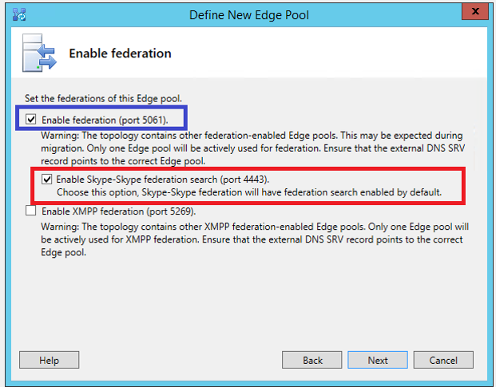
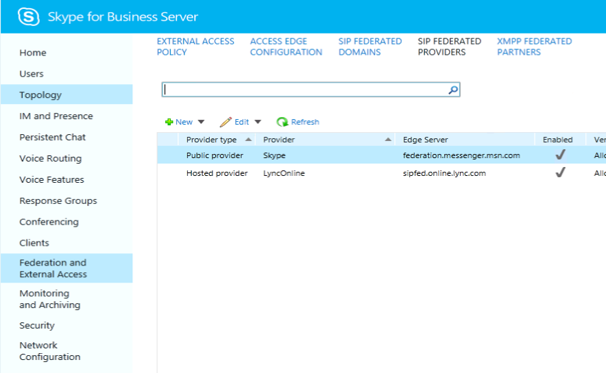

# Deploy Skype Connectivity in Skype for Business Server

**Summary:** Learn how to connect Skype for Business Server with Skype consumer. Also known as Skype connectivity.
  
This article walks through deployment for Skype Connectivity.
  
## Skype Connectivity Overview for IT Professionals

Skype Connectivity provides Skype for Business users with the ability to search for and add Skype users. Skype Connectivity is a feature of Skype for Business that lets you enable federation and directory search with Skype users. After you enable Skype Connectivity your Skype for Business users will be able to search for and add Skype users.
  
## Skype Directory Search

Skype Directory Search functionality provides Skype for Business users with the ability to search for Skype contacts. The search functionality lets users search using the following:
  
- **Search by display name, example "John Doe"** - This could return many results, so you might not find what you are looking for.
    
- **Search by display name plus location, example "John Doe in Barcelona"** - This will narrow the results of the search down considerably.
    
- **Search by email, example "johndoe@outlook.com"** - This should return one result in most cases; the one that matches the specified email exactly. But if the same email is associated with more than one account, multiple results may be returned.
    
- **Search by phone number, example "123-123-1234"** - This should return one result in most cases; the one that matches the specified phone exactly. Phone number must include the country code (i.e. 1-xxx-yyy-zzzz). If the same phone number is associated with more than one account, multiple results may be returned.
    
- **Search by Skype Name, example "JohnDoe1456"** - If exact match is found, it will be returned as the first result. Other possible "name" matches may be returned.
    
    > [!NOTE]
    > Skype Directory Search must be able to communicate with the following IP addresses on port 443: 104.40.75.246, 23.101.135.34, and 40.113.86.19. 
  
## Supported deployment matrix for Skype Directory Search

The following table outlines support for Skype Directory Search.
  

||**Skype for Business Server Front End**|**Lync Server 2013 (or older) Front End**|**Comments**|
|:-----|:-----|:-----|:-----|
|Skype for Business Server Edge  <br/> |Supported  <br/> |Not Supported  <br/> |Skype for Business Server and Edge are prerequisites for Skype Directory Search  <br/> |
|Skype for Business Server Edge + Lync Server 2013 Edge deployed side-by-side  <br/> |Supported  <br/> |Not Supported  <br/> |Skype Directory Search traffic flows through Skype for Business Server Edge servers. Federation traffic goes through edge configured by the administrator. For example, the administrator could choose to continue to send federation traffic through Lync Server 2013 Edge servers which would not support Skype Directory Search.  <br/> |
|Lync Server 2013 (or older) Edge  <br/> |Not Supported  <br/> |Not Supported  <br/> ||
   
> [!NOTE]
> Addressbook service running on Skype for Business Server Front End finds the Edge by the existence of the Skype Search port 4443 in the Edge server. 
  
> [!NOTE]
> In case a customer has multiple sites in their on-premises deployment, and if they have deployed just one Skype for Business Server Edge server/pool, then Search traffic from all sites will go through the single available Edge server. The administrator needs to make sure the pools from all sites can access the deployed Skype for Business Server Edge server/pool. 
  
> [!NOTE]
> Skype graph service will throttle search requests from any on-premises or Office 365 customer if the request rate exceeds 15 requests / second. 
  
> [!NOTE]
> For large enterprise on-premises customers, the domains will need to be whitelisted with the Skype search service to allow higher request rates. 
  
> [!NOTE]
> Skype for Business Server will throttle incoming requests, if there are too many pending requests in the queue. 
  
## Deploying Skype Connectivity for Skype for Business Online in Office 365

Skype Connectivity is also a feature of Skype for Business Online, which is part of Office 365. You can enable the Skype Connectivity feature from the Skype for Business Administration Center within the Office 365 portal.
  
For Office 365 Midsize Business, Office 365 Enterprise, Office 365 Education, and Office 365 for Government: Sign in to the Office 365 portal and navigate to the Skype for Business Administration Center. Go to External Communications. Under Public IM Service Providers, click Enable. If you want to control individual user access to Skype Connectivity, you can do so by editing individual users' External Communications settings.
  
For Office 365 Small Business Premium: Sign in to Office 365, and go to Admin \> Service Settings \> Instant messaging, meetings and conferencing. Turn on External communications. The External communications switch turns on both Skype Connectivity and communications with other organizations that use Skype for Business.
  
For more information about Skype for Business Online administration, see:
  
- [Allow users to contact external Skype for Business users](../../SfbOnline/set-up-skype-for-business-online/allow-users-to-contact-external-skype-for-business-users.md)

- [What to try if you can't IM Skype for Business or Skype external contacts](https://support.office.com/en-us/article/What-to-try-if-you-cant-IM-Skype-for-Business-Lync-or-Skype-external-contacts-87f6d5d7-3b8c-4196-9c8c-1dabb75f54b8?ui=en-US&amp;rs=en-US&amp;ad=US)
    
- [Add a contact in Skype for Business](https://support.office.com/en-US/article/Add-a-contact-in-Skype-for-Business-89338023-2adf-4f5c-90b6-f8b6f72fadd1)
  
- [Admins: Configure Skype for Business settings for individual users](../../SfbOnline/set-up-skype-for-business-online/configure-skype-for-business-settings-for-individual-users.md)
    
## Deploying Skype Connectivity for Skype for Business Server

Skype for Business Server uses the federation access architecture to support connectivity with Skype. This connectivity enables your Skype for Business Server users to add Skype. Skype clients can also add Skype for Business users to their contact list. Based on policies administratively set in Skype for Business Server users will be able to communicate using instant messaging, see each other's presence, and initiate audio and video calls. Skype connectivity is also a feature of Skype for Business Online, and can be enabled for Skype for Business Online customers from the Skype for Business Administration Center within the Office 365 portal.
  
> [!NOTE]
> If Skype for Business Server is already configured to connect with Windows Messenger by using Public Instant Messaging Connectivity (PIC), your deployment is already configured for Skype connectivity. The only change you may want to consider is to rename your existing Messenger PIC entry as Skype. 
  
### The Skype for Business Server public IM connectivity provisioning site is no longer available

The site that was formerly used to manually provision federation between Skype for Business on-premise deployments and Skype is no longer necessary and will be shut down on 8/15/2019. Federation with Skype now utilizes federated partner discovery, which is the same mechanism required for federation with Skype for Business Online.

Communication between any on-premise Skype for Business deployment and Skype users via the existing Public IM infrastructure now requires the on-premise edge server configuration to be compatible with Skype for Business Online.

> [!NOTE]
> No action is needed by most customers, including all deployments that federate with Skype for Business Online.
  
On-premise deployments are required to publish a Federation DNS SRV record for each domain that they host. Guidance is available in [DNS planning](../plan-your-deployment/edge-server-deployments/edge-environmental-requirements.md#dns-planning). Each domain must resolve by DNS SRV query to an edge server FQDN that satisfies a top-level suffix match of the domain. For example, consider the domain "contoso.com":

|**Valid FQDNs**|**Comment**|
|:-----|:-----|
|sip.contoso.com   ||
|sipfed.contoso.com   |In each case, the exact FQDN must be present in either the SN or the SAN of the external certificate installed on the edge server.   |
|access.contoso.com   ||
|**Invalid FQDNs**|**Reason**|
|sip.contoso-edge.com   |Not a suffix match.  |
|sip.it.contoso.com   |Not a top-level suffix match.   |

Further guidance regarding External Certificates can be found in [Certificate planning](../plan-your-deployment/edge-server-deployments/edge-environmental-requirements.md#certificate-planning).

#### FAQs

**Why is the provisioning website being shut down?**
The public IM (PIC) provisioning mechanism (pic.lync.com) that was deployed in 2006 is no longer serviceable and will be shut down on 8/15/2019. Instead, public IM federation will assume the same federation model used by Skype for Business Online, known as "partner discovery", whereby an on-premise deployment is publicly discoverable by its federation DNS SRV record(s).

**Does this change mean that Public IM federation is being deprecated?**
No. Public IM federation will continue to be supported for many years, probably until the Skype for Business on-premise product reaches end-of-life.

**Our company has a hybrid relationship (shared address space) with Skype for Business Online, are we affected?**
No, since you are already federating with Skype for Business Online, this change will not affect you.
 
**Does this change mean that our company has to enable federation with Skype for Business Online?**
No. If your edge server proxy settings do not enable federation with the Skype for Business Online hosting provider (sipfed.online.lync.com) then this change will not affect that. However, the same DNS and certificate requirements that apply to federating with Skype for Business Online now also apply to federating with Skype users.
 
**Our company is large and cannot change its edge configuration due to regulatory/compliance/etc reasons … what can we do?**
Any on-premise organization that cannot change its edge server configuration as specified should reach out to product support at the earliest opportunity.

### Enabling Federation and Public IM Connectivity (PIC)

Now focus on the Skype for Business Server environment and administrative tasks required to configure Skype Connectivity. In this section, we assume that the administrator has deployed Skype for Business Server and configured external access, also known as Edge servers. 
  
There are three primary steps required to enable federation and PIC. These are:
  
1. Configure Federation and PIC
    
2. Configure at least one policy to support federated user access
    
3. Configure the Skype PIC provider setting
    
#### 1. Configure Federation and PIC

Federation is required to enable Skype users to communicate with Skype for Business users in your organization. Public Instant Messaging Connectivity (PIC) is a class of federation, and it must be configured to enable your Skype for Business users to communicate with Skype users. Federation and PIC are configured by using the Skype for Business Server Control Panel.
  
> [!NOTE]
> PIC federation is no longer supported by product releases prior to Lync Server 2010 (Live Communication Server, Office Communications Server). The supported platforms for PIC federation include Skype for Business Server, Lync Server 2013, and Lync Server 2010. 
  
Federation is required to enable Skype users to communicate with Skype for Business users in your organization. Public Instant Messaging Connectivity (PIC) is a class of federation, and it must be configured to enable your Skype for Business Server users to communicate with Skype users. Federation and PIC are configured by using the Edge configuration dialog of the Skype for Business Server Control Panel as shown in the figure.
  

  
> [!NOTE]
> EnableSkypeIdRouting and EnableSkypeDirectorySearch attributes need to be set to true in the public provider settings (see later instructions) for Search to work. 
  
This completes the administrative tasks that must be performed on the server. You are now set up for Skype Connectivity.
  
#### 2. Configure at least one policy to support federated user access

Using the Skype for Business Server Control Panel, an administrator must configure one or more external user access policies to control whether Skype users can collaborate with internal Skype for Business Server users.
  
#### 3. Configure the Skype PIC provider setting

Using the Skype for Business Server Management Shell, an administrator must configure the Skype for Business client policy to display Skype as an additional PIC provider. 
  
> [!NOTE]
> Users of the Public Instant Messaging Connectivity (PIC) service providers can't participate in IM or conferences in your organization until you also configure at least one policy (step 2, earlier in this procedure) to support public IM connectivity. 
  
For new installations you can configure Skype Connectivity by enabling a Skype Public Provider using the Skype for Business Server Control Panel as shown in the figure.
  

  
> [!NOTE]
> To configure Skype Connectivity when upgrading to Skype for Business Server you must remove and re-add the existing Skype public provider. 
  
Configuring Skype Connectivity can also be done using only PowerShell. To configure Skype Connectivity using PowerShell:
  
1. From a Skype for Business Server Front End Server, open the Skype for Business Server Management Shell.
    
2. Run the following two commands:
    
   ```
    Remove-CsPublicProvider -Identity <identity-name>
   ```

    > [!NOTE]
    > If you do not already have a PIC provider in your environment and are creating a new PIC provider then you do not need to run the Remove-CsPublicProvider cmdlet. 
  
   ```
   New-CsPublicProvider -Identity Skype -ProxyFqdn federation.messenger.msn.com -IconUrl https://images.edge.messenger.live.com/Messenger_16x16.png -NameDecorationRoutingDomain msn.com -NameDecorationExcludedDomainList "msn.com,outlook.com,live.com,hotmail.com" -Enabled $true -EnableSkypeIdRouting $true -EnableSkypeDirectorySearch $true
   ```

    What do the less obvious parameters do?
    
   - ProxyFqdn: location of Skype federation edge (owned/maintained by Microsoft)
    
   - IconURL: icon used by Lync &amp; Skype for Business client to visually identify Skype contacts
    
   - NameDecorationRoutingDomain and NameDecorationExcludedDomainList: setting these allows users to enter Skype users' MSAs without needing to know about "decorating" non-Microsoft domains with "msn.com". This eliminates the need to type "user(contoso.com)@msn.com" for all domains that are NOT in the ExcludedDomainList. The SfB client will automatically format the MSA if the domain is NOT in the Excluded list. We've added the most common Microsoft Account domains to the excluded list.
    
     > [!NOTE]
     > Public Provider must be removed and added new if changes are made. No in-place changes are allowed. 
  
     > [!NOTE]
     > Added in Lync Server 2013 CU5 &amp; Lync desktop client in Office 2013 SP1, the NameDecorationRoutingDomain and NameDecorationExcludedDomainList improve the situation where Lync users adding Skype contacts needed to "decorate" non-Microsoft domains to identify and route them to Skype (the format of: user(contoso.com)@msn.com). These new settings will allow automatic formatting of the address user's enter in the "Add Skype contact" dialog box with the NameDecorationRoutingDomain (which should be set to msn.com) if it does not contain the domains in the NameDecorationExcludedDomainList (we currently can support msn.com, live.com, Hotmail.com, outlook.com). 
  
3. From a Skype for Business client users can now search for and add a Skype user.
    
## Clients and Interoperability Matrix

The following table outlines the status of interop between the latest version of Skype consumer and the latest version of Skype for Business.
  

|**Skype Clients**|**Add contacts, IM, presence, audio, and video calling**|**Comment**|
|:-----|:-----|:-----|
|Skype Windows Desktop  <br/> |7.6 or higher, Windows XP and higher  <br/> |**NEW**: Support added for Windows Skype client running on Windows XP, and Windows Vista **(requires latest client version 7.26 or higher)** <br/> |
|Skype Mobile - Android Phone and Tablet  <br/> |6.19 or higher, running Android OS version 4.0.3 or higher  <br/> |Low spec devices may not support video calling  <br/> |
|Skype Mobile - iOS  <br/> |6.11 or higher, on IOS 7 or higher  <br/> |Not supported are iPhone 4 and earlier, iPod 4th generation and earlier, iPad 1st generation  <br/> |
|Skype Mac  <br/> |7.19 or higher, on Mac OS X 10.9 (Mavericks) or higher  <br/> |Requires Mac OSX 10.9 or higher  <br/> |
|Skype Universal Windows App (Windows 10) Desktop and Mobile  <br/> |Windows 10 (Redstone 1 update or later)  <br/> |Windows Universal App will receive update in Fall 2016 adding interop support  <br/> |
   
The following table outlines the status of interop between the latest version of Skype for Business and the latest version of Skype consumer. 
  
|**Client**|**Skype Directory Search and Add Contacts**|**Skype A/V, IM interop**|
|:-----|:-----|:-----|
|Skype for Business  <br/> |Yes  <br/> |Yes  <br/> |
|Skype for Business on Mac  <br/> |Can add (no search)  <br/> |Yes  <br/> |
|Lync Desktop 2013  <br/> |Can add (no search)  <br/> |Yes  <br/> |
|Lync Web App - online and on-premises  <br/> |N/A  <br/> |N/A  <br/> |
|Lync Mobile - Windows Phone  <br/> |Coming Soon  <br/> |Yes  <br/> |
|Lync Mobile - Android  <br/> |Coming Soon  <br/> |Yes  <br/> |
|Lync Mobile - iOS  <br/> |Coming Soon  <br/> |Yes  <br/> |
|Lync Room System  <br/> |Coming Soon  <br/> |Yes  <br/> |
|Lync Modern App (Win 8.1)  <br/> |Yes  <br/> |Yes  <br/> |
|Lync Mac 2011  <br/> |Can add (no search)  <br/> |Yes  <br/> |
|Lync Desktop 2010  <br/> |Can add (no search)  <br/> |Yes  <br/> |
|Lync Phone Edition  <br/> |N/A  <br/> |N/A  <br/> |
|Lync Attendant  <br/> |N/A  <br/> |N/A  <br/> |
   

