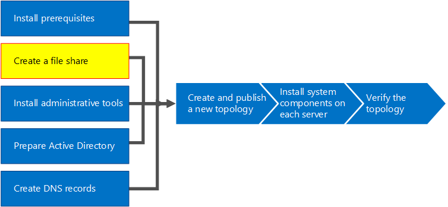
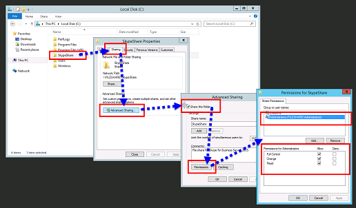

# Create a file share in Skype for Business Server
 
**Summary:** Learn how to create a Windows Server file share as part of the installation of Skype for Business Server. Download a free trial of Skype for Business Server from the Microsoft Evaluation center at:[https://www.microsoft.com/evalcenter/evaluate-skype-for-business-server](https://www.microsoft.com/evalcenter/evaluate-skype-for-business-server).
  
Skype for Business Server requires a file share so that computers throughout the topology can exchange files. Creating a file share is step 2 of 8 in the installation process for Skype for Business Server. You can do steps 1 through 5 in any order. However, you must do steps 6, 7, and 8 in order, and after steps 1 through 5 as outlined in the diagram. For planning details about file share, see [Environmental requirements for Skype for Business Server](../../plan-your-deployment/requirements-for-your-environment/environmental-requirements.md) or [Server requirements for Skype for Business Server 2019](../../../SfBServer2019/plan/system-requirements.md).
  

  
## Create a basic file share

This section walks you through creating a basic Windows Server file share. A basic Windows Server file share is supported with Skype for Business Server. However, it does not explicitly provide high availability. For a high availability environment, a Distributed File System (DFS) file share is recommended. For more information about a high availability file share and DFS, see [Plan for high availability and disaster recovery in Skype for Business Server](../../plan-your-deployment/high-availability-and-disaster-recovery/high-availability-and-disaster-recovery.md).
  
> [!NOTE]
> Windows Server 2012 R2 has made major leaps in providing Storage Area Network (SAN)-like file share solutions using the Windows Server platform. When compared to a traditional SAN-based appliance, a Windows Server 2012 R2 storage solution can cut costs in half with very minimal impact to performance. For more information about file share options in Windows Server 2012 R2, see the downloadable white paper [Windows Server 2012 R2 Storage](https://download.microsoft.com/download/9/4/A/94A15682-02D6-47AD-B209-79D6E2758A24/Windows_Server_2012_R2_Storage_White_Paper.pdf). 
  
Watch the video steps for **create a file share**:
  
> [!video https://www.microsoft.com/en-us/videoplayer/embed/dbef31be-e899-4a32-a1ca-370053284f56?autoplay=false]
  
### Create a basic file share

1. Log on to the computer that will host the file share.
    
2. Right-click the folder you plan to share, and select **Properties**.
    
3. Select the **Sharing** tab, and click **Advanced Sharing**.
    
4. Click **Share this folder**.
    
5. Click **Permissions**.
    
6. Add the local **Administrators** group of the server hosting the file share, grant **Allow: Full Control, Change, and Read** rights, and then click **OK**.
    
7. Click **OK** again and take note of the network path.
    
8. Click **Done** to close the wizard.
    
     
  
> [!NOTE]
>If the file store is hosted on a DFS share, the following warning will be received:

Warning: Unable to access share permissions for "\\<domain>\<share>".

>This is expected if you are not an administrator on the file server, or if this is a Distributed File System (DFS) share. If the share permissions have already been configured, this warning can be ignored. If it is a new share, refer to the documentation for details on manually configuring share permissions.

>Due to the inability to access the share permissions on a DFS share, Skype for Business Server will not be able to explicitly set groups on the file share. To ensure Skype for Business Server components can access the file share with the appropriate permissions, ensure the following RTC groups are added with Change level share permissions in addition to the local Administrators with Full Control share permissions.

RTCHSUniversalServices
RTCComponentUniversalServices
RTCUniversalServerAdmins
