# Create and publish new topology in Skype for Business Server
 
**Summary:** Learn how to create, publish, and verify a new topology before you install Skype for Business Server. Download a free trial of Skype for Business Server from the Microsoft Evaluation center at: [https://www.microsoft.com/evalcenter/evaluate-skype-for-business-server](https://www.microsoft.com/evalcenter/evaluate-skype-for-business-server).
  
Before you can install the Skype for Business Server system on each of the servers in the topology, you must create a topology and publish it. When you publish a topology, you are loading the topology information into the Central Management Store database. If this is an Enterprise Edition pool, you are creating the Central Management Store database the first time you publish a new topology. If this is Standard Edition, you will need to run the Prepare First Standard Edition Server process from the Deployment Wizard before you publish a topology. This prepares for Standard Edition by installing a SQL Server Express Edition instance and creating the Central Management Store. You can do steps 1 through 5 in any order. However, you must do steps 6, 7, and 8 in order, and after steps 1 through 5, as outlined in the diagram. How to create and publish a new topology is described in step 6 of 8.
  
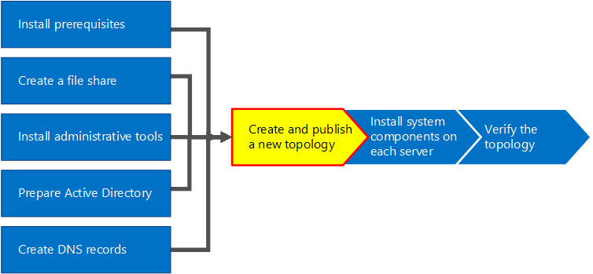
  
## Create and publish new topology

You can use Skype for Business Server Topology Builder to design, define, configure, and publish topologies. This tool was installed when you installed Administrative Tools earlier in the article. There are many different choices you can make when you create a topology. In this procedure, you will create a basic topology with conferencing.
  
> [!IMPORTANT]
> Skype for Business Server requires SQL Server in order to operate. The primary databases are known as the Central Management Store. If you are deploying Enterprise Edition, these databases are created when you publish the topology by using the steps below. In this case, Topology Builder will ask you for the connection information to a SQL Server installation. If you are planning to deploy Standard Edition, you will need to install SQL Server Express Edition before you define and publish the new topology. To install SQL Server Express Edition, you should open the Deployment Wizard on the server that will act as the Front End, and then run Prepare First Standard Edition Server. When you click Prepare First Standard Edition Server, the Deployment Wizard automatically installs SQL Server Express Edition and creates the Central Management Store databases. 
  
### Create a new topology

1. Log in as a standard user with access to Topology Builder.
    
2. Open Skype for Business Server Topology Builder.
    
3. Select **New Topology**, and click **OK**..
    
4. Select a location and file name for the topology configuration file.
    
    > [!NOTE]
    > The topology configuration is saved as a Topology Builder XML (.tbxml) file. When you publish a topology, you are pushing the configuration information from the file to the SQL Server database. When you open Topology Builder in the future, you can download the existing configuration from SQL Server directly into Topology Builder and either publish it back to SQL Server or save it as a Topology Builder configuration file. 
  
5. On the **Define the primary domain screen**, enter the **primary SIP domain**, and click **Next**. In this example, we are using **contoso.local**, as shown in the figure.
    
     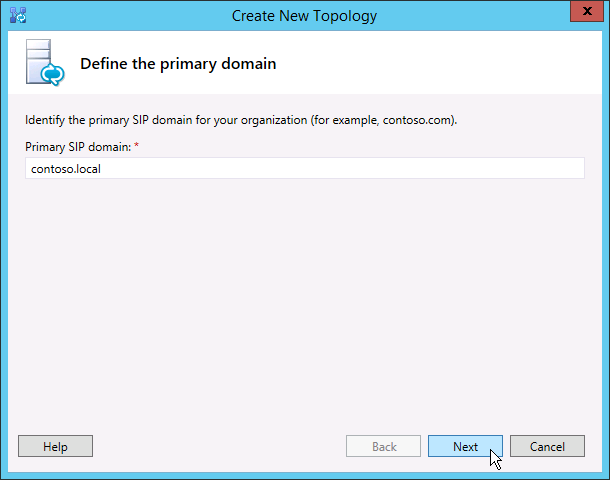
  
6. Add any additional supported SIP domains, and then click **Next**.
    
7. Enter a **Name** and **Description** for the first site (location), and then click **Next**, as shown in the figure.
    
     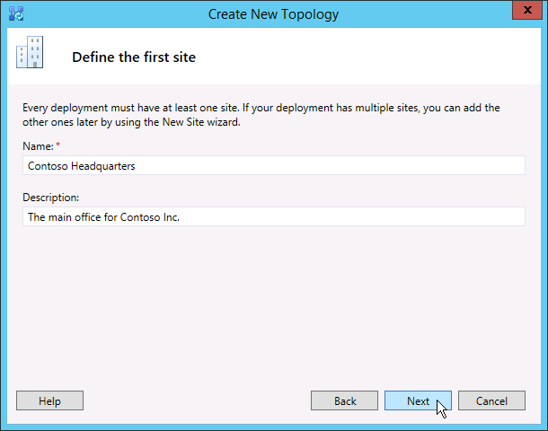
  
8. Enter the **City**, **State/Province**, and **Country/Region Code** for the site, and then click **Next**.
    
9. Click **Finish** to complete the process of defining a new topology. The New Front End Wizard launches automatically.
    
### Define a Front End pool or Standard Edition server

1. Review the wizard prerequisites, and then click **Next**.
    
2. Enter the fully qualified domain name (FQDN) of the pool, and select either **Enterprise Edition Front End Pool** or **Standard Edition Server**, and then click **Next**, as shown in the figure.
    
    > [!TIP]
    > Skype for Business Server Enterprise Edition can include multiple servers working together to provide the Front End role. When multiple servers are used to fulfill the role, it is called a pool. Thus, multiple servers working together to provide the Front End role is also referred to as the Front End pool. Skype for Business Server Standard Edition can include only a single server to provide the Front End role. It is common to refer to the Front End pool even if only a single server is providing the role. 
  
     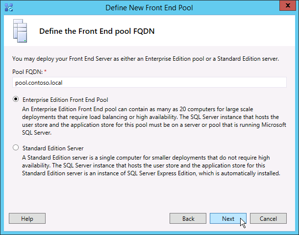
  
3. Enter the fully qualified domain names (FQDNs) of all computers in the pool, and then click **Next** as shown in the figure.
    
     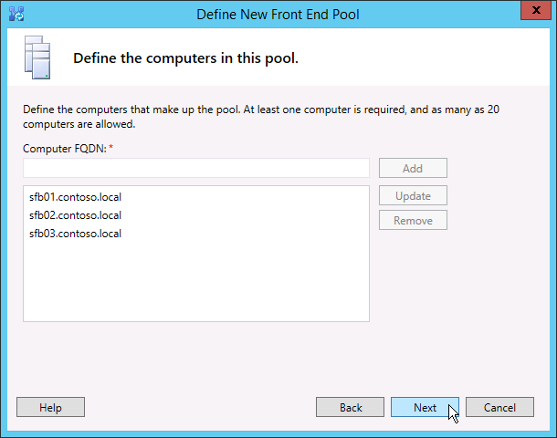
  
4. Select the features that will be included in this topology, and then click **Next** as shown in the figure.
    
    > [!NOTE]
    > Skype for Business Server includes many advanced features. Review planning and deployment documentation for each specific feature you want to use. 
  
     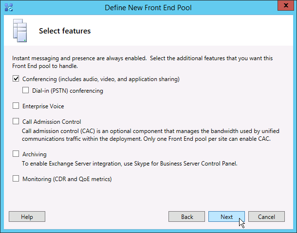
  
5. On the **Select collocated server roles** page, you can choose to collocate the Mediation server on the Front End server, or you can choose to deploy it as a standalone server.
    
    If you intend to collocate the Mediation server on the Enterprise Edition Front End pool, ensure the check box is selected. The server role will be deployed on the pool servers. If you intend to deploy the Mediation server as a stand-alone server, clear the appropriate check box. You will deploy the Mediation server in a separate deployment step after you completely deploy the Front End server. For planning details about a collocation, see [Topology Basics for Skype for Business Server](../../plan-your-deployment/topology-basics/topology-basics.md).
    
6. By using the **Associate server roles with this Front End pool** page, you can define and associate server roles with the Front End pool. The following role is available:
    
    **Enable an Edge pool** Defines and associates a single Edge Server or a pool of Edge Servers. An Edge Server facilitates communication and collaboration between users inside the organization and people outside the organization, including federated users.
    
    There are two possible scenarios that you can use to deploy and associate the server roles.
    
    For scenario one, you are defining a new topology for a new installation. You can approach the installation in one of the two following ways:
    
   - Leave the check box clear, and define the topology. After you have published, configured, and tested the Front End and Back End Server roles, you can run Topology Builder again to add the role servers to the topology. By using this strategy, you can test the Front End pool and the server running SQL Server without additional complications from additional roles. After you have completed your initial testing, you can run Topology Builder again to select the roles you need to deploy.
    
   - Select roles that you need to install, and then set up the hardware to accommodate the selected roles.
    
     For scenario two, you have an existing deployment, and your infrastructure is ready for new roles, or you need to associate existing roles with a new Front End server.
    
   - In this case, you will select the roles that you intend to deploy or associate with the new Front End server. In either case, you will proceed with the definition of the roles, set up any needed hardware, and proceed with the installation.
    
7. Next, you will define the SQL Server store that will be used with the topology. In this example, we use the Default instance. For more information about SQL Server features, such as High Availability, see [Plan for high availability and disaster recovery in Skype for Business Server](../../plan-your-deployment/high-availability-and-disaster-recovery/high-availability-and-disaster-recovery.md).
    
   - To use an existing SQL Server store that has already been defined in your topology, select an instance from **SQL store**.
    
   - To define a new SQL Server instance to store pool information, click **New**, and then specify the **SQL Server FQDN** in the **Define New SQL Store** dialog box.
    
   - To specify the name of a SQL Server instance, select **Named Instance**, and then specify the name of the instance.
    
   - To use the default instance, click **Default instance**.
    
   - To use SQL Mirroring, select **Enable SQL mirroring**, and select an existing instance, or create a new instance.

     > [!NOTE]
     > SQL Mirroring is available in Skype for Business Server 2015 but is no longer supported in Skype for Business Server 2019. The  AlwaysOn Availability Groups, AlwaysOn Failover Cluster Instances (FCI), and SQL failover clustering methods are preferred with Skype for Business Server 2019.
    
     For this example, we enter the **SQL Server FQDN**, and configure any relevant high availability settings, and then click **OK**, as shown in the figure.
    
     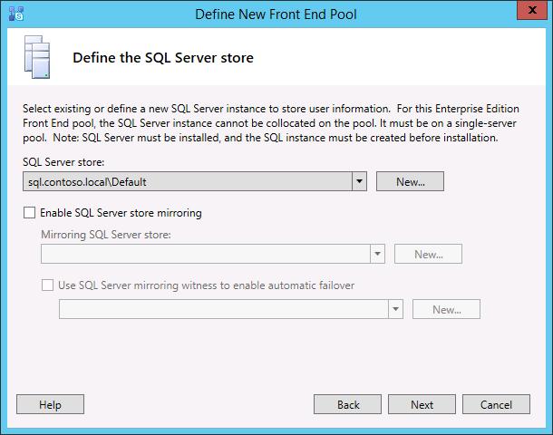
  
8. Decide if you want to enable SQL Server store mirroring or SQL Server mirroring witness, and then click **Next**.
    
9. Define the file share that you want to use.
    
   - To use a file share that has already been defined in your topology, select **Use a previously defined file share**.
    
   - To define a new file share, select **Define a new file share**, in the **File Server FQDN** box, enter the FQDN of the existing file server where the file share is to reside, and then enter a name for the file share in the **File Share** box.
    
     For this example, we will click **Define a new file store**, enter the **file server FQDN** and **file share**, and then click **Next**.
    
     > [!NOTE]
     > The file share for Skype for Business Server can be collocated but it is not recommended for performance reasons. Note that in this example, the file share has been located on a single dedicated server that will act as the file share. However, other more robust file share systems, such as DFS using Windows Server 2012 R2, are recommended. For details about supported file share systems, see [Requirements for your Skype for Business environment](../../plan-your-deployment/requirements-for-your-environment/requirements-for-your-environment.md). For more information about creating the file share, see [Create a file share in Skype for Business Server](create-a-file-share.md). You can define the file share without the file share having been created. You will need to create the file share in the location you define before you publish the topology. 
  
10. On the Specify the Web Services URL page, you must decide if you need to override the internal Web Services pool base URL. The reason for this override has to do with load balancing. Basic SIP traffic can be load balanced through simple DNS load balancing. However, the HTTP/S Web Services network traffic must use a supported Hardware or Software load balancing solution. For supported load balancers, see [Infrastructure for Skype for Business](https://docs.microsoft.com/SkypeForBusiness/certification/infra-gateways). In this example, we used DNS load balancing for SIP traffic and a supported software load balancing solution. Because we are dividing the traffic this way, we need to override the internal Web Services pool FQDN. Alternatively, if we had a top line load balancer and sent all traffic through it instead of using DNS load balancing for SIP traffic, we would not need to override the Web Services URL. 
    
    In the DNS section of this topic, we created an A record for webint.contoso.local. This is the URL we are using for the web services HTTP/S traffic, and it must go through the supported software load balancer we set up. Therefore, in this example, we override the URL to let Skype for Business Server know that all HTTP/S traffic should go to webint.contoso.local instead of pool.contoso.local, as shown in the figure. For more about load balancing, see [Load balancing requirements for Skype for Business](../../plan-your-deployment/network-requirements/load-balancing.md).
    
    > [!IMPORTANT]
    > The base URL is the Web Services identity for the URL, minus the https://. For example, if the full URL for the Web Services of the pool is https://webint.contoso.local, the base URL is webint.contoso.local. 
  
    - If you are configuring DNS load balancing, as we are in this example, select the **Override internal Web Services pool FQDN** check box, and enter the internal base URL (which must be different from the pool FQDN) in **Internal Base URL**. 
    
    > [!CAUTION]
    > If you decide to override the Internal Web Services with a self-defined FQDN, each FQDN must be unique from any other Front End pool, Director, or Director pool. **Use only standard characters** (including A-Z, a-z, 0-9, and hyphens) when you define URLs or fully qualified domain names. Do not use Unicode characters or underscores. Nonstandard characters in a URL or FQDN are often not supported by external DNS and public certification authorities (CAs) (that is, when the URL or FQDN must be assigned to the subject name or subject alternative name in the certificate).
  
    - Optionally, enter the external base URL in **External Base URL**. You would enter the external base URL to differentiate it from your internal domain name. For example, your internal domain is contoso.local, but your external domain name is contoso.com. You would define the URL using the contoso.com domain name since it must be resolvable from public DNS. This is also important in the case of a reverse proxy. The external base URL domain name would be the same as the domain name of the FQDN of the reverse proxy. HTTP access to the Front End pool is required for instant messaging and presence on mobile clients.
    
      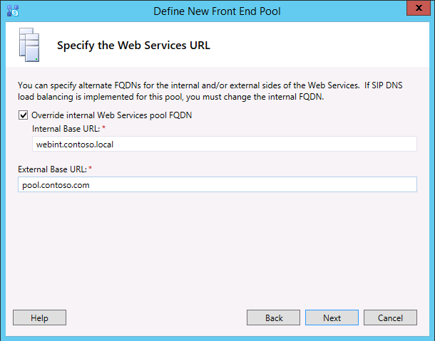
  
11. If you selected **Conferencing** on the **Select Features** page, you will be asked to select an Office Web Apps server. Click **New** to launch the dialog box.
    
12. In the **Define New Office Web Apps Server** dialog box, type the FQDN of your Office Web Apps server in the **Office Web Apps Server FQDN** box; when you do this, your Office Web Apps server discovery URL should automatically be entered into the **Office Web Apps Server discovery URL** box.
    
    If the Office Web Apps server is installed on-premises and in the same network zone as Skype for Business Server, do not select the option **Office Web Apps Server is deployed in an external network (that is, perimeter/Internet)**.
    
    If the Office Web Apps server is deployed outside your internal firewall, select the option **Office Web Apps Server is deployed in an external network (that is, perimeter/Internet)**.
    
13. Click **Finish** to complete the configuration. If you defined other role servers on the **Associate server roles with this Front End pool** page, separate role configuration wizard pages will open where you can configure the server roles. In this example we only chose conferencing.
    
### Configure simple URLs

1. In Topology Builder, right-click the **Skype for Business Server** top node, and then click **Edit Properties**, as shown in the figure.
    
     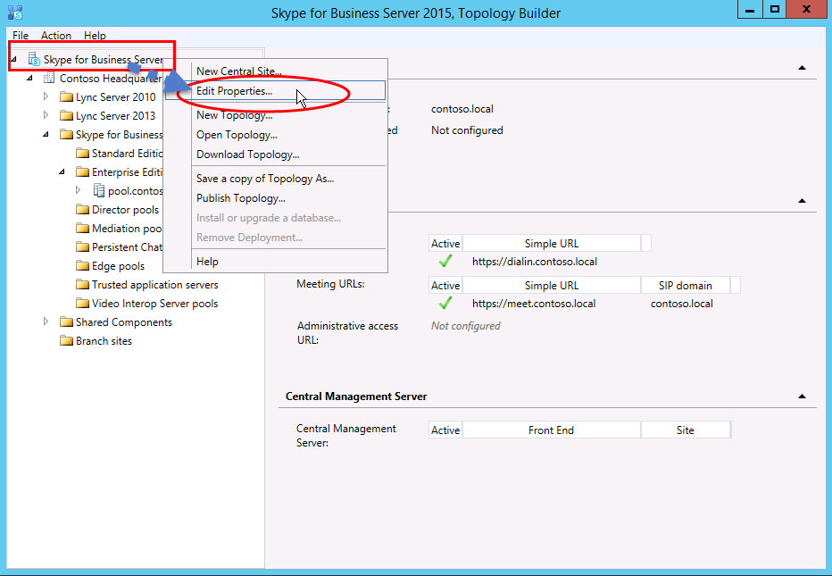
  
2. In the **Simple URLs** pane, select either **Phone access URLs:** (Dial-in) or **Meeting URLs:** (Meet) to edit, and then click **Edit URL**.
    
3. Update the URL to the value you want, and then click **OK** to save the edited URL. You should configure the simple URL using the external SIP domain so that external users can join meetings, for example, contoso.com, which is external, as opposed to contoso.local, which is an internal domain. Thus, the SIP domain should be able to be resolved by external DNS.
    
4. Edit the Meet URL by using the same steps, if necessary.
    
### To define the optional Admin simple URL

1. In Topology Builder, right-click the **Skype for Business Server** node, and then click **Edit Properties**.
    
2. In the **Administrative access URL** box, enter the simple URL you want for administrative access to Skype for Business Server Control Panel, and then click **OK**.
    
    > [!TIP]
    > We recommend using the simplest possible URL for the Admin URL. The simplest option is https://admin. _\<domain\>_. The Admin URL can be either an internal or external domain, for example, contoso.local or contoso.com, as long as either record is resolvable in internal DNS. 
  
    > [!IMPORTANT]
    > If you change a simple URL after initial deployment, you must be aware of what changes impact your Domain Name System (DNS) records and certificates for simple URLs. If the change impacts the base of a simple URL, you must change the DNS records and certificates, too. For example, changing from https://sfb.contoso.com/Meet to https://meet.contoso.com changes the base URL from sfb.contoso.com to meet.contoso.com, so you would need to change the DNS records and certificates to refer to meet.contoso.com. If you changed the simple URL from https://sfb.contoso.com/Meet to https://sfb.contoso.com/Meetings, the base URL of sfb.contoso.com stays the same, so no DNS or certificate changes are needed. Whenever you change a simple URL name, however, you must run the **Enable-CsComputer** cmdlet on each Director and Front End server to register the change.
  
### Publish and verify the topology

1. Check that all simple URLs are configured correctly.
    
2. Confirm that the SQL Server-based server is online and available to the computer where Topology Builder is installed, including any necessary firewall rules.
    
3. Confirm that the file share is available and that the proper permissions are defined.
    
4. Confirm that the correct server roles that meet the deployment requirements are defined in the topology.
    
5. Verify that the servers exist in Active Directory Domain Services (AD DS). This happens automatically when you join the servers to the domain.
    
    When you have verified the topology and there are no validation errors, you should be ready to publish the topology. If there are validation errors, you must correct them before you can publish the topology.
    
6. Right-click the **Skype for Business Server** node, and then click **Publish Topology**.
    
7. On the **Publish the topology** page, click **Next**.
    
8. On the **Select Central Management Server** page, select a Front End pool, as shown in the figure.
    
    > [!NOTE]
    > You can click **Advanced** to configure database file locations.
  
     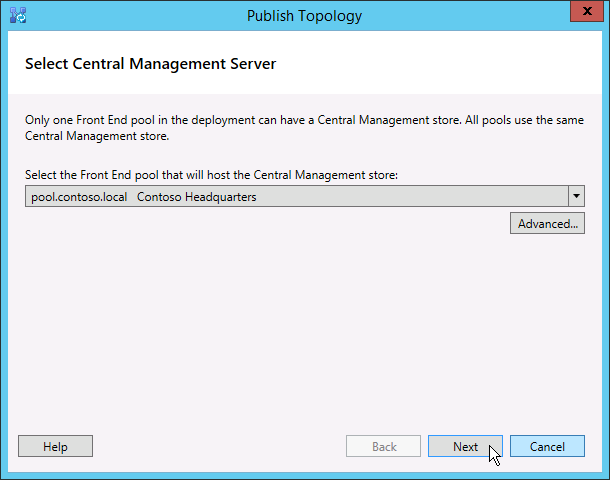
  
9. On the **Select databases** page, select the databases you want to publish.
    
    > [!NOTE]
    > If you don't have the appropriate rights to create the databases, you can clear the check boxes next to those databases, and someone with appropriate rights can later create the databases. For details about requirements, see [Server requirements for Skype for Business Server](../../plan-your-deployment/requirements-for-your-environment/server-requirements.md). 
  
10. Optionally click **Advanced**. By using Advanced SQL Server data file placement options, you can select between the following options: 
    
    - **Automatically determine database file location** - This option determines the best operational performance based on the disk configuration on your SQL Server-based server by distributing the log and data files to the best location.
    
    - **Use SQL Server instance defaults** - This option puts log and data files onto the SQL Server-based server by using the instance settings. This option does not use the operational functionality of the SQL Server-based server to determine optimal locations for logs and data. The SQL Server administrator would typically move the log and data files to locations that are appropriate for the SQL Server-based server and organization management procedures.
    
    Click **OK**, and then click **Next**. 
    
11. Optionally, click **Advanced**. By using Advanced SQL Server data file placement options, you can select between the following options: 
    
    - **Automatically determine database file location** - This option determines the best operational performance based on the disk configuration on your SQL Server-based server by distributing the log and data files to the best location.
    
    - **Use SQL Server instance defaults** - This option puts log and data files onto the SQL Server-based server by using the instance settings. This option does not use the operational functionality of the SQL Server-based server to determine optimal locations for logs and data. The SQL Server administrator would typically move the log and data files to locations that are appropriate for the SQL Server-based server and organization management procedures.
    
    Click **OK**.
    
12. Click **Next** to complete the publishing process.
    
    > [!NOTE]
    > A common failure for this step is that the SQL Server databases cannot be created. When the process cannot complete, an error is provided, as shown in the figure. The most likely cause is that the user attempting to create the database does not have the appropriate permissions, or the SQL Server system cannot be contacted due to a firewall or other network issue. 
  
     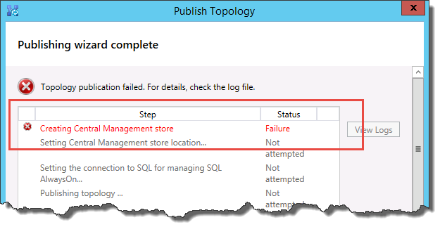
  
13. When the publishing process completes, you are presented with a link to open a list of next steps. Click **Click here to open to-do list** to view the next steps, and then click **Finish**. 
    
    The "Completed with warnings" message for the database creation does not mean there was an error. The installation process has to change settings in SQL Server for Skype for Business Server to work correctly. When a setting is changed in SQL Server, it is logged as a warning so that SQL Server administrators can understand exactly what the installation process completed. If you receive a warning, you can select the record, and then click **View Logs** to view the details of the warning.
    
    When the topology has been successfully published, you can begin installing a local replica of the Central Management store on each server running Skype for Business Server in your topology. We recommend that you begin with the first Front End pool. 
    

