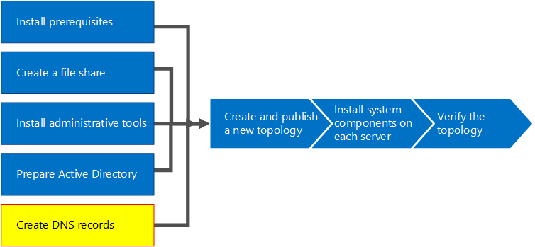
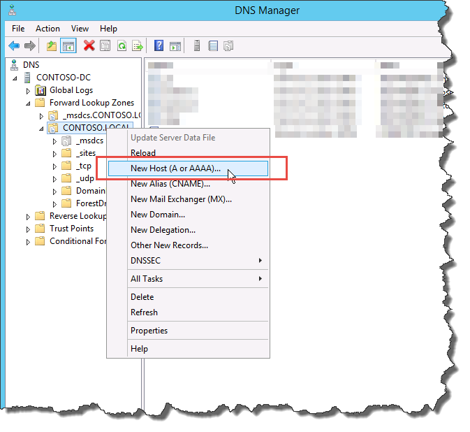
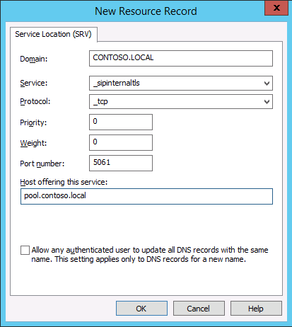

# Create DNS records for Skype for Business Server
 
**Summary:** Learn how to configure DNS and create DNS records for an installation of Skype for Business Server. Download a free trial of Skype for Business Server from the Microsoft Evaluation center at: [https://www.microsoft.com/evalcenter/evaluate-skype-for-business-server](https://www.microsoft.com/evalcenter/evaluate-skype-for-business-server).
  
For Skype for Business Server to work properly, a number of Domain Name System (DNS) settings must be in place. This is so that clients know how to access the services and that the servers know about each other. These settings need to be completed only once per deployment because once you assign a DNS entry, it is available throughout the domain. You can do steps 1 through 5 in any order. However, you must do steps 6, 7, and 8 in order, and after steps 1 through 5, as outlined in the diagram. Creating DNS records comprises step 5 of 8. For more information about planning DNS, see [Environmental requirements for Skype for Business Server](../../plan-your-deployment/requirements-for-your-environment/environmental-requirements.md) or [Server requirements for Skype for Business Server 2019](../../../SfBServer2019/plan/system-requirements.md).
  
> [!IMPORTANT]
> It is important to note that this is just an example of how to create DNS records in a Windows Server DNS environment. There are many other DNS entries that are required for Skype for Business Server, and the procedure for creating DNS records depends on the system you are using to manage DNS in your organization. For a complete list of requirements for DNS, see [DNS requirements for Skype for Business Server](../../plan-your-deployment/network-requirements/dns.md). 
  

  
## Configure DNS

DNS records are required for Skype for Business Server to work properly and be accessible by users.
  
This example is using a DNS load balanced FQDN named pool.contoso.local. This pool consists of three servers running Skype for Business Server Enterprise Edition. A Standard Edition front-end server can only contain a single server. By using Standard Edition, you would only use the fully qualified domain name (FQDN) of the single Standard Edition server when referencing the front-end role instead of creating a DNS load balanced pool of servers, as this example shows. This simple example that uses only the front-end role includes the DNS entries in the following table. To plan your specific DNS requirements, see [DNS requirements for Skype for Business Server](../../plan-your-deployment/network-requirements/dns.md). 
  
 
|**Description**|**Record type**|**Name**|**Resolves to**|**Load balancing type**|
|:-----|:-----|:-----|:-----|:-----|
|Internal Web Services FQDN    |A    |webint.contoso.local    |VIP for Internal Web Services    |Supported software and hardware    |
|Pool FQDN    |A    |pool.contoso.local    |IP address of server SFB01    |DNS    |
|SFB01 FQDN    |A    |SFB01.contoso.local    |IP address of server SFB01    |DNS    |
|Pool FQDN    |A    |pool.contoso.local    |IP address of server SFB02    |DNS    |
|SFB02 FQDN    |A    |SFB02.contoso.local    |IP address of server SFB02    |DNS    |
|Pool FQDN    |A    |pool.contoso.local    |IP address of server SFB03    |DNS    |
|SFB03 FQDN    |A    |SFB03.contoso.local    |IP address of server SFB03    |DNS    |
|Skype for Business Auto Discover    |A    |lyncdiscoverinternal.contoso.local    |VIP for Internal Web Services    |Supported software and hardware    |
|Meeting Simple URL    |A    |meet.contoso.local    |VIP for Internal Web Services    |Supported software and hardware    |
|Dial-in Simple URL    |A    |dialin.contoso.local    |VIP for Internal Web Services    |Supported software and hardware    |
|Web Scheduler Simple URL    |A    |scheduler.contoso.local    |VIP for Internal Web Services    |Supported software and hardware    |
|Administration Simple URL    |A    |admin.contoso.local    |VIP for Internal Web Services    |Supported software and hardware    |
|Legacy Discovery    |SRV    |_sipinternaltls._tcp.contoso.local    |Pool FQDN (port 5061)    |N/A    |
   
### Create DNS records

1. Log on to the DNS server, and open **Server Manager**.
    
2. Click the **Tools** drop-down menu, and click **DNS**.
    
3. In the console tree for your SIP domain, expand **Forward Lookup Zones**, and then expand the SIP domain in which Skype for Business Server will be installed.
    
4. Right-click the SIP domain, and select **New Host (A or AAAA)**, as shown in the figure.
    
     
  
5. In the **Name** box, type the name of the host record (the domain name will be automatically appended).
    
6. In the **IP Address box**, type the IP address of the individual front-end server, and then select **Create associated pointer (PTR) record** or **Allow any authenticated user to update DNS records with the same owner name**, if applicable. Note that this assumes that DNS is used to load balance all traffic with the exception of web services. In this example, we have three front-end servers as shown in the table.
    
   |**Server Name**|**Type**|**Data**|
   |:-----|:-----|:-----|
   |SFB01    |Host (A)    |10.0.0.5    |
   |SFB02    |Host (A)    |10.0.0.6    |
   |SFB03    |Host (A)    |10.0.0.7    |
   
7. Next, create the DNS load balancing entries for the pool. DNS load balancing allows DNS to send requests to the individual servers in the pool while using the same DNS pool name. For more information about DNS and load balancing, see [DNS requirements for Skype for Business Server](../../plan-your-deployment/network-requirements/dns.md). 
    
    > [!NOTE]
    > Pooling multiple servers together is available only in Enterprise Edition deployments. If you are deploying a single Enterprise Server or Standard Edition server, you need to create only an A record for the single server. 
  
    For example, if you had a pool named pool.contoso.local and three front-end servers, you would create the following DNS entries:
    
   |**FQDN**|**Type**|**Data**|
   |:-----|:-----|:-----|
   |pool.contoso.local    |Host (A)    |10.0.0.5    |
   |pool.contoso.local    |Host (A)    |10.0.0.6    |
   |pool.contoso.local    |Host (A)    |10.0.0.7    |
   
8. Continue creating A records for all servers in the planned deployment. 
    
9. To create the service record (SRV) record for legacy discovery, right-click the SIP domain, and select **Other New Records**.
    
10. In **Select a resource record type**, click **Service Location (SRV)**, and then click **Create Record**.
    
11. Click **Service**, and then type **_sipinternaltls**.
    
12. Click **Protocol**, and then type **_tcp**.
    
13. Click **Port Number**, and then type **5061**.
    
14. Click **Host offering this service**, and then type the FQDN of the pool or Standard Edition server.
    
     
  
15. Click **OK**, and then click **Done**.
    
### Verify DNS records

1. Log on to a client computer in the domain with an account that is a member of the Authenticated Users group or has equivalent permissions.
    
2. Click **Start**, and then type **cmd**, and press Enter.
    
3. Type **nslookup \<FQDN of the Front End pool\>** or **\<FQDN of the Standard Edition server or single Enterprise Edition server\>**, and press Enter.
    
4. Continue to verify the rest of the A records for your deployment.
    
5. If you are supporting legacy clients and created the SRV record, verify it by typing **set type=srv** at the **nslookup** prompt, and then press Enter.
    
6. Type **_sipinternaltls._tcp. *domain*** (for example, _sipinternaltls._tcp.contoso.local), and then press Enter.
    
7. The expected output should be similar to that shown in the figure. Note that not all DNS records are shown in the sample output, but all records should be verified. 
    
     
  

