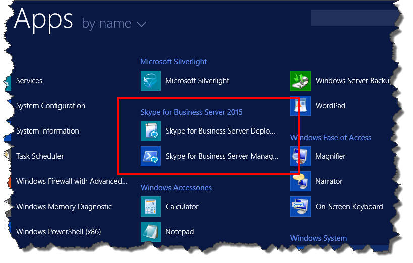
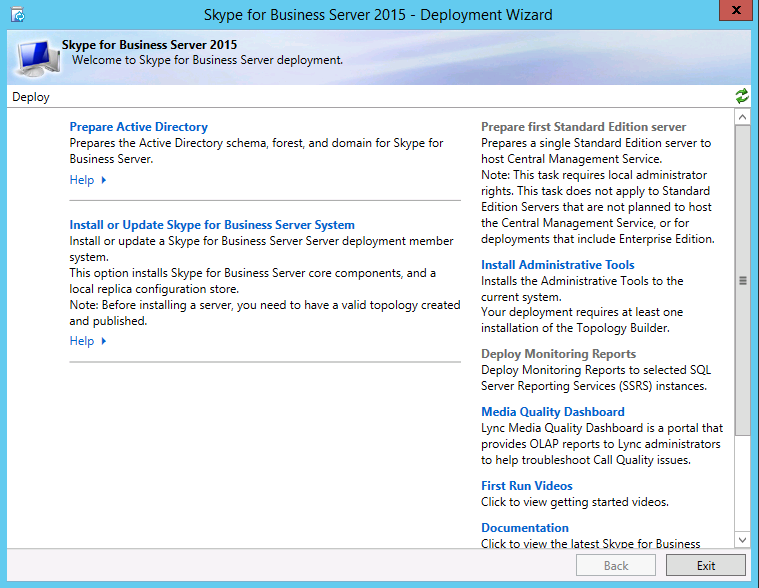
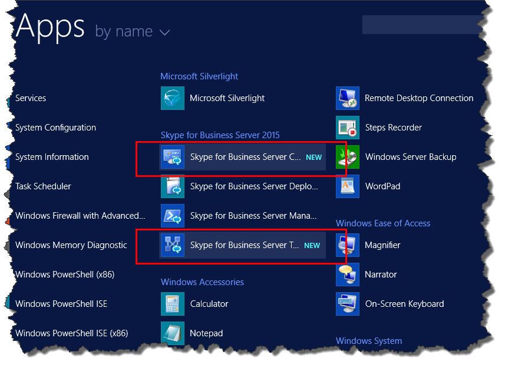

# Install administrative tools in Skype for Business Server
 
**Summary:** Learn how to install the administrative tools required for an installation of Skype for Business Server. Download a free trial of Skype for Business Server from the Microsoft Evaluation center at: [https://www.microsoft.com/evalcenter/evaluate-skype-for-business-server](https://www.microsoft.com/evalcenter/evaluate-skype-for-business-server).
  
The administrative tools include Topology Builder and the Control Panel. The administrative tools must be installed on at least one server in the topology or a 64-bit management workstation running a Windows OS version that is supported for Skype for Business Server. You can do steps 1 through 5 in any order. However, you must do steps 6, 7, and 8 in order, and after steps 1 through 5, as outlined in the diagram. Installing the administrative tools is step 3 of 8.
  

  
## Install Skype for Business Server administrative tools

The installation media for Skype for Business Server provides a flexible experience. When you first run Setup.exe, the only tools installed are the Skype for Business Server Deployment Wizard and the Skype for Business Server Management Shell. By using these two tools, known as Core Components, you can continue with the installation process, but they do not provide primary functionality for the overall Skype for Business Server environment. The Deployment Wizard launches automatically after you install the Core Components. The section of the Deployment Wizard titled **Install Administrative Tools** installs Skype for Business Server Topology Builder and Skype for Business Server Control Panel.
  
> [!IMPORTANT]
> Every Skype for Business Server environment must have at least one server with the administrative tools installed. 
  
Watch the video steps for **Install administrative tools**:
  
> [!video https://www.microsoft.com/en-us/videoplayer/embed/99a5c436-963b-4eed-b423-651568c87cb1?autoplay=false]
  
### Install Skype for Business Server administrative tools from the Deployment Wizard

1. Insert the Skype for Business Server installation media. If the setup does not automatically begin, double-click **Setup**.
    
2. The installation media requires Microsoft Visual C++ to run. A dialog box will pop up asking if you want to install it. Click **Yes**.
    
3. By using Smart Setup, a new feature in Skype for Business Server, you can connect to the Internet to check for updates during the installation process. This provides a better experience by making sure you have the most recent updates to the product at installation. Click **Install** to begin the installation.
    
4. Carefully review the License Agreement, and if you agree, select **I accept the terms in the license agreement**, and click **OK**.
    
5. The Skype for Business Server Core Components will be installed on the server. 
    
    The Core Components consist of the following, as shown in the figure.
    
    
  
   - **Skype for Business Server Deployment Wizard** A deployment program that provides a launch pad for installing the various components of Skype for Business Server.
    
   - **Skype for Business Server Management Shell** A preconfigured PowerShell program that allows for administration of Skype for Business Server.
    
     Once the installation of the Core Components is complete, the Skype for Business Server Deployment Wizard will automatically launch, as shown in the figure. 
    
     
  
6. In addition to the Core Components, you will also need to install Skype for Business Server Topology Builder and Skype for Business Server Control Panel on at least one server in the environment. Click **Install Administrative Tools** on the Deployment Wizard.
    
7. Click **Next** to begin the installation.
    
8. Once the installation has completed, click **Finish**. The administrative tools are now added to the server, as shown in the figure.
    
    
  
   - **Skype for Business Server Topology Builder** A program used to build, deploy, and manage topologies.
    
   - **Skype for Business Server Control Panel** A program used to administer the installation.
    

