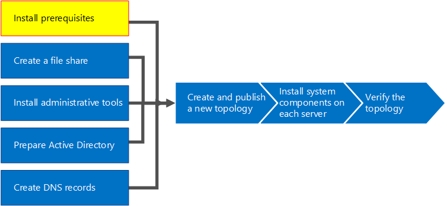
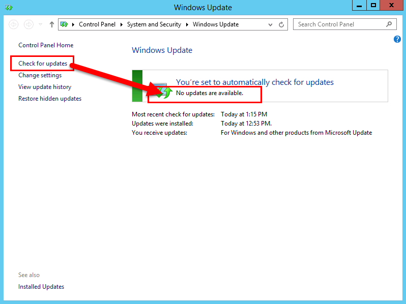

# Install prerequisites for Skype for Business Server
 
**Summary:** Learn about the servers and server roles you must configure before you install Skype for Business Server. Download a free trial of Skype for Business Server from the [Microsoft Evaluation center](https://www.microsoft.com/evalcenter/evaluate-skype-for-business-server).
  
Installing prerequisites consists of setting up Windows Server by installing the required roles and features on each of the servers in the topology. The requirements are based on the role the server will fulfill in the topology. You can do steps 1 through 5 in any order. However, you must do steps 6, 7, and 8 in order, and after steps 1 through 5, as outlined in the diagram. Installing prerequisites is step 1 of 8.
  

  
## Setup Windows Server

Skype for Business Server requires the Windows Server operating system and a number of prerequisites before it can be installed. For details on planning for prerequisites, see [Server requirements for Skype for Business Server](../../../SfBServer2019/plan/system-requirements.md). 
  
> [!TIP]
> This procedure uses Windows Server 2012 R2. If you are using a different version of Windows Server, the procedure might be slightly different. 
  
> [!IMPORTANT]
> Before you begin, make sure that Windows Server is up-to-date by using Windows Update. 
  

  
Watch the video steps for **install prerequisites**:
  
> [!video https://www.microsoft.com/en-us/videoplayer/embed/02447c2a-5b26-432f-aad6-b9b05cc93478?autoplay=false]
  
### Install required roles and features for front-end servers

You can install the required roles and features using Server Manager. 
    
1. Install the prerequisite software features listed in [Server requirements for Skype for Business Server](../../../SfBServer2019/plan/system-requirements.md). The required software must be on the server that will run Skype for Business Server.
    
    > [!CAUTION]
    > Windows Server 2012 R2 does not install all of the source files for the required features by default. 
    > If the server is not connected to the Internet, you will need to insert the Windows Server 2012 R2 media and select **Specify an alternate source path** in order to install the required features. 
    > The source files are located in the sources\sxs directory. 
    > For example, if the Windows Server 2012 R2 media is in drive D, you would set the path to `d:\sources\sxs`. 
    > It is important that you have the latest updates from Windows Update. 
    > If you are not connected to the Internet, you will need to manually install all relevant updates as well as any prerequisites to the required updates. 
  
1. When the dialog box indicates that the installation has completed, you will need to reboot the server to complete the process.
    
1. Run **Windows Update** again to check if there are any updates to the roles and services that were installed.
    
1. If you will be using Skype for Business Server Control Panel on this server then you must also install Silverlight. To install Silverlight, see [Microsoft Silverlight](https://www.microsoft.com/silverlight/).

> [!IMPORTANT]
> The prerequisites for servers performing roles other than front-end server, such as the role of Director, Persistent Chat, or Edge, have their own prerequisites. 
> For details on the exact prerequisites required by each server type, see [Server requirements for Skype for Business Server](../../../SfBServer2019/plan/system-requirements.md). 
  

