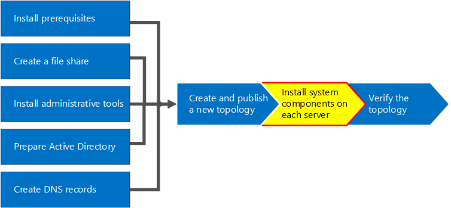
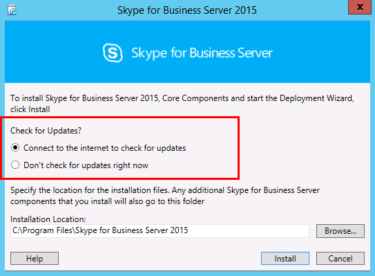
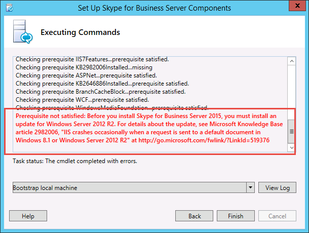
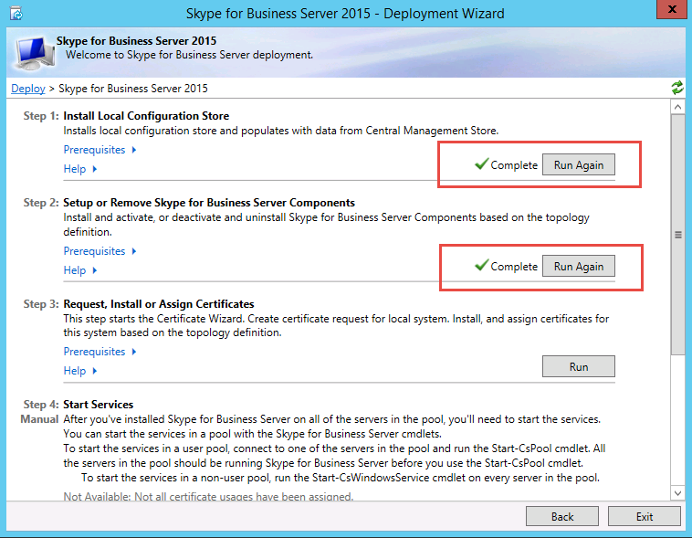
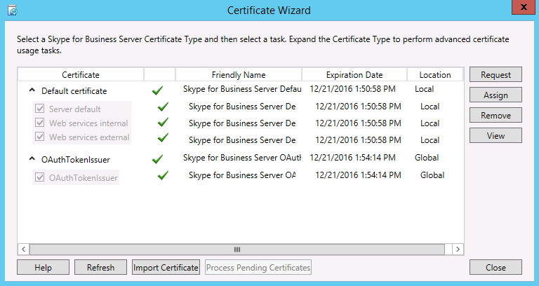
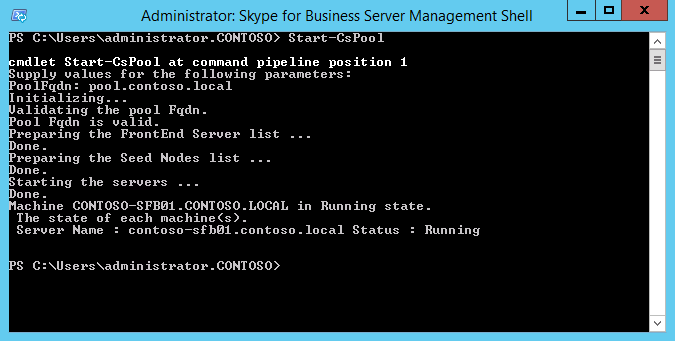
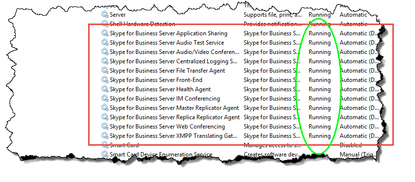

# Install Skype for Business Server on servers in the topology
 
**Summary:** Learn how to install the Skype for Business Server system components on each server in the topology. Download a free trial of Skype for Business Server from the [Microsoft Evaluation center](https://www.microsoft.com/evalcenter/evaluate-skype-for-business-server).
  
Once the topology is loaded into the Central Management Store and Active Directory knows which servers will perform which roles, you need to install the Skype for Business Server system on each of the servers in the topology. You can do steps 1 through 5 in any order. However, you must do steps 6, 7, and 8 in order, and after steps 1 through 5 as outlined in the diagram. Installing the Skype for Business Server system is step 7 of 8.
  

  
## Install Skype for Business Server system

Once you have published a topology, you can install the Skype for Business Server components on each server in the topology. This section guides you through installing Skype for Business Server and setting up the server roles for the Front End pool and any server roles that are collocated with the Front End servers. To install and set up server roles, you run the Skype for Business Server Deployment Wizard on each computer on which you are installing a server role. You use the Deployment Wizard to complete all four deployment steps, including installing the Local Configuration store, installing the Front End Servers, configuring certificates, and starting services.
  
> [!IMPORTANT]
> You must use Topology Builder to complete and publish the topology before you can install Skype for Business Server on servers. 
  
> [!NOTE]
> This procedure must be completed for all servers in the topology. 
  
> [!CAUTION]
> After you install Skype for Business Server on a Front End Server, the first time you start services, you must make sure that the Windows Firewall Service is running on the server. 
  
> [!CAUTION]
> Before you follow these steps, make sure you're logged onto the server with a domain user account that's both a local administrator and a member of the RTCUniversalServerAdmins group. 
  
> [!NOTE]
> If you haven't run Skype for Business Server setup on this server before, you'll be prompted for a drive and path for the installation. This provides the capability to install to a drive other than the system drive, if your organization requires it, or if you have space concerns. You can change the installation location path for the Skype for Business Server files in the **Setup** dialog box to a new, available drive. If you install the Setup files to this path, including OCSCore.msi, the rest of the Skype for Business Server files will deploy there as well.
  
> [!IMPORTANT]
> Before you begin the installation, make sure that Windows Server is up-to-date by using Windows Update. 
  

  
### Install Skype for Business Server system

1. Insert the Skype for Business Server installation media. If the setup does not automatically begin, double-click **Setup**.
    
2. The installation media requires Microsoft Visual C++ to run. A dialog will pop up asking if you want to install it. Click **Yes.**
    
3. Carefully review the License Agreement, and if you agree, select **I accept the terms in the license agreement**, and click **OK**. 
    
4. Smart Setup is a feature in Skype for Business Server where you can connect to the Internet to check for updates from Microsoft Update (MU) during the installation process, as shown in the figure. This provides a better experience by making sure you have the most recent updates for the product. Click **Install** to begin the installation.
    
    > [!NOTE]
    > Many organizations have Windows Server Update Services (WSUS) deployed in their corporate environments. WSUS lets administrators fully manage the distribution of updates that are released through Microsoft Update to computers in their network. As part of the Cumulative Update 1 release Skype for Business Server introduced support for Smart Setup to work with WSUS. Customers with WSUS who are deploying Skype for Business Server for the first time or upgrading from the Lync Server 2013 environment using the In-Place Upgrade feature will have Smart Setup fetching Skype for Windows updates from WSUS as opposed to fetching updates from MU. Customers wanting to use Smart Setup need to run the SmartSetupWithWSUS.psq on all the machines before running Setup.exe. 
  
     
  
5. On the Deployment Wizard page, click **Install or Update Skype for Business Server System**.
    
6. Perform the procedures in the following procedures, when you've completed them, click **Exit** to close the Deployment Wizard. Repeat the procedures for each Front End server in the pool.
    
### Step 1: Install Local Configuration Store

1. Review the prerequisites, and then click **Run** next to **Step 1: Install Local Configuration Store**.
    
    > [!NOTE]
    > The Local Configuration Store is a read-only copy of the Central Management Store. In a Standard Edition deployment, the Central Management Store is created using a local copy of SQL Server Express Edition on the Front End server. This happens when you run the Prepare First Standard Edition Server procedure. In an Enterprise Edition deployment, the Central Management store is created when you publish the topology that includes an Enterprise Edition Front End pool. 
  
2. On the **Install Local Configuration Store** page, make sure that the **Retrieve directly from the Central Management store** option is selected, and then click **Next**.
    
    SQL Server Express Edition is installed on the local server. SQL Server Express Edition is required for the local configuration store.
    
3. When the local server configuration installation is complete, click **Finish**.
    
### Step 2: Setup or remove Skype for Business Server components

1. Review the prerequisites, and then click **Run** next to **Step 2: Setup or Remove Skype for Business Server Components**.
    
2. On the **Set Up Skype for Business Server Components** page, click **Next** to set up components as defined in your published topology.
    
3. The **Executing Commands** page displays a summary of commands and installation information as the set up takes place. When it's done, you can use the list to select a log to view, and then click **View Log**.
    
4. When Skype for Business Server components setup is done and you've reviewed the logs as needed, click **Finish** to complete this step in the installation.
    
    > [!NOTE]
    > Restart the server if prompted (which might happen if Windows Desktop Experience needed to be installed). When the computer is back up and running, you need to run this (Step 2: Setup or Remove Skype for Business Server Components) procedure again. 
  
    > [!NOTE]
    > If the installer finds any prerequisites that have not been satisfied, you will be notified with a "Prerequisite not satisfied" message, as shown in the figure. Satisfy the required prerequisite, and then start this (Step 2: Setup or Remove Skype for Business Server Components) procedure again. 
  
     
  
5. Verify that the first two steps completed as expected. Confirm that there is a green checkmark with the word **Complete**, as shown in the figure.
    
     
  
6. Run **Windows Update** again to check if there are any updates after you install the Skype for Business Server Components.
    
### Step 3: Request, install, or assign certificates

1. Review the prerequisites, and then click **Run** next to **Step 3: Request, Install or Assign Certificates**.
    
    > [!NOTE]
    > Skype for Business Server includes support for the SHA-2 suite (SHA-2 uses digest lengths of 224, 256, 384 or 512 bits) of digest hash and signing algorithms for connections from clients running the Windows 10, Windows 8, Windows 7, Windows Server 2012 R2, Windows Server 2012, or Windows Server 2008 R2 operating systems. To support external access using the SHA-2 suite, the external certificate is issued by a public CA that also can issue a certificate with the same bit length digest. 
  
    > [!IMPORTANT]
    > The selection of which hash digest and signing algorithm is dependent on the clients and the servers that will use the certificate, and other computers and devices that clients and servers will communicate with who must also know how to use the algorithms used in the certificate. For information on which digest lengths are supported in the operating system and some client applications, see [Windows PKI blog - SHA2 and Windows](https://go.microsoft.com/fwlink/p/?LinkId=287002). 
  
    Each Standard Edition or Front End server requires up to four certificates: the oAuthTokenIssuer certificate, a default certificate, a web internal certificate, and a web external certificate. However, you can request and assign a single default certificate with appropriate subject alternative name entries as well as the oAuthTokenIssuer certificate. For details about the certificate requirements, see [Environmental requirements for Skype for Business Server](../../plan-your-deployment/requirements-for-your-environment/environmental-requirements.md) or [Server requirements for Skype for Business Server 2019](../../../SfBServer2019/plan/system-requirements.md).
    
    > [!IMPORTANT]
    > The following procedure describes how to configure certificates from an internal Active Directory Certificate Services based certificate authority. 
  
2. On the **Certificate Wizard** page, click **Request**.
    
3. On the **Certificate Request** page fill in the relevant data including selecting the SIP domain and , click **Next**.
    
4. On the **Delayed or Immediate Requests** page, you can accept the default **Send the request immediately to an online certification authority** option by clicking **Next**. The internal CA with automatic online enrollment must be available if you select this option. If you choose the option to delay the request, you will be prompted for a name and location to save the certificate request file. The certificate request must be presented and processed by a CA either inside your organization, or by a public CA. You will then need to import the certificate response and assign it to the proper certificate role.
    
5. On the **Choose a Certificate Authority (CA)** page, select the **Select a CA from the list detected in your environment** option, and then select a known (through registration in Active Directory Domain Services) CA from the list. Or, select the **Specify another certification authority** option, enter the name of another CA in the box, and then click **Next**.
    
6. On the **Certificate Authority Account** page, you are prompted for credentials to request and process the certificate request at the CA. You should have determined if a user name and password is necessary to request a certificate in advance. Your CA administrator will have the required information and might have to assist you in this step. If you need to supply alternate credentials, select the check box, provide a user name and password in the text boxes, and then click **Next**.
    
7. On the **Specify Alternate Certificate Template** page, to use the default Web Server template, click **Next**.
    
    > [!NOTE]
    > If your organization has created a template for use as an alternative for the default Web server CA template, select the check box, and then enter the name of the alternate template. You will need the template name as defined by the CA administrator. 
  
8. On the **Name and Security Settings** page, specify a **Friendly Name**. By using a friendly name, you can quickly identify the certificate and purpose. If you leave it blank, a name will be generated automatically. Set the **Bit length** of the key, or accept the default of 2048 bits. Select the **Mark the certificate's private key as exportable** if you determine that the certificate and private key needs to be moved or copied to other systems, and then click **Next**.
    
    > [!NOTE]
    > Skype for Business Server has minimal requirements for an exportable private key. One such place is on the Edge Servers in a pool, where the Media Relay Authentication Service uses copies of the certificate, rather than individual certificates for each instance in the pool. 
  
9. On the **Organization Information** page, optionally provide organization information, and then click **Next**.
    
10. On the **Geographical Information** page, optionally provide geographical information, and then click **Next**.
    
11. On the **Subject Name / Subject Alternate Names** page, review the subject alternative names that will be added, and then click **Next**.
    
12. On the **SIP Domain setting** page, select the **SIP Domain**, and then click **Next**.
    
13. On the **Configure Additional Subject Alternate Names** page, add any additional required subject alternative names, including any that might be required for additional SIP domains in the future, and then click **Next**.
    
14. On the **Certificate Request Summary** page, review the information in the summary. If the information is correct, click **Next**. If you need to correct or modify a setting, click **Back** to the proper page to make the correction or modification.
    
15. On the **Executing Commands** page, click **Next**.
    
16. On the **Online Certificate Request Status** page, review the information returned. You should note that the certificate was issued and installed into the local certificate store. If it is reported as having been issued and installed, but it is not valid, make sure that the CA root certificate has been installed in the server's Trusted Root CA store. Refer to your CA documentation on how to retrieve a Trusted Root CA certificate. If you need to view the retrieved certificate, click **View Certificate Details**. By default, the check box for **Assign the certificate to Skype for Business Server certificate usages** is selected. If you want to manually assign the certificate, clear the check box, and then click **Finish**.
    
17. If you cleared the check box for **Assign the certificate to Skype for Business Server certificate usages** on the previous page, you will be presented with the **Certificate Assignment** page. Click **Next**.
    
18. On the **Certificate Store** page, select the certificate that you requested. If you want to view the certificate, click **View Certificate Details**, and then click **Next** to continue.
    
    > [!NOTE]
    > If the **Online Certificate Request Status** page reported an issue with the certificate, such as the certificate is not valid, view the actual certificate for help in resolving the issue. Two specific issues that can cause a certificate to not be valid is the previously mentioned missing Trusted Root CA certificate, and a missing private key that is associated with the certificate. Refer to your CA documentation to resolve these two issues.
  
19. On the **Certificate Assignment Summary** page, review the information presented to make sure that this is the certificate that should be assigned, and then click **Next**.
    
20. On the **Executing Commands** page, review the output of the command. Click **View Log** if you want to review the assignment process or if there was an error or warning issued. When you are finished with your review, click **Finish**.
    
21. On the **Certificate Wizard** page, confirm that all services have a green check to indicate that all have been assigned a certificate, including the OAuthTokenIssuer ,as shown in the figure, and then click **Close**.
    
     
  
    > [!TIP]
    > If you are installing in a lab environment and have just set up the Certificate Authority using Active Directory Certificate Services, you will need to reboot both the server running Certificate Services and also the Front End server before the certificate assignment can go through successfully. 
  
    > [!TIP]
    >  For more information about certificates in Active Directory Certificate Services, see [Active Directory Certificate Services](https://technet.microsoft.com/en-us/windowsserver/dd448615.aspx). 
  
### Step 4: Start Services

1. Review the prerequisites for **Step 4: Start Services**.
    
2. If this is an Enterprise Edition Front End pool with at least three servers, Windows Fabric is used, and you must use the **Start-CsPool** cmdlet. If a single server is used, which is always the case with Standard Edition, you muse use the **Start-CsWindowsService** cmdlet. In this example we are using Enterprise Edition with three Front End servers in the pool, open the **Skype for Business Server Management Shell** and run the **Start-CsPool** cmdlet as shown in the figure. For all other roles, including Standard Edition server, you must use **Start-CsWindowsService**. To deploy roles other than the Front End role, see documentation for those particular roles.
    
     
  
3. On the **Executing Commands** page, after all services have started successfully, click **Finish**.
    
    > [!IMPORTANT]
    > The command to start the services on the server is a best effort method to report that the services have, in fact, started. It might not reflect the actual state of the service. We recommend that you use the step **Service Status (Optional)** to open the Microsoft Management Console (MMC) and confirm that the services have started successfully, as shown in the figure. If any Skype for Business Server service has not started, you can right-click that service in the MMC, and then click **Start**. 
  
     
  

