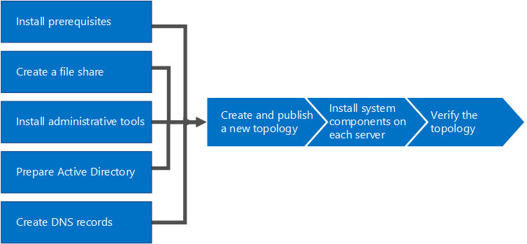

# Install Skype for Business Server
 
**Summary:** Learn how to prepare your environment for an installation of Skype for Business Server. Download a free trial of Skype for Business Server from the Microsoft Evaluation center at:[https://www.microsoft.com/evalcenter/evaluate-skype-for-business-server](https://www.microsoft.com/evalcenter/evaluate-skype-for-business-server).
  
This article walks you through an example installation of Skype for Business Server. This article does not attempt to cover all of the procedures you need to perform a full Skype for Business Server installation. The goal is to provide example procedures in a narrowly defined topology that includes basic meet-and-share functionality.
  
## Overview of the install process for Skype for Business Server

An installation of Skype for Business Server includes many different procedures. The procedures you need to get Skype for Business Server running in your environment depend on the specifics of your environment. For example, if you are using Windows Server for DNS, you will benefit from the example procedure for adding a DNS entry. If you use another system for DNS, you need to follow procedures for your particular DNS system. This is true for many of the procedures in this section.
  
Skype for Business Server is available in Standard Edition and Enterprise Edition. The main difference is that Standard Edition does not support the high availability features that are included with Enterprise Edition. 
  
Skype for Business Server is an advanced product, and the exact installation process depends a great deal on your specific circumstances. This section walks you through the general steps to install the product. However, each procedure might be different depending on your environment and planning decisions. For example, for small organizations a single server, running Skype for Business Server Standard Edition might be appropriate, whereas a large multinational organization might have 50 servers at locations around the world dedicated to the product.
  
> [!NOTE]
> To learn about the latest Cumulative Updates, see [Updates for Skype for Business Server](https://support.microsoft.com/en-us/kb/3061064). After installing the CU1 patch an administrator needs to execute the  `Update-CsAdminRole` cmdlet. This cmdlet is required to access the new GCP cmdlets over Remote PowerShell.
  
> [!IMPORTANT]
> The procedures in this section serve as an example using a narrowly defined set of requirements and assume specific decisions have already been made. The actual procedures you need to install Skype for Business Server will likely be very different. Use the procedures in this section as an example only and not as a step-by-step guide for installing Skype for Business Server in every environment. 
  
Getting Skype for Business Server up and running for the first time involves eight primary steps. You should understand that the example procedures in this section are not the only procedures required for installing Skype for Business Server. The following eight steps are simply examples to help you better understand the overall process and get a basic working environment up and running. You can do steps 1 through 5 in any order. However, you must do steps 6, 7, and 8 in order, and after steps 1 through 5, as outlined in the diagram. The eight steps are:
  

  
- [Install prerequisites for Skype for Business Server](install-prerequisites.md) : Install prerequisites on all servers that make up the Skype for Business Server topology. Note that prerequisites are not the same for all roles. For example, servers that provide the front-end role have a set of prerequisites, and servers that provide a director role have a different set of prerequisites. See prerequisite planning documentation for more details.
    
- [Create a file share in Skype for Business Server](create-a-file-share.md) : Create a file share that will be used by servers throughout the Skype for Business Server topology.
    
- [Install administrative tools in Skype for Business Server](install-administrative-tools.md) : The administrative tools include Topology Builder and Control Panel. You must install the administrative tools on at least one server in the topology or a 64-bit management workstation running a Windows OS version that is supported for Skype for Business Server.
    
- [Prepare Active Directory for Skype for Business Server](prepare-active-directory.md) : Skype for Business Server works closely with Active Directory. You must prepare the Active Directory domain to work with Skype for Business Server. You can do this through the Deployment Wizard, and it is only done once for the domain. This is because the process creates groups and modifies the domain, and you need to do that only once.
    
- [Create DNS records for Skype for Business Server](create-dns-records.md) : In order for Skype for Business Server to work properly, a number of DNS settings must be in place. This is so that clients know how to access the services and the servers know about each other. These settings only need to be completed once per deployment because once you assign a DNS entry, it is available throughout the domain.
    
- [Create and publish new topology in Skype for Business Server](create-and-publish-new-topology.md) : Before you can install the Skype for Business Server system on each of the servers in the topology, you must create a topology and publish it. When you publish a topology, you are loading the topology information into the Central Management Store database. If this is an Enterprise Edition pool, you are creating the Central Management Store database the first time you publish a new topology. If this is Standard Edition, you need to run the Prepare First Standard Edition Server process from the Deployment Wizard before you publish a topology. This prepares for Standard Edition by installing a SQL Server Express Edition instance and creating the Central Management Store.
    
- [Install Skype for Business Server on servers in the topology](install-skype-for-business-server.md) : Once the topology is loaded into the Central Management Store and Active Directory knows which servers will perform which roles, you need to install the Skype for Business Server system on each of the servers in the topology.
    
- [Verify the topology in Skype for Business Server](verify-the-topology.md) : After you have the topology published and the Skype for Business Server system components installed on each of the servers in the topology, you are ready to verify that the topology is working as expected. This includes verifying that the configuration has propagated out to all of the Active Directory servers so that the entire domain knows that Skype for Business is available in the domain.
    

