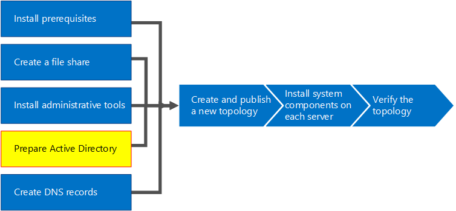

# Prepare Active Directory for Skype for Business Server
 
**Summary:** Learn how to prepare your Active Directory domain for an installation of Skype for Business Server. Download a free trial of Skype for Business Server from the [Microsoft Evaluation Center](https://www.microsoft.com/evalcenter/evaluate-skype-for-business-server).
  
Skype for Business Server works closely with Active Directory. You must prepare the Active Directory domain to work with Skype for Business Server. This process is accomplished in the Deployment Wizard and is only done once for the domain. This is because the process creates groups and modifies the domain, and you need to do that only once. You can do steps 1 through 5 in any order. However, you must do steps 6, 7, and 8 in order, and after steps 1 through 5, as outlined in the diagram. Preparing Active Directory is step 4 of 8. For more information about planning for Active Directory, see [Environmental requirements for Skype for Business Server](../../plan-your-deployment/requirements-for-your-environment/environmental-requirements.md) or [Server requirements for Skype for Business Server 2019](../../../SfBServer2019/plan/system-requirements.md).
  

  
## Prepare Active Directory

Skype for Business Server is tightly integrated with Active Directory Domain Services (AD DS). Before Skype for Business Server can be installed for the first time, Active Directory must be prepared. The section of the Deployment Wizard titled **Prepare Active Directory** prepares the Active Directory environment for use with Skype for Business Server.
  
> [!NOTE]
> Skype for Business Server uses (AD DS) to track and communicate with all of the servers in a topology. Every server must be joined to the domain so that Skype for Business Server can work properly. 
  
> [!IMPORTANT]
> The Prepare Active Directory procedure should be run only once for each domain in the deployment. 
  
Watch the video steps for **Prepare Active Directory**:
  
> [!video https://www.microsoft.com/en-us/videoplayer/embed/RE1Ybuk]
  
### Prepare Active Directory from the Deployment Wizard

1. Log on as a user with Schema Admins credentials for the Active Directory domain.
    
2. Open Skype for Business Server Deployment Wizard.
    
    > [!TIP]
    > If you want to review the log files that are created by the Skype for Business Server Deployment Wizard, you can find them on the computer where the Deployment Wizard was run, in the Users directory of the AD DS user who ran the step. For example, if the user logged on as the domain administrator in the domain, contoso.local, the log files are located in: C:\Users\Administrator.Contoso\AppData\Local\Temp. 
  
3. Click the **Prepare Active Directory** link.
    
4. **Step 1: Prepare schema**
    
    a. Review the prerequisites information for Step 1 which can be accessed by clicking the drop-down under the Step 1 title.
    
    b. Click **Run** in Step 1 to launch the Prepare Schema wizard.
    
    c. Take note that the procedure should be run only once for each deployment, and then click **Next**.
    
    d. Once the schema has been prepared, you can view the log by clicking **View Log**. 
    
    e. Click **Finish** to close the Prepare Schema wizard, and return to the Prepare Active Directory steps.
    
5. **Step 2: Verify replication of schema partition**
    
    a. Log on to the domain controller for the domain.
    
    b. Open **ADSI Edit** from the **Tools** drop-down menu in **Server Manager**.
    
    c. On the **Action** menu, click **Connect to**.
    
    d. In the **Connection Settings** dialog box under **Select a well known Naming Context**, select **Schema**, and then click **OK**.
    
    e. Under the schema container, search for **CN=ms-RTC-SIP-SchemaVersion**. If this object exists, and the value of the **rangeUpper** attribute is 1150 and the value of the **rangeLower** attribute is 3, the schema was successfully updated and replicated. If this object does not exist or the values of the **rangeUpper** and **rangeLower** attributes are not as specified, the schema was not modified or has not replicated.
    
6. **Step 3: Prepare current forest**
    
    a. Review the prerequisites information for Step 3 which can be accessed by clicking the drop-down under the Step 3 title.
    
    b. Click **Run** in Step 3 to launch the Prepare Current Forest wizard.
    
    c. Take note that the procedure should be only run once per deployment, and then click **Next**.
    
    d. Specify the domain where the universal groups will be created. If the server is part of the domain, you can choose **Local domain**, and click **Next**.
    
    e. Once the forest has been prepared, you can view the log by clicking **View Log**. 
    
    f. Click **Finish** to close the Prepare Current Forest wizard, and return to the Prepare Active Directory steps.
    
    g. Click **Skype for Business Server Management Shell** from the **Apps** page to launch PowerShell.
    
    h. Type the command Get-CsAdForest, and press **Enter**.
    
    i. If the result is **LC_FORESTSETTINGS_STATE_READY**, the forest has successfully been prepared, as shown in the figure.
    
     
  
7. **Step 4: Verify replication of the global catalog**
    
    a. On a domain controller (preferably in a remote site from the other domain controllers), in the forest where the Forest Preparation was run, open **Active Directory Users and Computers**.
    
    b. In **Active Directory Users and Computers**, expand the domain name of your forest or a child domain.
    
    c. Click the **Users** container on the left side pane, and look for the Universal group **CsAdministrator** in the right side pane. If CsAdministrator (among other new Universal groups that begin with Cs) is present, Active Directory replication has been successful.
    
    d. If the groups are not yet present, you can force the replication, or wait 15 minutes and refresh the right side pane. When the groups are present, replication is complete.
    
8. **Step 5: Prepare the current domain**
    
    a. Review the prerequisites information for Step 5.
    
    b. Click **Run** in Step 5 to launch the Prepare Current Domain wizard.
    
    c. Take note that the procedure should only be run once for each domain in the deployment, and then click **Next**.
    
    d. Once the domain has been prepared, you can view the log by clicking **View Log**. 
    
    e. Click **Finish** to close the Prepare Current Domain wizard, and return to the Prepare Active Directory steps.
    
    These steps must be completed in every domain where Skype for Business Server objects are found, otherwise services might not start. This includes any type of Active Directory object, such as users, contact objects, administrative groups, or any other type of object. You can use Set-CsUserReplicatorConfiguration -ADDomainNamingContextList to add only the domains with Skype for Business Server objects, if needed.
    
9. **Step 6: Verify replication in the domain**
    
    a. Click the **Skype for Business Server Management Shell** from the **Apps** page to launch PowerShell.
    
    b. Use the command Get-CsAdDomain to verify replication within the domain.
    
   ```
   Get-CsAdDomain [-Domain <Fqdn>] [-DomainController <Fqdn>] [-GlobalCatalog <Fqdn>] [-GlobalSettingsDomainController <Fqdn>]
   ```

    > [!NOTE]
    > If you do not specify the Domain parameter, the value is set to the local domain. 
  
    Example of running the command for the contoso.local domain:
    
   ```
   Get-CsAdDomain -Domain contoso.local -GlobalSettingsDomainController dc.contoso.local
   ```

    > [!NOTE]
    > By using the parameter GlobalSettingsDomainController, you can indicate where global settings are stored. If your settings are stored in the System container (which is typical with upgrade deployments that have not had the global setting migrated to the Configuration container), you define a domain controller in the root of your AD DS forest. If the global settings are in the Configuration container (which is typical with new deployments or upgrade deployments where the settings have been migrated to the Configuration container), you define any domain controller in the forest. If you do not specify this parameter, the cmdlet assumes that the settings are stored in the Configuration container and refers to any domain controller in Active Directory. 
  
    c. If the result is **LC_DOMAINSETTINGS_STATE_READY**, the domain has successfully replicated.
    
10. **Step 7: Add users to provide administrative access to the Skype for Business Server Control Panel**
    
    a. Log on as a member of the Domain Admins group or the RTCUniversalServerAdmins group.
    
    b. Open **Active Directory Users and Computers**, expand your domain, click the **Users** container, right-click CSAdministrator, and choose **Properties**.
    
    c. In **CSAdministrator Properties**, click the **Members** tab.
    
    d. On the **Members** tab, click **Add**. In **Select Users, Contacts, Computers, Service Accounts, or Groups**, locate the **Enter the object names to select**. Type the user name(s) or group name(s) to add to the group CSAdministrators. Click **OK**.
    
    e. On the **Members** tab, confirm that the users or groups that you selected are present. Click **OK**.
    
    > [!CAUTION]
    > The Skype for Business Server Control Panel is a role-based access control tool. Membership in the CsAdministrator group gives a user who is using the Skype for Business Server Control Panel full control for all configuration functions available. There are other roles available that are designed for specific functions. For details on the roles available, see [Environmental requirements for Skype for Business Server](../../plan-your-deployment/requirements-for-your-environment/environmental-requirements.md) or [Server requirements for Skype for Business Server 2019](../../../SfBServer2019/plan/system-requirements.md). Note that users do not have to be enabled for Skype for Business Server in order to be made members of the management groups. 
  
    > [!CAUTION]
    > To help retain security and role-based access control integrity, add users to the groups that define what role the user performs in management of the Skype for Business Server deployment. 
  
11. Log off, and then log back on to Windows so that your security token is updated with the new Skype for Business Server security group, and then reopen the Deployment Wizard.
    
12. Verify that you see a green checkmark next to **Prepare Active Directory** to confirm success, as shown in the figure.
    
     
  

## See also
 
[Active Directory Domain Services for Skype for Business Server 2015](../../plan-your-deployment/security/active-directory-domain-services.md)
