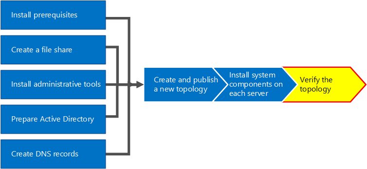
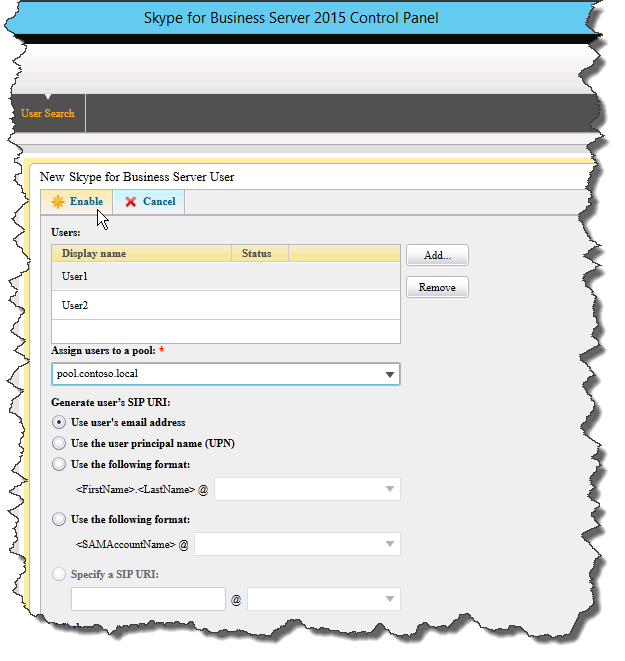
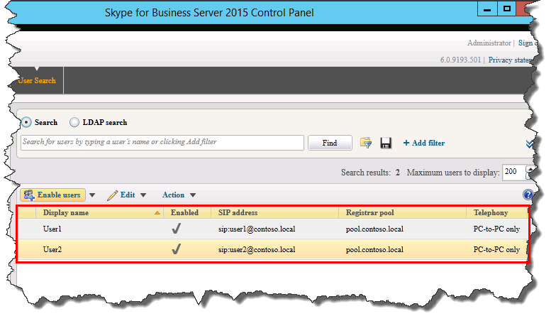

# Verify the topology in Skype for Business Server
 
**Summary:** Learn how to verify the Skype for Business Server topology and Active Directory servers are working as expected. Download a free trial of Skype for Business Server from the [Microsoft Evaluation center](https://www.microsoft.com/evalcenter/evaluate-skype-for-business-server).
  
After you have the topology published and the Skype for Business Server system components installed on each of the servers in the topology, you are ready to verify that the topology is working as expected. This includes verifying that the configuration has propagated out to all of the Active Directory servers so that the entire domain knows Skype for Business is available in the domain. You can do steps 1 through 5 in any order. However, you must do steps 6, 7, and 8 in order, and after steps 1 through 5, as outlined in the diagram. Verifying the topology is step 8 of 8.
  

  
## Test the Front End pool deployment

The final step is to test the Front End pool and confirm that Skype for Business clients can communicate with each other. 
  
### Add users and verify client connectivity

1. Use Active Directory Computers and Users to add the Active Directory user object of the administrator role for the Skype for Business Server deployment (on which Skype for Business Server Control Panel is installed) to the **CSAdministrator** group.
    
    > [!IMPORTANT]
    > If you do not add the appropriate users and groups to the CsAdministors group, you will receive an error when you open Skype for Business Server Control Panel which reads, "Unauthorized: Access is denied due to a role-based access control (RBAC) authorization failure." 
  
2. If the user object is currently logged on, log off and then log on again to register the new group assignment.
    
    > [!NOTE]
    > The user account cannot be the local administrator of any server running Skype for Business Server. 
  
3. Use the administrative account to log on to the computer where Skype for Business Server Control Panel is installed.
    
4. Start Skype for Business Server Control Panel, and then provide credentials, if prompted. Skype for Business Server Control Panel displays deployment information.
    
5. In the left navigation bar, click **Topology**, and then confirm that the service status shows a computer with a green arrow and that a green check mark for replication status is next to each Skype for Business Server role that has been deployed and brought online. 
    
6. In the left navigation bar, click **Users**, and then click **Enable users**. 
    
7. On the **New Skype for Business Server User** page, click **Add**.
    
8. To define search parameters for the objects you want to find, on the **Select from Active Directory** page, you can select **Search**, and then optionally click **Add Filter**. You can also select **LDAP search** and enter an LDAP expression to filter or limit the objects that will be returned. After you have decided on your Search options, click **Find**.
    
9. In the Search results pane, select the users you want to add, and then click **OK**.
    
10. On the **New Skype for Business Server User** page, the users you selected are in the **Users** display. In the **Assign users to a pool** list, select the server where the users should reside.
    
    The following is a list of options you can use to configure the objects.
    
    - **Generate user's SIP URI**
    
    - **Telephony**
    
    - **Line URI**
    
    - **Conferencing policy**
    
    - **Client version policy**
    
    - **PIN policy**
    
    - **External access policy**
    
    - **Archiving policy**
    
    - **Location policy**
    
    - **Client policy**
    
    To test the basic functionality, select the option you prefer for the **Generate user's SIP URI** setting (the other options in the configuration use default settings), and then click **Enable**, as shown in the figure.
    
     
  
11. A summary page is displayed that shows a check mark in the **Enabled** column to indicate that the users are setup. The **SIP address** column displays the address you need for the user sign-in configuration.
    
     
  
12. Log one user on to a computer that is joined to the domain and another user on to another computer in the domain.
    
13. Install Skype for Business client on each of the two client computers, and then verify that both users can sign in to Skype for Business Server and can send instant messages to each other.
    

