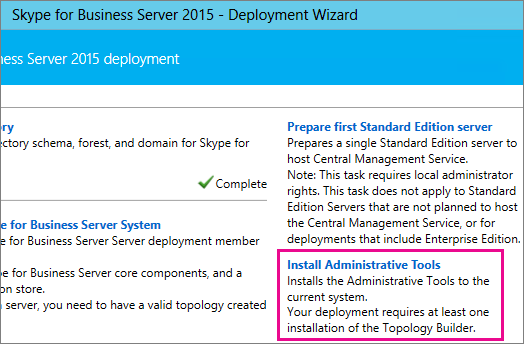
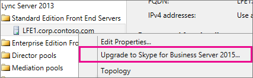
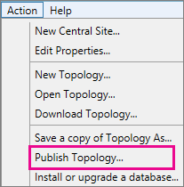
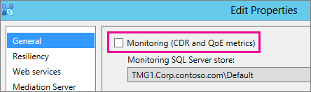
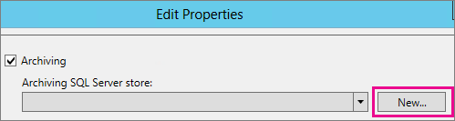
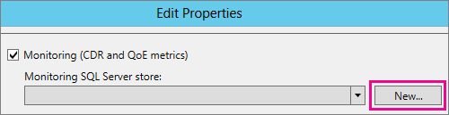
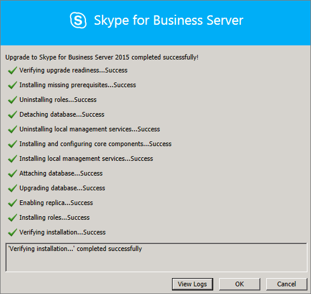
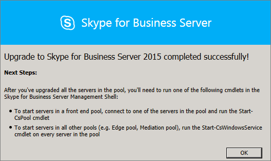
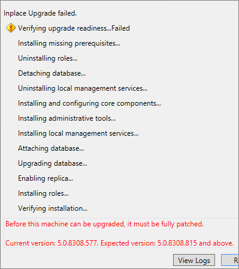

# Upgrade to Skype for Business Server 2015
 
**Summary:** Learn how to upgrade from Lync Server 2013 to Skype for Business Server 2015. Download a free trial of Skype for Business Server 2015 from the  [Microsoft Evaluation center](https://www.microsoft.com/evalcenter/evaluate-skype-for-business-server).
  
Use the procedures in this document to upgrade from Lync Server 2013 to Skype for Business Server 2015 by using the Skype for Business Server Topology Builder and the new In-Place Upgrade feature. If you want to upgrade from Lync Server 2010 or Office Communications Server 2007 R2, see [Plan to upgrade to Skype for Business Server 2015](../plan-your-deployment/upgrade.md).

> [!NOTE]
> In-place upgrades were available in Skype for Business Server 2015 but are no longer supported in Skype for Business Server 2019. Side by side coexistance is supported, see [Migration to Skype for Business Server 2019](../../SfBServer2019/migration/migration-to-skype-for-business-server-2019.md) for more information.
  
## Upgrade from Lync Server 2013

Upgrading Lync Server 2013 to Skype for Business Server 2015 involves installing prerequisite software, using the Skype for Business Server Topology Builder to upgrade databases in the pool, and using the Skype for Business Server In-Place Upgrade on each of the servers associated with the pool. To complete the upgrade, go through the eight steps in this topic.
  
### Before you begin

- Review [Plan to upgrade to Skype for Business Server 2015](../plan-your-deployment/upgrade.md).
    
- Review [Server requirements for Skype for Business Server 2015](../plan-your-deployment/requirements-for-your-environment/server-requirements.md).
    
- [Install prerequisites for Skype for Business Server 2015](install/install-prerequisites.md) .
    
- [Install Skype for Business Server 2015](install/install.md) .
    
### Step 1: Install Administrator tools and download topology

1. Connect to computer in the topology that does not have Lync OCSCore or any other Lync components installed.
    
2. From Skype for Business Server 2015 installation media, run **Setup.exe** from **OCS_Volume\Setup\AMD64**. 
    
3. Click **Install**. 
    
4. Accept the license agreement.
    
5. On the Deployment Wizard, click **Install Administrator tools**, and follow the steps to install.
    
     
  
6. From the Windows Start screen, open Skype for Business Server Topology Builder.
    
7. Click **Download topology from existing deployment**, and click **Next**.
    
8. Enter a name for the topology, and click **Save**.
    
9. Go to location where you saved the topology, and make a copy of the topology.
    
### Step 2: Upgrade and publish topology using Topology Builder

Before you start the upgrade process, all services must be running for the pools you plan to upgrade. This is so the topology changes will be replicated to the local database of the servers in the pool.
  
> [!IMPORTANT]
>  Save a copy of your topology file before you upgrade. After you upgrade, you will not be able to downgrade the topology.>  If your services are on the same servers as your databases, like the Persistent Chat service is on the same server as the Persistent Chat database, skip this step, and go to step 4. After you stop the services, run the In-Place Upgrade setup on each server to upgrade the local databases.
  
> [!NOTE]
> If the topology has a back-end database that is mirrored then you will see both the Principal and the Mirrored databases show up **when you publish the topology** using Topology Builder. Make sure all of the databases are running on the Principal and only select the Principal, not the mirror, when publishing the topology otherwise you will see a warning after publishing the topology.
  
Pick one of the options below to upgrade and publish a new topology by using the Skype for Business Server 2015 Topology Builder. After you complete the steps and publish the updated topology, move to Step 3 in this topic.
  
#### Option 1: Upgrade an isolated Front End pool and associated Archiving and Monitoring stores

If the pool you're upgrading has an Archiving and Monitoring store dependency, when you use the following steps, the Archiving and Monitoring store will be upgraded as well.
  
1. In Topology Builder, right-click a Lync Server 2013 pool, select **Upgrade to Skype for Business Server 2015**, and follow the steps. 
    
     
  
2. In Topology Builder, click **Action** > **Publish topology** or **Action** > **Topology** > **Publish**. 
    
     
  
3. During publishing, choose to install a database on the Archiving and Monitoring store.
    
#### Option 2: Upgrade Front End pool without upgrading Archiving and Monitoring stores

If you use the following steps, archiving and monitoring for the selected pool are disabled. The pool will not have Archiving and Monitoring stores after the upgrade.
  
1. In Topology Builder, select the Lync Server 2013 pool that you want to upgrade.
    
2. Remove the dependency to the Lync Server 2013 Archiving and Monitoring stores. 
    
   - Go to **Action** > **Edit properties**.
    
   - Clear the **Archiving** check box.
    
     
  
   - Clear the **Monitoring** check box.
    
     
  
3. Right-click the Lync Server 2013 pool, select **Upgrade to Skype for Business Server 2015**, and follow the steps. 
    
     
  
4. In Topology Builder, click **Action** > **Publish topology** or **Action** > **Topology** > **Publish**. 
    
#### Option 3: Upgrade Front End pool and associated it to new Skype for Business Server 2015 Archiving and Monitoring stores

If you use the following steps, archiving and monitoring will stop in the previous store and start in the new store you've created. 
  
1. In Topology Builder, select the Lync Server 2013 pool that you want to upgrade. 
    
2. Remove the dependency to the Lync Server 2013 Archiving and Monitoring stores. 
    
   - Go to **Action** > **Edit properties**.
    
   - Clear the **Archiving** check box.
    
     
  
   - Clear the **Monitoring** check box.
    
     
  
3. Right-click the Lync Server 2013 pool, select **Upgrade to Skype for Business Server 2015**, and follow the steps. 
    
     
  
4. Create a new SQL store for Archiving. 
    
   - Select the pool and **Action** > **Edit properties**. 
    
   -  Select the **Archiving** check box.
    
   - Click **New**.
    
     
  
5. Create a new SQL store for Monitoring. 
    
   - Select the pool and **Action** > **Edit properties**. 
    
   -  Select the **Monitoring** check box.
    
   - Click **New**.
    
     
  
6. In Topology Builder, click **Action** > **Publish topology** or **Action** > **Topology** > **Publish**. 
    
7. During publishing, choose to install the database on the new Archiving and Monitoring store.
    
### Step 3: Wait for replication

Give replication some time to publish the updated topology to all the servers in the environment.
  
### Step 4: Stop all services in pool to be upgraded

On each server that is servicing the pool that you're going to upgrade, run the following cmdlet in PowerShell:
  
```
Disable-CsComputer -Scorch
```

We recommend using Disable-CsComputer because you may need to reboot the server during the In-Place Upgrade process. If you use Stop-CsWindowsService, some services may restart automatically after a reboot. This may cause the In-Place Upgrade to fail.
  
### Step 5: Upgrade Front End pools and non-Front End pool servers

> [!NOTE]
>  Before upgrading please install all new prerequisites required for Skype for Business Server 2015 which include:>  At least 32GB of free space before attempting an upgrade. In addition, make sure that the drive is a fixed local drive, is not connected by USB or Firewire, is formatted with NTFS file system, is not compressed, and does not contain a page file.>  PowerShell version 6.2.9200.0 or later.>  The latest Lync Server 2013 Cumulative Update installed.>  SQL Server 2012 SP1 installed.>  The following KB's installed (installed automatically if using Microsoft Update):>  Windows Server 2008 R2 -[KB2533623](https://support.microsoft.com/kb/2533623)>  Windows Server 2012 -[KB2858668](https://support.microsoft.com/kb/2858668)>  Windows Server 2012 R2 -[KB2982006](https://support.microsoft.com/kb/2982006)
  
Use the In-Place Upgrade on each server to update the Front End pool, Edge pool, Mediation server, and the Persistent Chat pool.
  
1. On each server, run **Setup.exe** from **OCS_Volume\Setup\amd64** on the Skype for Business Server 2015 installation media.
    
2. Accept the license agreement and follow the prompts for the In-Place Upgrade.
    
3. Repeat these steps for each server in the Front End pool and on each non-Front End pool server.
    
> [!NOTE]
> You might be prompted to reboot the server during the In-Place Upgrade. That's ok. After you reboot, the In-Place Upgrade will continue from where it left off. 
  
When the In-Place Upgrade completes successfully, you see the following message.
  

  
### Step 6: Restart services on all upgraded servers

> [!NOTE]
> Before restarting the services, please make sure %ProgramData%\WindowsFabric doesn't exist on all Front End Servers. If it exists, delete it before starting the services. 
  
- After you've upgraded all servers in the Front End pool, restart the services by using the following PowerShell command: 
    
  ```
  Start-CsPool
  ```

    > [!NOTE]
    > If there is already a pending system reboot needed before you start running In-Place Upgrade, then In-Place Upgrade won't ask you to reboot at the end of the installation. This will cause some assembly exceptions to be thrown against the first Front End server when you try to start services using the Start-CSPool cmdlet. To resolve these errors, reboot all of the servers in the pool and run the cmdlet again. 
  
- On the non-Front End pool servers, restart the services by using the following command:
    
  ```
  Start-CsWindowsService
  ```

After you click **OK** on the In-Place Upgrade page, you'll see the following reminder to complete this step.
  

  
### Step 7: Verify Skype for Business functionality works

To make sure the upgrade was successful, for the pool that was upgraded, test Skype for Business to make sure the functionality is working as expected. 
  
### Step 8: Upgrade secondary pools

Repeat the steps in this topic to upgrade any additional pools that you have in your environment.
  
## Troubleshoot issues with the In-Place Upgrade

If the In-Place Upgrade fails, you might see a message similar to what's in the following image. 
  

  
Review the full message at the bottom of the page to help you troubleshoot the issue. Click **View logs** to get more detail.
  
If the In-Place Upgrade fails on **Verifying upgrade readiness** or **Installing missing prerequisites**, make sure the server has all the latest Windows Server, Lync Server, and SQL Server updates applied, and all the required software and roles are installed. For a list of what's required, see [Server requirements for Skype for Business Server 2015](../plan-your-deployment/requirements-for-your-environment/server-requirements.md) and [Install prerequisites for Skype for Business Server 2015](install/install-prerequisites.md).
  
## See also

[Plan to upgrade to Skype for Business Server 2015](../plan-your-deployment/upgrade.md)
  
[Server requirements for Skype for Business Server 2015](../plan-your-deployment/requirements-for-your-environment/server-requirements.md)
  
[Install prerequisites for Skype for Business Server 2015](install/install-prerequisites.md)
  
[Install Skype for Business Server 2015](install/install.md)
