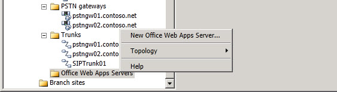

# Office Web Apps Server Scope Node Expander
 
You right click on **Office Web Apps Servers** in Topology Builder to perform the following:
  
- **New Office Web Apps Server**: Starts the **Define New Office Web Apps Server** wizard used to define a new Office Web Apps Server.
    
In addition to the New Office Web Apps Server option, you can perform the following general tasks:
  

  
- **Topology**. You can use this option to define a new topology, open an existing topology, download the current topology, save a copy of the topology, publish the topology, install a database, merge components from previous versions, or remove the deployment.
    
- **Help**. You can use this option to access Help for the active node.
    

