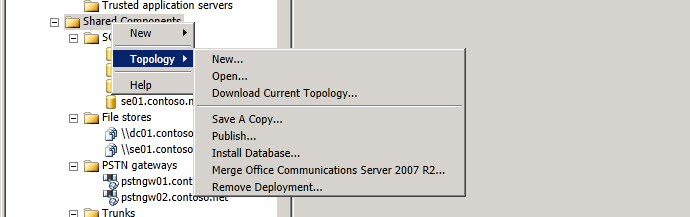

# Shared Components Scope Node
 
You right click on **Shared Components** in the Topology Builder hierarchy tree to create new shared components or to access Topology level options.
  

  
Select **New** to create a new filestore, a new IP/PSTN Gateway, a new Office Web Apps Server, a new SQL Server store, or a new Trunk.
  
> [!NOTE]
> See the Help topics for each of these options. 
  

  
You select **Topology** to click on options to open a New topology document. Open an existing topology document, Download Current Topology from the Central Management store, Save a Copy of the current topology document, Publish the current topology document, Install Database to create the currently configured database configurations, Merge Office Communications Server 2007 R2 into the current deployment, or to Remove Deployment.
  

  

