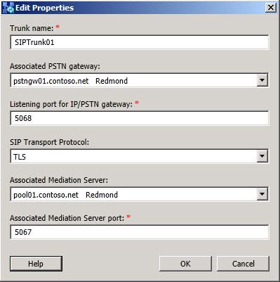

# Trunk Settings Expander

To edit or modify the settings for a SIP trunk, you do the following:

 **Trunk name** is a required entry and uniquely identifies the SIP trunk in the deployment.

 **Associated PSTN gateway**: Select an existing PSTN gateway that has been defined in the deployment.

 **Listening port for IP/PSTN gateway**: Indicates what TCP/IP port the gateway will be listening for requests on. The required value may differ, based on the vendor of the gateway, but the default is port 5067.

 **SIP Transport Protocol**: The protocol used is either TCP or TLS. TLS is the default. Refer to the gateway vendor documentation for what you gateway supports. The default is TLS, and should be considered the more secure selection, if the gateway supports TLS.

 **Associated Mediation Server**: Select an existing Mediation Server from the deployment to associate with the SIP trunk.

> [!NOTE]
> Only the root trunk can be associated with a Mediation Server.

 **Associated Mediation Server port**: A required value, this is set to the value that the Mediation Server is configured to listen on.

## See also

[SIP Trunking Deployment Checklist](https://technet.microsoft.com/library/94f4f03e-19d5-4198-92be-e4076dbb959a.aspx)

[Components and Topologies for SIP Trunking](https://technet.microsoft.com/library/8ed9a9d0-517e-4f36-a131-22cdafa257fa.aspx)
