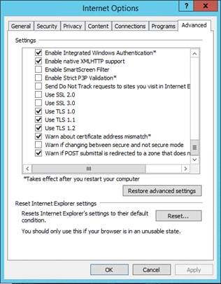
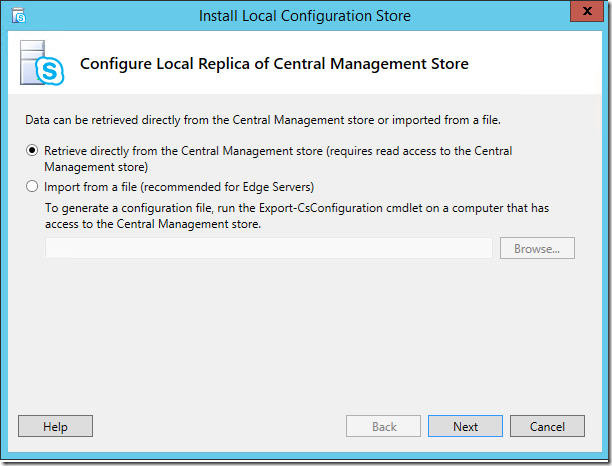
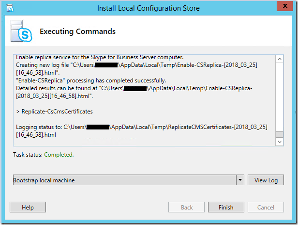
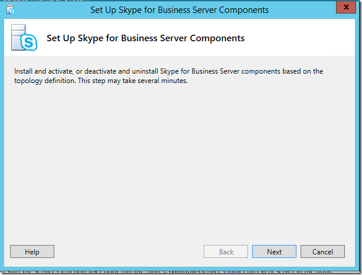

# Disable TLS 1.0/1.1 in Skype for Business Server 2015

The purpose of this article is to provide the necessary guidance for you to prepare for and implement disabling TLS 1.0 and 1.1 in your environments. This process requires extensive planning and preparation. Please carefully review all of the information in this article as you make your plan to disable TLS 1.0 and 1.1 for your organization. Note that there are many external dependencies and connectivity conditions that could be impacted by disabling TLS 1.0/1.1, so extensive planning and testing is warranted.

## In this article

- [Background and scope](#background)
- [Prerequisites and process](#prerequisites-and-process)
- [Advanced deployment scenarios](#advanced-deployment-scenarios)

## Background

The primary drivers for providing TLS 1.0 and 1.1 disable support for Skype for Business Server On-Premises are Payment Card Industry (PCI) Security Standards Council and Federal Information Processing Standards requirements. More information for PCI requirements can be found [here](https://blog.pcisecuritystandards.org/are-you-ready-for-30-june-2018-sayin-goodbye-to-ssl-early-tls).  Microsoft cannot provide guidance on whether or not your organization is required to adhere to these or other requirements. You must determine if it is required for you to disable TLS 1.0 and/or 1.1 in your environments.

Microsoft has produced a white paper on TLS available [here](https://cloudblogs.microsoft.com/microsoftsecure/2017/06/20/tls-1-2-support-at-microsoft/), and we also recommend the background reading available in this [Exchange blog](https://blogs.technet.microsoft.com/exchange/2018/01/26/exchange-server-tls-guidance-part-1-getting-ready-for-tls-1-2/).

## Supportability Scope

*Scope* refers to supportability boundaries. For Skype for Business Server On-Premises, *in scope* means we fully support and have tested disabling of TLS 1.0 and 1.1 for the listed product versions. *Currently being investigated* means just that; we are actively investigating bringing these products into scope for TLS disable support. *Out of scope* means these product versions do not support disabling TLS 1.0 or 1.1 and will not work, with noted exceptions.

### Fully tested and supported servers

- Skype for Business Server 2019
- Skype for Business Server 2015 CU6 HF2 6.0.9319.516 ([March 2018 update](https://support.microsoft.com/en-us/help/4086059/march-2018-cumulative-update-6-0-9319-516-for-skype-for-business)) and higher on: 
    - Windows Server 2012 (with KB 3140245 or superseding update), 2012 R2 or 2016
- In-place Upgraded Skype for Business Server 2015, with CU6 HF2 and higher on 
    - Windows Server 2008 R2, 2012 (with KB [3140245](https://support.microsoft.com/en-us/help/3140245/update-to-enable-tls-1-1-and-tls-1-2-as-a-default-secure-protocols-in) or superseding update), or 2012 R2
- Exchange Connectivity and Outlook Web App with Exchange Server 2010 SP3 RU19 or higher, guidance [here](https://blogs.technet.microsoft.com/exchange/2018/01/26/exchange-server-tls-guidance-part-1-getting-ready-for-tls-1-2/)
- Survivable Branch Appliance (SBA) with Skype for Business Server 2015 CU6 HF2 or higher (confirm with your vendor that they packaged the appropiate updates and have been made available for your appliance)
- Survivable Branch Server (SBS) with Skype for Business Server 2015 CU6 HF2 or higher
- Lync Server 2013 **Edge Role Only**, this is because Edge role does not have a dependency on Windows Fabric 1.0.


### Fully tested and supported clients

- Lync 2013 (Skype for Business) Desktop Client, MSI and C2R, including Basic [15.0.5023.1000 and higher](https://support.microsoft.com/en-us/help/4018334/april-3-2018-update-for-skype-for-business-2015-lync-2013-kb4018334)
- Skype for Business 2016 Desktop Client, MSI [16.0.4678.1000 and higher](https://support.microsoft.com/en-us/help/4018323/april-3-2018-update-for-skype-for-business-2016-kb4018323), including Basic
- Skype for Business 2016 Click to Run Require the [April 2018](https://docs.microsoft.com/officeupdates/release-notes-office365-proplus) Updates: 
    - Monthly and Semi-Annual Targeted, 16\.0\.9126\.2152 and higher
    - Semi-Annual and Deferred Channel, 16\.0\.8431\.2242 and higher
- Skype for Business on Mac 16.15 and higher
- Skype for Business for iOS and Android 6.19 and higher
- Skype Web App 2015 CU6 HF2 and higher (ships with Server)

### Currently being investigated

#### Devices

- Lync Room System (a.k.a. SRSv1)
- Microsoft Teams Rooms
- Surface Hub
- 2015 based Survivable Branch Appliance (SBA) or Survivable Branch Server (SBS)

#### Other

- Call Quality Dashboard (new install after TLS 1.0, 1.1 have been disabled, see below)*
 
### Out of scope

Except where noted, the following products are not in scope for TLS 1.0/1.1 disable support and will not function in an environment where TLS 1.0 and 1.1 have been disabled.  What this means: if you still utilize out-of-scope servers or clients, you must update or remove these if you need to disable TLS 1.0/1.1 anywhere in your Skype for Business Server on-premises deployment.

- Lync Server 2013
- Lync Server 2010
- Windows Server 2008 and lower
- Lync for Mac 2011
- Lync 2013 for Mobile - iOS, iPad, Android or Windows Phone
- Lync "MX" Windows Store client
- All Lync 2010 clients
- Lync Phone Edition - updated guidance [here](https://techcommunity.microsoft.com/t5/Skype-for-Business-Blog/Certified-Skype-for-Business-Online-Phones-and-what-this-means/ba-p/120035).
- 2013 based Survivable Branch Appliance (SBA) or Survivable Branch Server (SBS)
- Cloud Connector Edition (CCE)
- Skype for Business for Windows Phone

### Exceptions

#### Lync Server 2013

Lync Server 2013 takes a dependency on Windows Fabric version 1.0.  In the design phase for Lync Server 2013, Windows Fabric 1.0 was chosen for its compelling and new distributed architecture to provide replication, high availability, and fault tolerance.  Over time, both Skype for Business Server and Windows Fabric have greatly improved this joint architecture with significant re-design in subsequent versions.  Current Skype for Business 2015 Server uses Windows Fabric 3.0, for example.

Unfortunately, Windows Fabric 1.0 **does not support TLS 1.2.  However, we will be updating Lync Server 2013 to work with TLS 1.2**. This will be coming in the next Cumulative Update for Lync Server 2013.  We're providing TLS 1.2 support to enable co-existence, migration, federation, and hybrid scenarios.

If your organization is required to disable TLS 1.0 and 1.1, and you currently use Lync Server 2013, we recommend you begin your planning process, with the possibility you may have to In-place upgrade or Side-by-Side migrate (new pools, move users) to Skype for Business Server 2015 or higher.  Or you may want to accelerate migration to Skype for Business Online.

#### Call Quality Dashboard

On-Premises Call Quality Dashboard currently has a dependency on TLS 1.0 during new install (first time installing into your On-Premises environments).  We are currently investigating this issue and plan to release a fix in the near future.  If you are planning to install CQD and also disable TLS 1.0, we recommend that you complete CQD installation first, and then proceed with TLS 1.0 disabling.

#### Third-party devices

On third-party devices such as 3PIP phones, Video conferencing, Reverse Proxies and Load Balancers, be sure to validate TLS 1.2 supportability, test carefully, and contact the vendor if needed.

### Federation considerations when disabling TLS 1.0/1.1 on Edge servers

You must carefully plan for and consider the impact of disabling TLS 1.0/1.1 on your Edge servers.  Once TLS 1.0 and 1.1 are disabled, you may find that other organizations are no longer be able to federate with your organization.

You may opt to keep TLS 1.0/1.1 enabled on your Edge servers to maintain backward compatibility with non-patched (SfB 2015, Lync 2013) or older (2010) external systems.

Microsoft cannot provide advice or recommendations on whether or not your Edge network (or any network) falls under PCI standard; that must be determined by the individual company.

Skype for Business Online is capable of TLS 1.2 today, so no impact to Hybrid/Federation with Online is expected.

PIC (Public IM Connectivity) to Skype Consumer service: We do not expect disabling TLS 1.0/1.1 to impact [Skype Connectivity](../../deploy/deploy-skype-connectivity.md); Microsoft PIC Gateways are already TLS 1.2 capable.

## Prerequisites and process

Except where noted above, once TLS 1.0 and 1.1 are disabled out-of-scope servers, clients and devices will longer function properly, or at all. This may mean you need to pause and wait for updated guidance from Microsoft. Once you are satisfied that you meet all requirements and have a plan to address gaps, proceed.

At a high level, while Skype for Business Server 2019 is ready for procedure at install, Skype for Business Server 2015 will require that you install CU6 HF2, applying pre-requisite updates to .NET and SQL, deploying prerequisite registry keys, and finally a separate round of OS configuration updates (i.e. disabling TLS 1.0 and 1.1 via registry file import). It is critically important that you complete installation of all prerequisites, including Skype for Business Server 2015 CU6 HF2, prior to disabling TLS 1.0 and 1.1 on any server in your environment. Every Skype for Business server, including Edge role and SQL Backends, requires the updates. Also ensure that all supported (in-scope) clients have been updated to the required minimum versions. Don’t forget to update management workstations as well.

We want to follow the usual order of operations of "inside out" for upgrading Skype for Business servers. Treat Director pools, Persistent chat, and Paired Pools in the same manner you normally would. Order and methods for upgrade are covered [here](topology.md) and [here](https://support.microsoft.com/en-us/help/3061064/updates-for-skype-for-business-server-2015).

### High-level process

1. Test all steps in your lab prior to configuring production servers.
2. Back up and preserve a copy of exported registry on each and every individual server to be updated. You cannot share registries between servers; they contain unique machine-based keys.
3. Upgrade all Skype for Business 2015 servers to CU6 HF2 or higher. (For Skype for Business Server 2019, no CU is needed)
4. Install all prerequisites to all servers.
5. Deploy prerequisite registry keys.
6. Ensure that all in-scope clients are updated.
7. Disable TLS 1.0 and 1.1 via registry import.
8. Validate that workloads are functioning as expected.
    - If problems are encountered, troubleshoot and resolve, or
    - Restore registry from step 2 to re-enable TLS 1.0 and 1.1
9. Validate that only TLS 1.2 is being used.

### Install prerequisites to all servers

Extensive dependency updating is required before you begin to disable TLS 1.0 and 1.1 at the operating system level in your Skype for Business Server 2015 deployments. The following are the minimum versions that can support TLS 1.2. Deploy all prerequisite updates across every Skype for Business server in your environment before you begin disabling TLS 1.0 and 1.1.

- Skype for Business Server 2015 CU6 HF2 6.0.9319.516 ([March 2018 update](https://support.microsoft.com/en-us/help/4086059/march-2018-cumulative-update-6-0-9319-516-for-skype-for-business)) or higher
- [.NET Framework 4.7](https://www.microsoft.com/en-us/download/details.aspx?id=55167) or higher with SchUseStrongCrypto enabled in the registry (provided below)
- SQL must be updated on all Skype for Business 2015 servers and backends. Update Enterprise Edition Pool SQL Backends first, then their respective FEs. 
    - SQL Server 2014 SP1 + CU5 ([link](https://support.microsoft.com/help/3130926)), or higher / SQL Server 2012 SP2 + CU16 or higher/ SQL Server 2014 RTM + CU12 ([link](https://support.microsoft.com/en-us/help/3130923/cumulative-update-12-for-sql-server-2014)) or higher / SQL Server 2014 SP2
    - SQL Server Native Client for SQL Server 2012 ([link](https://www.microsoft.com/en-us/download/details.aspx?id=50402))
    - Microsoft ODBC Driver 11 for SQL Server ([link](https://www.microsoft.com/en-us/download/details.aspx?id=36434)), or higher
    - Shared Management Objects for SQL Server 2014 SP2 ([link](https://www.microsoft.com/en-in/download/details.aspx?id=42295))
    - SQLSysClrTypes for SQL server 2014 SP2 ([link](https://www.microsoft.com/en-in/download/details.aspx?id=42295))

### Basic steps to install pre-requisites, in recommended order of operations

1. Install the Skype for Business Server CU6HF2 (6.0.9319.516) update to all servers. 
    1. Install the update to components using the updater.
    2. Update databases according to documented procedures. Instructions are documented at [https://support.microsoft.com/en-us/help/3061064/updates-for-skype-for-business-server-2015](https://support.microsoft.com/en-us/help/3061064/updates-for-skype-for-business-server-2015).
    3. Validate product functionality in the deployment prior to moving forward with any other changes.
2. Download .NET 4.7 Offline Installer. 
    1. Reference: [https://www.microsoft.com/en-us/download/details.aspx?id=55167](https://www.microsoft.com/en-us/download/details.aspx?id=55167)
    2. Ensure that Skype for Business Server 2015 services are stopped on the Front End server.
    3. Reference: [https://support.microsoft.com/en-us/help/3061064/updates-for-skype-for-business-server-2015](https://support.microsoft.com/en-us/help/3061064/updates-for-skype-for-business-server-2015)
    4. Ex (Standard Edition): Stop-CsWindowsServices
    5. Ex (Enterprise Edition): Invoke-CsComputerFailover
    6. Run the installer package.
    7. Reboot the server.
3. Update SQL Express 2014 on all servers. 
    1. Reference: [https://support.microsoft.com/en-us/help/3135244/tls-1-2-support-for-microsoft-sql-server](https://support.microsoft.com/en-us/help/3135244/tls-1-2-support-for-microsoft-sql-server)
    2. Download SQL 2014 SP2 
        - Reference: [https://www.microsoft.com/en-us/download/details.aspx?id=53168](https://www.microsoft.com/en-us/download/details.aspx?id=53168)
    3. Copy the installation media to a folder on the server (Ex: C:\01_2014SqlSp2)
    4. Ensure Skype for Business Server 2015 services are stopped on the Front End server 
        - Ex (Standard Edition): Stop-CsWindowsService
        - Ex (Enterprise Edition): Invoke-CsComputerFailove
    5. Open an Admin Command Prompt, and upgrade all installed components and instances 
        - Example: C:\01_2014SqlSp2\SQLServer2014SP2-KB3171021-x64-ENU.exe /qs /IAcceptSQLServerLicenseTerms /Action=Patch /AllInstances
4. Update SQL Native Client. 
    1. Reference: [https://support.microsoft.com/en-us/help/3135244/tls-1-2-support-for-microsoft-sql-server](https://support.microsoft.com/en-us/help/3135244/tls-1-2-support-for-microsoft-sql-server).
    2. Download from [https://www.microsoft.com/en-us/download/details.aspx?id=50402](https://www.microsoft.com/en-us/download/details.aspx?id=50402)
    3. Ensure Skype for Business Server 2015 services are stopped on the Front End server. 
        - Ex (Standard Edition): Stop-CsWindowsServices
        - Ex (Enterprise Edition): Invoke-CsComputerFailove
    4. Stop the SQL instances installed from running 
        - Ex: Get-Service 'MSSQL$RTCLOCAL' | Stop-Servic
        - Ex: Get-Service 'MSSQL$LYNCLOCAL' | Stop-Servic
        - Ex (Standard Edition Only): Get-Service 'MSSQL$RTC' | Stop-Servic
    5. Install the update.
5. Update ODBC Driver 11 for SQL Server. 
    1. Reference: [https://support.microsoft.com/en-us/help/3135244/tls-1-2-support-for-microsoft-sql-server](https://support.microsoft.com/en-us/help/3135244/tls-1-2-support-for-microsoft-sql-server).
    2. Download from [https://www.microsoft.com/en-us/download/confirmation.aspx?id=36434](https://www.microsoft.com/en-us/download/confirmation.aspx?id=36434)
    3. Ensure that Skype for Business Server 2015 services are stopped on the Front End server 
        - Ex (Standard Edition): Stop-CsWindowsService
        - Ex (Enterprise Edition): Invoke-CsComputerFailove
    4. Install the update.
6. Deploy prerequisite registry keys.

### Pre-requisite registry keys

Copy/paste the following test into Notepad and rename TLSPreReq.reg or a name of your choice, then import:

```
Windows Registry Editor Version 5.00

[HKEY_LOCAL_MACHINE\SOFTWARE\Microsoft\.NETFramework\v2.0.50727]

"SchUseStrongCrypto"=dword:00000001

[HKEY_LOCAL_MACHINE\SOFTWARE\Microsoft\.NETFramework\v4.0.30319]

"SchUseStrongCrypto"=dword:00000001

[HKEY_LOCAL_MACHINE\SOFTWARE\Wow6432Node\Microsoft\.NETFramework\v2.0.50727]

"SchUseStrongCrypto"=dword:00000001

[HKEY_LOCAL_MACHINE\SOFTWARE\Wow6432Node\Microsoft\.NETFramework\v4.0.30319]

"SchUseStrongCrypto"=dword:00000001

[HKEY_LOCAL_MACHINE\SOFTWARE\Microsoft\Windows\CurrentVersion\Internet Settings\WinHttp]

"DefaultSecureProtocols"=dword:00000AA0

[HKEY_LOCAL_MACHINE\SOFTWARE\Wow6432Node\Microsoft\Windows\CurrentVersion\Internet Settings\WinHttp]

"DefaultSecureProtocols"=dword:00000AA0

[HKEY_LOCAL_MACHINE\SYSTEM\CurrentControlSet\Control\SecurityProviders\SCHANNEL\Protocols\TLS 1.2]

[HKEY_LOCAL_MACHINE\SYSTEM\CurrentControlSet\Control\SecurityProviders\SCHANNEL\Protocols\TLS 1.2\Client]

"DisabledByDefault"=dword:00000000

"Enabled"=dword:00000001

[HKEY_LOCAL_MACHINE\SYSTEM\CurrentControlSet\Control\SecurityProviders\SCHANNEL\Protocols\TLS 1.2\Server]

"DisabledByDefault"=dword:00000000

"Enabled"=dword:00000001
```

For SQL back ends for Enterprise Edition Pools, prerequisites and TLS disable should be treated as any SQL or OS updates would; refer to: [https://docs.microsoft.com/skypeforbusiness/manage/topology/patch-or-update-a-back-end-or-standard-edition-server](https://docs.microsoft.com/skypeforbusiness/manage/topology/patch-or-update-a-back-end-or-standard-edition-server)

While both the prerequisite application and TLS disabling steps can be combined, we strongly recommend all prerequisites be applied before proceeding with disabling of TLS 1.0 and 1.1 at the operating system level. The best practice approach would be to prepare the environment by deploying all prerequisites, validating that workloads all function correctly and as expected, and then proceeding with TLS 1.0/1.1 disable at a later time.

### Disable TLS 1.0 and 1.1 via registry import

Before you proceed with the next steps, *make sure you have completed all prerequisites and updated Skype for Business Servers*.

Copy the following text into a Notepad file and rename it **TLSDisable.reg**:

```
Windows Registry Editor Version 5.00

[HKEY_LOCAL_MACHINE\SOFTWARE\Policies\Microsoft\Cryptography\Configuration\SSL\00010002]

"Functions"="TLS_ECDHE_ECDSA_WITH_AES_256_GCM_SHA384_P384,TLS_ECDHE_ECDSA_WITH_AES_128_GCM_SHA256_P256,TLS_ECDHE_RSA_WITH_AES_256_GCM_SHA384_P384,TLS_ECDHE_RSA_WITH_AES_128_GCM_SHA256_P256,TLS_ECDHE_ECDSA_WITH_AES_256_CBC_SHA384_P384,TLS_ECDHE_ECDSA_WITH_AES_128_CBC_SHA256_P256,TLS_ECDHE_RSA_WITH_AES_256_CBC_SHA384_P384,TLS_ECDHE_RSA_WITH_AES_128_CBC_SHA256_P256,TLS_RSA_WITH_AES_256_GCM_SHA384,TLS_RSA_WITH_AES_128_GCM_SHA256,TLS_RSA_WITH_AES_256_CBC_SHA256,TLS_RSA_WITH_AES_128_CBC_SHA256"

[HKEY_LOCAL_MACHINE\SYSTEM\CurrentControlSet\Control\SecurityProviders\SCHANNEL]

"AllowInsecureRenegoClients"=dword:00000000

"AllowInsecureRenegoServers"=dword:00000000

[HKEY_LOCAL_MACHINE\SYSTEM\CurrentControlSet\Control\SecurityProviders\SCHANNEL\Ciphers]

[HKEY_LOCAL_MACHINE\SYSTEM\CurrentControlSet\Control\SecurityProviders\SCHANNEL\Ciphers\AES 128/128]

"Enabled"=dword:FFFFFFFF

[HKEY_LOCAL_MACHINE\SYSTEM\CurrentControlSet\Control\SecurityProviders\SCHANNEL\Ciphers\AES 256/256]

"Enabled"=dword:FFFFFFFF

[HKEY_LOCAL_MACHINE\SYSTEM\CurrentControlSet\Control\SecurityProviders\SCHANNEL\Ciphers\DES 56/56]

"Enabled"=dword:00000000

[HKEY_LOCAL_MACHINE\SYSTEM\CurrentControlSet\Control\SecurityProviders\SCHANNEL\Ciphers\NULL]

"Enabled"=dword:00000000

[HKEY_LOCAL_MACHINE\SYSTEM\CurrentControlSet\Control\SecurityProviders\SCHANNEL\Ciphers\RC2 128/128]

"Enabled"=dword:00000000

[HKEY_LOCAL_MACHINE\SYSTEM\CurrentControlSet\Control\SecurityProviders\SCHANNEL\Ciphers\RC2 40/128]

"Enabled"=dword:00000000

[HKEY_LOCAL_MACHINE\SYSTEM\CurrentControlSet\Control\SecurityProviders\SCHANNEL\Ciphers\RC2 56/128]

"Enabled"=dword:00000000

[HKEY_LOCAL_MACHINE\SYSTEM\CurrentControlSet\Control\SecurityProviders\SCHANNEL\Ciphers\RC2 56/56]

"Enabled"=dword:00000000

[HKEY_LOCAL_MACHINE\SYSTEM\CurrentControlSet\Control\SecurityProviders\SCHANNEL\Ciphers\RC4 128/128]

"Enabled"=dword:00000000

[HKEY_LOCAL_MACHINE\SYSTEM\CurrentControlSet\Control\SecurityProviders\SCHANNEL\Ciphers\RC4 40/128]

"Enabled"=dword:00000000

[HKEY_LOCAL_MACHINE\SYSTEM\CurrentControlSet\Control\SecurityProviders\SCHANNEL\Ciphers\RC4 56/128]

"Enabled"=dword:00000000

[HKEY_LOCAL_MACHINE\SYSTEM\CurrentControlSet\Control\SecurityProviders\SCHANNEL\Ciphers\RC4 64/128]

"Enabled"=dword:00000000

[HKEY_LOCAL_MACHINE\SYSTEM\CurrentControlSet\Control\SecurityProviders\SCHANNEL\Ciphers\Triple DES 168]

"Enabled"=dword:00000000

[HKEY_LOCAL_MACHINE\SYSTEM\CurrentControlSet\Control\SecurityProviders\SCHANNEL\Hashes]

[HKEY_LOCAL_MACHINE\SYSTEM\CurrentControlSet\Control\SecurityProviders\SCHANNEL\Hashes\MD5]

"Enabled"=dword:00000000

[HKEY_LOCAL_MACHINE\SYSTEM\CurrentControlSet\Control\SecurityProviders\SCHANNEL\Hashes\SHA]

"Enabled"=dword:FFFFFFFF

[HKEY_LOCAL_MACHINE\SYSTEM\CurrentControlSet\Control\SecurityProviders\SCHANNEL\Hashes\SHA256]

"Enabled"=dword:FFFFFFFF

[HKEY_LOCAL_MACHINE\SYSTEM\CurrentControlSet\Control\SecurityProviders\SCHANNEL\Hashes\SHA384]

"Enabled"=dword:FFFFFFFF

[HKEY_LOCAL_MACHINE\SYSTEM\CurrentControlSet\Control\SecurityProviders\SCHANNEL\Hashes\SHA512]

"Enabled"=dword:FFFFFFFF

[HKEY_LOCAL_MACHINE\SYSTEM\CurrentControlSet\Control\SecurityProviders\SCHANNEL\KeyExchangeAlgorithms]

[HKEY_LOCAL_MACHINE\SYSTEM\CurrentControlSet\Control\SecurityProviders\SCHANNEL\KeyExchangeAlgorithms\Diffie-Hellman]

"Enabled"=dword:FFFFFFFF

[HKEY_LOCAL_MACHINE\SYSTEM\CurrentControlSet\Control\SecurityProviders\SCHANNEL\KeyExchangeAlgorithms\ECDH]

"Enabled"=dword:FFFFFFFF

[HKEY_LOCAL_MACHINE\SYSTEM\CurrentControlSet\Control\SecurityProviders\SCHANNEL\KeyExchangeAlgorithms\PKCS]

"Enabled"=dword:FFFFFFFF

[HKEY_LOCAL_MACHINE\SYSTEM\CurrentControlSet\Control\SecurityProviders\SCHANNEL\Protocols]

[HKEY_LOCAL_MACHINE\SYSTEM\CurrentControlSet\Control\SecurityProviders\SCHANNEL\Protocols\Multi-Protocol Unified Hello]

[HKEY_LOCAL_MACHINE\SYSTEM\CurrentControlSet\Control\SecurityProviders\SCHANNEL\Protocols\Multi-Protocol Unified Hello\Client]

"DisabledByDefault"=dword:00000001

"Enabled"=dword:00000000

[HKEY_LOCAL_MACHINE\SYSTEM\CurrentControlSet\Control\SecurityProviders\SCHANNEL\Protocols\Multi-Protocol Unified Hello\Server]

"DisabledByDefault"=dword:00000001

"Enabled"=dword:00000000

[HKEY_LOCAL_MACHINE\SYSTEM\CurrentControlSet\Control\SecurityProviders\SCHANNEL\Protocols\PCT 1.0]

[HKEY_LOCAL_MACHINE\SYSTEM\CurrentControlSet\Control\SecurityProviders\SCHANNEL\Protocols\PCT 1.0\Client]

"DisabledByDefault"=dword:00000001

"Enabled"=dword:00000000

[HKEY_LOCAL_MACHINE\SYSTEM\CurrentControlSet\Control\SecurityProviders\SCHANNEL\Protocols\PCT 1.0\Server]

"DisabledByDefault"=dword:00000001

"Enabled"=dword:00000000

[HKEY_LOCAL_MACHINE\SYSTEM\CurrentControlSet\Control\SecurityProviders\SCHANNEL\Protocols\SSL 2.0]

[HKEY_LOCAL_MACHINE\SYSTEM\CurrentControlSet\Control\SecurityProviders\SCHANNEL\Protocols\SSL 2.0\Client]

"DisabledByDefault"=dword:00000001

"Enabled"=dword:00000000

[HKEY_LOCAL_MACHINE\SYSTEM\CurrentControlSet\Control\SecurityProviders\SCHANNEL\Protocols\SSL 2.0\Server]

"DisabledByDefault"=dword:00000001

"Enabled"=dword:00000000

[HKEY_LOCAL_MACHINE\SYSTEM\CurrentControlSet\Control\SecurityProviders\SCHANNEL\Protocols\SSL 3.0]

[HKEY_LOCAL_MACHINE\SYSTEM\CurrentControlSet\Control\SecurityProviders\SCHANNEL\Protocols\SSL 3.0\Client]

"DisabledByDefault"=dword:00000001

"Enabled"=dword:00000000

[HKEY_LOCAL_MACHINE\SYSTEM\CurrentControlSet\Control\SecurityProviders\SCHANNEL\Protocols\SSL 3.0\Server]

"DisabledByDefault"=dword:00000001

"Enabled"=dword:00000000

[HKEY_LOCAL_MACHINE\SYSTEM\CurrentControlSet\Control\SecurityProviders\SCHANNEL\Protocols\TLS 1.0]

[HKEY_LOCAL_MACHINE\SYSTEM\CurrentControlSet\Control\SecurityProviders\SCHANNEL\Protocols\TLS 1.0\Client]

"DisabledByDefault"=dword:00000001

"Enabled"=dword:00000000

[HKEY_LOCAL_MACHINE\SYSTEM\CurrentControlSet\Control\SecurityProviders\SCHANNEL\Protocols\TLS 1.0\Server]

"DisabledByDefault"=dword:00000001

"Enabled"=dword:00000000

[HKEY_LOCAL_MACHINE\SYSTEM\CurrentControlSet\Control\SecurityProviders\SCHANNEL\Protocols\TLS 1.1]

[HKEY_LOCAL_MACHINE\SYSTEM\CurrentControlSet\Control\SecurityProviders\SCHANNEL\Protocols\TLS 1.1\Client]

"DisabledByDefault"=dword:00000001

"Enabled"=dword:00000000

[HKEY_LOCAL_MACHINE\SYSTEM\CurrentControlSet\Control\SecurityProviders\SCHANNEL\Protocols\TLS 1.1\Server]

"DisabledByDefault"=dword:00000001

"Enabled"=dword:00000000
```

Import the .reg file on each server you wish to disable TLS 1.0 and 1.1. Reboot the server. Once the services have come back online, move to the next server. The approach for Enterprise Edition Pools is the same you would take for any OS update.

You may have noticed we are doing more than just disabling TLS 1.0 and 1.1 here. We are supporting Cipher Suite re-order (as shown above) and the disabling of some older weak ciphers. This is the first time we have officially supported these changes to SCHANNEL and Crypto API on Skype for Business Server, and it is important to note that these changes are the only ones we support and have tested at this time. We may consider additional configurations in the future, but for now, please do not modify the registry import file in your implementation.

### Validate that workloads are functioning as expected

Once TLS 1.0 and 1.1 have been disabled in your environment, ensure that all your main workloads are functioning as expected, such as IM & Presence, P2P calls, Enterprise Voice, etc.

**Validate only TLS 1.2 is being used**

Have your Security Team perform a new audit of Skype for Business traffic to ensure that the older protocols TLS 1.0 and 1.1 are no longer in use.

Alternatively, you can use Internet Explorer to test TLS connections to web services from Skype for Business Server 2015 after TLS 1.0 and TLS 1.1 have been disabled.

1. Launch Internet Explorer.
2. Select **Tools** > **Internet Options**.
3. Select the **Advanced** tab.
4. Under **Settings**, scroll to the bottom.
5. Verify that TLS 1.0, TLS 1.1, and TLS 1.2 are enabled.
6. Browse the Internal Web Service URL of your SfB 2015 pool (should connect successfully).
7. Go back into Internet Explorer and disable the option to **Use TLS 1.2** only.
8. Browse the Internal Web Service URL of your SfB 2015 pool again (should fail to connect).



## Advanced deployment scenarios

Because some dependency prerequisites are required to support TLS 1.2 in Skype for Business Ser 2015, installing from RTM media will fail on any system where TLS 1.0 and 1.1 have been disabled.

**Deploying New Standard Edition Servers or Enterprise Edition Pools once TLS 1.0 and 1.1 have been disabled in your environment.**

**Option 1:** Use [SmartSetup](../../deploy/install/install-skype-for-business-server.md). Note that we are updating SmartSetup to accommodate the updated SQL binaries in a future CU, and will update this article in the future.

**Option 2:** Pre-install local SQL instances (RTCLOCAL and LYNCLOCAL)

1. Download and copy SQL Express 2014 SP2 (SQLEXPR_x64.exe) to local folder on FE. Let’s say folder path <SQL_FOLDER_PATH>.
2. Launch PowerShell or Command Prompt and navigate to <SQL_FOLDER_PATH>.
3. Create the RTCLOCAL SQL instance by running the command below. Wait until SQLEXPR_x64.exe finishes before proceeding:

    SQLEXPR_x64.exe  /Q /IACCEPTSQLSERVERLICENSETERMS /UPDATEENABLED=0 /HIDECONSOLE /ACTION=Install /FEATURES=SQLEngine,Tools /INSTANCENAME=RTCLOCAL /TCPENABLED=1 /SQLSVCACCOUNT="NT AUTHORITY\NetworkService" /SQLSYSADMINACCOUNTS="Builtin\Administrators" /BROWSERSVCSTARTUPTYPE="Automatic" /AGTSVCACCOUNT="NTAUTHORITY\NetworkService" /SQLSVCSTARTUPTYPE=Automati
1. Create the LYNCLOCAL SQL instance by running the command below. Wait until SQLEXPR_x64.exe finishes before proceeding to the next step:

    SQLEXPR_x64.exe /Q /IACCEPTSQLSERVERLICENSETERMS /UPDATEENABLED=0 /HIDECONSOLE /ACTION=Install /FEATURES=SQLEngine,Tools /INSTANCENAME=LYNCLOCAL /TCPENABLED=1 /SQLSVCACCOUNT="NT AUTHORITY\NetworkService" /SQLSYSADMINACCOUNTS="Builtin\Administrators" /BROWSERSVCSTARTUPTYPE="Automatic" /AGTSVCACCOUNT="NTAUTHORITY\NetworkService" /SQLSVCSTARTUPTYPE=Automatic
1. Run Skype for Business Server 2015 RTM setup.
2. Follow the remaining steps from the prerequisites section above.

**Option 3:** You may also manually replace binaries in a local installation media directory as follows:

1. [Install prerequisites for Skype for Business Server](../../deploy/install/install-prerequisites.md)  
2. 2. Install .NET 4.7: 
      - **Note:** We first introduced support for .NET 4.7 in Skype for Business Server 2015 CU5+ (6.0.9319.281). Therefore, in later steps below we will be updating Core Components prior to the main install.
      - Download: https://www.microsoft.com/en-us/download/details.aspx?id=55167.
      - Reference: [Software that should be installed before a Skype for Business Server 2015 deployment](../../plan-your-deployment/requirements-for-your-environment/server-requirements.md#software-that-should-be-installed-before-a-skype-for-business-server-2015-deployment)
3. Copy ISO Files/Folders: 
    - With the Skype for Business Server 2015 ISO attached, open the root directory of the drive it is attached as (Ex: D:\) in File Explorer.
    - Copy all folders and files to a folder on a local disk (Ex: C:\SkypeForBusiness2015ISO).
    - **Note:** Prior to installing components, some files will need to be updated for support of TLS 1.2.
4. Replace MSI/EXE Packages: 
    - Replace the existing MSI and EXE packages in the /Setup/amd64/ folder of the installation media on the local machine.
    - SQL 2014 SP2 Express: https://www.microsoft.com/en-us/download/details.aspx?id=53167 
        - Rename to SQLEXPR_x64 on the local machine, and replace the existing file in the Setup/amd64/ folder of the installation media.
    - SQL Native Client: https://www.microsoft.com/en-us/download/details.aspx?id=50402 
        - **Note:** Rename this if necessary to sqlncli.msi, and then replace the existing file that exists in the Setup/amd64/ folder of the installation media.
    - SQL Management Objects: https://www.microsoft.com/en-us/download/details.aspx?id=53164 
        - **Note:** The Feature pack will have a lot of items that can be downloaded. Select to download SharedManagementObjects.msi only.
        - **Note:** Replace the existing file that exists in the Setup/amd64/ folder of the installation media.
    - SQL CLR Types: https://www.microsoft.com/en-us/download/details.aspx?id=53164 
        - **Note:** The Feature pack will have a lot of items that can be downloaded. Select to download CQLSysClrTypes.msi only
        - **Note**: Replace the existing file that exists in the Setup/amd64/ folder of the installation media.
5. Install Core Components: 
    - Run Setup.exe from the Setup/amd64/ folder of the installation media. Follow the instructions to install Core Components
    - Close Core Components.
6. Update Core Components: 
    - Download the Skype for Business Update Installer.
    - Run the installer to update Core Components and install the performance counters.
    - **Note:** As of the release of CU6HF2, the auto-update feature currently only will install up to CU6. Therefore, the updater must be run separately to update Core Components to 6.0.9319.516.
    - Reference: https://support.microsoft.com/en-us/help/3061064/updates-for-skype-for-business-server-2015
7. Install Administrative Tools (Optional): 
    - This will install the Microsoft SQL Server 2012 Native Client, SQL Server 2014 Management Objects (x64), and Microsoft System CLR Types for SQL Server 2014 (x64) using the updated files. Additionally, the Skype for Business Server 2015 Topology Builder and Control Panel will be available on the local machine.
8. Install Local Configuration Store (Step 1): 
     - Open the Deployment Wizard, click Install or Update Skype for Business Server System, and click on **Run** at Step 1: Install Local Configuration Store.
     - Click **Next** in the **Install Local Configuration Store** dialog box.
     
     - Review the results, and ensure that the Task Status is Completed. Review the resulting log file by clicking **View Log**.
     
     - Click **Finish**.
9. Set up or remove Skype for Business Server Components (Step 2):
    - Open the Deployment Wizard, click **Install or Update Skype for Business Server System**, and click **Run** at Step 2: Set up or Remove Skype for Business Server Components
    - Click **Next** in the Set Up Skype for Business Server Components dialog box.
    
    - Review the log using View Log, and validate that setup completed without issues. 
    - Click **Finish**.
10. Proceed with additional installation and configuration as required (you can resume normal installation procedures at this point).
