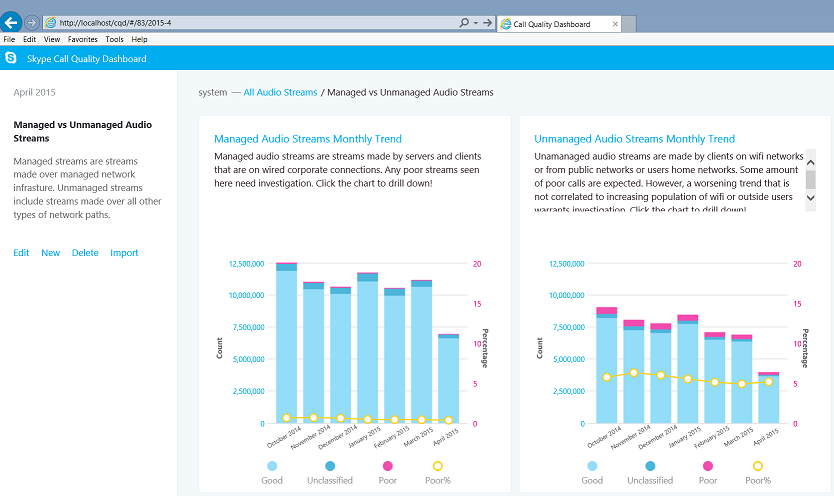
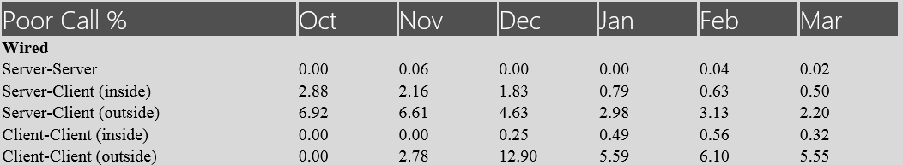
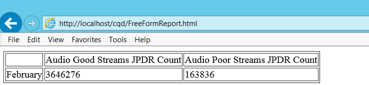
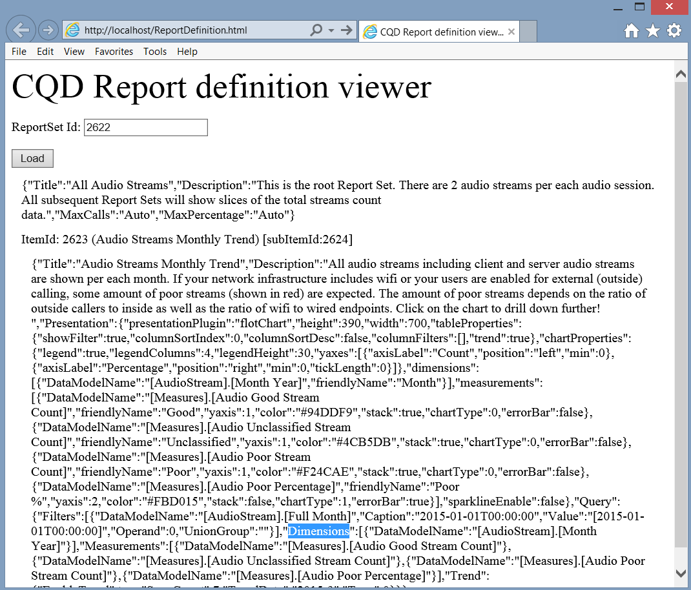

# CQD Development Samples

**Summary:** Review a tutorial and development samples for Call Quality Dashboard. Call Quality Dashboard is a tool for Skype for Business Server.

This article provides a tutorial and samples on development for Call Quality Dashboard (CQD).

## Call Quality Dashboard (CQD) Development Samples

Tutorial: Building Customized Report Presentation using the CQD Data Service and Repository Service API's.

### Introduction to CQD

CQD offers quick and easy access to aggregated call quality information for on-premise Skype for Business Server deployments. CQD consists of three components: the QoE Archive database, the Cube, and the Portal. The Portal is the main presentation layer and can be further divided into the following three components:

1. Data Service, which is accessible for authenticated users through the [Data API for Call Quality Dashboard (CQD) in Skype for Business Server](data-api.md).

2. Repository Service, which is accessible for authenticated users through the [Repository API for Call Quality Dashboard (CQD) in Skype for Business Server](repository-api.md).

3. Web portal, which is the HTML5 based interface that CQD users see and interact with. This is accessible for authenticated users.

The reports shown on the web portal are grouped into "report sets". The figure shows a report set with two reports. Each report in this dashboard below shows query results on number of good calls, poor calls and poor call percentage for several months, with various filters applied. 



CQD is created following the Call Quality Methodology (CQM), so the default set of reports is designed to align with the investigation flow introduced by CQM. Users also have the flexibility to edit or create custom reports to meet their needs. However, since there are multiple ways to visualize the data, the visualization provided by CQD may not fully address the needs of every user. In such situations, a user can leverage the Data APIs and Repository APIs to create custom report pages. We will go through a series of examples in this tutorial.

### How the dashboard consumes the data service

When navigating to the CQD homepage (e.g. http://localhost/cqd), the report set and corresponding reports for an authenticated and authorized user will be retrieved from the Repository Service. A full URL will be constructed from the report-set ID and the year-month (report-set ID is the integer number after '/#/' section in URL, and by default the current year-month is appended at the end of the report-set ID after the slash). The report definitions are stored in JSON format and when retrieved from the Repository Service, will then be used as input to the Data Service. The Data Service generates Multi-Dimension expressions (MDX) queries based on the input and then run these MDX queries against the Cube to retrieve data for each report. 

### Building customized reports

CQD already has a lot of flexibility in customizing reports, but there could be situations where users may want to aggregate data across multiple reports created in CQD. For example, there could be a need to create a report that shows the poor call percentages of all possible combinations of wired calls in a table (a result like the figure):



Using the Portal provided by CQD, a user would have to navigate to multiple reports to extract and record the poor call % for each one, which can be laborious if there are many data points that need to be collected. The Data APIs provide users with a programmatic way to accomplish this, by retrieving data from the Data Service (e.g. via AJAX calls). 

 **Example 1: Simple report sample**

Let us take a simple example first. If we want to show the Audio Good Stream and the Audio Bad stream count of February 2015 on an HTML page like the figure:



What we need is to send a call to the Data Service with the proper parameters, and show the query results in an HTML table. The following is a sample of the JavaScript code:

```        
$($.fn.freeFormReport = function (queries, urlApi, presentation) {
            var query = {
                Dimensions: [{ DataModelName: '[StartDate].[Month]' }],
                Filters: [{
                    DataModelName: '[StartDate].[Month]',
                    Value: '[2015-02-01T00:00:00]',
                    Operand: 0
                }],
                Measurements:
                    [{ DataModelName: '[Measures].[Audio Good Streams JPDR Count]' },
                     { DataModelName: '[Measures].[Audio Poor Streams JPDR Count]' },]
            };            

            $.ajax({
                url: 'http://localhost/QoEDataService/RunQuery',
                data: JSON.stringify(query),
                type: 'POST',
                async: true,
                contentType: 'application/json;charset=utf-8',
                success: function (data) {
                    //This is the jQuery syntax for document.GetElementById()
                    $('#AudioGoodStreamsJPDRCount').html(data.DataResult[0][1]);
                    $('#AudioPoorStreamsJPDRCount').html(data.DataResult[0][2]);
                }
                error: function (error) {
                    alert('Error getting data, check that the data service is running and that the URL is correct.');
           }
            });
        });
```

This example can be further deconstructed into three steps:

1. Construct the query (in the example this is defined in the variable 'query'). The query is defined as a JSON object, which includes the following data:

   a. Zero or more dimensions. Each dimension is indicated by a DataModelName.

   b. Zero or more filters. Each filter has:

   - DataModelName (the dimension that will have the filter set).

   - Value (the value that will be compared by the operand).

   - Operand (comparison type, 0 means "Equal").

     c. One or more measurements.

2. Send the query to Data Service via AJAX call. The following request parameters need to be provided:

   a. url (which should be http://[ServerName]/QoEDataService/RunQuery).

   b. data (this is the string representation of the JSON object defined in the 'query' variable). Data Service will return the query results as a parameter of the call back function for success.

   c. type (for QoEDataService, RunQuery only accepts 'POST' requests).

   d. async (a flag indicating whether the AJAX call should be synchronous or asynchronous).

   e. contentType (should be "application/json").

   f. success (call-back function for when the AJAX call finishes successfully).

   g. error (error handling function for when AJAX call fails).

3. Put data into div elements in the HTML (in the example in the code, this is done via the anonymous function call after the AJAX request is completed successfully).

Enclosing the JavaScript code into an HTML page, and the page will show a report like the one shown in the figure. The full html is as follows:

```
<!DOCTYPE html>
<html xmlns="http://www.w3.org/1999/xhtml">
<head>
</head>
<body>
    <script src="OpenSourceSoftware/Scripts/jquery-2.1.1.js"></script>

    <script>
        $($.fn.freeFormReport = function (queries, urlApi, presentation) {

            var query = {
                Dimensions: [{ DataModelName: '[StartDate].[Month]' }],
                Filters: [{
                    DataModelName: '[StartDate].[Month]',
                    Value: '[2015-02-01T00:00:00]',
                    Operand: 0
                }],
                Measurements:
                    [{ DataModelName: '[Measures].[Audio Good Streams JPDR Count]' },
                     { DataModelName: '[Measures].[Audio Poor Streams JPDR Count]' },]
            };            

            $.ajax({
                url: 'http://localhost/QoEDataService/RunQuery',
                data: JSON.stringify(query),
                type: 'POST',
                async: true,
                contentType: 'application/json;charset=utf-8',
                success: function (data) {
                    //This is the jQuery syntax for document.GetElementById()
                    $('#AudioGoodStreamsJPDRCount').html(data.DataResult[0][1]);
                    $('#AudioPoorStreamsJPDRCount').html(data.DataResult[0][2]);
                }
                error: function (error) {
                    alert('Error getting data, check that the data service is running and that the URL is correct.');
           }

            });
        });
    </script>
    <table border="1">
        <tr>
            <td></td>
            <td><div>Audio Good Streams JPDR Count</div></td>
            <td><div>Audio Poor Streams JPDR Count</div></td>
        </tr>
        <tr>
            <td>February</td>
            <td><div id="AudioGoodStreamsJPDRCount"></div></td>
            <td><div id="AudioPoorStreamsJPDRCount"></div></td>
        </tr>
    </table>
</body>
</html>
```

So far, the report is still very simple. The user can add more measurements, dimensions, or filters to customize the report. For example, if you want to show AppSharing poor call percentage, then a new measurement regarding AppSharing needs to be added. If you want to show all TCP calls v.s. UDP calls, a new dimension regarding transportation type should be added. If you want to show the number of poor calls within a specific building, then a new filter should be added to select the calls to and from that building.

 **Example 2: Report definition sample**

It might be difficult for someone to figure out how to write the full list of measurements/dimensions/filters and their corresponding values when constructing a query. In this case, you can go to the Portal, build a report using the report editor, and view the JSON string of the report definition, and then copy the definition into a custom report. 

In this example, we will create a web page like the one shown in the figure where a user can enter the ID of any existing report set (or report) and show the definition of the report set or report on the web page. The user can then plug the JSON string of each report into code similar to the one shown in Example 1 and construct any customized report the user desires. 



To create the report definition viewer tool, we need to send calls to Repository Service to retrieve the JSON string representations of the definitions of every report-set we want. The Repository API will return report-set definition based on a given report set ID. 

A quick example is as follows, the code contains a block that is a simple example to send a query to the Repository service to get the contents of a repository item based on its identifier. And the next portion of code (processReportSetData method) is sending AJAX calls to get the definition of each report within that report set. Since the ID in the CQD web portal is the ID of a report set, the AJAX call will return a report set item. More detail on the Repository API and specifically, GetItems, can be found in the [Get Items](get-items.md). 

```
<!DOCTYPE html>
<html lang="en">
<head>
    <meta charset="utf-8" />
    <meta http-equiv='cache-control' content='no-cache'>
    <meta http-equiv='expires' content='0'>
    <meta http-equiv='pragma' content='no-cache'>
    <meta http-equiv="X-UA-Compatible" content="IE=edge">
    <meta http-equiv="x-content-type-options" content="nosniff">
    <title>CQD Report definition viewer</title>
</head>
<body>    
    <div style="font-size:32pt">CQD Report definition viewer</div>
        <p>ReportSet Id: <input id="reportSetId" /></p>
        <button onclick='loadReportSet()'>Load</button>
        <div id="Report"></div>
    <!-- Third party Libraries -->
    <script src="OpenSourceSoftware/Scripts/jquery-2.1.1.js"></script>

    <script>
        var urlRepositoryApi = 'http://localhost/QoERepositoryService/repository/item/';

        var loadReportSet = function ()
        {
            var reportSetId = document.getElementById('reportSetId').value;

            $.ajax({
                url: urlRepositoryApi + reportSetId,
                data: '',
                type: 'GET',
                async: false,
                contentType: 'application/json;charset=utf-8',
                success: function (data) {
                    var reportSetDiv = document.getElementById('Report');
                    reportSetDiv.innerHTML = '';
                    processReportSetData(reportSetDiv, data);
                },
                error: function (error) {
                    alert('Error getting Report, check that the qoe data service is running and url is correct.');
                }
            });
        };

        var processReportSetData = function (divReportSet, reportSetDef) {
             //show the report set definition like Title, Description, etc
            showReportSetDefinition(divReportSet, reportSetDef);

            //for each Report in the Reportset, get the Report definition from the Repository Service
            for (var i = 0; i < reportSetDef.subItemIds.length; i++)
            {
                //the reportId is in the subItemIds array.  This is not shown in the CQD UI at all
                var reportId = reportSetDef.subItemIds[i];

                var divReport = document.createElement('div');
                divReport.style.margin = '12px';                
                divReportSet.appendChild(divReport);

                //retrieve the report definition with the reportId
                $.ajax({
                    url: urlRepositoryApi + reportId,
                    data: '',
                    type: 'GET',
                    async: false,
                    contentType: 'application/json;charset=utf-8',
                    success: function (reportData) {
                        processReportData(divReport, reportData, reportId);
                    },
                    error: function (error) {
                        alert('Error getting Report ' + reportId.toString() + ', check that the qoe data service is running and url is correct.');
                    }
                });
            }
        };

        //helper function to render the ReportSet definition
        var showReportSetDefinition = function (divReportSet, reportSetDef) {
            var div = document.createElement('div');
            ReportSetDefinition = reportSetDef.content;
            txt = document.createTextNode(ReportSetDefinition);
            div.style.margin = '12px';
            div.appendChild(txt);
            divReportSet.appendChild(div);
        };

        //show the report definition
        var processReportData = function (divReport, reportData, itemId) {
            if (divReport != undefined &amp;&amp; reportData.content != undefined) {
                var Report = JSON.parse(reportData.content);

                var divReportId = document.createElement('div');
                var subItemId = reportData.subItemIds.length > 0 ? reportData.subItemIds[0].toString() : 'none';
                divReportId.innerHTML = 'ItemId: ' + itemId.toString() + ' (' + Report.Title + ') [subItemId:' + subItemId + ']';
                divReport.appendChild(divReportId);

                var divReportDef = document.createElement('div');
                txt = document.createTextNode(JSON.stringify(Report));
                divReportDef.style.margin = '12px';
                divReportDef.appendChild(txt);                            
                divReport.appendChild(divReportDef);
            }
        };
    </script>
</body>
</html>
```

The above will result in a web page like the one in the figure (without the report definition upon initial visit). Get the report set ID from CQD portal (it is after '/#/' sign in CQD portal URL (E.g. in the first figure the report set ID is 3024), and put this report set ID into the input section of this web page. Press the "load" button and see the full definition (measurements, dimensions, filters lists) of the report set.

In summary, in order to quickly get the full definition of a report/report set. The steps are:

1. Go to the Portal and use the query editor to customize a report (click the "Edit" button above a report to edit, add, remove measurements/dimensions/filters, and then save the report).

2. Get the report set ID from URL (the integer after '/#/' sign in URL).

3. Launch this Report Definition web page created in Example 2, and enter the report set ID and retrieve the full definition of a report set (to use in Data API calls).

   **Example 3: Scorecard sample**

Time for a more complicated task. What if we want to create a web page like the figure? We need to update Example 1, (with the help of the web page generated in Example 2 to retrieve the full definition of any report) so that we can handle larger amount of data.

In this case, we need to update the measurement and dimension list. The way to figure out how to add/edit a measurement and/or a dimension is to follow the instructions in Example 2, and retrieve the full report definition, including the full measurement and dimension lists. Plug the full report definition into the sample code. 

Here are the detailed steps to get to the scorecard page in the figure from the sample provided in Example 1:

1. Update Measurements in the 'query' variable from  `[Measures].[Audio Good Streams JPDR Count]` and `[Measures].[Audio Poor Streams JPDR Count]` to `[Measures].[AudioPoorJPDRPercentage]`. 

2. Update the filters. The JSON data for Filters in Example 1 has one filter, which is set on the dimension  `[StartDate].[Month]`. Since Filters is a JSON array, additional dimensions can be added to the list of filters. For example, to get the server-client inside wired calls for the "currentMonth", we should have the following filters:

   ```
   Filters: [
     { DataModelName: '[StartDate].[Month]', Value: currentMonth, Operand: 0 },
    {
        "DataModelName": "[Scenarios].[ScenarioPair]",
         "Caption": " Server-Inside-wired,Client-Inside-wired",
         "Value": "[1]&amp;[0]&amp;[1]&amp;[1]&amp;[Wired]&amp;[Wired]",
         "Operand": 0,
         "UnionGroup": ""
     },

     { DataModelName: '[StreamType].[StreamType]', Caption: "Valid", Value: "[False]", Operand: 0, UnionGroup: "" }
   ],
   ```

   Here the dimension  `[Scenarios].[ScenarioPair]` is set to equal `[1]&amp;[0]&amp;[1]&amp;[1]&amp;[Wired]&amp;[Wired]`. The  `[Scenario.][ScenarioPair]` is a special dimension created to simplify report creation. It has six values corresponding to `[FirstIsServer], [SecondIsServer], [FirstInside], [SecondIsServer], [FirstConnectionType], [SecondConnectionType]`. So instead of using a combination of 6 filters to define a scenario, we only need to use 1 filter. In our example, the value  `[1]&amp;[0]&amp;[1]&amp;[1]&amp;[Wired]&amp;[Wired]` translates to the scenario where: first is server, second is not server, first is inside, second is inside, first connection type is wired, and second connection type is wired, which is the exact definition of "Server-Client-Inside Wired".

3. Create one filter set per scenario. Each row in the scorecard, in the figure, represents a different scenario, which will be a different filter (while the dimensions and measurements stay the same). 

4. Parse the results from the AJAX calls and place them in the correct position of the table. Since this is mostly HTML and JavaScript manipulation, we will not go into the details here. Instead, the code is provided in Appendix A.

    > [!NOTE]
    >  If Cross-Origin Resource Sharing (CORS) is enabled, users may encounter errors like "No 'Access-Control-Allow-Origin' header is present on the requested resource. Origin 'null' is therefore not allowed access". To resolve the issue, place the HTML file under the folder where the Portal is installed (by default, it should be `%SystemDrive%\Program Files\Skype for Business 2015 CQD\CQD)`. Then access the html through any browser with the URL  `http://<servername>/cqd/<html_file_name>`. (The default URL for local CQD dashboard is  `http://<servername>/cqd.`) 

### Appendix A

HTML code for Example 3 (Scorecard sample):

```
<!DOCTYPE html>
<html xmlns="http://www.w3.org/1999/xhtml">
<head>
    <meta charset="utf-8" />
    <meta http-equiv='cache-control' content='no-cache'>
    <meta http-equiv='expires' content='0'>
    <meta http-equiv='pragma' content='no-cache'>
    <meta http-equiv="X-UA-Compatible" content="IE=edge">
    <title>Scoreboard Sample</title>

    <style>
        .row {
            margin-right: -15px;
            margin-left: -15px;
            display: table-row;
        }
        .col-md-3 {
            width: 25%;
            display: table-cell;
        }
        .col-md-2 {
            width: 16.66666667%;
            display: table-cell;
        }
        .col-md-1 {
            width: 8.33333333%;
            display: table-cell;
        }

    </style>
</head>
<body>    

    <!-- Third party Libraries -->
    <script src="OpenSourceSoftware/Scripts/jquery-2.1.1.js"></script>

    <table id="ScoreCardTable" style="margin:100px">
        <tr>
            <td width="250px" style="text-align: center; font-size: 24px; font-family: 'Segoe UI'; font-weight: lighter; color: white; background-color: #505050">
                <div style="margin:10px">Scoreboard Sample</div>
            </td>
            <td width="1200px">
                <div style="margin:10px;background-color:#D9D9D9" >
                    <div class="row" id="Header" style="font-size:24px;font-family:'Segoe UI';font-weight:lighter;color:white;background-color:#505050">
                        <div class="col-md-3">Poor Call %</div>
                        <div class="col-md-1">Month1</div>
                        <div class="col-md-1">Month2</div>
                        <div class="col-md-1">Month3</div>
                        <div class="col-md-1">Month4</div>
                        <div class="col-md-1">Month5</div>
                        <div class="col-md-1">Month6</div>
                    </div>                    
                    <div class="row"><div class="col-md-3" style="font-weight:bold">Wired</div></div>
                    <div class="row" id="SS"><div class="col-md-3">Server-Server</div><div class="col-md-1"></div><div class="col-md-1"></div><div class="col-md-1"></div><div class="col-md-1"></div><div class="col-md-1"></div><div class="col-md-1"></div></div>
                    <div class="row" id="SWI"><div class="col-md-3">Server-Client (inside)</div><div class="col-md-1"></div><div class="col-md-1"></div><div class="col-md-1"></div><div class="col-md-1"></div><div class="col-md-1"></div><div class="col-md-1"></div></div>
                    <div class="row" id="SWO"><div class="col-md-3">Server-Client (outside)</div><div class="col-md-1"></div><div class="col-md-1"></div><div class="col-md-1"></div><div class="col-md-1"></div><div class="col-md-1"></div><div class="col-md-1"></div></div>
                    <div class="row" id="WWI"><div class="col-md-3">Client-Client (inside)</div><div class="col-md-1"></div><div class="col-md-1"></div><div class="col-md-1"></div><div class="col-md-1"></div><div class="col-md-1"></div><div class="col-md-1"></div></div>
                    <div class="row" id="WIWO"><div class="col-md-3">Client-Client (outside)</div><div class="col-md-1"></div><div class="col-md-1"></div><div class="col-md-1"></div><div class="col-md-1"></div><div class="col-md-1"></div><div class="col-md-1"></div></div>
                    <div class="row"><div class="col-md-3" style="font-weight:bold">Wireless</div></div>
                    <div class="row" id="SWFI"><div class="col-md-3">Server-Client (inside)</div><div class="col-md-1"></div><div class="col-md-1"></div><div class="col-md-1"></div><div class="col-md-1"></div><div class="col-md-1"></div><div class="col-md-1"></div></div>
                    <div class="row" id="SWFO"><div class="col-md-3">Server-Client (outside)</div><div class="col-md-1"></div><div class="col-md-1"></div><div class="col-md-1"></div><div class="col-md-1"></div><div class="col-md-1"></div><div class="col-md-1"></div></div>
                    <div class="row" id="WFIWFI"><div class="col-md-3">Client-Client (inside)</div><div class="col-md-1"></div><div class="col-md-1"></div><div class="col-md-1"></div><div class="col-md-1"></div><div class="col-md-1"></div><div class="col-md-1"></div></div>
                    <div class="row" id="WFOWFO"><div class="col-md-3">Client-Client (outside)</div><div class="col-md-1"></div><div class="col-md-1"></div><div class="col-md-1"></div><div class="col-md-1"></div><div class="col-md-1"></div><div class="col-md-1"></div></div>
                    <div class="row"><div class="col-md-3" style="font-weight:bold">Mobile/Broadband</div></div>
                    <div class="row" id="SMP"><div class="col-md-3">Server-MobilePhone</div><div class="col-md-1"></div><div class="col-md-1"></div><div class="col-md-1"></div><div class="col-md-1"></div><div class="col-md-1"></div><div class="col-md-1"></div></div>
                    <div class="row" id="SMBB"><div class="col-md-3">Server-MobileBroadBand</div><div class="col-md-1"></div><div class="col-md-1"></div><div class="col-md-1"></div><div class="col-md-1"></div><div class="col-md-1"></div><div class="col-md-1"></div></div>
                    <div class="row"><div class="col-md-3" style="font-weight:bold">Lync Web App</div></div>
                    <div class="row" id="SLWA"><div class="col-md-3">Server-Client (inside &amp; outside)</div><div class="col-md-1"></div><div class="col-md-1"></div><div class="col-md-1"></div><div class="col-md-1"></div><div class="col-md-1"></div><div class="col-md-1"></div></div>
                </div>
            </td>
        </tr>
        <tr>
            <td><br /></td>
        </tr>
    </table>

    <script>

        $(function () {
            var month_names_short = ['NAM', 'Jan', 'Feb', 'Mar', 'Apr', 'May', 'Jun', 'Jul', 'Aug', 'Sep', 'Oct', 'Nov', 'Dec'];
            var currentMonth = '2015-3';

            //update the header with the month names
            var row = document.getElementById('Header');
            var numMonthsToShow = 6;
            for (var m = numMonthsToShow-1; m >= 0; m--) {
                var dateSplit = currentMonth.split('-');
                var monthInt = parseInt(dateSplit[1]);
                var yearInt = parseInt(dateSplit[0]);
                monthInt = monthInt - m;
                if (monthInt < 1)
                {
                    monthInt += 12;
                    yearInt--;
                }
                row.children[numMonthsToShow-m].innerHTML = month_names_short[monthInt];
            }

            var queries = [
            {
                Label: "Server-Server",
                ID: "SS",
                Query:
                {
                  Dimensions: [{ DataModelName: '[StartDate].[Month]'}],
                  Filters: [
                      {
                          "DataModelName": "[Scenarios].[ScenarioPair]",
                          "Caption": " Server-Inside-wired,Server-Inside-wired",
                          "Value": "[1]&amp;[1]&amp;[1]&amp;[1]&amp;[Wired]&amp;[Wired]",
                          "Operand": 0,
                          "UnionGroup": ""
                      },
                      { DataModelName: '[StartDate].[Month]', Value: currentMonth, Operand: 0 },
                      { DataModelName: '[StreamType].[StreamType]', Caption: "Valid", Value: "[False]", Operand: 0, UnionGroup: ""}
                  ],
                  Measurements: [{ DataModelName: '[Measures].[AudioPoorJPDRPercentage]'}],
                  Trend: { EnableTrend: true, SpanCount: numMonthsToShow, TrendDate: currentMonth, Type: 0 }
                 }
            },
            {
                Label: "Server-Client (inside)",
                ID: "SWI",
                Query:
                {
                  Dimensions: [{ DataModelName: '[StartDate].[Month]' }],
                  Filters: [
                      {
                          "DataModelName": "[Scenarios].[ScenarioPair]",
                          "Caption": " Server-Inside-wired,Client-Inside-wired",
                          "Value": "[1]&amp;[0]&amp;[1]&amp;[1]&amp;[Wired]&amp;[Wired]",
                          "Operand": 0,
                          "UnionGroup": ""
                      },
                      { DataModelName: '[StartDate].[Month]', Value: currentMonth, Operand: 0 },
                      { DataModelName: '[StreamType].[StreamType]', Caption: "Valid", Value: "[False]", Operand: 0, UnionGroup: "" }
                  ],
                  Measurements: [{ DataModelName: '[Measures].[AudioPoorJPDRPercentage]' }],
                  Trend: { EnableTrend: true, SpanCount: numMonthsToShow, TrendDate: currentMonth, Type: 0 }
                }
            },
            {
                Label: "Server-Client (outside)",
                ID: "SWO",
                Query:
                {
                  Dimensions: [{ DataModelName: '[StartDate].[Month]' }],
                  Filters: [
                      {
                          "DataModelName": "[Scenarios].[ScenarioPair]",
                          "Caption": " Server-Inside-wired,Client-Outside-wired",
                          "Value": "[1]&amp;[0]&amp;[1]&amp;[0]&amp;[Wired]&amp;[Wired]",
                          "Operand": 0,
                          "UnionGroup": ""
                      },
                      { DataModelName: '[StartDate].[Month]', Value: currentMonth, Operand: 0 },
                      { DataModelName: '[StreamType].[StreamType]', Caption: "Valid", Value: "[False]", Operand: 0, UnionGroup: "" }
                  ],
                  Measurements: [{ DataModelName: '[Measures].[AudioPoorJPDRPercentage]' }],
                  Trend: { EnableTrend: true, SpanCount: numMonthsToShow, TrendDate: currentMonth, Type: 0 }
                 }
            },
            {
                Label: "Client-Client (inside)",
                ID: "WWI",
                Query:
                {
                    Dimensions: [{ DataModelName: '[StartDate].[Month]' }],
                    Filters: [
                        {
                            "DataModelName": "[Scenarios].[ScenarioPair]",
                            "Caption": " Client-Inside-wired,Client-Inside-wired",
                            "Value": "[0]&amp;[0]&amp;[1]&amp;[1]&amp;[Wired]&amp;[Wired]",
                            "Operand": 0,
                            "UnionGroup": ""
                        },
                        { DataModelName: '[StartDate].[Month]', Value: currentMonth, Operand: 0 },
                        { DataModelName: '[StreamType].[StreamType]', Caption: "Valid", Value: "[False]", Operand: 0, UnionGroup: "" }
                    ],
                    Measurements: [{ DataModelName: '[Measures].[AudioPoorJPDRPercentage]' }],
                    Trend: { EnableTrend: true, SpanCount: numMonthsToShow, TrendDate: currentMonth, Type: 0 }
                }
            }
            ,
            {
                Label: "Client-Client (outside)",
                ID: "WIWO",
                Query:
                {
                    Dimensions: [{ DataModelName: '[StartDate].[Month]' }],
                    Filters: [
                        {
                          "DataModelName": "[Scenarios].[ScenarioPair]",
                          "Caption": "Client-Outside-Wired,Client-Outside-Wired",
                          "Value": "[0]&amp;[0]&amp;[0]&amp;[0]&amp;[Wired]&amp;[Wired]",
                          "Operand": 0,
                          "UnionGroup": ""
                        },
                        { DataModelName: '[StartDate].[Month]', Value: currentMonth, Operand: 0 },
                        { DataModelName: '[StreamType].[StreamType]', Caption: "Valid", Value: "[False]", Operand: 0, UnionGroup: "" }
                    ],
                    Measurements: [{ DataModelName: '[Measures].[AudioPoorJPDRPercentage]' }],
                    Trend: { EnableTrend: true, SpanCount: numMonthsToShow, TrendDate: currentMonth, Type: 0 }
                }
            },
            {
                Label: "Server-Client (inside)",
                ID: "SWFI",
                Query:
                {
                    Dimensions: [{ DataModelName: '[StartDate].[Month]' }],
                    Filters: [
                        {
                            "DataModelName": "[Scenarios].[ScenarioPair]",
                            "Caption": " Server-Inside-wired,Client-Inside-wifi",
                            "Value": "[1]&amp;[0]&amp;[1]&amp;[1]&amp;[Wired]&amp;[Wifi]",
                            "Operand": 0,
                            "UnionGroup": ""
                        },
                        { DataModelName: '[StartDate].[Month]', Value: currentMonth, Operand: 0 },
                        { DataModelName: '[StreamType].[StreamType]', Caption: "Valid", Value: "[False]", Operand: 0, UnionGroup: "" }
                    ],
                    Measurements: [{ DataModelName: '[Measures].[AudioPoorJPDRPercentage]' }],
                    Trend: { EnableTrend: true, SpanCount: numMonthsToShow, TrendDate: currentMonth, Type: 0 }
                }
            },
            {
                Label: "Server-Client (outside)",
                ID: "SWFO",
                Query:
                {
                    Dimensions: [{ DataModelName: '[StartDate].[Month]' }],
                    Filters: [
                         {
                             "DataModelName": "[Scenarios].[ScenarioPair]",
                             "Caption": " Server-Inside-wired,Client-Outside-wifi",
                             "Value": "[1]&amp;[0]&amp;[1]&amp;[0]&amp;[Wired]&amp;[Wifi]",
                             "Operand": 0,
                             "UnionGroup": ""
                         },
                        { DataModelName: '[StartDate].[Month]', Value: currentMonth, Operand: 0 },
                        { DataModelName: '[StreamType].[StreamType]', Caption: "Valid", Value: "[False]", Operand: 0, UnionGroup: "" }
                    ],
                    Measurements: [{ DataModelName: '[Measures].[AudioPoorJPDRPercentage]' }],
                    Trend: { EnableTrend: true, SpanCount: numMonthsToShow, TrendDate: currentMonth, Type: 0 }
                }
            },
            {
                Label: "Client-Client (inside)",
                ID: "WFIWFI",
                Query:
                {
                    Dimensions: [{ DataModelName: '[StartDate].[Month]' }],
                    Filters: [
                        {
                            "DataModelName": "[Scenarios].[ScenarioPair]",
                            "Caption": " Client-Inside-Wifi,Client-Inside-Wifi",
                            "Value": "[0]&amp;[0]&amp;[1]&amp;[1]&amp;[Wifi]&amp;[Wifi]",
                            "Operand": 0,
                            "UnionGroup": ""
                        },
                        { DataModelName: '[StartDate].[Month]', Value: currentMonth, Operand: 0 },
                        { DataModelName: '[StreamType].[StreamType]', Caption: "Valid", Value: "[False]", Operand: 0, UnionGroup: "" }
                    ],
                    Measurements: [{ DataModelName: '[Measures].[AudioPoorJPDRPercentage]' }],
                    Trend: { EnableTrend: true, SpanCount: numMonthsToShow, TrendDate: currentMonth, Type: 0 }
                }
            },
            {
                Label: "Client-Client (outside)",
                ID: "WFOWFO",
                Query:
                {
                    Dimensions: [{ DataModelName: '[StartDate].[Month]' }],
                    Filters: [
                        {
                          "DataModelName": "[Scenarios].[ScenarioPair]",
                          "Caption": "Client-Outside-Wifi,Client-Outside-Wifi",
                          "Value": "[0]&amp;[0]&amp;[0]&amp;[0]&amp;[Wifi]&amp;[Wifi]",
                          "Operand": 0,
                          "UnionGroup": ""
                        },
                        { DataModelName: '[StartDate].[Month]', Value: currentMonth, Operand: 0 },
                        { DataModelName: '[StreamType].[StreamType]', Caption: "Valid", Value: "[False]", Operand: 0, UnionGroup: "" }
                    ],
                    Measurements: [{ DataModelName: '[Measures].[AudioPoorJPDRPercentage]' }],
                    Trend: { EnableTrend: true, SpanCount: numMonthsToShow, TrendDate: currentMonth, Type: 0 }
                }
            },
            {
                Label: "Server-MobilePhone",
                ID: "SMP",
                Query:
                {
                    Dimensions: [{ DataModelName: '[StartDate].[Month]' }],
                    Filters: [
                        {"DataModelName": "[First Is Server].[Agent]","Caption": "Server","Value": "[1]","Operand": 0,"UnionGroup": ""},
                        {"DataModelName": "[Second User Agent].[User Agent Type]","Caption": "AndroidLync | iPhoneLync | WPLync","Value": "[AndroidLync],[iPhoneLync],[WPLync]","Operand": 0,"UnionGroup": ""},
                        { DataModelName: '[StartDate].[Month]', Value: currentMonth, Operand: 0 },
                    ],
                    Measurements: [{ DataModelName: '[Measures].[AudioPoorJPDRPercentage]' }],
                    Trend: { EnableTrend: true, SpanCount: numMonthsToShow, TrendDate: currentMonth, Type: 0 }
                }
            },
            {
                Label: "Server-MobileBroadBand",
                ID: "SMBB",
                Query:
                {
                    Dimensions: [{ DataModelName: '[StartDate].[Month]' }],
                    Filters: [
                        {"DataModelName": "[Second Network Connection Type].[Network Connection Detail]","Caption": "MobileBB","Value": "[MobileBB]","Operand": 0,"UnionGroup": ""},
                        {"DataModelName": "[First Is Server].[Agent]","Caption": "Server","Value": "[1]","Operand": 0,"UnionGroup": ""},
                        {"DataModelName": "[Second Is Server].[Agent]","Caption": "Client ","Value": "[0]","Operand": 0,"UnionGroup": ""},
                        { DataModelName: '[StartDate].[Month]', Value: currentMonth, Operand: 0 }                       
                    ],
                    Measurements: [{ DataModelName: '[Measures].[AudioPoorJPDRPercentage]' }],
                    Trend: { EnableTrend: true, SpanCount: numMonthsToShow, TrendDate: currentMonth, Type: 0 }
                }
            },
            {
                Label: "Server-LWA",
                ID: "SLWA",
                Query:
                {
                    Dimensions: [{ DataModelName: '[StartDate].[Month]' }],
                    Filters: [
                        {"DataModelName": "[First Is Server].[Agent]","Caption": "Server","Value": "[1]","Operand": 0,"UnionGroup": ""},
                        {"DataModelName": "[Second User Agent].[User Agent Type]","Caption": "LWA","Value": "[LWA]","Operand": 0,"UnionGroup": ""},
                        { DataModelName: '[StartDate].[Month]', Value: currentMonth, Operand: 0 }                       
                    ],
                    Measurements: [{ DataModelName: '[Measures].[AudioPoorJPDRPercentage]' }],
                    Trend: { EnableTrend: true, SpanCount: numMonthsToShow, TrendDate: currentMonth, Type: 0 }
                }
            }

            ];

            //get the overall corpnet data
            for (var i = 0; i < queries.length; i++) {
                $.ajax({

                    url: 'http://localhost/QoEDataService/RunQuery',
                    data: JSON.stringify(queries[i].Query),
                    type: 'POST',
                    async: false,
                    withCredentials: true,
                    contentType: 'application/json;charset=utf-8',
                    success: function (data) {

                        //find the table row corresponding to the name of this query
                        var row = document.getElementById(queries[i].ID);

                        //update the values for each month
                        for (var m = 0; m < data.DataResult.length; m++)
                        {
                            row.children[m + 1].innerHTML = data.DataResult[m][1].toFixed(2).toString();
                        }

                    },
                    error: function (error) {
                        var row = document.getElementById(queries[i].ID);
                        row.children[1].innerHTML = 'error';
                    }
                });
            }
        });
    </script>
</body>
</html>
```
