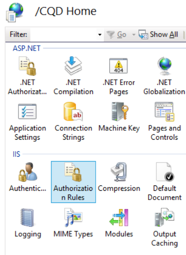
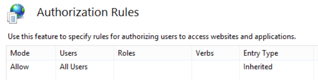
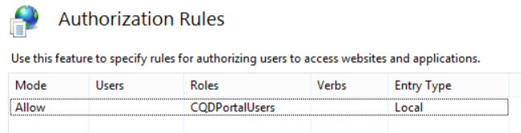
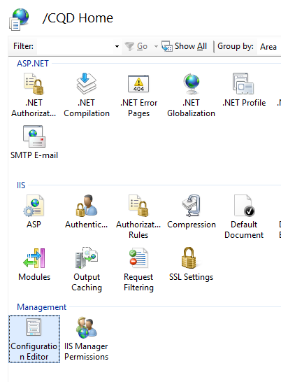
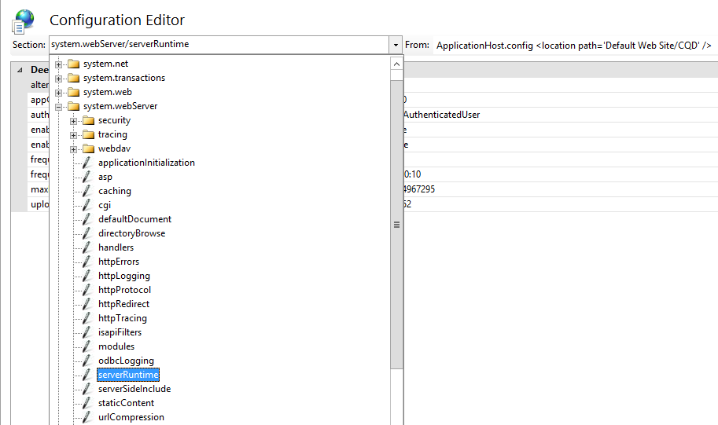
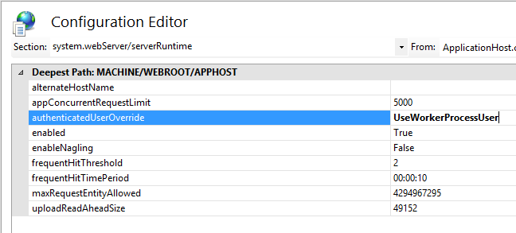
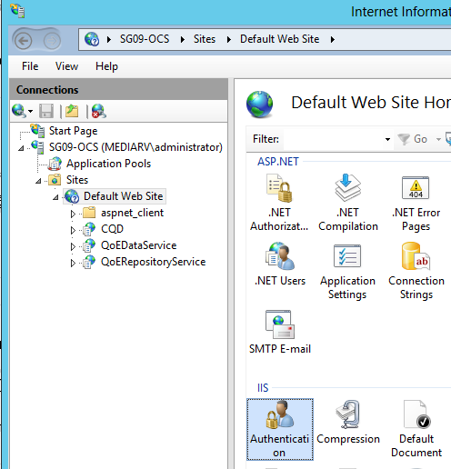
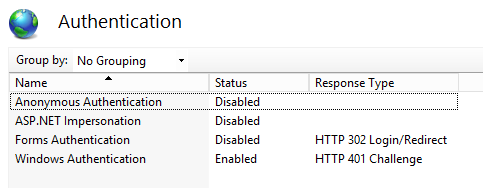
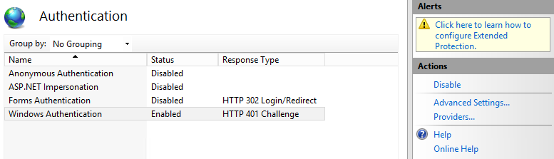
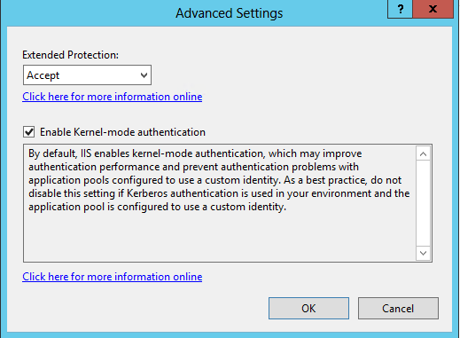

# Deploy Call Quality Dashboard for Skype for Business Server
 
**Summary:** Learn about the deployment process for Call Quality Dashboard. Call Quality Dashboard is a tool for Skype for Business Server.
  
## Deployment Overview

Call Quality Dashboard (CQD) consists of three major components:
  
- **Archive Database**, where the Quality of Experience (QoE) data is replicated and stored.
    
- **Cube**, where data from QoE Archive database is aggregated for optimized and fast access.
    
- **Portal**, where users can easily query and visualize QoE data.
    

  
The setup process for QoE Archive involves creating the QoE Archive database, deploying a SQL Server stored procedure that will move the data from the source QoE Metrics database into QoE Archive database, and setting up the SQL Server Agent job to execute the stored procedure at a regular interval. 
  
Cube deployment gets information from the user on where the QoE Archive is located, deploys the cube, and sets up a regular SQL Server agent job that will refresh the cube at a regular interval.
  
Portal install creates a Repository database that stores the mapping of CQD users to each user's reports/queries. It then sets up an IIS web application which is the dashboard where users can see a pre-defined set of reports as well as customize and create their own queries to visualize data from the cube. The portal install creates two additional web applications that exposes APIs for users to programmatically access the repository and the cube. (These APIs are used internally by the dashboard as well.)
  

|**Phase**|**Steps**|**Roles and group membership**|**Documentation**|
|:-----|:-----|:-----|:-----|
|Install prerequisite hardware and software.  <br/> |Decide on the CQD configuration, and choose a SQL Server from which to perform the install.  <br/> |Domain user who is a member of the local administrators group.  <br/> |"Pre-install Requirements" section in the deployment documentation.  <br/> |
|Install CQD.  <br/> |Run the MSI following the deployment document.  <br/> |To perform the setup, the installing account must be a domain user who is a member of the local administrators group and have read access to QoE Metrics database on the Monitoring Server.  <br/> |"Accounts and Deployment Steps" sections in the deployment documentation.  <br/> |
|Grant user access.  <br/> |For managing user authorization to the Portal, we recommend using URL Authorization, which was introduced in IIS 7.0. For more information, see [Understanding IIS 7.0 URL Authorization](https://www.iis.net/learn/manage/configuring-security/understanding-iis-url-authorization).  <br/> |Domain user who is a member of the local administrators group.  <br/> |Managing User Access for the Portal section in the deployment documentation.  <br/> |
|Optional: Provide subnet mapping information.  <br/> |Populate network and building mapping tables in QoE Archive database.  <br/> |An account with write access to the QoE Archive database.  <br/> |"Supplying Subnet Information" section in the user documentation.  <br/> |
   


Deployment of Call Quality Dashboard involves setting up the infrastructure and installing the software. The following procedure outlines the process.
  
## Deployment Steps

1. Copy the CallQualityDashboard.msi to the machine where the archive database component of CQD is to be installed (this is the machine that has SQL Server installed). 
    
2. Execute the MSI (Windows will prompt to run with administrator privilege, do so). 
    
3. Accept the EULA.
    
4. Select the destination folder where files related to Call Quality Dashboard components will be located or accept the default location.
    
5. Select all features.
    
6. At the QoE Archive Configuration page, provide the following information:
    
   - **QoE Metrics SQL Server:** SQL Server instance name for where the QoE Metrics DB is located (this will be the data source).
    
   - **QoE Archive SQL Server Name:** This is read-only field and fixed to the fully qualified domain name of the local machine. Archive DB can be installed only on the local machine.
    
   - **QoE Archive SQL Server Instance:** A local SQL Server instance name for where the Archive DB is to be created. To use a default SQL Server instance, leave this field blank. To use a named SQL Server instance, specify the instance name (e.g. the name after the "\").
    
   - **QoE Archive Database:** By default, this option is set to "Create new database". Since Archive DB upgrade is not supported, the only circumstance under which the "Use existing database" option can be used is if the existing Archive database has the same schema as the build to be installed.
    
   - **Database File Directory:** Path to where the database files (.mdf and .ldf) for the Archive DB should be placed. This should be on a drive (HDD2 in the recommended hardware configuration) separate from the OS. Note that since the file names are fixed in the install, to avoid any potential conflict, it is recommended that a blank directory with no files be used.
    
   - **Use Multiple Partitions:** The default is set to "Multiple partition", which requires Business Intelligence edition or Enterprise edition of SQL Server. For Standard edition, select "Single Partition" option. Note that cube processing performance may be impacted if Single Partition is used.
    
     > [!NOTE]
     > The selection for Use Multiple Partitions option cannot be changed once Setup completes. In order to change it, the Cube feature needs to be first uninstalled and then reinstalled using "Change" option in Control Panel. 
  
   - **Partition File Directory:** Path to where the partitions for the QoE Archive database should be placed. This should be on a drive (HDD3 in the recommended hardware configuration) separate from the OS drive and SQL database log files drive. Note that since the file names are fixed in the install, to avoid any potential conflict, it is recommended that a blank directory with no files be used.
    
   - **SQL Agent Job User - User Name &amp; Password:** Domain service account name and password (masked) that will be used to run the "QoE Archive Data" step of the SQL Server Agent job (which will run the stored procedure to fetch data from QoE Metrics DB into Archive DB, so this account must have read access to QoE Metrics DB, as indicated under Accounts section. This account also needs to have a login in the QoE Archive SQL Server Instance).
    
     > [!NOTE]
     > The account that the SQL Server instance is running under, such as NT SERVICE\MSSQLSERVER, must have access/permission to the directories given above for the installation to succeed. For details, see [Configure File System Permissions for Database Engine Access](https://msdn.microsoft.com/en-us/library/jj219062%28v=sql.110%29.aspx)
  
7. Upon clicking next, the installer will perform pre-requisite checks and report if any issues are encountered. When all pre-requisite checks pass, the installer will go to the Cube Configuration page. 
    
    > [!NOTE]
    > If the installer shows a warning message that the SQL Server Agent service for the QoE Archive SQL Server instance is currently not running, installation can proceed, but post installation please make sure that SQL Agent service is running and set the Startup type to Automatic so that the scheduled Job runs. 
  
8. At Cube Configuration page, provide the following information:
    
   - **QoE Archive SQL Server Name:** This is read-only field and fixed to the fully qualified domain name of the local machine. Cube can be installed only from the machine that has QoE Archive database (Note. Cube itself may be installed on a remote machine. See below)
    
   - **QoE Archive SQL Server Instance:** SQL Server instance name for where the QoE Archive DB is located. To specify a default SQL Server instance, leave this field blank. To specify a named SQL Server instance, enter the instance name (e.g. the name after the "\"). If QoE Archive component was selected for the install, this field will be pre-populated with the value provided on the QoE Archive Configuration page.
    
   - **Cube Analysis Server:** SQL Server Analysis Service instance name for where the cube is to be created. This can be a different machine but the installing user has to be a member of Server administrators of the target SQL Server Analysis Service instance.
    
     > [!NOTE]
     >  For more information about configuring Analysis Services Server Administrator Permissions, see [Grant Server Administrator Permissions (Analysis Services)](https://msdn.microsoft.com/en-us/library/ms174561.aspx)
  
   - **Use Multiple Partitions:** The default is set to "Multiple partition", which requires Business Intelligence edition or Enterprise edition of SQL Server. For Standard edition, select "Single Partition" option. Note that cube processing performance may be impacted if Single Partition is used .
    
     > [!NOTE]
     >  The selection for Use Multiple Partitions option cannot be changed once Setup completes. In order to change it, the Cube feature needs to be first uninstalled and then reinstalled using "Change" option in Control Panel.
  
   - **Cube User - User Name &amp; Password:** Domain service account name and password (masked) that will trigger the cube processing. If QoE Archive component was selected for the install, this field will be pre-populated with the value provided on the Archive Configuration page for the SQL Agent Job User, but we recommend specifying a different domain service account so that Setup can grant the least required privilege to it.
    
9. When clicking next, another round of validation will be performed and any issue will be reported. Upon successful completion of the validation, the installer will go to the Portal Configuration page. 
    
10. At Portal Configuration page, provide the following information:
    
    - **QoE Archive SQL Server:** SQL Server instance name for where the QoE Archive database is located. Note that unlike the QoE Archive Configuration page and the Cube Configuration page, the machine name is not fixed and must be provided. If QoE Archive component was selected for the install, this field will be pre-populated with the value provided on the QoE Archive Configuration page.
    
    - **Cube Analysis Server:** SQL Server Analysis Service instance name for where the cube is located. If Cube component was selected for the install, this field will be pre-populated with the value provided on the Cube Configuration page.
    
    - **Repository SQL Server:** SQL Server instance name where the Repository database is to be created. If the SQL Server instance name for where the QoE Archive database is located has been provided earlier in the setup (in other components), this field will be pre-populated with the QoE Archive DB SQL Server instance name. This can be any SQL Server instance.
    
    - **Repository Database:** By default the option is set to "Create new database". Since Repository DB upgrade is not supported, the only circumstance under which the "Use existing database" option can be used is if the existing Repository DB has the same schema as the build to be installed.
    
    - **IIS App Pool User - User Name &amp; Password:** The account that the IIS application pool should execute under. The User Name and Password fields will be grayed out if built-in system accounts are selected. These fields will only be enabled if "Other" is selected from the drop down box so the user can enter the domain service account information.
    
11. When clicking next, the final round of validation will be done to ensure that the SQL Server instances are accessible using the credentials provided and that IIS is available on the machine. Upon successful completion of the validation, the installer will proceed with the setup. 
    
When the installer is done, most likely the SQL Server Agent job will be in progress, doing the initial load of the QoE data and the cube processing. Depending on the amount of data in QoE, the portal will not have data available for viewing yet. To check on the status of the data load and cube processing, go to  `http://<machinename>/CQD/#/Health`. 
> [!NOTE]
> Note that the URL for checking the status of the download cube processing is case sensitive. If you enter 'health' the URL will not work. You must enter 'Health' at the end of the URL with a capital H. 
  
Detailed log messages will be shown if debug mode is enabled. To enable debug mode, go to **%SYSTEMDRIVE%\Program Files\Skype For Business 2015 CQD\QoEDataService\web.config**, and update the following line so the value is set to **True**:

```
<add key="QoEDataLib.DebugMode" value="True" /> 
```

The main portal page is accessible via  `http://<machinename>/CQD`. 
## Managing User Access for the Portal

For managing user authorization to the Portal, we recommend using URL Authorization, which was introduced in IIS 7.0. For more information on IIS security, see [Understanding IIS 7.0 URL Authorization ](https://www.iis.net/learn/manage/configuring-security/understanding-iis-url-authorization).
  
Any web site or web application inherit the default URL Authorization configured for the entire IIS, which is typically "Allow All Users". If access to the Portal needs to be more restrictive, then administrators can grant access to only the specific group of users by editing the "Authorization Rules".
  

  
> [!NOTE]
> The Authorization Rules icon is not to be confused with the ".NET Authorization" under the ASP.NET section, which is a different authorization mechanism. 
  
Administrators should first remove the inherited "Allow All Users" rule. This prevents any non-authorized users from accessing the Portal.
  

  
Next, administrators should add new Allow Rules and give specific users the permission to access the Portal. It is recommended that a local Group called "CQDPortalUsers" be created to manage the users.
  

  
The configuration details are stored in the web.config located at the Portal's physical directory.
  
```
<?xml version="1.0" encoding="UTF-8"?> <configuration> <system.webServer> <security> <authorization> <remove users="*" roles="" verbs="" /> <add accessType="Allow" roles="CQDPortalUsers" /> </authorization> </security> </system.webServer> </configuration> 
```

The next step is to configure the dashboard of the CQD. After users are authenticated by IIS, they will have to have file permissions on the CQD directory in order to access the web portal content. It is possible to change the ACLs through the security tab of the CQD directory properties to add individual users or groups; however the recommended approach is to leave the file permissions untouched. Instead, change the IIS setting to use the IIS worker process to access the CQD directory no matter which user is authenticated. 
  
> [!IMPORTANT]
> It is important to only change this setting for the CQD application, and not for the two API applications: QoEDataService and QoERepositoryService. 
  
## Configuring File Access for the CQD (Dashboard)

1. Open the Configuration Editor for CQD.
    
     
  
2. Under Section, choose **system.webServer/serverRuntime**.
    
     
  
3. Change authenticatedUserOverride to **UseWorkerProcessUser**.
    
     
  
4. Click **Apply** on the right-hand side of the page.
    
## Known Issues

### The CQD shows no data after deployment

You may receive the following error:

*We couldn’t perform the query while running it on the Cube. Use the Query Editor to modify the query and fix any issues. Also make sure that the Cube is accessible.*

This means that the cube must be processed in SQL Server Analysis Services prior to being used in CQD. You can resolve this by following these steps:

1. Open SQL Management Studio and select **Analysis Services**.

2. Expand the **QoECube** object, select **QoE Metric**, right-click, and then choose **Browse**. 

    If this returns empty browser, the cube hasn’t been proceed yet.

3. Right-click **QoE Metric** angain and choose **Process**.

4. When processing is complete, right-click the object again, and choose **Browse** to confirm that the browser page now shows data. 


### Users have trouble logging in because installer fails to create the correct settings in IIS

In rare cases, the installer fails to create the correct settings in IIS. Manual change is required to allow users to log into the CQD. If users are having trouble logging in, please follow these steps:
  
1. Open up IIS Manager, and navigate to Default Web Site.
    
     
  
2. Click on "Authentication". If the "Anonymous Authentication", "ASP.NET Impersonation", "Form Authentication", and "Windows Authentication" do not match the settings shown below, manually change them to match the settings below. All other authentication mechanisms should be disabled.
    
     
  
3. For "Windows Authentication", click on Advanced Settings on the right-hand side.
    
     
  
4. Set "Extended Protection" to Accept and check the "Enable Kernel-mode authentication" box.
    
     
  
5. Repeat the above steps for each of the "CQD", "QoEDataService", and "QoERepositoryService" entries below "Default Web Site".
    
For HTTP and HTTPS port bindings the installer will create port bindings on the default port numbers (port 80 for HTTP and port 443 for HTTPS). If there is another website on the machine that uses these bindings, there will be a conflict and the IIS behavior cannot be predicted. The best way to avoid this problem is to make sure that no other websites are mapped to ports 80 and 443 before installing CQD. 
  
To enable SSL/TLS in IIS and force users to connect via secure HTTPS instead of HTTP:
  
1. Configure Secure Sockets Layer in IIS, see [Configuring Secure Sockets Layer in IIS 7](https://technet.microsoft.com/en-us/library/cc771438%28v=ws.10%29.aspx). Once done, replace  `http` with `https`.
    
2. For instructions on enabling TLS in the SQL Server connections, see [How to enable SSL encryption for an instance of SQL Server by using Microsoft Management Console ](https://support.microsoft.com/en-us/kb/316898/).
    
## Cube Sync Fails

QoEMetrics may contain some invalid records based on end user clocks. If the time skew is greater than 60 yrs, the cube import will fail.
  
 Check the Min and Max StartTime/EndTime using the selections below. Look for and delete records in the far past and very distant future, they can be disregarded and they will break up the sync processes.
  
- Select MIN(StartTime) FROM CqdPartitionedStreamView
    
- Select MAX(StartTime) FROM CqdPartitionedStreamView
    
- Select MIN(EndTime) FROM CqdPartitionedStreamView
    
- Select MAX(EndTime) FROM CqdPartitionedStreamView
    
## Post-install tasks

### Importing Buildings and Networks

After Installing CQD, perform the following configuration tasks:
  
1. Define Building types (recommended)
    
2. Define Building Ownership types (recommended)
    
3. Define Network types (highly recommended)
    
4. Import Buildings (recommended)
    
5. Import Subnets (recommended)
    
### Define Building Types

Building types are used to describe the different buildings definitions or types within your organization. 
  
> [!NOTE]
> This step is optional, but recommended. 
  
Examples
  
- Headquarters
    
- Remote Office
    
- Joint-venture location
    
  **Sample SQL Syntax**
  
```
INSERT INTO
[dbo].[CqdBuildingType]
([BuildingTypeId],
[BuildingTypeDesc])
VALUES
(1, 
'Headquarters')   
```

The BuildingTypeId and BuildingTypeDesc parameters are required.
  
### Define Building Ownership Types

Ownership types are used to distinguish owned vs leased assets.
  
> [!NOTE]
> This step is optional, but recommended. 
  
Examples
  
- Contoso Leased non-RE&amp;F
    
- Contoso Leased RE&amp;F
    
- Contoso Owned
    
- Subsidiary Leased
    
  **Sample SQL Syntax**
  
```
INSERT INTO
[dbo].[CqdBuildingOwnershipType]
([OwnershipTypeId],
[OwnershipTypeDesc]
)

VALUES
(1,
'Contoso Owned'
)
```

The OwnershipTypeId and OwnershipTypeDesc parameters are required. 
  
### Define Network Names

Network Types are used to describe different types of networks within the organization. This gives you the ability to filter on (or filter out) specific Network Types.
  
> [!NOTE]
> It is highly recommended to define Network Names, but it is optional. If you decide to not define network names, ensure the each CqdNetwork entry has a BuildingId of 0. 
  
Examples
  
- VPN
    
- LAB
    
  **Sample SQL Syntax**
  
```
INSERT INTO [dbo].[CqdNetworkName] 
( [NetworkName]
,[NetworkType]
 ) 
VALUES
('VPN','VPN') 
```

The NetworkNameID and NetworkName parameters are required, the NetworkType parameter is optional but recommended.
  
### Import Buildings

Importing Buildings gives you the ability to get building specific insights (poor calls per building on WiFi/Wired, etc.). 
  
> [!NOTE]
> This step is optional, but recommended. 
  
Before you Import a new building you should already have a predefined BuildingKey identified. To do that, issue the "SELECT MAX(BuildingKey) FROM CqdBuilding" SQL command to identify the current value and add 1 to the result.
  
 **Sample SQL Syntax**
  
```
INSERT INTO [dbo].[CqdBuilding] 
( [BuildingKey]
,[BuildingName]
,[BuildingShortName]
,[OwnershipTypeId],
[BuildingTypeId]
)
VALUES
(2, 'Ann Arbor', 'AA', 0, 0)
```

The BuildingKey, BuildingName, BuildingShortName, OwnershipTypeId, BuildingTypeId parameters are required, the other parameters are optional.
  
### Import Subnets

Importing Buildings gives you the ability to get building specific insights (poor calls per building on WiFi/Wired, etc.). 
  
> [!NOTE]
> This step is optional, but recommended. 
  
Import Subnets and map them to the Buildings imported in the last step. If you decided not to populate NetworkName, ensure each entry in this table uses a NetworkNameID of 0.
  
 **Sample SQL Syntax**
  
```
INSERT INTO [dbo].[CqdNetwork] 
([Network]
,[NetworkNameID]
,[BuildingKey]
,[UpdatedDate]
)

VALUES
 ('172.16.254.0',0,1,'2015-11-11')
```

The Network, and UpdatedDate parameters are required, the other parameters are optional.
  
### Optional: BSSID

Populating BSSID information gives you additional WiFi stream correlation by controller or radio. This is in addition to filtering by building or subnet. 
  
 **Sample SQL Syntax**
  
```
INSERT INTO [dbo].[CqdBssid]
([Ap],
[Bss],
[Building],
[ess],
[phy]
)
VALUES
('AP1','00-00-00-00-00-00','Aruba AP 1','Controller1','bgn')
```

**CqdBssidTable Details**

|**As shown in CQD**|**CQDBssid Table**|**Example inputs**|
|:-----|:-----|:-----|
|Ap NName  <br/> |AP  <br/> |AP1  <br/> |
|BBssid  <br/> |BSS  <br/> |00-00-00-00-00-00 (you must use the delimited fformat)  <br/> |
|Controller  <br/> |Building  <br/> |Aruba AP 7  <br/> |
|Device  <br/> |ess  <br/> |Controller1  <br/> |
|Radio  <br/> |phy  <br/> |bgn  <br/> |
   
### Processing the imported data

By default, after you import building/network data it will only apply to records generated after that point in time. 
  
To tag all the previous records with this new data, you will need to run the CqdUpdateBuilding stored procedure as shown below: 
  
Give it the date of your first record (identify that using the Select MIN(StartTime) FROM CqdPartitionedStreamView SQL command ), an EndDate of tomorrow, then NULL for the last two values.
  
Once the data is associated with stream data, the SSIS Cube needs to reprocess all records. This also applies when bulk adding BSSID/ISP data. Ensure that "Process Full" is selected.
  

