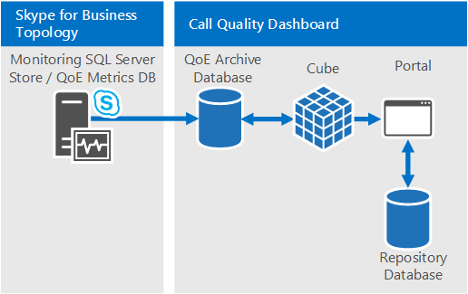
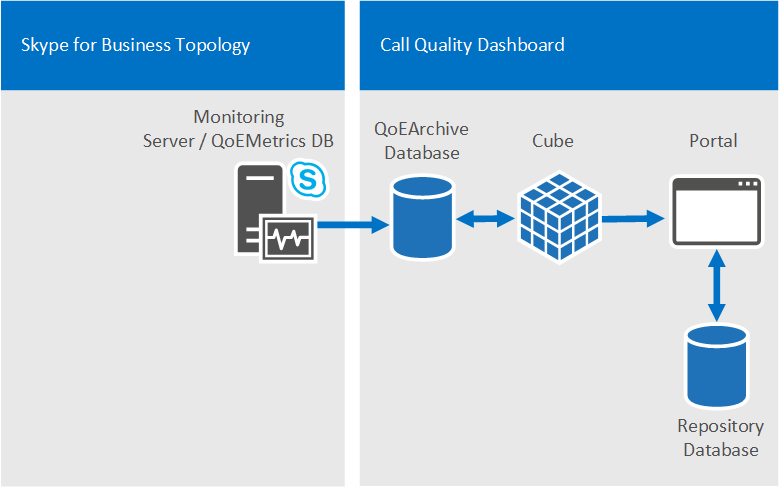
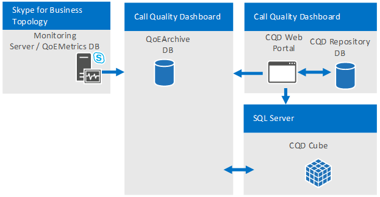
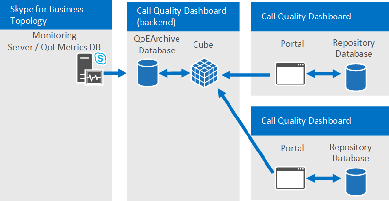
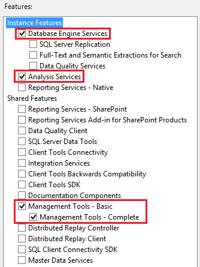

# Plan for Call Quality Dashboard for Skype for Business Server 
 
**Summary:** Learn about what to consider when you plan for the Call Quality Dashboard.
  
## Overview of the Skype for Business Server Call Quality Dashboard

The Skype for Business Server Call Quality Dashboard (CQD) is a reporting layer on top of the Quality of Experience Database in the Monitoring Server in Skype for Business Server. CQD uses Microsoft SQL Server Analysis Services to provide aggregate usage and call quality information as well as for filtering and pivoting on the dataset. CQD features include:
  
- **Archival storage of QoE data via the QoE Archive component of CQD.** The QoE Archive component can store QoE data for a much longer duration than the Monitoring Server can. This allows for trending and reporting for up to seven months of data at a time, with the ability to slide the reporting window as far back as there is data.
    
- **Reporting and analysis using the power and speed of Microsoft SQL Server Analysis Services.** CQD utilizes Microsoft SQL Analysis Services to provide fast summary, filter, and pivoting capabilities to power the dashboard via an Analysis Cube. Reporting execution speed and the ability to drill down into the data can reduce analysis times dramatically.
    
- **New data schema optimized for call quality reporting.** The Cube has a schema designed for voice quality reporting and investigations. Portal users can focus on the reporting tasks instead of figuring out how the QoE Metrics database schema maps to the views they need. The combination of the QoE Archive and the Cube provides an abstraction that reduces the complexity of reporting and analysis via CQD. The QoE Archive database schema also contains tables that can be populated with deployment-specific data to enhance the overall value of the data.
    
- **Built-in report designer and in-place report editing.** The Portal component comes with several built-in reports modeled after the Call Quality Methodology. Portal users can modify the reports and create new reports via the Portal's editing functionality.
    
- **Web API access to the Report Structure and Analysis Cube Data.** The Dashboard reporting framework is not the only way to display the data from the Cube. CQD provides several examples of using HTML and JavaScript to retrieve data from the CQD Web APIs and render the data in a custom format. The combination of the Report Editor and the CQD Web APIs allows rapid prototyping of reports and custom report layout.
    
## CQD Design Goals

CQD allows IT Pros to use aggregate data to identify focus areas in their environment experiencing media quality issues. It allows an IT Pro to compare statistics for different groups of users and identify trends and patterns. It is not focused on solving individual call issues, but on identifying problems and solutions that will apply to many users in a given environment. 
  
## Call Quality Dashboard components

The Call Quality Dashboard consists of several databases, Microsoft SQL Agent jobs, processes, and web applications. The Microsoft SQL Agent jobs periodically copy data from the QoE Metrics database into the QoE Archive database and processes the Cube with the data in the QoE Archive database. The Repository database stores the report definitions that power the Portal. The Portal provides browser access to the Cube data. 
  
The CQD components, including the QoE Archive, Cube, and Repository databases, can be installed on the Monitoring Server, installed on its own server, or installed across multiple servers. The particular installation method depends on the performance demands of CQD as well as impact to other processes on the same servers. For more information, refer to the "Components and topologies for CQD" section later in this article.
  
### Architectural Overview

To summarize, CQD requires the following elements:
  
- Two databases: an Archive Database and a Repository Database.
    
- One SSAS Cube visualizing aggregated data 
    
- IIS hosts CQD Web Portal
    

  
The same CQD architecture supports Lync Server 2013 and Skype for Business. 
  
### CQD and Skype for Business vs. Lync 2013

 In a Skype for Business environment only, the following capabilities are available:
  
- Wi-Fi reporting of Signal Strength
    
- Wi-Fi reporting of Chipset drivers
    
- Rate my Call data 
    
## Information available through CQD

CQD can show Skype for Business Server audio, video, and application sharing stream counts and count of good versus bad calls as well as ratios of bad to good calls. The views can be sliced and filtered by many different dimensions. CQD draws data from the QoE Metrics database in the Monitoring Server. The data is then merged with any customer-supplied data, such as network subnet-to-building mapping to make reports such as "Call Quality per Building" possible. 
  
CQD also abstracts many of the internal QoE data idiosyncrasies such as "caller" and "callee" such that the user can focus on building report views around "server" and "client". Following the Call Quality Methodology, CQD is streamlined to help identify the conditions that pockets of poor calls have in common—one of the tenets for improving call quality.
  
## Viewing data in CQD

The CQD data can be viewed via the CQD Portal and accessed via REST API calls.
  
### CQD Portal

The Portal is the fastest way to view the data in the Cube. The Portal comes with several built-in reports that are usable right away. The built-in reports are linked in a structured manner to guide the user to successively smaller and smaller slices of the call data. The built-in reports also highlight the various different ways the data can be shown by demonstrating a combination of charts and tables with different pivots, filters, and measures. Each user that accesses the Portal can have his or her own set of reports that he/she can modify and share. For more information on the usage of the CQD Web Portal, see [Use Call Quality Dashboard for Skype for Business Server](use.md).
  
Supported Operating Systems for CQD Portal: Windows 8.1, Windows 8, Windows Server 2012 R2, Windows Server 2012 , and Windows Server 2016 (Skype for Business Server 2019 CQD only).
  
Supported Browsers for CQD Portal: Internet Explorer 11, Internet Explorer 10, and Internet Explorer 9.
  
### REST APIs

The Cube data can also be accessed via REST API calls. The data retrieved via the REST API calls can be rendered via HTML pages. Users can take advantage of the query speed and the high level schema of CQD while still creating custom reports suited for their business needs. For more information on the API and samples, see [Develop Call Quality Dashboard for Skype for Business Server](develop.md). 
  
## Defining Your organization's requirements for CQD

CQD provides QoE data archiving and fast and deep analysis of call quality data. The following guide helps you to decide when and why you would deploy CQD.
  
### When to deploy CQD

 **CQD can be deployed to establish a baseline call quality measurement, even if an organization doesn't experience call quality issues.** Establishing a baseline call quality measurement is important because every organization has a different mix of Wi-Fi versus wired and remote versus office workers. When call quality issues arise, the most recent call quality measurements can be compared to previous time intervals. CQD's trending features allow easy detection of changes in call quality over time.
  
 **CQD can be deployed to proactively find problem areas that may impact call quality.** Even if the average call quality for an organization might meet the targets set by the organization, there could be pockets of call quality issues that are hidden behind average metrics. CQD allows pivot table-like breakdown of call quality metrics by many dimensions in the QoEMetrics database. Spotting outliers in peer groups is a quick way to proactively locate call quality issues.
  
 **CQD should be deployed if there are call quality issues in the organization to reduce the time needed to troubleshoot problems.** CQD can simplify existing call quality investigations by offering fast reporting performance and dynamic drill down capabilities. CQD is designed for many kinds of workflows in call quality investigations validation of repairs to the environment.
  
### Why deploy CQD

 **CQD should be deployed if QoE reporting needs to happen for more than 3 months of data.** The QoEMetrics database and monitoring server reports are designed to retain and report a small set of data. The QoE Metrics database is optimized for fast insertions, and therefore reporting performance can be impeded by large volume of calls or competing reporting access to the database. CQD's QoE Archive database provides a second copy of the QoE Metrics data with much longer retention capabilities. The Portal is also optimized to show up to 7 months of data at a time and can report on all the data in the QoE Archive as needed.
  
 **CQD should be deployed if custom QoE reports are needed.** The Portal has a Report Editor feature for creating and prototyping reports quickly and easily. It also makes available REST APIs for programmatic access to the Cube data, allowing custom presentation using HTML/JavaScript or many other frameworks. It is no longer necessary to author new SQL queries for the purpose of creating custom data views for reporting.
  
 **CQD should be deployed if existing QoE reporting functionality does not meet the speed or depth required by the organization.** CQD comes with many built-in reports. The reports are immediately useful and demonstrate how progressively drilling into the data can offer additional insights at each level. The reports hierarchy also helps with managing the numerous reports in a logical manner and fosters creation of many more reports that are easily accessible and understandable. CQD doesn't just offer speed and flexibility but also is optimized for the workflows developed by the Call Quality Methodology.
  
## Components and topologies for CQD

CQD comes with several components, and it helps to understand the requirements of each component and their relationship with each other to obtain the simplest and best performing deployment of the tool. The following table describes the dependent component for each CQD component.
  

|**Component name**|**Dependent component**|
|:-----|:-----|
|QoE Archive  <br/> |Microsoft SQL Server  <br/> |
|Cube  <br/> |Microsoft SQL Server Analysis Services  <br/> |
|Portal  <br/> |Microsoft Information Services  <br/> |
|Repository Service (part of Portal installation)  <br/> |Microsoft SQL Server  <br/> |
   
> [!NOTE]
> For QoE Archive and Cube, certain deployment options require Business Intelligence or Enterprise editions of Microsoft SQL Server. Refer to the [Infrastructure requirements for CQD](plan.md#Infrastructure_Req) section below for more details.
  

  
### Single server configuration

All CQD components and dependent components can be installed onto one machine. The single box configuration is the simplest configuration and allows CQD to be self-contained. CQD would just need access to the QoE Metrics database on the Monitoring Server. The CQD Server can be a standalone machine, a virtual machine, or it can even be the Monitoring Server, depending on the available resources of the host machine and the performance requirements. 
  
During installation, the user performing the installation simply needs to provide the Microsoft SQL Server and Microsoft SQL Server Analysis Services instances that have been previously set up on the machine where the CQD is to be installed. Please refer to [Deploy Call Quality Dashboard for Skype for Business Server](deploy-0.md) for more information.
  
### Multiserver configuration

In a multiserver configuration, The QoE Archive, Cube, and Portal can all be on different machines. There are two main uses for the multiserver configuration:
  
- Hosting CQD Web Portal and CQD Cube on different servers.
    
- Hosting a "development" Portal separate from the "production" Portal. 
    
  **Hosting CQD Web Portal and CQD Cube on different machines.** Organizations that might have requirements to separate the CQD Portal from the SQL Server installation or that might want to mix and match SQL Server editions for the SQL Server instance and SQL Server Analysis Services instance can choose to install the CQD Portal and CQD Cube on different machines. The QoE Archive component can also be the sole CQD component that is installed if the organization simply wants to have a sustainable method to archive the QoE data without reaching performance limits on the Monitoring Server.
  

  
 **Hosting a "development" Portal separate from the "production" Portal.** Organizations that develop their own custom reports (via the REST APIs) might prefer to deploy additional (CQD) Portal instances alongside the production Portal that regular users access for call quality monitoring or investigations. The development Portal can isolate any modifications to the Portal from the production environment. The additional web portals can be deployed on different machines (shown below) or deployed onto different web directories on the same machine (not shown). To accomplish the latter, the additional CQD web portal must be copied to the production machine manually because the CQD setup process always deploys the CQD Web Portal to the default web site with predefined web application names.
  

  
### Supported topologies

CQD does not merge data from multiple QoEMetrics databases, as is the case where there are multiple Skype for Business Server topologies, each with its own Monitoring Server. Each CQD instance must point to one QoEMetrics database. However, because CQD will move much of the reporting workload off of the Monitoring Server, large organizations that needed to deploy one Monitoring Server per Skype for Business Server topology should consider using one Monitoring Server for all topologies.
  
## Infrastructure requirements for CQD
<a name="Infrastructure_Req"> </a>

CQD, including all its components and dependent components, can be deployed on a virtual machine, a single machine, or across multiple machines. The minimum software and hardware requirements are listed below. Data availability and query performance can vary from minutes to hours, depending on the number of active Skype for Business Server users and hardware and configuration, so some performance measurements are given below.
  
|||
|:-----|:-----|
|Supported Operating Systems  <br/> |Windows Server 2008 R2, Windows Server 2012, Windows Server 2012 R2  <br/> |
|Supported SQL Server  <br/> |SQL Server 2012, SQL Server 2014, SQL Server 2016  <br/> |
   
CQD utilizes Microsoft SQL Server, Microsoft SQL Server Analysis Services, and Microsoft Internet Information Services so CQD's minimum hardware and software requirements are basically the same as those dependent components. However, based on the organization's requirements around data freshness (which will depend in part on the volume of QoE data the organization generates) and deployment cost, additional deployment considerations should be made.
  
Data processing in CQD is separated into two main stages: 
  
- QoE Archive process
    
- CQD Cube processing
    
  **QoE Archive processing.** The QoE Archive processing task copies data from the QoE Metrics database on the Monitoring Server to the QoE Archive database. There are two situations where the processing time of the task would have fundamentally different performance characteristics. The first is after the initial installation of CQD. When the task is run for the first time after a fresh installation, the QoE Archive processing task will copy all the data that is in the QoE Metrics database into QoE Archive database. The second is the periodic processing after this initial round. The QoE Archive processing task will run every 15 minutes and process any new QoE records that are in the QoE Metrics database. Generally, the initial processing time is not a concern because it is run only the first time, when CQD is installed. However, if the CQD server is severely under-provisioned, this task can take several hours. Refer to the table below for example initial QoE Archive processing times.
  
  **CQD Cube processing.** The Cube processing task aggregates the data from the QoE Archive database into the Cube. The initial cube processing time and subsequent cube processing time are determined by the SQL Server Analysis Services edition used for the CQD Cube. If the Standard edition is used, there is no difference between the initial cube processing time and the subsequent cube processing time because each time the Cube data is refreshed, it will always be a full processing of all available data. (This means that the Cube processing time increases as the amount of data in the QoE Archive database increases.) Because the Business Intelligence Edition and Enterprise Edition of SQL Server have partition support, if either edition is used, only the initial run will process all data in the QoE Archive database. In subsequent runs, when the task is triggered every 15 minutes, the task will only process the new records added to the QoE Archive database since the last time the task was run. Once a day, there will also be a full processing on the partition that contains the current month's data.
  
The physical machine characteristics can affect CQD performance as well as the software features that are available from the SQL Server components. The QoE Archive component will be more disk-intensive compared to other components, whereas the Cube component will be more CPU and memory intensive. All of these factors contribute to CQD's total data processing time, which directly affects data freshness and availability. Organizations should make decisions on the hardware and software based on the individual needs of the organization. 
  
### Tested Hardware Configurations

This section makes the assumption that there is a single QoEMetrics DB in the environment. 
  
**Machine profiles**

|**Machine**|**CPU Cores**|**RAM**|**QoE Archive and Cube on same disk**|**QoE Archive and SQL Temp DB on same disk**|
|:-----|:-----|:-----|:-----|:-----|
|Virtual machine  <br/> |4  <br/> |7 GB  <br/> |Yes  <br/> |Yes  <br/> |
|4 core  <br/> |4  <br/> |20 GB  <br/> |Yes  <br/> |No  <br/> |
|8 core  <br/> |8  <br/> |32 GB  <br/> |Yes  <br/> |No  <br/> |
|16 core  <br/> |16  <br/> |128 GB  <br/> |No  <br/> |No  <br/> |
   
**Performance results**

|**Machine**|**QoE metrics DB size**|**SQL partitions**|**Disk type**|**Number of streams**|**Initial Archive process**|**Initial Cube process**|**Subsequent Archive process**|**Subsequent Cube process**|
|:-----|:-----|:-----|:-----|:-----|:-----|:-----|:-----|:-----|
|Virtual machine  <br/> |900 MB  <br/> |Single  <br/> |VHD (variable-size)  <br/> |.5 M  <br/> |30 m  <br/> |2 m  <br/> |30 s  <br/> |1 m  <br/> |
|Virtual machine  <br/> |9 GB  <br/> |Single  <br/> |VHD (variable-size)  <br/> |5 M  <br/> |4 h  <br/> |15 m  <br/> |1 m  <br/> |5 m  <br/> |
|Virtual machine  <br/> |9 GB  <br/> |Single  <br/> |VHD (fixed-size)  <br/> |5 M  <br/> |2 h  <br/> |5 m  <br/> |1 m  <br/> |5 m  <br/> |
|Virtual machine  <br/> |30+ GB  <br/> |Single  <br/> |VHD (fixed-size)  <br/> |10 M  <br/> |15 h  <br/> |20 m  <br/> |2 m  <br/> |45 m  <br/> |
|8 core  <br/> |9 GB  <br/> |Single  <br/> |Multiple Disks  <br/> |5 M  <br/> |2 h  <br/> |5 m  <br/> |25 s  <br/> |5 m  <br/> |
|8 core  <br/> |9 GB  <br/> |Multiple  <br/> |Multiple Disks  <br/> |5 M  <br/> |2 h  <br/> |15 m  <br/> |35 s  <br/> |2 m  <br/> |
|8 core  <br/> |30+ GB  <br/> |Single  <br/> |Multiple Disks  <br/> |20 M  <br/> |9 h  <br/> |20 m  <br/> |1 m  <br/> |20 m  <br/> |
|8 core  <br/> |30+ GB  <br/> |Multiple  <br/> |Multiple Disks  <br/> |20 M  <br/> |9 h  <br/> |30 m  <br/> |2 m  <br/> |2 m  <br/> |
|4 core  <br/> |200 GB  <br/> |Single  <br/> |Multiple Disks  <br/> |125 M  <br/> |6+ days  <br/> |7 h  <br/> |2 m  <br/> |6 h  <br/> |
|16 core  <br/> |500 GB  <br/> |Multiple  <br/> |Multiple Spindles  <br/> |250 M  <br/> |8 days  <br/> |2 h  <br/> |2 m  <br/> |10 m  <br/> |
   
\*These are not expected to be encountered in real deployments because the QoE Metrics database would have to have 9 and 18 months of data, respectively, but they're provided here for completeness.
  
### Service Account Requirements

You will need an account (with read access to QoEMetrics) that the SQL Agent on the CQD Server can use for importing data to the QoEArchiveDB.
  
You may also need to configure a separate account for an SSAS Job to pull data from QoEArchiveDB (this is an optional process).
  
IIS most commonly uses Network Service as App Pool Identity, but can be configured to a Service Account.
  
### Portal Access Control

By default, any authenticated user has access. This can be changed by using IIS Authorization rules to restrict to a specific group.
  
### Pre-Install Requirements

These instructions assume that a QoE Metrics database has already been installed and is running somewhere in the Skype for Business Server topology.
  
#### Hardware Requirements

CQD utilizes Microsoft SQL Server, Microsoft SQL Analysis Server, and Microsoft Internet Information Server so CQD's minimum hardware and software requirements are basically the same as those dependent components. However, based on the organization's requirements around data freshness (which will depend in part on the volume of QoE data the organization generates) and deployment cost, additional deployment considerations should be made.
  
#### Software Requirements

The following operating systems are required for CQD:
  
- Windows Server 2008 R2 with IIS 7.5
    
- Windows Server 2012 with IIS 8.0
    
- Windows Server 2012 R2 with IIS 8.5

- Windows Server 2016 with IIS 10.0 (Skype for Business Server 2019 CQD only)
    
The following are the required IIS role services (in hierarchical order):
  
- Web Server
    
  - Common HTTP Features
    
  - Static Content
    
  - Default Document
    
  - Application Development
    
  - ASP.NET
    
  - ISAPI Filters
    
  - Health &amp; Diagnostics
    
  - HTTP Logging
    
  - Security
    
  - URL Authorization
    
  - Windows Authentication
    
  - Management Tools
    
  - IIS Management Console
    
> [!NOTE]
>  Note the following for the above requirements:>  3.5 and 4.5 versions of the .Net framework are available. Both are required (more specifically, 3.5 SP1 is required).>  In some systems, if ASP.NET is setup before IIS install, then ASP.NET may not be registered in IIS. The problem manifests through the absence of application pools for the corresponding .Net version and also missing the .NET CLR version in app pool configuration. To correct such an issue on Windows Server 2008 R2, execute `%systemroot%\Microsoft.NET\Framework64\4.0.30319\aspnet_regiis.exe -iru`. On Windows Server 2012 and Windows Server 2012 R2, execute  `dism /online /enable-Feature /all /FeatureName:WCF-HTTP-Activation45` followed by removing the "ServiceModel" module from the Default Web Site in IIS Manager.>  Management tools is optional, but recommended.
  
To install these requirements using PowerShell, run the following:
  
```
import-module servermanager
```

```
add-windowsfeature Web-Server, Web-Static-Content, Web-Default-Doc, Web-Asp-Net, Web-Asp-Net45, Web-Net-Ext, Web-Net-Ext45, Web-ISAPI-Ext, Web-ISAPI-Filter, Web-Http-Logging, Web-Url-Auth, Web-Windows-Auth, Web-Mgmt-Console
```

The following versions of SQL Server are supported:
  
- SQL Server 2012
    
- SQL Server 2014

- SQL Server 2016

- SQL Server 2017
    
Business Intelligence or Enterprise edition is recommended for performance reasons. These editions allow use of multiple partition files that can be processed in parallel, which is beneficial for processing data spanning multiple months or longer. 
  
While not recommended, Standard edition is supported as well. Processing will be constrained to a single partition (which needs to be configured during setup). 
  
In all cases, "Database Engine Services" and "Analysis Services" must be installed. It is recommended but not required to also install the "Management Tools - Complete" feature, which adds SQL Server Management Studio support for Analysis Services. Feature selection screen should look like the figure.
  

  
When configuring the SSAS setup, in the Analysis Services Configuration, set "Server Mode" to "Multidimensional and Data Mining Mode". 
  
For additional help in installing and configuring SQL Server Business Intelligence Features, see [Install Analysis Services in Multidimensional and Data Mining Mode](https://msdn.microsoft.com/en-us/library/ms143708%28v=sql.110%29.aspx).
  
#### Account Requirements

Three domain service accounts are recommended on the principle of least privilege: 
  
- One that already has both a login security principal for QoE Metrics database (with db_datareader privilege) and a login security principal in QoE Archive SQL Server Instance (needed to create a Linked Server object during setup). This account will be used to run "QoE Archive Data" step of the SQL Server Agent job.
    
- One that will be used to run "Process Cube" step of the SQL Server Agent job. Setup will create a login security principal to QoE Archive database (with read and write privilege) and also create a member in the QoE Role (with full control privilege) for the Cube.
    
- One that will be used to run IIS Worker Process for the web portals and web APIs. Setup will create a login security principal to QoE Archive database (with read privilege), a login security principal to Repository database (with read and write privilege) , and a member in QoERole (with full control privilege) for the Cube. 
    
    > [!NOTE]
    > When both QoE Archive database and Repository database are hosted in the same SQL Server, only one login security principal with two user mappings is created. 
  
The first two accounts can be logically considered as "back end service accounts" and the last account is a "front end service account". While not recommended, it is possible to use a single account in all cases.
  
> [!NOTE]
> The user account initiating the installation must have read access to QoE Metrics DB as well (in addition to having machine admin rights on the QoE Archive DB server where the installation must take place). 
  
## Capacity Planning
<a name="Infrastructure_Req"> </a>

CQD is designed for minimal Impact on QoEMetrics: the code has been optimized to not lock data, and import jobs are tunable.
  
The type of hardware to use depends on your requirements for how quickly syncs should run. Disk Sizing is as follows:
  
- QoEArchive is ~1.5x larger than QoEMetrics DB initially
    
- SSIS Cube compresses the data almost 10x compared to DB
    
- Data is partitioned monthly; partitions can be deleted
    

