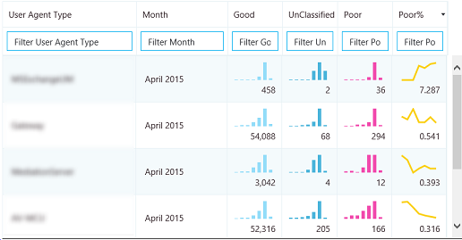
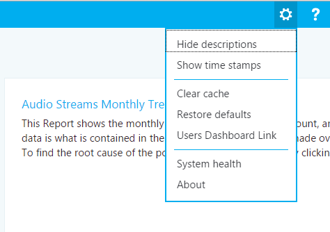
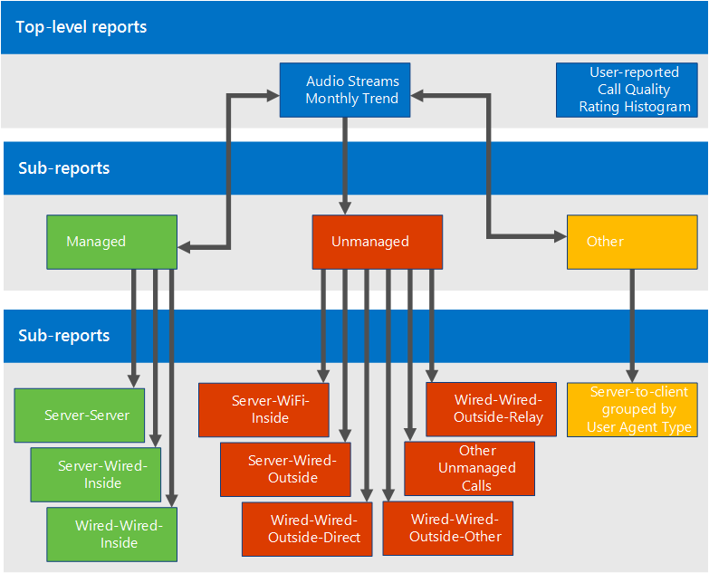

# Use Call Quality Dashboard for Skype for Business Server
 
**Summary:** Learn about how to use the Call Quality Dashboard. Call Quality Dashboard is a tool for Skype for Business Server.
  
CQD allows IT Pros to use aggregate data to identify focus areas in their environment experiencing media quality issues. It allows an IT Pro to compare statistics for different groups of users and identify trends and patterns. It is not focused on solving individual call issues, but on identifying problems and solutions that will apply to many users in a given environment.
  
## Call Quality Dashboard User Guide

The Call Quality Dashboard (CQD) is a web portal for quickly creating and organizing reports based on Quality of Experience (QoE) data. CQD deploys a SSAS cube to aggregate the data in the QoE Metrics database. This enables users to create and modify reports and do investigations in real-time. While it is possible to use Excel to connect directly to the cube, the portal is optimized for several workflows involving QoE data. This data includes caching of report data for fast access, deep links to report pages for information sharing and publishing, streamlined report editing and creation, and editable metadata for report descriptions. Additionally, CQD exposes web APIs that give users programmatic access to the cube data for use in custom dashboards. 
  
### Feature Overview

When a user visits the Call Quality Dashboard, this is what s/he will see:
  

  
1. The "Summary Pane" is where context for the "Report Set" (to the right) can be found. 
    
2. Report Set level properties (including Y-axis height) can be set by clicking on "Edit" in the Summary Pane.
    
3. The Breadcrumb helps users identify their current location within the report set hierarchy. 
    
4. Reports with sub-reports are shown with a blue link. Clicking on the link will drill down to the child reports. 
    
Moving the mouse over the bar charts and trend lines will show detailed values. The report that has focus will show the action menu: "Edit", "Clone", "Delete", and "Download". 
  
### Default Reports

When a user first accesses the Call Quality Dashboard portal, a default set of reports is automatically created. These reports are sometimes referred to as system reports. The user is able to freely modify or delete these reports. Generally, users will extend them by creating new sibling and child reports. 
  
At the top level, the "Audio Streams Monthly Trend" report shows the monthly trend for all audio streams. Moving the mouse over the bars in a bar chart will show a more detailed view of the data represented by the bar chart. Clicking on the title of the Audio Streams Monthly Trend report will navigate to the "Managed vs Unmanaged Audio Streams" report, where the reports are split between Managed and Unmanaged calls. Managed calls are calls made from inside the corporate firewall over wired connections. Unmanaged calls include calls made from outside the corporate firewall as well as all calls made over Wi-Fi.
  
The other top level report is called the "User-reported Call Quality Rating Histogram." The Call Quality Ratings are the numbers given by Skype for Business users at the end of a call to indicate the quality of the call. The rating numbers range from 1 to 5, with 1 being the worst and 5 being the best. The histogram shows the number of audio calls that had the indicated rating in one month. 
  
In general, clicking on the title of any of the reports will navigate into reports with additional filters on the data. In the system reports, each child report displays a subset of the data available in its parent report. This provides a conceptually simple model for problem solving: narrow down the problem space by investigating which sub-report the problematic data or trend is confined to. The ability to create new sub-reports allows users to investigate their own hypotheses as to the provenance of specific data trends.
  
### Creating and Editing Reports

When clicking on "Edit" in the action menu of a report, users will see the Report Editor. Each report is backed by a query into the cube. A report is a visualization of the data returned by its query. The Report Editor is a user interface for editing these queries, as well as the display options of the report. When a user opens the Report Editor, this is what s/he will see:
  

  
1. Dimensions, measures, and filters are chosen in the left pane. Hovering over one of the existing values will show an "x" button that allows the value to be removed. Clicking on the "plus" button next to a heading will open the dialog for adding a new dimension, measure or filter. 
    
2. Options for chart customization are displayed at the top.
    
3. A preview of the report is available in the Report Editor. 
    
4. A detailed report description can be created using the edit box at the bottom. 
    
### Sparklines in Tables

When StartDate.Month is added as a dimension and the data is rendered as a trend in table form, bar charts and sparklines can be shown inside the table cells. Moving the mouse pointer over the bar chart and the sparklines will show values for individual months. 
  

  
In order for the bar charts and the sparklines to appear, the "Show sparklines" checkbox at the top of the Report Editor must be checked. This will select the Trend option and move Month down to be the last dimension, which can also be accomplished by clicking on Month and using the up and down arrows to shift StartDate.Month up or down. 
  
### Settings

Located in the top right corner of the dashboard, the settings menu contains links to useful pages like the System Health and About pages.
  

  
Whether or not to show descriptions and time stamps is up to individual users, and these settings only affect the individual's version of the dashboard, not does not modify the report set or what other users see. Clearing the cache causes all queries to reload their data from the cube, while restoring defaults deletes all of user-created or modified reports and recreates the system report set — what a user would see when logging in for the first time.
  
The Users Dashboard Link shows a page where users can view other users of CQD and browse their reports. When sharing a report set, simply copy the link in the URL bar and share it with another CQD user. This link will be the same as the one other users would see in the Users Dashboard Link page under the user's username.
  
### Supplying Subnet Information

Additional insights can be revealed if site-specific information is entered into the Archive database to provide subnet-to-building mapping information (e.g. wired/wireless call quality by building). 
  
At a minimum, the following tables need to be populated to create these reports:
  
- CqdBuilding
    
- CqdNetwork
    
Additional information can be provided in CqdBuildingType and CqdBuildingOwnershipType tables to allow further filtering and drill-down. 
  
The schema for these tables are defined as follows:
  
**CqdBuilding**

|**Column**|**Data Type**|**Allow Nulls?**|**Details**|
|:-----|:-----|:-----|:-----|
|BuildingKey    |int    |No    |Primary key for the CqdBuilding table.    |
|BuildingName    |varchar(80)    |No    |Building name.    |
|BuildingShortName    |varchar(10)    |No    |Shorter version of the Building name.    |
|OwnershipTypeId    |int    |No    |Foreign key, should match one of the entreis in the CqdBuildingOwners table.    |
|BuildingTypeId    |int    |No    |Foreign key, should match one of the entries in the CqdBuildingType table.    |
|Latitutde    |float    |Yes    |Latitude of the building.    |
|Longitude    |float    |Yes    |Longitude of the building.    |
|CityName    |varchar(30)    |Yes    |City name where the building is located.    |
|ZipCode    |varchar(25)    |Yes    |Zip code where the building is located.    |
|CountryShortCode    |varchar(2)    |Yes    |ISO 3166-1 alpha-2 codes for the country where the building is located.    |
|StateProvinceCode    |varchar(3)    |Yes    |3-letter abbreviation for the State/Province where the building is located.    |
|InsideCorp    |bit    |Yes    |Bit indicating whether the building is part of the corporate network.    |
|BuildingOfficeType    |nvarchar(150)    |Yes    |Description of the building office type.    |
|Region    |varchar(25)    |Yes    |Region where the building is located.    |
   
**CqdNetwork**

|**Column**|**Data Type**|**Allow Nulls?**|**Details**|
|:-----|:-----|:-----|:-----|
|Network    |varchar(25)    |No    |Subnet address.    |
|NetworkRange    |tinyint    |Yes    |Subnet mask.    |
|NetworkNameID    |int    |Yes    |Optionally maps to a row in CqdNetworkName table.    |
|BuildingKey    |int    |Yes    |Foreign key, should match one of the entries in the CqdBuilding table.    |
|UpdatedDate    |datetime    |No    |Datetime for when the entry was last updated.    |
   
By default this next table has one entry (0, 'Unknown').
  
**CqdBuildingType**

|**Column**|**Data Type**|**Allow Nulls?**|**Details**|
|:-----|:-----|:-----|:-----|
|BuildingTypeId    |int    |No    |Primary key for the CqdBuildingType table.    |
|BuildingTypeDesc    |char(18)    |No    |Building type description.    |
   
By default this next table has one entry (0, 'Unknown', 0, null).
  
**CqdBuildingOwnershipType**

|**Column**|**Data Type**|**Allow Nulls?**|**Details**|
|:-----|:-----|:-----|:-----|
|OwnershipTypeId    |int    |No    |Primary key for the CqdBuildingOwnershipType table.    |
|OwnershipTypeDesc    |varchar(25)    |No    |Ownership type description.    |
|LeaseInd    |tinyint    |Yes    |Index referencing another row in the CqdBuildingOwnershipType table, used for identifying leased buildings.    |
|Owner    |varchar(50)    |Yes    |Building owner.    |
   
By default this next table has one entry (0, 'Unknown', 0, null).
  
**CqdBssid**

|**Column**|**Data Type**|**Allow Nulls?**|**Details**|
|:-----|:-----|:-----|:-----|
|bss    |nvarchar(50)    |No    |Primary key for the CqdBssid table. Is the BSSID of the Wifi Access Point.    |
|ess    |nvarchar(50)    |Yes    |Wifi Access Point Controller information.    |
|phy    |nvarchar(50)    |Yes    |Phy information.    |
|ap    |nvarchar(50)    |Yes    |Wifi Access Point Name.    |
|Building    |nvarchar(500)    |Yes    |The Building Name the Wifi Access Point is located in.    |
   
## CQD Streams

A CQD stream will be good, poor or unclassified. CQM 1.5 now uses the following CQD definition: 
  
- A poor stream is any combination of the poor call metrics going beyond threshold.
    
- When one stream in a call is poor, both streams of the call are flagged poor. In conferences, each participant is counted as a unique call and is reported on independently of all others.
    
- Unclassified streams are streams without quality metrics (i.e. Synthetic Transactions, short calls).
    
- Valid Streams = non-mobile clients
    
- Classifier cannot be modified
    
**Poor call definition/classifier**

|**Metric**|**Threshold**|
|:-----|:-----|
|DDegradationAvg    |Greater than 1.0 (-1 network MOS)    |
|RoundTrip    |Greater than 500    |
|PacketLossRate    |Greater than .1 (10%)    |
|JitterInterArrival    |Greater than 30    |
|RRatioConcealedSamplesAvg    |Greater than .07    |
   
JPDR definition = Poor call definition minus RatioConcealedSamplesAvg 
  
## Where is Caller/Callee?

CQD doesn't use Caller/Callee fields. These have been renamed "First" and "Second" because there are intervening steps between the caller and callee.
  
 **First** Will always be the Server endpoint (e.g. AV MCU; Mediation Server) if a Server is involved in the stream.
  
 **Second** Will always be the Client endpoint, unless it is a Server-Server stream.
  
**Example of First and Second classification**

|**Endpoint 1 UAType**|**Endpoint 2 UUAType**|**First**|**Second**|
|:-----|:-----|:-----|:-----|
|2 (AVMCU)    |4 (Skype for Business)    |Endpoint 1    |Endpoint 2    |
|2 (AVMCU)    |1 (mMediationServer)    |Endpoint 2    |Endpoint 1    |
|4 (Skype for Business)    |4 (Skype for Business)    |The Caller in MediaLine    |The Callee in MMediaLine    |
   
If both endpoints are the same type, CQD will make the Caller entry First and Callee will become Second. See [this blog](https://blogs.technet.com/b/jenstr/archive/2015/05/22/call-quality-dashboard-tips-and-tricks.aspx) for more information.
  
## Accounting for VPN

If VPN solution is known to accurately set VPN flag, you're all set. Otherwise, use one of the methods below:
  
- Create a Network Type called VPN (preferred), then Associate VPN Subnets with this new VPN NetworkType.
    
- Create a building called VPN, then Associate VPN Subnets with this building. 
    
## Query Fundamentals

A well-formed query contains all three of these parameters: 
  
- Measurement
    
- Dimension
    
- Filter
    
An example of a well-formed query would be "Show me Poor Streams [Measurement] by Subnet [Dimension] for Building 6 [Filter]."
  
## What does UNION do?

Union allows you to filter conditions using the AND operator. There are scenarios where you need to combine multiple Filter conditions together to achieve an OR like result
  
Example: When you need to get all streams from a building UNION will provide a distinct view of the merged dataset. To use the UNION, insert common text into the UNION field on the two filter conditions you want to UNION. 
  
## Default Report Breakdown

If Wireless is managed internally, you can recreate the Wireless reports in the Managed bucket. 
  

  
## Operational Processes

Start by reviewing and remediating Managed Streams. Quality in this area should be 100% within your control and therefore easiest to remediate. 
  
### Managed Streams

Review and remediate managed streams in the following order: 
  
1. Server-Server 
    
2.  Server-Wired-Inside
    
3. Wired-Wired-Inside 
    
### Unmanaged Streams

Review and remediate unmanaged streams in the following order: 
  
1. Server-Wifi-Inside
    
2. Server-Wired-Outside
    
3. Server-Wifi-Outside
    
4. Wired-Outside-Direct
    
5. Wired-Outside-Relay
    
6. Other Unmanaged
    

