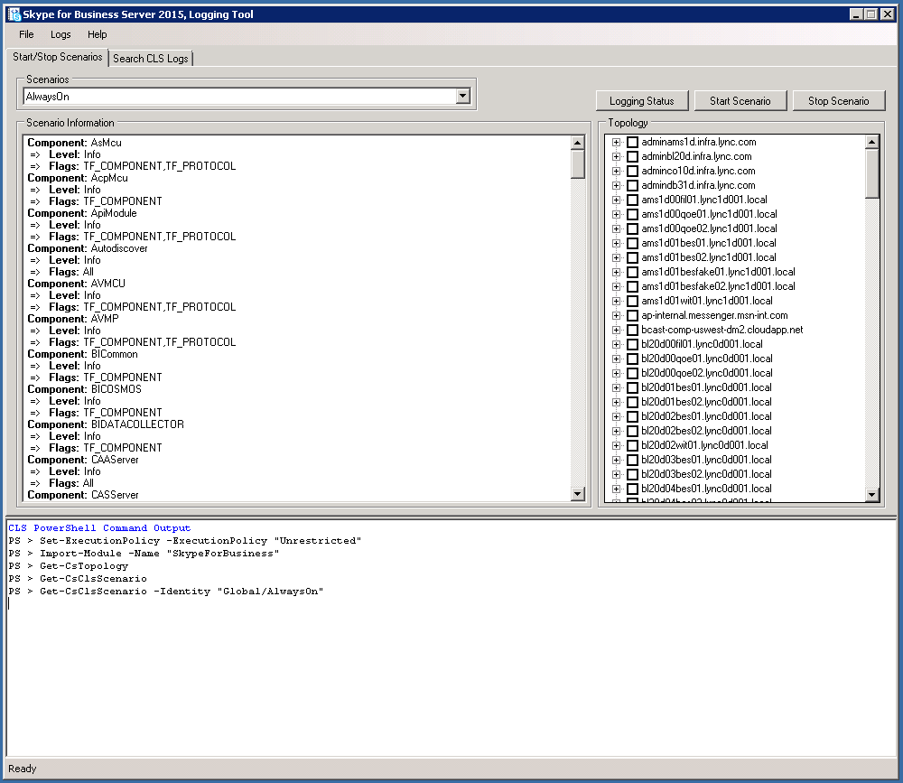
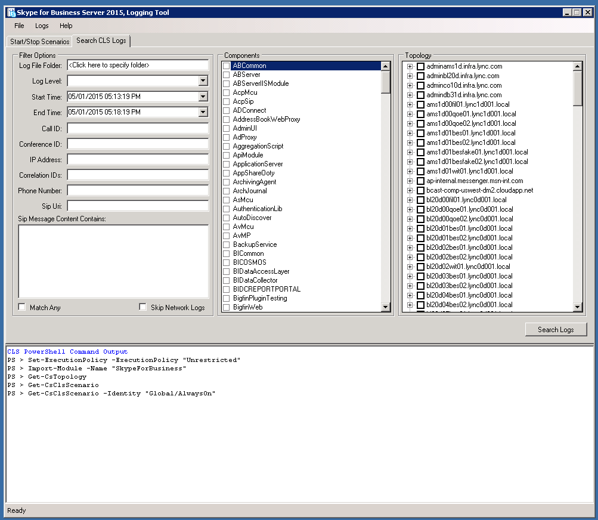
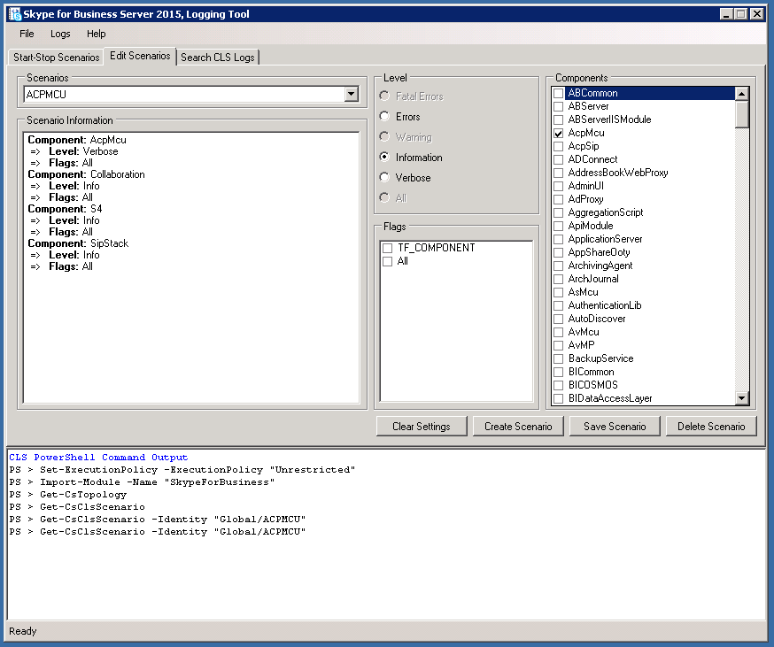

# CLS Logger for Skype for Business Server 2015
 
**Summary:** Learn how to use the Centralized Logging Service (CLS) Logger in Skype for Business Server 2015.
  
The CLS Logger is a tool that helps you manage logs generated by the Centralized Logging Service.
  
## Prerequisites

To successfully use the CLS Logger, you'll need to make sure that the following are true:
  
- You are using the tool on a computer that is a member of the domain where the Centralized Logging Service (CLS) is running. The tool is not currently supported in Remote PowerShell sessions.
    
- The Default.tmx file from the tracing folder (the folder where tracing data is captured for the CLS) and Snooper must be copied in to the same folder where the CLS Logger tool is installed.
    
## Check the Logging Status of a set of Pools/Computers

Use following commands to check logging status:
  
1. In the "Start/Stop Scenarios" tab, select a grouping of Pools and/or Computers in the Topology tree view.
    
2. Click the Logging Status button.
    
3. View the command output in the PowerShell Command Output area for specifics about the logging status of the selected Pools and/or Computers.
    
## Start an existing scenario

To start an existing scenario:
  
1. In the "Start/Stop Scenarios" tab, select an existing Scenario from the Scenarios drop down menu.
    
2. Select a grouping of Pools and/or Computers in the Topology tree view.
    
3. Click on the Start Scenario button. The user interface will get disabled until the operation completes. This may be slow on large deployments.
    
4. The user interface will be enabled again once the Scenario has been successfully started, the details of the action will also be shown in the PowerShell Command Output area.
    
5. The task may take some time before for the logging to be picked up by CLS before any new data from this scenario.
    
## Stop an existing scenario

To stop an existing scenario:
  
1. In the "Start/Stop Scenarios" tab, select an existing Scenario from the Scenarios drop down menu.
    
2. Select a grouping of Pools and/or Computers in the Topology tree view.
    
3. Click on the Stop Scenario button. The user interface will get disabled until the operation completes. This may be slow on large deployments.
    
4. The user interface will be enabled again once the Scenario has stopped, the details of the action will also be shown in the PowerShell Command Output area.
    

  
## Search for logs

In order to search for logs, select the "Search CLS Logs" tab and click the "Search Logs" button after filling in the displayed fields as described below:
  
> **Log File Folder** The folder to save the results of the log search. (Required)
> 
> **Log Level** This determines the lowest level that will show up in the results. For example if Warning is selected, only Warning, Error, and Fatal will be shown. Defaults to Debug.
> 
> **Pools** Computer pools to perform the log search against, these are the parent nodes the tree view. (Required)
> 
> **Computers** Individual computers to perform the log search against, these are all the child nodes in the tree view. (Required)
> 
> **Start Time** The time period where CLS will query the logs from. (Required)
> 
> **End Time** The time period where CLS will stop querying the logs from. (Required)
> 
> **Components** Used to select which components to add to the query. (Optional)
> 
> **Call ID** The Call ID of any SIP dialogs to be filtered by. Note, this field uses exact matching. (Optional)
> 
> **Conference ID** The conference ID of any conferences to be filter by. Note, this field uses exact matching. (Optional)
> 
> **IP Address** The IP address that to be filtered by. Note, this field uses exact matching. (Optional)
> 
> **Correlation IDs** Trace statements that are logically linked together by this ID. (Optional)
> 
> **Phone Number** Filter by phone number. (Optional)
> 
> **SIP URI** Filter by SIP URI. (Optional)
> 
> **SIP Message Content Contains** Filter by SIP message contents, this will substring search within this field. (Optional)
> 
> **Match Any** Searches using a logical OR if checked. Defaults to Exact match of all parameters.
> 
> **Skip Network Logs** Skips searching any network logs if checked.
    

  
## Create a scenario

1. In the **Edit Scenarios** tab, click the **Create Scenario** button.
    
    > [!NOTE]
    > Creating a new scenario will clone the configuration of the scenario that is currently selected. If you click **Clear Settings** before creating a new scenario it will start with no components and Flags selected.
  
2. Enter the name of the scenario you which to create and press Enter key or click the Ok button.
    
3. The new scenario will now be created. Upon successful creation the Scenarios drop-down will be selected with the newly created Scenario.
    
## Modify a scenario

  
1. In the **Edit Scenarios** tab, find the desired scenario to modify.
    
2. Make the desired changes to the components, levels, and flags.
    
3. Click the **Save Scenario** button.
    
4. Upon successfully saving the scenario, it will refresh the scenario information pane with the updated configuration.
    
## Delete a scenario

1. In the **Edit Scenarios** tab, select an existing Scenario from the Scenarios drop down menu.
    
2. Click **Delete Scenario** to delete the scenario.
    
3. After confirming the action the scenario will be deleted.
    

