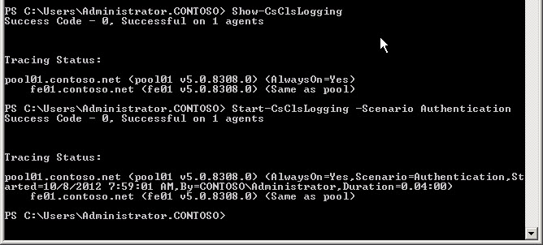
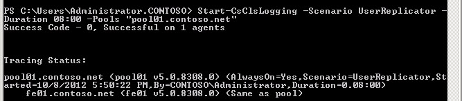

# Start or stop CLS log capture in Skype for Business Server 2015
 
**Summary:** Learn how to start or stop a Centralized Logging Service log capture session in Skype for Business Server 2015.
  
To capture trace logs using the Centralized Logging Service, you issue a command to begin logging on one or more computers and pools. You also issue parameters that define which computers or pools, what scenarios to run (for example, AlwaysOn, another predefined scenario, or a scenario you have created), what Skype for Business Server components (for example, S4, SipStack) to trace.
  
To capture the right information, you need to make sure you use the right scenario to collect information that is relevant to the problem. In the Centralized Logging Service, a scenario is the concept of turning logging on based on a collection of server components, logging levels, and flags, which is much more efficient and useful than having to define these elements on a per-server basis. You define and specify a scenario to run and the scenario is run consistently across all servers and pools in the scope of the infrastructure.
  
The default scenario is called **AlwaysOn**. The intended purpose for AlwaysOn is to run the scenario constantly, as the name of the scenario implies. The AlwaysOn scenario collects Info level information (note that Info logging level includes Fatal, Error, and Warning in addition to Info messages) for many of the most common server components. AlwaysOn collects information before, during, and after a problem occurs. This differs dramatically from the typical behavior of previous logging tools such as OCSLogger. You ran OCSLogger after the problem had already occurred, making your troubleshooting efforts more difficult because the data that you have is reactive, not proactive. If AlwaysOn does not contain the information that you are looking for in order to point to the problem component and indicate a course of action to fix it (which is not likely given the breadth and depth of providers in AlwaysOn), it will indicate a reasonable level of information to determine what else you need to do, such as creating a new scenario, gather other information, run a different search to collect more focused details, and so on.
  
The Centralized Logging Service provides two ways to issue commands. A number of topics have been focused squarely on using Windows PowerShell through the Skype for Business Server Management Shell. The ability to use a number of complex configurations and commands favors Windows PowerShell for Centralized Logging Service use. Because Windows PowerShell through the Skype for Business Server Management Shell is nearly ubiquitous for all functions in Skype for Business Server, only the Windows PowerShell commands are discussed. 
  
### To run Start-CsClsLogging with Windows PowerShell using basic commands

1. Start the Skype for Business Server Management Shell: Click **Start**, click **All Programs**, click **Skype for Business 2015**, and then click **Skype for Business Server Management Shell**.
    
2. Start a logging scenario with the Centralized Logging Service by typing the following:
    
   ```
   Start-CsClsLogging -Scenario <name of scenario>
   ```

    For example, to start the **AlwaysOn** scenario, type:
    
   ```
   Start-CsClsLogging -Scenario AlwaysOn
   ```

    > [!NOTE]
    > The AlwaysOn scenario has no default duration. This scenario will run until you explicitly stop it with the **Stop-CsClsLogging** cmdlet. For details, see [Stop-CsClsLogging](https://docs.microsoft.com/powershell/module/skype/stop-csclslogging?view=skype-ps). For all other scenarios, the default duration is 4 hours. 
  
3. Press Enter to run the command. 
    
    > [!NOTE]
    > It may take a short amount of time (30 to 60 seconds) for the commands to run and to receive the status back from the computers in your deployment. 
  
     
  
4. To start another scenario, use the **Start-CsClsLogging** cmdlet with the name of the additional scenario to run as follows (for example, the scenario **Authentication**):
    
   ```
   Start-CsClsLogging -Scenario Authentication
   ```

    > [!IMPORTANT]
    > You can have a total of two scenarios running on any given computer at any time. If the command is global in scope, all of the computers in your deployment will run the scenario or scenarios. To start a third scenario, you must stop logging on the computer, pool, site, or global scope that you want to run the new scenario on. If you have started a global scope, you can stop logging for one or both of the scenarios on one or more computers and pools. 
  
### To run Start-CsClsLogging with Windows PowerShell using advanced commands

1. Start the Skype for Business Server Management Shell: Click **Start**, click **All Programs**, click **Skype for Business 2015**, and then click **Skype for Business Server Management Shell**.
    
2. Additional parameters are available to manage the logging commands. You can use -Duration to adjust the length of time for the scenario to run. You also can define -Computers, a list of computer fully qualified domain names (FQDNs) separated by a comma, or -Pools, a comma separated list of FQDNs for pools that you want to run logging on.
    
    You start a logging session for the UserReplicator scenario on the pool "pool01.contoso.net". You also define the duration of the logging session at 8 hours. To do this, type:
    
   ```
   Start-CsClsLogging -Scenario UserReplicator -Duration 8:00 -Pools "pool01.contoso.net"
   ```

    The successful execution of this scenario returns a result like the following:
    
     
  
Note that in this example, the AlwaysOn scenario is running and the UserReplicator scenario is running. 
    
## Stop the Centralized Logging Service log capture
<a name="stop"> </a>

You can stop a currently running logging session with the Stop-CsClsLogging cmdlet. Generally, there aren't many situations in which you would need to stop a logging session. For example, you can search logs and change configurations without first needing to stop logging. If you have two scenarios running, for example AlwaysOn and UserReplicator, and you need to collect information related to Authentication, you will need to stop one of the other scenarios (at a global, site, pool or computer scope) before you can start running to Authentication scenario. For details, see [Stop-CsClsLogging](https://docs.microsoft.com/powershell/module/skype/stop-csclslogging?view=skype-ps).
  
> [!NOTE]
> When determining what scenarios you can run on a given deployment, pool or computer, you need to remember that you are limited to running two scenarios **per computer**: AlwaysOn and one custom scenario. If you are logging activity on a pool, you should treat a pool as a single entity. In most cases, it would not make sense to run different scenarios on each computer in a pool. It does make sense to look at the problem that you are collecting data about and think about what scenario makes the most sense on a given computer in the overall deployment. For example, if you consider the UserReplicator scenario, there would be very little value in running UserReplicator on an Edge Server or Edge pool. 
  
After you understand the problem and the scope of the impact, you should make careful choices about what scenarios to run on which computers and pools. While the AlwaysOn scenario makes sense for a wide scope application because it collects information on a wide variety of providers, specific scenarios only have application value on specific computers or pools. Also, you should take caution when randomly starting up a logging session without first understanding the value of a given scenario. If you use the wrong scenario, or if you use a scenario that is appropriate for the task and you apply the scenario at the wrong scope (be it global, site, pool, or computer), you can get questionable data that is not very useful—as if you didn't run the scenario at all.
  
To control the Centralized Logging Service functions by using the Skype for Business Server Management Shell, you must be a member of either the CsAdministrator or the CsServerAdministrator role-based access control (RBAC) security groups, or a custom RBAC role that contains either of these two groups. To return a list of all the RBAC roles this cmdlet has been assigned to (including any custom RBAC roles you have created yourself), run the following command from the Skype for Business Server Management Shell or the Windows PowerShell prompt:
  
```
Get-CsAdminRole | Where-Object {$_.Cmdlets -match "Skype for Business Server 2015 cmdlet"}
```

For example:
  
```
Get-CsAdminRole | Where-Object {$_.Cmdlets -match "Set-CsClsConfiguration"}
```

> [!NOTE]
> So you may be wondering: Now that you've enabled logging, where are the logs kept? Since you'll access the information stored in the logs using management shell queries sent to the CLS Agents, and you can output the results to several possible file formats, where on each server a CLS Agent keeps its records isn't actually important to know.  The log files can be saved to a location you specify and  read and analyzed using a variety of tools, including **Snooper.exe** and any tool that can read a text file, such as **Notepad.exe**. Snooper.exe is part of the Skype for Business Server 2015 Debug Tools and is available as a [Web download](https://go.microsoft.com/fwlink/p/?LinkId=285257).

### To stop a currently running Centralized Logging Service session

1. Start the Skype for Business Server Management Shell: Click **Start**, click **All Programs**, click **Skype for Business 2015**, and then click **Skype for Business Server Management Shell**.
    
2. Query the Centralized Logging Service to find out what scenarios are currently running by typing the following:
    
   ```
   Show-CsClsLogging
   ```

   
  
   The result of Show-CsClsLogging is a summary of the scenarios that are running and what scope they are running in. For details, see [Show-CsClsLogging](https://docs.microsoft.com/powershell/module/skype/show-csclslogging?view=skype-ps).
    
3. To stop a currently running logging session with a specific scenario, type:
    
   ```
   Stop-CsClsLogging -Scenario <scenario name> -Computers <comma separated list of fully qualified computer names> -Pools <comma separated list of fully qualified pool names>
   ```
   For example:
    
   ```
   Stop-CsClsLogging -Scenario UserReplicator -Pools pool01.contoso.net
   ```

   This command will stop logging with the UserReplicatior scenario on pool01.contoso.net.
    
    > [!NOTE]
    > Logs created during this logging session using the UserReplicator scenario are not deleted. The logging is still available for you to execute searches against using the Search-CsClsLogging command. For details, see [Search-CsClsLogging](https://docs.microsoft.com/powershell/module/skype/search-csclslogging?view=skype-ps). 
  
Acting as the companion command to Start-CsClsLogging, the Stop-CsClsLogging cmdlet ends the logging session, defined by scenarios, and retains the logs created by the logging session. You can run two scenarios on a given computer at any time. The method of stopping one scenario to gather information using another scenario is a common task that you can perform during most workload troubleshooting.
## See also
<a name="stop"> </a>

[Centralized Logging Service in Skype for Business 2015](centralized-logging-service.md)
