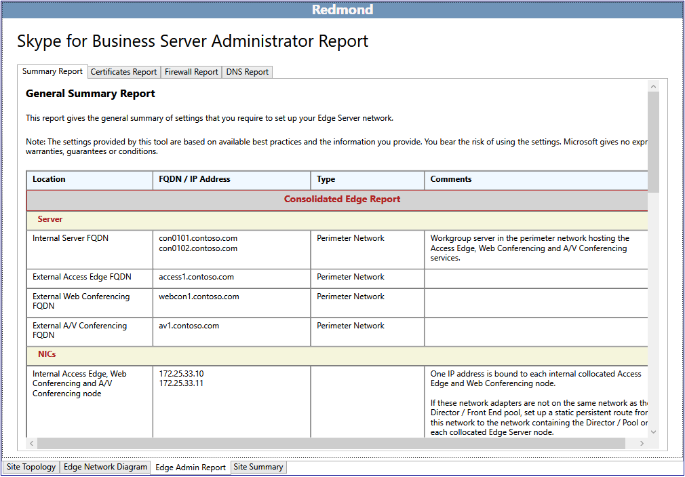

# Edit the topology in Skype for Business Server 2015

After completing the initial interview questions, you can edit the fully qualified domain name (FQDN) and IP addresses for the site. To do this, on the **Global Topology** page, double-click the site that you want to edit.

The Planning Tool displays the site topology for the selected site. At the bottom of the site page are four tabs:

- Site Topology - The currently displayed page with a visual overview of the topology as recommended.

- Edge Network Diagram - The Edge Network Diagram page is where the designer does most of the work in the Planning Tool. The diagram displays the network configuration for a recommended Skype for Business Server 2015 topology, with editable entries for IP addresses and FQDNs for servers, pool, and both hardware and Domain Name System (DNS) load balancers.

- Edge Admin Report - The Edge Admin Report contains a total of four reports:

     

  - Summary Report - A general report of settings for the Edge network configuration. If you edit the values on the **Edge Network Diagram** page to the topology TCP/IP and FQDN values of that will be used in the actual deployment, those addresses and names will be represented here. Otherwise, the default text will appear.

  - Certificate Report - The certificate report will list the subject name and subject alternative names for the certificates that are required for the topology.

  - Firewall Report - The firewall report lists information necessary to configure perimeter firewalls in the infrastructure. This includes the IP addresses (either the default or edited values), server role, source IP and port, destination IP and port, transport protocol, application protocol, and relevant notes.

  - DNS Report - The DNS Report lists relevant information for the DNS entries that you must create. The record type, FQDN, IP address, and comments necessary for the proper operation are included.

- Site Summary - The site summary presents an overview of the selections that you made by either answering the initial interview questions or filling in the values in **Design Sites**. Capacity information is also presented.

    > [!NOTE]
    > The information on the Site Summary page is customized for each design and may not contain all sections or information detailed here.

## Edit the network configuration diagram

Most of the work that a designer does in the Skype for Business Server 2015 Planning Tool consists of defining the entries for the IP addresses and fully qualified domain names (FQDNs) for the entries on the network diagram. The information that is entered on this page carries over into the reports and other information contained in the Planning Tool.

The Planning Tool creates a network diagram with default text for IP addresses and FQDNs.

To edit the network diagram and input values:

1. Choose a section of the network to begin working on. For example, double-click the text, **access1.contoso.com**. In the dialog box that opens, type the actual FQDN of the server access1.contoso.com and the actual IP address, replacing the 131.107.155.3.

2. Click **OK** to save the entries.

3. Continue to edit IP addresses and FQDNs, providing virtual IP addresses for hardware load balancers or server entries for Domain Name System (DNS) load balancing for servers in pools.

A helpful feature of the Planning Tool is that it can incrementally assign a range of IP addresses and server host names, rather than requiring the designer to edit each separate server in a pool. For example:

1. Double-click the pooled Front End Servers. When the dialog box opens, select **Do you want to use the IPs and FQDN as starting points for all equivalent servers in this cluster?**.

2. For example, the starting value for the first server is fe0101.contoso.com and an IP address of 192.168.21.122.

3. Type fe0.contoso.com in **Front End Server FQDN**, type 192.168.21.131 in **Front End Server IP address**, and then click **OK**.

4. The auto-increment feature updates all servers in the pool to fe01 through fe06, and all IP address from 192.168.21.131 to 136.

After you have completed all edits, save the topology by completing the following steps:

To save the Planning Tool design, click **File**, and then click **Save Topology** or **Save Topology As**. If a **Save Planning Tool As** dialog box appears, type a name for the file in **File name**, and then click **Save**.

## See also

[Editing the Design](https://technet.microsoft.com/library/08f639ba-0e5f-4ae7-9191-c3d96c25b169.aspx)
