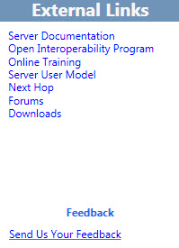

# Navigate the Planning Tool in Skype for Business Server 2015

You navigate the Skype for Business Server 2015 Planning Tool by using a combination of a toolbar, page-specific buttons and links, and context-specific panes. The context-specific panes provide design information for planning and capacity that is relevant to the selection options on a specific page.

On starting the Planning Tool, a designer first sees the **Welcome to the Planning Tool for Skype for Business Server 2015** page.

On the Welcome page, the designer chooses **Get Started**, **Design Sites**, or **Display**. For details, see [Create the initial topology design for Skype for Business Server 2015](create-the-initial-design.md).

At the top of the Planning Tool is a toolbar that provides easy access to frequently used functions. The toolbar is displayed here for reference, and each function will be discussed in related topics.

The Planning Tool has an External Links section on the left side of the tool. From here, the designer has easy access to planning and deployment information, and other technical resources such as training, technical blogs, forums, and other downloadable resources. Also in the External Links section is a Feedback link to the Skype for Business Server 2015 Planning Tool team.

A context-sensitive Actions pane is displayed on many pages in the Planning Tool. The Actions pane gives the designer easy access to main sections of the topology. The links available in the Actions pane change based on the detail level in your topology. The Actions pane is available after you have completed the interview questions and displayed your topology. Included in the Actions pane is the Overview section, which displays numbers that the designer has entered as part of the interview process. The overview is contextually related to the displayed information.

Additionally, hardware information is displayed in the overview under the Actions pane. The hardware configuration displays a list of hardware requirements that the current topology recommends.

## See also

[Create the initial topology design for Skype for Business Server 2015](create-the-initial-design.md)

[Editing the Design](https://technet.microsoft.com/library/08f639ba-0e5f-4ae7-9191-c3d96c25b169.aspx)

[Reviewing the Administrator Reports](https://technet.microsoft.com/library/1dee56a9-a033-4201-9765-e3469bd7d3e3.aspx)
