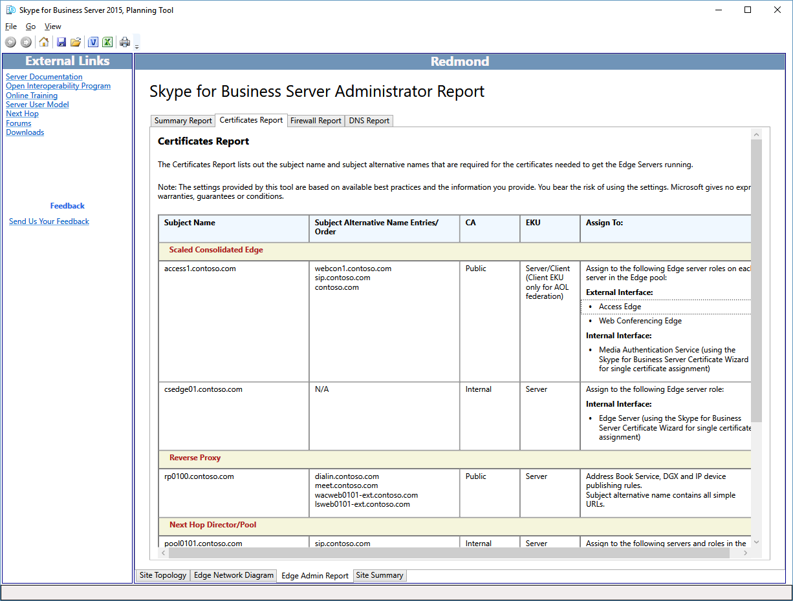
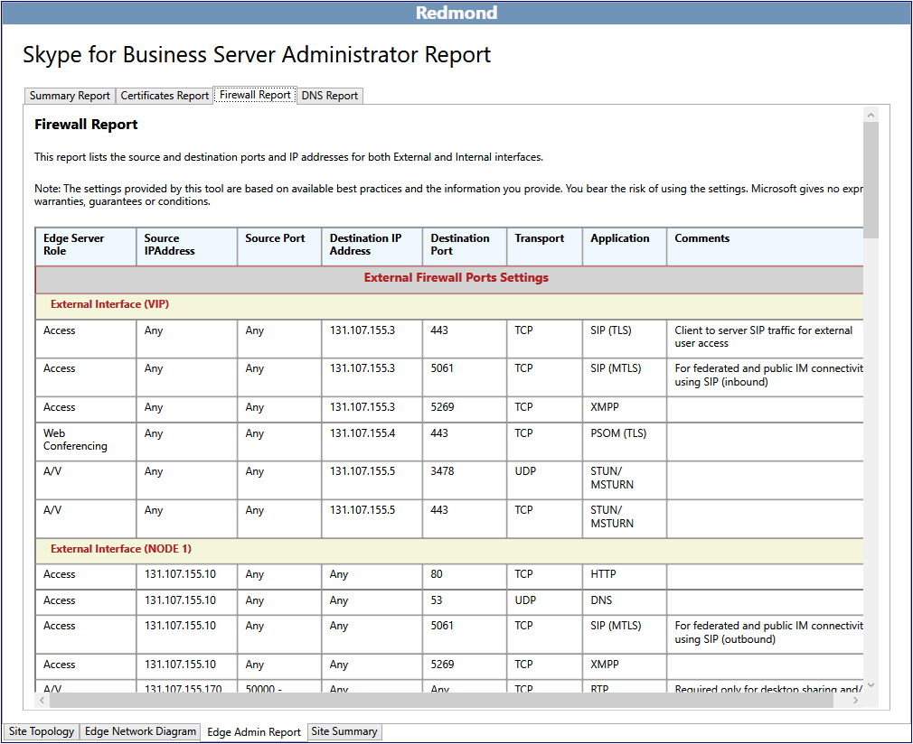
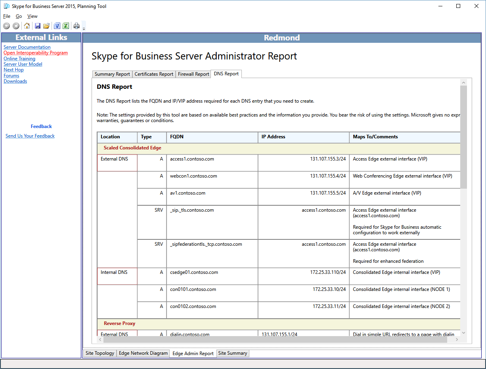

# Review the Administrator Reports in Skype for Business Server 2015

The Administrator Reports are detailed information for deployment and operations. The reports are generated based on the selections marked in **Design Sites**. The designer can further add value to the Administrator Reports by editing the network diagrams and defining the complete IP addresses and fully qualified domain names (FQDNs) for servers, pools, and load balancers.

The Administrator reports feature allows you to:

- [Review the Summary Report](review-the-administrator-reports.md#Summary_report)

- [Review the Certificates Report](review-the-administrator-reports.md#Certificates_Report)

- [Review the Firewall Report](review-the-administrator-reports.md#Firewall_report)

- [Review the DNS Report](review-the-administrator-reports.md#DNS_Report)

## Review the Summary Report

The Skype for Business Administrator Report is the first of four valuable reports that document your design in detail. The information in this report, and the other three associated reports, is useful for your Information Technology Teams:

The Summary Report lists general configuration information associated with your Edge network. The location, fully qualified domain name (FQDN) and IP address, type of network, and comments specific to a given role are documented.

The designer and each of the teams that will deploy, manage, and maintain the infrastructure should review the summary report for accuracy and to make sure that errors are at a minimum.

You can also view more detailed reports:

- Certificates Report

- Firewall Report

- DNS Report

## Review the Certificates Report

The Certificates Report contains all certificates that are required in the recommended Skype for Business Server 2015 deployment. The Planning Tool accounts for the subject names and subject alternative names that are entered. Default text that is left unedited may represent a potential challenge for the team responsible for requesting and issuing the certificates. Certificate information also contains information about where the certificate can typically be issued from. If the infrastructure does not have an internal public key infrastructure (PKI) in place, all certificates can be requested through a public certificate provider. Extended key usages (EKU) and Assign To fields in the report are very helpful in understanding what the purpose and location for each certificate should be.

Carefully review, and be sure to understand, the use and purpose of each certificate in the deployment. If there is a question about what a certificate does, determine which server or service is talking to what. Certificates in Skype for Business Server 2015 are used for two primary purposes:

- Mutual Transport Layer Security (MTLS) - The computers involved in the communication each present a certificate that proves their identity to another computer. This is known as server authentication. Communication cannot begin until each computer trusts the other computer's identity.

- Encryption - Encryption (Secure Sockets Layer, or SSL, and Transport Layer Security, or TLS) is a critical means to help secure communications, help ensure privacy, and to create a trusted communications and collaboration system.

## Review the Firewall Report

Skype for Business Server 2015 has a potentially complex set of firewall rules. The Planning Tool reduces this complexity by generating a report that defines in detail all firewall requirements, based on the designer's input criteria. The IT firewall administrator will be able to use this report to configure and define the necessary rules.

From the standpoint of firewall management, the report should be carefully reviewed to make sure that there are no conflicts with exiting firewall rules and that there are no policies or procedures that might be violated.

## Review the DNS Report

The DNS Report, which is part of the Administrator Report, details all of the recommended and known entries for the Domain Name System (DNS) in the internal, perimeter, and external networks. If the designer has completed the edits to the network diagram, and all IP addresses and fully qualified domain names (FQDNs) are defined to their production values, the DNS Report provides an excellent configuration resource. This report can also serve as an operational troubleshooting document.

You should have your DNS management team review the DNS Report thoroughly to make sure that there are no errors that may cause difficulty during deployment or that may complicate a troubleshooting session.

## See also

[Reviewing the Administrator Reports](https://technet.microsoft.com/library/1dee56a9-a033-4201-9765-e3469bd7d3e3.aspx)
