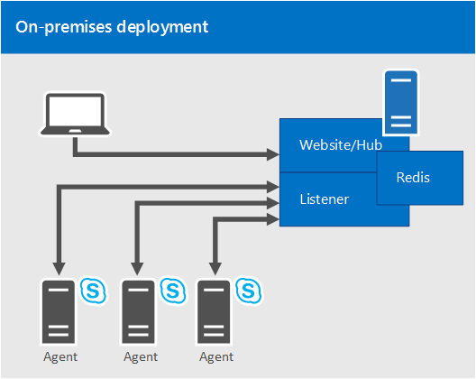

# Plan for Statistics Manager for Skype for Business Server

**Summary:** Read this topic to learn about Statistics Manager for Skype for Business Server.

 Statistics Manager for Skype for Business Server is a powerful tool that allows you to view Skype for Business Server health and performance data in real time. You can poll performance data across hundreds of servers every few seconds, and view the results instantly on the Statistics Manager Website.

You can use Statistics Manager to identify ongoing performance issues, view the results of a planned change to your environment, track resolution of outages, and much more. Out of the box, Statistics Manager is configured with Key Health Indicator (KHI) thresholds, and can be customized to suit your deployment's unique needs.

You can deploy Statistics Manager in an on-premises deployment in which a single server hosts all of the server-side Statistics Manager components. For more information about deploying Statistics Manager, see [Deploy Statistics Manager for Skype for Business Server](deploy.md). If you already have an existing deployment of Statistics Manager, but you have not yet upgraded to Release 2.0, see [What's new in Release 2.0](plan.md#BKMK_WhatsNew) and [Upgrade Statistics Manager for Skype for Business Server](upgrade.md).

This topic contains the following sections:

- [Features and capabilities](plan.md#BKMK_Features)

- [What's new in Release 2.0](plan.md#BKMK_WhatsNew)

- [Components](plan.md#BKMK_Components)

- [On-premises deployment](plan.md#BKMK_DeploymentOptions)

- [Requirements](plan.md#BKMK_Requirements)

- [Security considerations](plan.md#BKMK_Security)

## Features and capabilities

Statistics Manager allows you to:

- View raw data for all servers in real time. (Data is sampled at a very high rate and sent to the website in less than one second.)

- View data that is aggregated for a specific role; for example, Front End Server, Mediation Server, Edge Server, and so on.

- Drill down to view data for specific sites, specific pools within the site, and then specific servers within the pool.

- Create custom charts so that chosen counters are shown by default.

- Zoom and pan on both the x- and y- axes or on the x-axis only.

- Use date ranges or points in time to filter data.

- View server performance based on established key health indicators (KHIs). KHIs represent a collection of performance counters with a defined healthy range.

- View detailed metrics for each counter.

- Compare data across multiple populations or servers.

- View latent counter reports to identify agents that are not reporting current data to the dashboard service.

- Save a particular instance of chart data to a file.

- View KHIs in real time, including updates. If the history view is enabled, only new failures are shown.

  - View all KHIs at one time

  - View KHIs by server (Landscape view)

  - View KHI definitions

## What's new in Release 2.0

The following describes what's new in Release 2.0. If you have an existing deployment of Statistics Manager and you've not yet upgraded, see [Upgrade Statistics Manager for Skype for Business Server](upgrade.md).

- Scenario views have been added for Edge Media, Fabric Health, Pool Failover and Registration scenarios.

- Many new counters have been added for SQL servers, more Skype for Business usage counters, and so on.

- Watcher node integration for the Statistics Manager Agent - if the Agent is installed on a watcher node, it will report synthetic transaction statistics as counters back to Statistics Manager.

- Numerous reliability and performance improvements.

To verify the version of the Statistics Manager Website you are running:

- In File Explorer, open (default directory) C:\Program Files\Skype for Business Server StatsMan WebSite\bin

- Right click on StatsManHubWebSite.dll and view its properties

- The product version will be shown in the Description details.

## Components

Statistics Manager consists of the following components:

- **Agent.** A lightweight agent that runs on each monitored server. The Agent allows configurable high rate polling of performance counters with local aggregation.

- **Listener.** The server side API that receives data from all Agents, and aggregates data across populations.

- **Hub.** Serves as the client API for the system, runs on the web server(s), and provides real-time data updates to clients connected via the website. (The Hub is automatically installed as part of the Website msi.)

- **Website.** A user interface that pulls together all the features available in the system.

In addition, Statistics Manager requires **Redis**, an open-sourced data structure server for in-memory caching. For more information about downloading Redis, see [Deploy Statistics Manager](deploy.md#BKMK_Deploy) .

## On-premises deployment

In an on-premises deployment, a single server hosts all of the server-side Statistics Manager components.

The following diagram shows an on-premises deployment, in which the Statistics Manager Website, Hub, Listener, and Redis caching system are hosted on a single machine. Statistics Manager is monitoring three Skype for Business servers, each of which have a single Agent transmitting data to the Listener. Users connect to a single Website to view all data aggregated by Statistics Manager:

## Requirements

You will need to consider the following software, networking, and hardware requirements before you deploy Statistics Manager.

### Software requirements

- Windows Server 2016 and 2019

- IIS (automatically installed)

- Redis

- Statistics Manager services (automatically installed)

- PSExec - Required to do remote agent deployment

- .NET 4.5 (included with 2012 R2) - Required for agents and server-side components
- Download the [Skype for Business Server, Real-Time Statistics Manager (64-bit)](https://www.microsoft.com/en-in/download/details.aspx?id=57518)

### Networking requirements

|**Hosting server**|**Agents**|**Listener**|
|:-----|:-----|:-----|
|Minimum gigabit full duplex networking.    |Outbound TCP port 8443 (customizable port number) to communicate with the Listener.    |The Listener port must be the same on all servers.    |
|Inbound TCP port 80 or 443 open to host the website.    |||
|Inbound TCP port 8443 (customizable port number) for the agents to communicate with it.    |||

During installation, firewall ports for the Listener and the Website are automatically created. For the Agents, the installation assumes that outbound TCP connections are allowed by default.

### Hardware requirements

In an on-premises deployment, in which a single server hosts all of the server-side Statistics Manager components, a server with 16 GB of RAM and 4 CPU's should be able to support about 150 samples per second on average. To determine how many counters/agents you can support, use the following calculation:

100 servers \*80 counters \* 1 sample per minute from each agent / 60 seconds = ~ 133 samples per second.

## Security considerations

All traffic between servers is encrypted.

- Encrypted HTTPS traffic will be sent over port 8443 (by default) from the Agent to the Listener server.

- The Agent will verify the SSL thumbprint on the server to ensure the Listener server is the expected recipient. Note that the Agent uses certificate thumbprint verification (instead of chain verification). It will not do full certificate validation because it is possible to use self-signed certificates.

- After the Agent is satisfied the Listener is authentic, a password will be presented by the Agent which is then verified by the Listener.

- The Agent begins transmitting performance data over the connection to the Listener.

## For more information

For more information, see the following:

- [Deploy Statistics Manager for Skype for Business Server](deploy.md)

- [Upgrade Statistics Manager for Skype for Business Server](upgrade.md)

- [Troubleshoot Statistics Manager for Skype for Business Server](troubleshoot.md)
