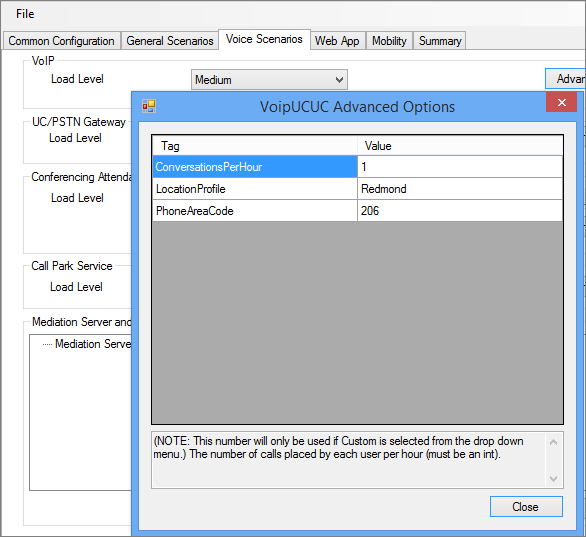
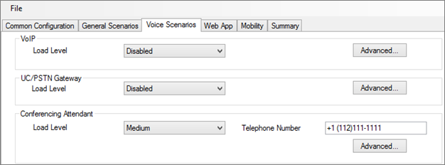
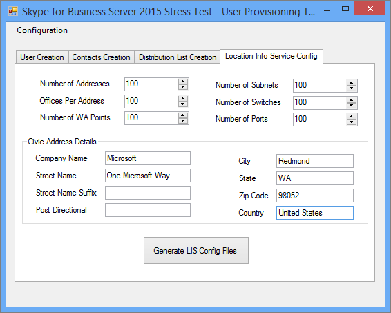
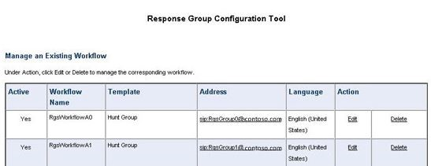

# Configuring policies for the Skype for Business Server 2015 Stress and Performance Tool
 
Policy configuration for Skype for Business Server 2015 Stress and Performance Tool.
  
There are several policies and other areas that you can configure in Skype for Business Server 2015, prior to running the Stress and Performance Tool:
  
- [Archiving policy](configuring-policies.md#ArchivingPolicy)
    
- [Conferencing policy](configuring-policies.md#ConferencingPolicy)
    
- [Contacts policy](configuring-policies.md#ContactsPolicy)
    
- [Federation policy](configuring-policies.md#FederationPolicy)
    
- [Call Admission Control policy](configuring-policies.md#CACPolicy)
    
- [Voice Routing rules](configuring-policies.md#VoiceRoutingRules)
    
- [Conference Attendant application](configuring-policies.md#ConfAttendantApp)
    
- [Server Call Park service](configuring-policies.md#ServerCallParkServ)
    
- [Emergency calls](configuring-policies.md#EmergencyCalls)
    
- [Configuring Response Group application](configuring-policies.md#ConfigResponseGroupApp)
    
## Archiving policy

If you have an Archiving server deployed in your Skype for Business Server topology, you can look at the ArchivingPolicy.ps1 script. If you need further assistance, check out the Archiving and Web Conferencing cmdlets.
  
## Conferencing policy

For conferencing, we have the MeetingPolicy.ps1 script. If you need further assistance, check out the Web Conferencing cmdlets.
  
## Contacts policy

ContactsPolicy.ps1 script will be the sample you'll need to review. The IM and Presence cmdlets will help if you need further references.
  
## Federation policy

The sample script for federation is FederationPolicy.ps1. The cmdlets to review, if you need further insight, will be Edge Server, federation, and external access.
  
## Call Admission Control policy

You can reference BandwidthPolicy.ps1 for this policy. The Call Admission Control cmdlets will have further information as well.
  
## Voice Routing rules

You'll need the RoutingRules.ps1 sample script for Voice Routing. When you're configuring these rules, take note of the phone context (that is, /Location Profile or /SimpleName) and Internal/External Area Codes, so that you can specify them when creating users. You'll also need them during LyncPerfTool configuration (specifically for PSTN-UC and UC-PSTN).
  
For example, the SimpleName parameter in the call to the **New-CsDialPlan** cmdlet in the RoutingRules.ps1 example should be used for the LocationProfile value in the following figure of UserProfileGenerator.exe:
  

  
For details, you can review the Enterprise Voice cmdlets.
  
## Conference Attendant application

First review the ConferenceAutoAttendantConfiguration.ps1 script. You'll want to take note of the ConferencingAutoAttendant phone number (1121111111 by default), so that you can enter it into the LyncPerfTool configuration tool for configuration generation, as below:
  

  
You'll find more details in the Conferencing and Dial-in Conferencing cmdlets.
  
## Server Call Park service

This is actually disabled by default. You can review the CallParkConfiguration.ps1 sample script if you need to test this. Additionally, check out the Call Park Application cmdlets as needed.
  
## Emergency calls

You'll need to perform the following steps to configure stress and performance testing for emergency calls:
  
1. Set up a voice route for emergency calls. You can use the RoutingRules.ps1 script, and check under the comment " **Route E911 to PSTN** " for an example of how to set up this voice route.
    
    > [!CAUTION]
    > The example command in RoutingRules.ps1 has a number pattern that includes the number 119 rather than 911. You should avoid using 911 (or your actual local emergency number) to prevent accidental calls to your local emergency operators during your load testing. Remember, this configuration is for simulation purposes only! 
  
2. Configure addresses by filling in the values on the **Location Info Service Config** tab in the UserProvisioningTool, as shown in the following figure:
    
     
  
3. When you've entered everything into the UserProvisioningTool, click the **Generate LIS Config Files** button.
    
4. Now CSV files for ports, subnets, switches, and wireless access points (WAPs), as well as an XML file for the Stress and Performance tool will be generated. You can use the CSV files for inputs when configuring the Location Information service (LIS) with the LisConfiguration.ps1 script. To do this, you'll need to move the Locations0.xml file to the same folder as the Stress and Performance Tool executable (LyncPerfTool.exe). This will let you run location profile (dial plan) scenarios.
    
## Configuring Response Group application

The sample script is ResponseGroupConfiguration.ps1. There are also Response Group application cmdlets to review for further configuration details. The following diagram will show some of the configuration details:
  

  

