# Using the Skype for Business Server 2015 Stress and Performance Tool
 
To run the Skype for Business Server 2015 Stress and Performance Tool, you'll need to be able to manage both users, contacts and user profiles, configure the tool for running, and then review the output or results that are produced by the tool.
  
There are four areas involved with running the Skype for Business Server 2015 Stress and Performance Tool (the executable is LyncPerfTool.exe):
  
- [Create Users and Contacts](using-the-tool.md#BKMK_CreateUsersAndContacts)
    
- [Configure User Profile](using-the-tool.md#BKMK_UserProfile)
    
- [Run LyncPerfTool](using-the-tool.md#BKMK_RunTool)
    
- [Interpreting the Results](using-the-tool.md#BKMK_Interpret)
    
## Create Users and Contacts
<a name="BKMK_CreateUsersAndContacts"> </a>

You need to use the Skype for Business Server 2015 (SB 2015) User Provisioning Tool (UserProvisioningTool.exe) to create users and contacts for your stress and performance testing.
  
This is a list of helpful terms that might be useful as you read through the topics:
  
- **Organizational Unit** - The Active Directory Domain Services (AD DS) organizational unit (OU).
    
- **Federated / Cross Pool** - Users who can communicate with users from other Instant Messaging (IM) services.
    
- **Distribution Lists** - Or DLs. These are objects in AD DS that contain a list of AD DS users. They're used to facilitate communications across groups of people.
    
- **Location Info Service** - The Skype for Business Server 2015 service that, when it's enabled and configured per phone, allows for the retrieval of physical location for Enhanced 911 (E911) services.
    
- **U.S. Phone Numbers** - Phone numbers assigned to user in addition to the SIP URI that's used for routing inbound and outbound calls in Reverse Number Lookup (RNL).
    
### Create Users and Contacts by using UserProvisioningTool.exe

> [!NOTE]
> Before you even begin, be absolutely sure you're logged in as a member of the Domain Admins security group to run this tool. You need to do this, because you're going to be creating Active Directory users. 
  
You have to use the Skype for Business Server User Provisioning Tool to create users and contacts for load simulation.
  
The **Skype for Business Server User Provisioning Tool** is installed with the **Skype for Business Server Stress and Performance Tool** package. Be sure that the package installer (CapacityPlanningTool.msi) has been run on the Front End Server or the Standard Edition server you intend to test.
  
You can start the Skype for Business Server User Provisioning Tool by running the file UserProvisioningTool.exe (located at %InstalledDirectory%LyncStressAndPerfTool\LyncStress) on the Front End Server or on the Standard Edition server.
  
> [!IMPORTANT]
> When you create a large number of users (for example, 10,000 or more), run the UserProvisioningTool.exe. You'll need to do this because the tool will be creating and configuring  *new*  AD users.
  
When the User Provisioning Tool opens, click Configuration and select the Load Configuration. 
  
To begin configuring users and contacts, load the default file included with the package, called "SampleData.xml". This will prepopulate fields with sample data that you'll need to change to make it relevant for your deployment.
  
If you have a preconfigured XML file that already contains your customized settings, you can load that file instead. Fill in the fields in the User Provisioning Tool, as described in the sections below.
  
### To configure server options:

1. In the **Front End Pool FQDN** field, type the fully qualified domain name (FQDN) of the Standard Edition server, or the Front End pool where you want to host the users.
    
2. In the **User Name Prefix** field, type a prefix that you want to use to bust your user names for testing purposes (such as "TestUser").
    
3. In the **Password** field, type a password that will be used across all the test user accounts.
    
4. In the **Account Domain** field, type the domain name of your current AD domain (the one in which you want to create your test users).
    
5. In the **Organizational Unit** field, type the name of the AD domain where you want to create these test users. (If the OU doesn't already exist, it'll be created for you).
    
6. In the **Phone Area Code** field, type the three-digit area code to be used across all test user accounts. Make certain that the area code you chose doesn't conflict with other users' area codes in AD.
    
7. Click to select the **Voice Enabled** check box, if you want to enable the test users for Enterprise Voice.
    
8. In the **Number of Users** field, give the total number of test users you want to create.
    
9. In the **Start Index** field, give the starting number that'll be used as a suffix to the user name prefix (for example, the prefix is "TestUser", and the first name will end in "0" in the example below.)
    
     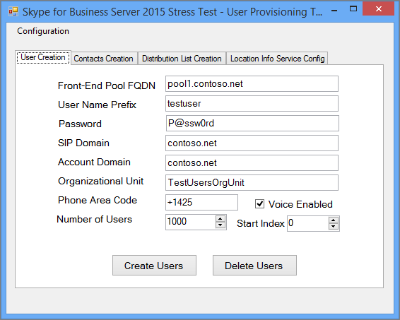
  
#### Create Users button

When you click on the **Create Users** button, the input parameters you've entered are validated. If there are any validation errors, you'll be prompted to fix them. Or, if all the values are correct, users will start appearing in AD (in whichever OU you specified). You'll see a progress bar at the bottom of the tool as it runs. Don't close the application while the progress bar is active.
  
User creation takes time, so please plan accordingly. This process can take anywhere from several minutes for a few users, to a few hours for a large number of users.
  
If you don't have access to the AD Domain Controller in your test environment, you can still validate user creation by logging in as one of the users in the range of users you specified to create. Remember to use the prefix, and the suffix, along with the @sipDomain as the username. Here is an example:  <em>TestUser20@contoso.net</em>  .
  
> [!NOTE]
> If the users already exist, clicking the Create Users button will update them with any configuration changes. 
  
#### Delete Users button

When you click on the **Delete Users** button, the tab's input parameters will be validated. If there are validation errors, you'll be prompted to fix them, and if the input values are correct, the specified test users will be disabled and deleted from Active Directory. Again, a progress bar will appear on the bottom of this tab, and you shouldn't close the application while the progress bar is active.
  
> [!NOTE]
> Only U.S.-formatted phone numbers are supported. Phone numbers are always assigned to users, and all users created by UserProvisioningTool.exe are enabled for Enterprise Voice by default. Any scenarios that use the phone number, such as Conferencing Auto Attendant or UC-PSTN calls, use this phone number to properly route calls. For this reason,  *every user*  must have a *unique phone number*  .
  
> [!NOTE]
> **If you have to create users twice, the command will fail unless you use a different area code, or if the previous users have been disabled by using the Disable-CsUser cmdlet.**
  
> [!IMPORTANT]
> Before you create contacts, you first need to complete user replication (which is done from the Users tab). 
  
> [!IMPORTANT]
> If you've just created your users, you'll need to wait until Skype for Business Server replication completes and populates the user accounts in the database. **If the users haven't finished replicating, you'll see an error.** You'll know when users have finished replicating if the Skype for Business Server 2015 Front End service has started, or by successfully running the Get-CsUser cmdlet on the last user of the total number you specified.
  
#### Contacts Creation tab

This tab lets you give users' contacts details for your testing.
  
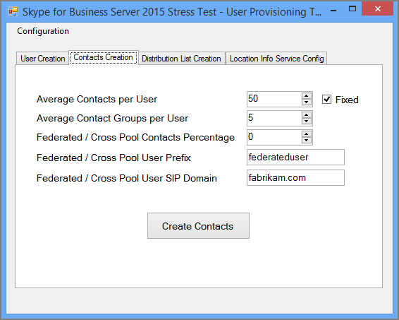
  
### To configure users' contacts, do the following:

1. In the **Average Contacts per User** field, enter the average number of contacts to populate in contact lists for each user.
    
2. Select the **Fixed** check box if you want to create an equal number of contacts for every user. If you want to vary the number of contacts created for users, clear that check box.
    
3. In the **Average Contact Groups per User** field, enter the number of contact groups per user. This number needs to be smaller than **Average Contacts per User**.
    
4. In the **Federated / Cross Pool Contacts Percentage** field, give a number between 0 and 100. This percentage of contacts will be created with the federated users.
    
5. In the **Federated / Cross Pool User Prefix** field, give the username for federated users that will be added to the contact lists of local users.
    
6. In the **Federated / Cross Pool User SIP Domain** field, give the SIP Domain Name of the federated users.
    
7. In **User Creation** tab make sure the information is correct. Your contacts will be created from values on the User Creation tab.
    
8. Click **Create Contacts** to begin the contact creation. This process can take several minutes. After it completes, a dialog box will appear with the message, "Operation Completed Successfully." You can validate the contacts that were created by logging on as a user that was created from the User Creation tab.
    
> [!NOTE]
> After the contacts are created, this tool will restart all the Front End Servers in the target pool. It may take longer (up to 2 hours) for the Front End Servers to start, depending on how many contacts were created by this operation. 
  
#### Distribution List

The Skype for Business Server 2015 Stress and Performance Tool can simulate the Distribution List (DL) expansion feature in the Skype for Business 2015 client. You can skip this step if you don't intend to enable DL expansion in the User Provisioning tool.
  
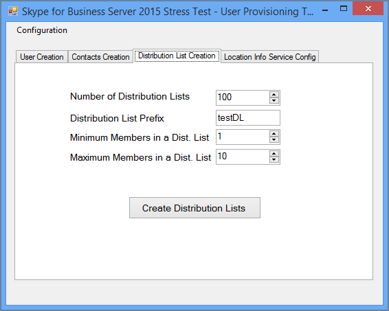
  
The Distribution List tab allows you to create DLs that the Stress and Performance Tool will use for Distribution List Expansion feature. Before creating DLs, Skype for Business Server 2015 needs to be deployed, including having run ForestPrep. If this isn't done, the DL attributes will not exist in the AD schema, so the tool won't be able to create DLs.
  
### To configure Distribution Lists:

1. In the **Number of Distribution Lists** field, give the total number of DLs you want to create (The recommendation here is that you start with a value that is double the number of users you have.).
    
2. In the **Distribution List Prefix** field, enter a prefix that all the DLs you create will have, for example *testDL*  . That means, at 100 DLs, your DL names will look like: testDL0, testDL1, up to testDL99.
    
3. In the **Minimum Members in a Dist. List** field, enter the minimum number of users to put in each DL.
    
4. In the **Maximum Members in a Dist. List** field, enter the maximum number of users to add in each DL.
    
#### Create Distribution Lists button

When you click the Create Distribution Lists button, the tool queries Active Directory to see if distribution lists matching the prefix and numbers already exist. The tool creates any DLs that don't already exist. When adding members to these newly created Distribution Lists, it'll choose the users from the range specified on the User Creation tab.
  
#### Location Info Service Config tab

The Skype for Business Server 2015 Stress and Performance Tool can also generate dummy configuration files for the Location Information Service. Note that the Location Information Service typically doesn't have significant performance impact on the servers. 
  
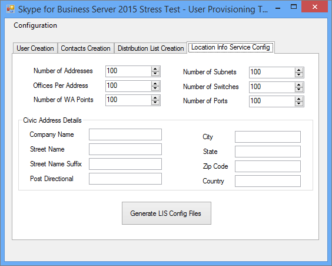
  
If you choose to test this feature, fill in the values in the form and click the Generate LIS Config Files button, which will create .CSV files called:
  
- LIS_Subnet.csv
    
- LIS_Switches.csv
    
- LIS_Ports.csv
    
- LIS_WAP.csv
    
To import these files into the LIS database use these PowerShell cmdlets:
  
- Set-CsLisSubnet
    
- Set-CsLisSwitch
    
- Set-CsLisPort
    
- Set-CsWirelessAccessPoint
    
## Configure User Profile
<a name="BKMK_UserProfile"> </a>

After your users are created (via the User Creation Tool) you can configure user profiles with the Skype for Business Server 2015 Load Configuration tool (UserProfileGenerator.exe).
  
### Running the Skype for Business Server 2015 Load Configuration tool

Start the Load Configuration tool (UserProfileGenerator.exe) and fill in the tabs. This tool creates a directory for each of the client computers that you'll need to run your simulations. Each client directory comes with a script to start the Skype for Business Server 2015 Stress and Performance tool (LyncPerfTool.exe). The sections below will give examples of how to fill in the fields on each tab of the Skype for Business Server 2015 Load Configuration tool.
  
> [!IMPORTANT]
> The user-specific values used in the Load Configuration tool (UserProfileGenerator.exe) must match the values specified in the Skype for Business Server 2015 User Creation Tool (UserProvisioningTool.exe) for the pool. 
  
#### Common Configuration tab

The **Common Configuration** tab of the Load Configuration Tool is shown below. Fill in the fields of the Common Configuration tab, as described in the following steps.
  
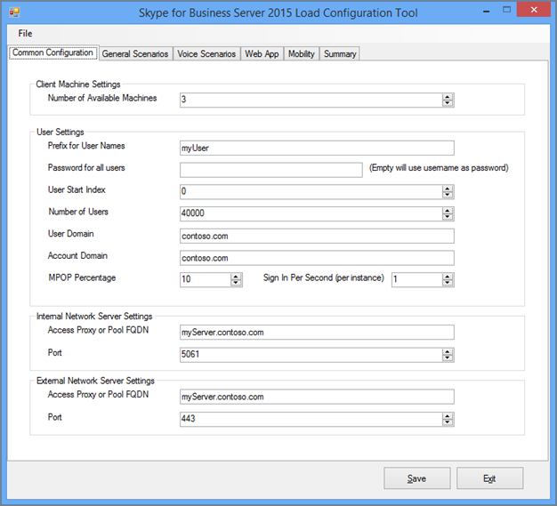
  
1. In the **Number of Available Machines** field, type the number of computers you want to use to run the Stress and Performance tool (LyncPerfTool.exe). We recommend that you have one computer for every 4500 users you'll be simulating, but that number may vary if you reduce the load level, or use only a subset of the tool's available features (Load levels are set on the General Scenarios tab).
    
2. In the **Prefix for User Names** field, enter a prefix for the user name field of all users. To log in the Uniform Resource Identifier (URI) will be: *UserPrefix[User Start Index…(Number Of Users-1)]@User Domain*  , for example, myUser009@Contoso.com.
    
3. In the **Password for All Users** field, enter the password used during creation of the users. If you leave this field empty the username will be set as the password.
    
4. In the **User Start Index** field, enter the index of the first user to be configured. You can configure different ranges for different types or levels of load, but you must run the Load Configuration tool (UserProfileGenerator.exe) once per the range you want to configure.
    
5. In the **Number of Users** field, enter the total number of users you're going to configure.
    
6. In the **User Domain** field, enter the domain used for the SIP URI. This is used to construct the SIP URI of each user to log on to the Skype for Business Server 2015 Front End Server or Standard Edition server, and may be different from the Account Domain.
    
7. In the **Account Domain** field, enter the AD DS domain logon.
    
8. In the **MPOP Percentage** (Multiple Point of Presence percentage) field, give a value for the percentage of users that are logged on from multiple machines or devices, for example 10 percent.
    
9. Enter the maximum number of concurrent endpoints in the **Sign in Per Second (per Instance)** field. This is the maximum number of log ins for your users, and the recommendation is a rate of less than/equal to 2 per second (<=2).
    
10. In the **Access Proxy or Pool FQDN** field, enter the fully qualified domain name (FQDN) of the server you want the clients to connect to. If the users are logging on externally, you'll need to type the access proxy. If the users are internal, give the FQDN of their Enterprise Pool or Standard Edition server.
    
11. In the **Port** field, enter the port that you want users to use for SIP (the default here is 5061).
    
12. For the **External Network Server Settings** field, give the Access Proxy or Pool FQDN and, again, the **Port**. These settings are used only for External endpoints load simulation.
    
#### General Scenarios tab

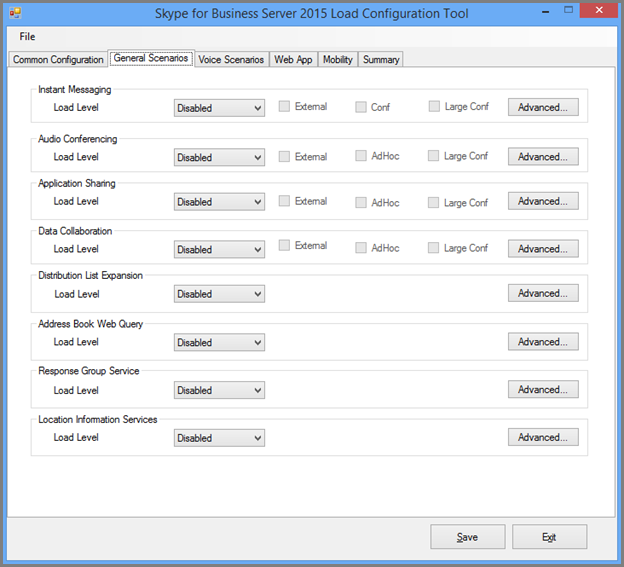
  
You can configure the load levels and parameters for each of the general scenarios offered by determining what you want to run or leave disabled. Here are your general options:
  
> [!NOTE]
> Load level values for all fields but Local Information Services are **Disabled**, **Low**, **Medium**, **High**, or **Custom**. If you select any setting but Disabled, then configurations are generated for each client. High results in the max supported load on the server; medium is 60% of high load; low is 30%. 
  
- **Instant Messaging -** This includes peer-to-peer and conferencing; choose the appropriate value for Load Level.
    
- **Audio Conferencing -** Choose a load level for audio conferencing *only*  . Peer-to-peer calls will be tackled a little later in the **Voice Scenarios** section. Open the **Advanced** tab to enable MultiView.
    
- **Application Sharing -** Choose a load level for application sharing.
    
- **Data Collaboration -** Choose a load level for data collaboration, which includes data conferencing.
    
- **Distribution List Expansion -** Click the **Advanced** button and fill in the field with the same values configured on the DL tab of the User Creation Tool (UserProvisioningTool.exe). Choose a load level.
    
- **Address Book Web Query -** This is the address book lookup service rather than the address book file download. If you want to enable this for address book file downloads, click the **Advanced** button and set **EnableABSDownload** to True. Give a value for load level.
    
- **Response Group Service -** Click the **Advanced** button and specify the URIs of the response groups you already created when you provisioned Response Group Service agents. You must choose at least one response group. To use more, separate the response groups with semicolons. Update **RGSUriSuffixStartIndex** and **RGSUriSuffixEndIndex** to the actual values. Choose a load level.
    
- **Location Information Services -** Select a load level of either Enabled or Disabled.
    
> [!NOTE]
> Each of the scenarios has an Advanced button located next to it, and a set of check boxes that enable variations to the default setting. 
  
- Choosing  *Ad-hoc*  will allow the tool to generate simulation of conferences that will be created throughout the hour.
    
- Choosing  *Large Conf*  means that a Large Conference Scenario will be simulated.
    
-  *External*  tells the tool to also simulate external users.
    
These buttons and check boxes are extra values specific to each scenario and will change the behavior of the Stress and Performance Tool and make customization possible.
  
For each scenario on the General Scenarios tab (except for Location Information Services), if the value of Load Level is **Custom**, then the conversation rate will be calculated using the corresponding field in the Advanced dialog box. The field name may differ, depending on the scenario, but the field description will state:  *NOTE This number will only be used if Custom is selected from the drop-down menu*  .
  
The values **High**, **Medium**, and **Low**, will alter the conversation rates per modality in line with the User Model that is a balance of all the scenarios. If there's a need to change the load level per modality due to a difference in expected usage, use a Custom conversation rate.
  
#### Voice Scenarios tab

This is the tab for configuration of all your voice-related scenarios.
  
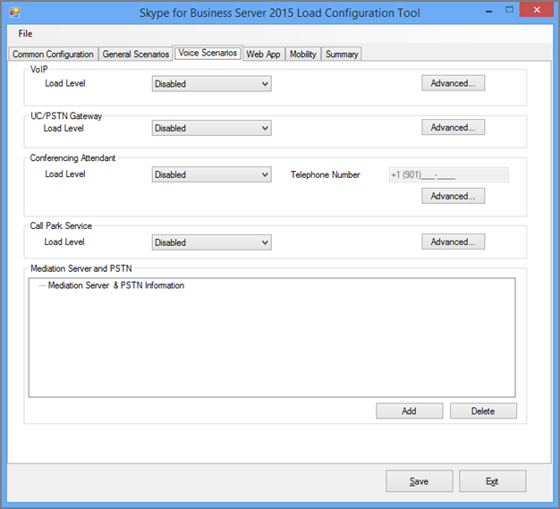
  
Your options are:
  
- **VoIP -** Click the **Advanced** button and add values for the PhoneAreaCode and LocationProfile (dial plan) fields. You'll also give a value for Load Level. If you choose a load level for VoIP or UC/PSTN Gateway enabled, then a public-switched telephone network (PSTN) to unified communications (UC) configuration file will be generated to simulate external calls.
    
- **UC/PSTN Gateway -** You need to choose a Load Level value, and when you choose anything other than Disabled, you've also got to supply a value for PSTN area code by clicking the **Advanced** button. Click **Add** under the Mediation Server and PSTN. Make sure you have a route configured for the area code.
    
    > [!TIP]
    > You can use either the Skype for Business Control Panel or Skype for Business Management Shell to verify your voice route configuration. 
  
- **Conferencing Attendant -** Supply a value for Load Level. Any value other than Disabled will enable the **Telephone Number** field. Enter the phone number of the Auto Attendant you want to use. Click **Advanced** and give a value for the **LocationProfile** field.
    
- **Call Parking Service -** Here, supply a Load Level.
    
- **Mediation Server and PSTN -** Each Mediation Server that you want to use needs its own PSTN simulator. After you've determined which client you're going to use for the simulator, configuration your Mediation Server to route calls to that computer on the PSTN Simulator you configured. Click the **Add** button to configure a value for the Mediation Server.
    
    > [!NOTE]
    > Each scenario has an Advanced button located next to it. Advanced dialog boxes contain settings specific to each scenario that change the behavior of the Stress and Performance Tool and enable customization. > For each scenario on the Voice Scenarios tab, if the value of Load Level is **Custom**, then the conversation rate will be calculated by using the corresponding field in the Advanced dialog box. The field name may differ, depending on the scenario, but the field description will state:  *NOTE This number will only be used if Custom is selected from the drop-down menu*  .
  
#### Web App tab

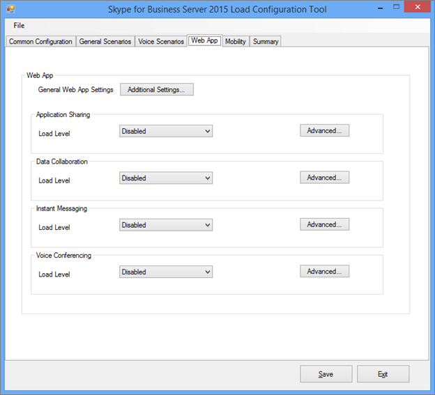
  
Web App supports conferencing scenarios through the Unified Communications Web API (UCWA) server that's installed on a Front End server. Use the Web App tab to configure all web app-related scenarios. Options are:
  
- **General Web App Settings -** Click the **Additional Settings** button and set the **ReachTargetServerUrl** to the Directory Pool virtual IP (VIP) of the Front End pool VIP.
    
- **Application Sharing -** Select a value for Load Level.
    
- **Data Collaboration -** Select a value for Load Level.
    
- **Instant Messaging -** Select a value for Load Level.
    
- **Voice Conferencing -** Select a value for Load Level.
    
> [!NOTE]
> Each of the scenarios has an **Advanced** button located next to it. Advanced dialogs contain values specific to each scenario that will change the behavior of the Stress and Performance Tool and enable customization.> For each of the Web App scenarios, if the Load Level is **Custom**, then the value specified in the **ConversationsPerHour** field is used instead of the default.
  
#### Mobility tab

Use this tab to configure all of the mobility-related scenarios.
  
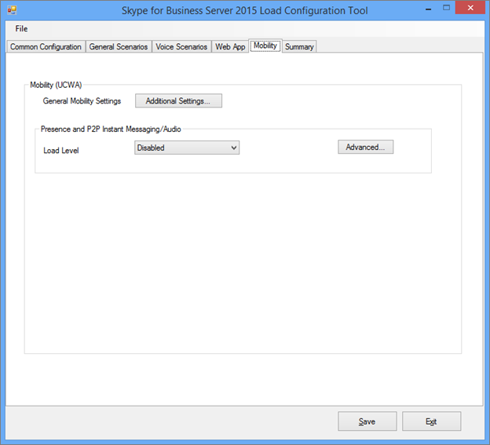
  
The options here are:
  
- **General Mobility Settings -** Click **Additional Settings** and set the field UcwaTargetServerUrl to the Director Pool virtual IP (VIP) or the Front End pool VIP.
    
- **Presence and P2P Instant Messaging/Audio -** Select a value for Load Level to enable the Mobility simulation.
    
> [!NOTE]
> Each of the scenarios has an **Advanced** button located next to it. Advanced dialogs contain values specific to each scenario that will change the behavior of the Stress and Performance Tool and enable customization.> For each of the Mobility scenarios, if the Load Level is **Custom**, then the value specified in the **ConversationsPerHour** field is used instead of the default.
  
#### Summary tab

The Summary tab indicates which users to use for each of the scenarios.
  
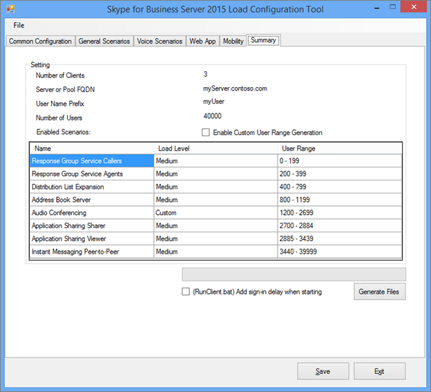
  
The Summary tab indicates which users to use for each of the scenarios. 
  
It's possible to manually configure user number ranges by selecting the **Enable Custom User Range Generation** check box, and then double-clicking the scenario in the table that has the User Range that you want to customize.
  
Check **(RunClient.bat) Add sign-in delay when starting** in order to include delays in the generated batch files to correspond to the sign-in rate. This is useful to prevent server overload when signing in a large number of users.
  
Click **Generate Files** and select the folder where you want to generate the configuration. A dialog box will appear when your files have been successfully created.
  
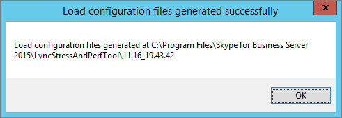
  
## Run LyncPerfTool
<a name="BKMK_RunTool"> </a>

You'll need to create users, contacts, and scenarios before running the Skype for Business Server 2015 Stress and Performance Tool (LyncPerfTool.exe). For details about using the tools to perform these actions, see [Create Users and Contacts](using-the-tool.md#BKMK_CreateUsersAndContacts) and [Configure User Profile](using-the-tool.md#BKMK_UserProfile) previously in this article. Running these tools will also generate a file that will run with the Stress and Performance tool as part of a batch file with the required parameters included.
  
### Running the Skype for Business Server 2015 Stress and Performance tool

The Load Configuration tool (UserProfileGenerator.exe) creates a batch file that enables you to run the Stress and Performance tool (LyncPerfTool.exe) by registering performance counters and loading the XML configuration file. The batch file runs one instance of LyncPerfTool.exe per configuration file. To run the batch file follow these steps:
  
### Run the Stress and Performance test

1. Copy the folder with the configuration folders and files inside to the directory that has LyncPerfTool.exe on each client computer. (For example, if you generated the configuration files in the folder named 1.28_13.16.16, copy that folder to the folder with LyncPerfTool.exe in it. Do this on each client.)
    
2. Navigate to the client folder and run the **RunClient** batch script. You can double-click the batch file in Windows Explorer and it will run all of the configuration files for that client. You can also run the script from a client folder by using the following syntax:
    
   ```
   RunClient0.bat "C:\Program Files\Skype for Business Server 2015\LyncStressAndPerfTool\LyncStress" 
   ```

To run the Stress and Performance tool directly, open a command prompt and type the following command at the command line (and when doing this for the first time, be sure to register the performance counters  `regsvr32 /i /n /s LyncPerfToolPerf.dll`, as shown in the note later in this topic):
  
```
LyncPerfTool.exe /file:IM_client0.xml
```

To have the tool display the values in the configuration file, include the  `/displayfile` parameter on the preceding command, so that it looks like this:
  
```
LyncPerfTool.exe /file:IM_client0.xml /displayfile
```

To  *end*  the process, press Ctrl+C.
  
> [!NOTE]
> Before running the Stress and Performance tool directly, you must register the performance counters via the following command:  `regsvr32 /i /n /s LyncPerfToolPerf.dll`
  
> [!NOTE]
> Every instance of the Stress and Performance tool that you start will immediately begin signing in users, usually at a rate of one user per second. 
  
The peak user sign-in rate for the pool is about 12 per second. This means that you shouldn't start more than 12 LyncPerfTool.exe instances at the same time while users are still signing in. One thousand users will take about 20 minutes to fully sign in at one per second.
  
## Interpreting the Results
<a name="BKMK_Interpret"> </a>

The Skype for Business Server 2015 Stress and Performance Tool has many counters that can help you understand what the client is doing, and whether it's encountering issues.
  
### Client Counters

Each instance of LyncPerfTool.exe running has a separate instance of the counters. Each instance is named by its process ID. If clients are overloaded other issues can occur. To prevent these issues:
  
- Monitor CPU and Memory usage on the client computers. If the CPU is consistently above 90 percent, reduce the number of users.
    
- When the Memory footprint is high, you may run into issues if the Page File begins to run out of space. Verify that the Commit Charge is not hitting the limit on the computer. If you are running into Memory limits consider increasing the Page File size or reducing the number of users.
    
Here's a list of key performance counters:
  
**General Information**

|**Performance Counter**|**Description**|
|:-----|:-----|
|Time Spent in Minutes  <br/> |Time spent since the process was started.  <br/> |
|Active Endpoints  <br/> |Number of endpoints currently connected to the server.  <br/> |
|Failed Logons  <br/> |Total number of endpoint sign-in failures.  <br/> |
|Logon Attempts  <br/> |Total number of endpoint sign-in attempts.  <br/> |
|Endpoints Disconnected  <br/> |Total number of endpoints that have been disconnected.  <br/> |
   
**Presence Information**

|**Performance Counter**|**Description**|
|:-----|:-----|
|SetPresence Calls  <br/> |Total number of presence change attempts. For different types of presence changes, see the SetPresence (Presence Type) Calls Performance Counter.  <br/> |
|NNN Responses for SetPresence  <br/> |Total number of nnn response codes received from the server.  <br/> |
|GetPresence Calls  <br/> |Total number of get presence request attempts.  <br/> |
|NNN Responses for GetPresence  <br/> |Total number of nnn response codes received from the server.  <br/> |
   
**Address Book service information**

|**Performance Counter**|**Description**|
|:-----|:-----|
|ABS Full/Delta File Downloads Attempted  <br/> |Total number of full or delta file download requests attempted.  <br/> |
|ABS Full/Delta File Downloads Succeeded  <br/> |Total number of full or delta file download requests attempted.  <br/> |
|Address Book Web Query service related counters  <br/> |Address book file download related counters.  <br/> |
|ABS WS Calls attempted  <br/> |Total number of Address Book Web Query service requests attempted.  <br/> |
|ABS WS Calls Succeeded  <br/> |Total number of Address Book Web Query service requests that returned a successful response code.  <br/> |
|ABS WS Calls Failed  <br/> |Total number of Address Book Web Query service requests that returned an error response code.  <br/> |
   
> [!NOTE]
> This category includes counters used to monitor Address Book service (ABS) file downloads and Address Book Web Query service requests. 
  
**Distribution List (DL) Information**

|**Performance Counter**|**Description**|
|:-----|:-----|
|Calls Attempted  <br/> |Total number of distribution list expansion (DLX) web service requests attempted.  <br/> |
|Calls Succeeded  <br/> |Total number of DLX web service requests that returned a successful response code.  <br/> |
|Calls Failed  <br/> |Total number of DLX web service requests that returned an error response code.  <br/> |
   

  
> [!NOTE]
> The performance counters listed below report numbers for all Voice over IP (VoIP) calls, including calls to Mediation Server, A/V Conferencing Server, Edge Server, Response Group application, and Conference Auto Attendant, when these scenarios are enabled. 
  
**VoIP Basic Information**

|**Performance Counter**|**Description**|
|:-----|:-----|
|Calls Active  <br/> |Total number of incoming/outgoing voice calls ongoing currently.  <br/> |
|Calls Terminated  <br/> |Total number of incoming/outgoing voice calls already terminated.  <br/> |
|Calls Declined  <br/> |Total number of incoming voice calls declined.  <br/> |
|Incoming/Outgoing Calls Attempted  <br/> |Total number of incoming/outgoing voice calls attempted.  <br/> |
|Incoming/Outgoing Calls Established  <br/> |Total number of incoming/outgoing voice calls established.  <br/> |
|Calls Received NNN  <br/> |Total number of nnn response codes received from the server.  <br/> |
|VoIP Pass Rate (%)  <br/> |Total calls established/Total calls attempted.  <br/> |
   
**Response Group service Call Information**

|**Performance Counter**|**Description**|
|:-----|:-----|
|Calls Active  <br/> |Total number of active calls to the Response Group application.  <br/> |
|Calls Attempted  <br/> |Total number of calls attempted.  <br/> |
   
**Instant Messaging (IM) Call Information**

|**Performance Counter**|**Description**|
|:-----|:-----|
|Calls Active  <br/> |Total number of ongoing incoming/outgoing instant messaging calls.  <br/> |
|Calls Terminated  <br/> |Total number of incoming/outgoing instant messaging calls already terminated.  <br/> |
|Calls Received NNN  <br/> |Total number of nnn response codes received from the server.  <br/> |
|IM Messages Received/Sent  <br/> |Total number of messages received or sent for all sessions.  <br/> |
|Incoming/Outgoing Calls Attempted  <br/> |Total number of incoming/outgoing instant messaging calls attempted.  <br/> |
|Incoming/Outgoing Calls Established  <br/> |Total number of incoming/outgoing instant message calls established.  <br/> |
   
**App Sharing Call Information**

|**Performance Counter**|**Description**|
|:-----|:-----|
|Calls Active  <br/> |Total number of ongoing incoming/outgoing application sharing calls.  <br/> |
|Calls Terminated  <br/> |Total number of incoming/outgoing application sharing calls already terminated.  <br/> |
|Calls Received NNN  <br/> |Total number of nnn response codes received from the server.  <br/> |
|Incoming/Outgoing Calls Attempted  <br/> |Total number of incoming/outgoing application sharing calls attempted.  <br/> |
|Incoming/Outgoing Calls Established  <br/> |Total number of incoming/outgoing application sharing calls established.  <br/> |
   
**CAA Call Information**

|**Performance Counter**|**Description**|
|:-----|:-----|
|Calls Active  <br/> |Total number of incoming/outgoing public switched telephone network (PSTN) calls ongoing currently.  <br/> |
|Calls Terminated  <br/> |Total number of incoming/outgoing PSTN calls already terminated.  <br/> |
|Incoming/Outgoing Calls Attempted  <br/> |Total number of incoming/outgoing PSTN calls attempted.  <br/> |
|Incoming/Outgoing Calls Established  <br/> |Total number of incoming/outgoing PSTN calls established.  <br/> |
   
**Conference Information**

|**Performance Counter**|**Description**|
|:-----|:-----|
|Active Instant Messaging Conferences  <br/> |Total number of ongoing instant messaging conferences.  <br/> |
|Active Audio/Video Conferences  <br/> |Total number of ongoing audio/video (A/V) conferences.  <br/> |
|Active Application Sharing Conferences  <br/> |Total number of ongoing application sharing conferences.  <br/> |
|Number of Participants  <br/> |Total number of participants currently connected to conferences.  <br/> |
|Conference Schedule Failure  <br/> |Total number of failures while trying to schedule a conference.  <br/> |
|Join Conference Failure  <br/> |Total number of failures while trying to connect to a conference.  <br/> |
   
**UCWA Client Counters**

|**Performance Counter**|**Description**|
|:-----|:-----|
|Total Number of IMMCU Joins Succeeded  <br/> |Total number of instant messaging conferences joined.  <br/> |
|Total Number of DMCU Joins Succeeded  <br/> |Total number of A/V conferences joined.  <br/> |
   

