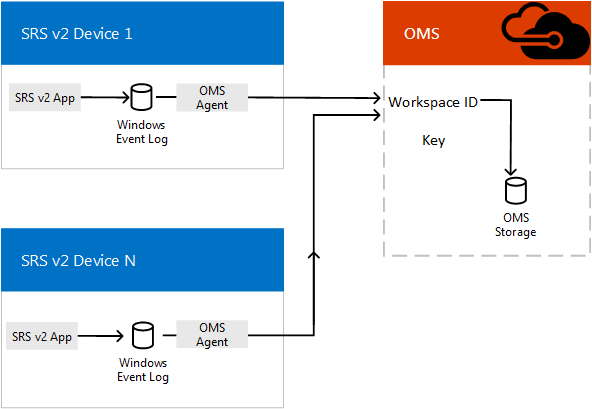

# Plan Skype Room Systems v2 management with OMS
 
 This article discusses planning considerations for using Operations Management Suite to administer Skype Room Systems v2 devices in your Skype for Business Server implementation.
  
[Operations Management Suite](https://docs.microsoft.com/en-us/azure/operations-management-suite/operations-management-suite-overview) (OMS) is a collection of management services that were designed in the cloud from the start. Rather than deploying and managing on-premise resources, OMS components are entirely hosted in Azure. Configuration is minimal, and you can be up and running literally in a matter of minutes. With some customization work, it can aid in managing Skype Room Systems v2 conferencing systems by providing real-time notifications of system health or faults for individual room systems, and it can potentially scale up to managing thousands of Skype Room Systems v2 conference rooms.
  
This article provides a discussion of the requirements, design/architecture, and implementation best practices needed to implement OMS management of Skype Room Systems v2 conference devices, and provides links to detailed articles on implementing OMS management for Skype Room Systems v2 and critical reference information for ongoing OMS management of Skype Room Systems v2 rooms. 
  
## Functional overview

  
The Skype Room Systems v2 app on the console device writes events to its Windows Event Log. An OMS agent, once installed, passes the information to OMS. 
  
Once properly configured, OMS parses the JSON payload embedded in the event descriptions to describe how each Skype Room Systems v2 system is functioning and what faults are detected. 
  
An administrator using OMS can get notifications of Skype Room Systems v2 systems that are offline or are experiencing app, connectivity, or hardware failures as well as knowing if a system needs to be restarted. Each system status is updated every five minutes, so these notifications are close to real-time updates.
  
## OMS requirements

You must have a valid subscription for OMS to use this feature. See [Get started with a Log Analytics workspace](https://docs.microsoft.com/en-us/azure/log-analytics/log-analytics-get-started?toc=%2fazure%2foperations-management-suite%2ftoc.json) to create a subscription for your organization.
  
You should familiarize yourself as necessary on how to use the OMS View Designer. See [Views in Operations Management Suite (OMS) management solutions](https://docs.microsoft.com/en-us/azure/operations-management-suite/operations-management-suite-solutions-resources-views) for those details.
  
### Related Tasks

1. Once subscribed to OMS, create custom fields (as described in [Map custom fields](../../deploy/deploy-clients/with-oms.md#Custom_fields)) needed to parse the information that will be sent from Skype Room Systems v2 consoles. This includes understanding the JSON schema documented in [Understand the log entries](../../manage/skype-room-systems-v2/oms.md#Telemetry).
    
2. Develop a Skype Room Systems v2 management view in OMS. You can either [Create a Skype Room Systems v2 dashboard by using the import method](../../deploy/deploy-clients/with-oms.md#create-a-skype-room-systems-v2-dashboard-by-using-the-import-method) ) or [Create a Skype Room Systems v2 dashboard manually](../../deploy/deploy-clients/with-oms.md#create-a-skype-room-systems-v2-dashboard-manually).
    
## Individual Skype Room Systems v2 Console requirements

Each Skype Room Systems v2 console is an app running on a Surface 4 device in kiosk mode (normally, it's configured to be the only app that can run on the device). As with any Windows app, the Skype Room Systems v2 app writes events like startup and hardware faults to the Windows Event Log. Adding an OMS agent on your Skype Room Systems v2 device allows these events to be collected by OMS. (See [Connect Windows computers to the Log Analytics service in Azure](https://docs.microsoft.com/en-us/azure/log-analytics/log-analytics-windows-agents) for details.)
  
## Ongoing management

While using OMS to manage your Skype Room Systems v2 conference devices, you'll need to understand the information contained in the event logs used by OMS. See [Understand the log entries](../../manage/skype-room-systems-v2/oms.md#understand-the-log-entries) for details on these health messages.
  
### Related Tasks

- Understand the Alerts generated by Skype Room Systems v2 and how to resolve them (see the section titled [Understand the log entries](../../manage/skype-room-systems-v2/oms.md#understand-the-log-entries))
    
## See also

[Deploy Skype Room Systems v2 management with OMS](../../deploy/deploy-clients/with-oms.md)
  
[Manage Skype Room Systems v2 devices with OMS](../../manage/skype-room-systems-v2/oms.md)