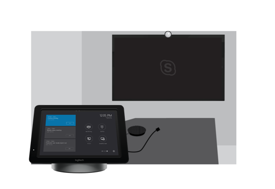

# Plan Skype Room Systems v2 

This article introduces an end-to-end approach to planning, delivering, and operating Skype Room Systems version 2 (v2) as part of your overall meeting and conference room strategy.

You’ll find planning information below covering the recommended approach and key decisions that you need to make, with links to supporting technical information. We recommend that you review the Plan, Deploy, and Manage sections even if you’re already fully deployed.

## Overview of Skype Room Systems v2

Skype Room Systems v2 provides a complete Skype for Business meeting experience that brings HD video, audio, and content sharing to meetings of all sizes, from small huddle areas to large conference rooms.

[Skype Room Systems v2 help](https://support.office.com/article/Skype-Room-Systems-version-2-help-e667f40e-5aab-40c1-bd68-611fe0002ba2) is a great resource to find out more about Skype Room Systems v2 and how it can add value as part of your Skype for Business deployment. In addition, we recommend watching this [overview video](https://youtu.be/tNey5KZVCl0). 

## Skype Room Systems v2 components 

Skype Room Systems v2 includes the following key components to deliver a great user experience:

-   Touchscreen control panel
-   Compute
-   Skype Room Systems v2 application
-   Dock/extender
-   Peripheral devices (camera, microphone, speaker)
-   External screens (maximum of two)
-   HDMI input

You can procure these components as preinstalled bundles from a number of vendors, or you can purchase the supported components individually by following the [requirements documented in this article](requirements.md). 

In addition to the Surface Pro/dock combination, you can also purchase Skype Room Systems v2 with the touchscreen control panel, compute, dock, and key peripheral devices integrated. 

Typically, the bundles and integrated units include preinstalled software, whereas if you buy supported components individually for the Surface Pro systems, you’ll need to install the software. For instructions, see [this article about installing software on devices](../../deploy/deploy-clients/room-systems-scale.md). 

You can deploy Skype Room Systems v2 with Skype for Business Online, or Skype for Business hybrid or on-premises deployments. 

<table>
<tr><td>  Decision points</td><td><ul><li>Will you deploy Skype Room Systems v2 in your organization? </li><li>How will you procure your Skype Room Systems v2 systems—bundled, as separate components, or as an integrated unit?</li></ol></td></tr>
<tr><td> Next steps</td><td><ul><li>Review the meeting rooms you have (and plan to set up) to understand where you want to deploy Skype Room Systems v2 and the peripheral devices that would be appropriate for the room size.</li></ol></td></tr>
</table>

## Room inventory and capability planning

Use the approach illustrated below to guide you through your deployment, and customize the sample outputs provided throughout this article as needed for your organization.

The first step is to inventory your organization’s existing meeting and conference rooms to understand their environment, room size, layout, and purpose, and to identify the capabilities you want each room in scope to have in the future such as which richer collaboration capabilities will be enabled in the room. 

After you create an inventory of the equipment and capabilities in each existing room, your requirements for that room feed into your device selection planning to create a rich conferencing solution. The modalities (audio, video) needed for each room—in addition to room size and purpose—all play an important role in deciding which solution is most appropriate for each room. 

As part of your discovery, it’s key to consider room acoustics and layout. For example, check that the chairs in the room won’t block the camera view. Verify that the room doesn’t have excessive echo or noisy air conditioning, and that it does have sufficient power for the screens and Skype Room Systems v2. There are many factors to consider that your audio-visual (AV) team or partner will be able to advise on. 

<table>
<tr><td>  Decision points</td><td><ul><li>Which rooms are in scope for this deployment?</li><li>Which sites are in scope for your deployment?</li><li>Who will undertake the meeting rooms inventory?</li></ol></td></tr>
<tr><td> Next steps</td><td><ul><li>Review the rooms in scope, and define Skype Room Systems v2 configurations for them.</li></ol></td></tr>
</table>

_Sample meeting/conference room inventory_

| **Site**  | **Room name** | **Room type** | **Number of people**  | **In scope?** | **Current room capabilities**       | **Future room capabilities**                             |
|-----------|---------------|---------------|-----------------------|--------------|-------------------------------------|----------------------------------------------------------|
| London HQ | Curie         | Medium        | 6&ndash;12                  | Yes          | Speakerphone                        | 1 screen, audio and video plus presentation PSTN Access |
| Sydney HQ | Hill          | Large         | 12&ndash;16                 | Yes          | Legacy AV unit, 1 screen and camera | 2 screens, audio and video plus presentation PSTN Access |

**Pro Tip** – If you have many sites to inventory, you might want to download
and use the [Site Rollout and Migration Planning - Site
Questionnaire](https://myadvisor.fasttrack.microsoft.com/CloudVoice/Downloads?SelectedIDs=5_1_0_15).

## Device selection 

Evaluate which Skype Room Systems v2 solution is the most suitable for each room based on the future capabilities you want for the room. Decide which AV peripheral devices are the best fit, depending on room size and layout. 

For guidance for the type of system and peripheral devices by room type and size, see the [Skype Room Systems v2 requirements](requirements.md) article. 

Based on the vendor you prefer, use the information provided in the requirements article to define your Skype Room Systems v2 and supported peripheral device configuration per room type, and use this as a template for your deployment. 

**Pro Tip** – Some room types might not be applicable for your deployment.

<table>
<tr><td>  Decision points</td><td><ul><li>From your inventory, which types of rooms are in scope for your deployment?</li><li>Which systems will you deploy for each room type?</li></ol></td></tr>
<tr><td> Next steps</td><td><ul><li>Start to gather key operational material for your chosen systems, and engage your procurement team.</li></ol></td></tr>
</table>

_Sample Skype Room Systems v2 deployment template for your organization_

| **Room type/size** | **Number of people**  | **Skype Room Systems v2 system** | **Peripheral devices**  | **Display(s)** |
|----------------------|-----------------------|----------------------------------|-------------------------|-----------------|
| Focus 10' by 9'      | 2&ndash;4                   |                                  |                         |                 |
| Small 16' by 16'     | 4&ndash;6                   |                                  |                         |                 |
| Medium 18' by 20'    | 6&ndash;12                  |                                  |                         |                 |
| Large 15' by 20'     | 12&ndash;16                 |                                  |                         |                 |

**Pro Tip –** Now is a great time to start gathering information about the Skype Room Systems v2 solution you’ve chosen. We recommend that you work with your vendor to discuss completing the design template to capture information that will be relevant to your deployment; you can [download this handy template](https://myadvisor.fasttrack.microsoft.com/CloudVoice/Downloads?SelectedIDs=4_4_0_11) from MyAdvisor. 

## Procurement 

You can procure your chosen system as a bundle, separate components, or an integrated solution via device partners. Or, you can acquire a partner device dock and prepare your own Skype Room Systems v2 solution by using Surface Pro and existing, supported AV peripheral devices. 

You can acquire devices from a number of partners who are listed in the [requirements article](requirements.md). Please visit the device partners’ websites to learn more about these solutions and procurement options. 

Depending on your deployment scale and approach, you might decide to have the Skype Room Systems v2 and supported peripheral devices shipped to a central location for initial configuration and assignment. This might be a good approach for a staged rollout across many sites. Or, you might choose to ship the bundles directly to your sites. 

<table>
<tr><td>  Decision points</td><td><ul><li>Will you ship the components directly to a site or to a staging facility?</li><li>Who will manage the staging facility (if you decide to use one)?</li></ol></td></tr>
<tr><td> Next steps</td><td><ul><li>Confirm that your sites are ready.</li></ol></td></tr>
</table>
