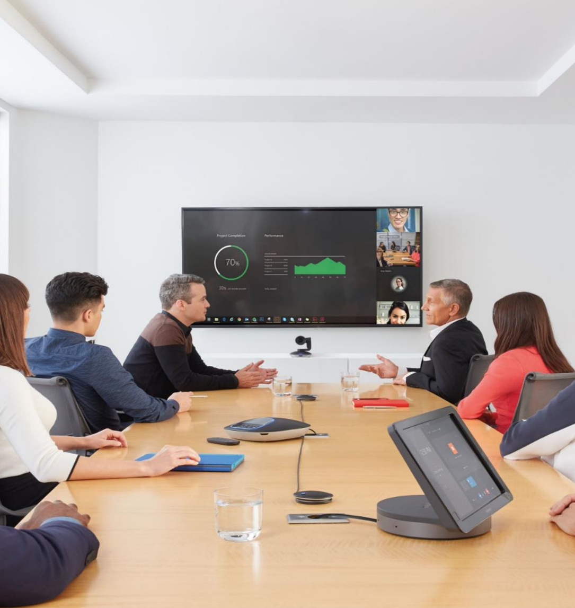

# Skype Room Systems v2 Admin Guide
 | | |
|--- | --- |
| Skype Room Systems v2 is Microsoft's latest conferencing solution designed to transform your meeting room into a rich, collaborative Skype for Business experience. Users will enjoy its familiar Skype for Business interface and IT administrators will appreciate an easily deployed and managed Windows 10 Skype Meeting app. Skype Room Systems v2 is designed to leverage existing equipment like LCD panels for ease of installation to bring Skype for Business into your meeting room.    Skype Room Systems v2 uses a purpose-built UWP app which acts as the Skype Meeting user interface. It runs on a Surface Pro 4 or Surface Pro in a console mode (once deployed the UWP app is the only app that will run on the device) and it requires its own device account on your Skype for Business implementation. It leverages existing equipment like LCD panels and relatively inexpensive peripheral cameras and microphones to provide a quality meeting room experience. Software is updated via both Windows store and Windows Update.| |
  
|Skype Room |Systems |v2 | 
|--- | --- | --- |
|   Plan |   Deploy |    Manage |

Before you being preparing your environment, be sure you have the necessary hardware and software. For more information, see [Skype Room Systems v2 requirements](requirements.md). 
  
> [!NOTE]
> Skype Room Systems v2 is intended for use with Skype for Business Server 2015 or Skype for Business Online. Earlier platforms like Lync Server 2013 are not expected to work with Skype Room Systems v2. 
  
Skype Room Systems v2 is Microsoft's latest conferencing solution designed to transform your meeting room into a rich, collaborative Skype for Business experience. Users will enjoy its familiar Skype for Business interface and IT administrators will appreciate an easily deployed and managed Windows 10 Skype Meeting app. Skype Room Systems v2 is designed to leverage existing equipment like LCD panels for ease of installation to bring Skype for Business into your meeting room.
  
 **Built for Skype for Business**
  
- One-touch join of Skype Meetings
    
- Skype Meeting experience optimized for rooms with screen-filling HD video and HD wideband audio
    
- All participants can connect to the Skype Meeting using their device of choice from wherever they may be located
    
- Invite people from your directory where you can instantly see their availability or via a phone call
    
- Supports Skype for Business PSTN Conferencing and PSTN Calling to replace the stand-alone conference phone in your room
    
 **Transform Any Meeting Room**
  
- Dedicated Skype Meeting app optimized for center of table touch controller and large front of room display
    
- Re-use existing investments in your front of room display or projectors
    
- Works in all types of meeting spaces from huddle spaces to large conference rooms
    
- Certified Skype for Business audio and video devices are available for various room sizes
    
- Built-in wired ingest for to project desktop sharing to the room and to the Skype Meeting
    
- In-app user selection of meeting room audio and video USB devices &#x2776;
    
- Dual-Screen support (for legacy system parity) &#x2777;
    
- Themability (built-in themes and the ability to set custom theme) &#x2777;
    
 **Easy to Deploy, Simple to Manage**
  
- Always-on appliance that will automatically wake up the displays when it detects people in the room
    
- Simple deployment and updating of the UWP (Universal Windows Platform) Skype Meeting App
    
- Windows AppLocker locks down the device to the Skype Meeting app
    
- Monitored and managed as a Windows 10 Enterprise device via Intune and SCCM (MDM)
    
- Enterprise-grade reliability
    
- Low training effort of end-users due to familiar Skype user interface
    
- Runs on Surface Pro 4 tablet
    
- Integrated room console status reporting for customers using Microsoft Operations Management Suite (see [Plan Skype Room Systems v2 management with OMS](oms-management.md)) &#x2776;
    
- Ability to Give Feedback for public builds &#x2777;
    
- Improved Telemetry around meeting join reliability &#x2777;
    
- Additional OMS reporting &#x2777;
    
- Ability for IT Admin to configure devices remotely &#x2777;
    <!--  - Front-of-Room UX shows room details pre-meeting &#x2777;  -->
- Runs on Surface Pro tablet &#x2778;
    
- Supports Windows 10 Enterprise Creator's Update (English language, build 1703) &#x2778;
    
- Support for [Crestron SR](http://www.crestron.com/products/line/sr-for-skype-for-business-room-system) dock hardware &#x2778;
    
- OEM Support for Environment Controls (Crestron) &#x2778;
    
- Support for [Polycom MSR Series](http://www.polycom.com/hd-video-conferencing/microsoft-video/msr-series.mdl) dock hardware &#x2779;
    
- Support for the [Logitech Brio](https://www.logitech.com/en-us/product/brio) &#x2779;

- Support for [Lenovo Hub 500](https://www3.lenovo.com/us/en/hub500)  dock hardware  &#x277A;
    
&#x2776; - Feature introduced in Update 1 (SW Ver. 2.0.2.0).
  
&#x2777;- Feature introduced in Update 2 (SW Ver. 3.0.6.0). 
  
&#x2778;- Feature introduced in Update 3 (SW Ver. 3.0.12.0). 
  
&#x2779;- Feature introduced in Update 4 (SW Ver. 3.0.15.0). 

&#x277A;- Feature introduced in Update 5 (SW Ver. 3.1.98.0). 
  

  
## See also

#### 

|   |   |   |
| ---| ---- | --- |
| | [Skype Room Systems v2 requirements](requirements.md) | |
| |[Preparing your Skype for Business Environment](srs-v2-prep.md)| |
|      |    [Plan Skype Room Systems v2 management with OMS](oms-management.md)| |
|      |         |         |
| [Deploy Skype Room Systems v2](../../deploy/deploy-clients/room-systems-v2.md)     |         |         |
|  | [Deploy Skype Room Systems v2 with Office 365](../../deploy/deploy-clients/with-office-365.md)||
|      |  [Deploy Skype Room Systems v2 with Skype for Business Server 2015](../../deploy/deploy-clients/with-skype-for-business-server-2015.md)       |         |
|      | [Deploy Skype Room Systems v2 with Exchange Online (Hybrid)](../../deploy/deploy-clients/with-exchange-online.md) |  |
|      |  [Deploy Skype Room Systems v2 with Exchange on premises (Hybrid)](../../deploy/deploy-clients/with-exchange-on-premises.md)  |         |
|      | [Configure a Skype Room Systems v2 console](../../deploy/deploy-clients/console.md) | |
|      |  [Deploy Skype Room Systems v2 management with OMS](../../deploy/deploy-clients/with-oms.md)       |         |
|      |         |         |
| [Manage Skype Room Systems v2](../../manage/skype-room-systems-v2/skype-room-systems-v2.md)|| |
|      | [Manage Skype Room Systems v2 devices with OMS](../../manage/skype-room-systems-v2/oms.md)        |         |
|      | [Manage a Skype Room Systems v2 console settings remotely with an XML configuration file](../../manage/skype-room-systems-v2/xml-config-file.md)        |         |
|      | [Use the Skype Room Systems v2 recovery tool](../../manage/skype-room-systems-v2/recovery-tool.md)        |         |
|      |         |         |
|      |  [Skype Room Systems v2 release notes](../../manage/skype-room-systems-v2/release-note.md)       | 
|      |  [Known issues for Skype Room Systems v2](../../manage/skype-room-systems-v2/known-issues.md) | |
|      | [Support for Skype Room Systems v2 current branch versions](../../manage/skype-room-systems-v2/lifecycle-support.md)|  |
| | | |

