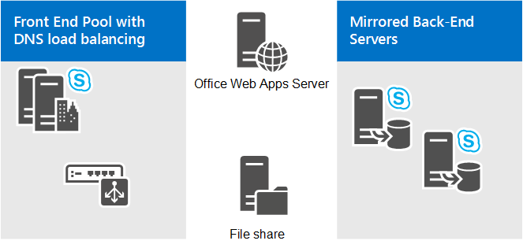

# Plan your conferencing topology for Skype for Business Server
 
**Summary:** Read this topic to learn about planning your conferencing topology in Skype for Business Server.
  
This topic describes topology basics for conferencing in Skype for Business Server:
  
- Supported topologies
    
- Dial-in conferencing considerations
    
- Web conferencing considerations
    
- Requirements for large meetings
    
For more information about hardware and software requirements, see [Hardware and software requirements for conferencing in Skype for Business Server](hardware-and-software-requirements.md).
  
## Supported topologies

In Skype for Business Server, the server running conferencing services is always collocated with the Front End Servers or Standard Edition servers. When you deploy Skype for Business Server, IM conferencing capabilities are automatically deployed. You can specify whether to deploy web, audio and video (A/V), and dial-in conferencing by using the Topology Builder. You can also use Topology Builder to add conferencing to an existing deployment. For details about topology basics and collocation scenarios, see [Topology Basics for Skype for Business Server](../../plan-your-deployment/topology-basics/topology-basics.md).
  
You can deploy conferencing in the following topologies and configurations:
  
- Skype for Business Server Standard Edition
    
- Skype for Business Server Enterprise Edition
    
- With or without Enterprise Voice
    
## Dial-in conferencing considerations

If you are deploying dial-in conferencing, you must consider the following:
  
- Dial-in conferencing requires a Mediation Server to translate signaling (and media in some configurations) between Skype for Business Server and the PSTN gateway, and a PSTN gateway to translate signaling and media between the Mediation Server and the PSTN gateway.
    
   Before you can configure dial-in conferencing, you need to deploy either Enterprise Voice or a Mediation Server and at least one of the following:
    
  - PSTN gateway
    
  - IP-PBX
    
  - Session Border Controller (SBC) (for an Internet telephony service provider to which you connect by configuring a SIP trunk)
    
- You can deploy the Application service, Conferencing Attendant application, and Conferencing Announcement application in a central site, but not in a branch site.
    
- You must deploy dial-in conferencing in every pool where you deploy Skype for Business Server conferencing. You do not need to assign access numbers in every pool, but you must deploy the dial-in conferencing feature in every pool. This requirement supports the recorded name feature when a user calls an access number from one pool to join a Skype for Business Server conference in a different pool. 
    
For more information, see [Plan for dial-in conferencing in Skype for Business Server](dial-in-conferencing.md).
  
## Web conferencing considerations

Web conferencing requires the following: 
  
- Access to the file store, which is used for storing web conferencing content.
    
- Integration with Office Web Apps Server/Office Online Server, which is necessary in order to share PowerPoint files during a conference.
    
> [!NOTE]
> The latest iteration of Office Web Apps Server is named Office Online Server, which is supported by Skype for Business Server. For more detail, refer to the [Office Online Server documentation](https://technet.microsoft.com/en-us/library/jj219456%28v=office.16%29.aspx). 
  
Skype for Business Server provides the following ways to configure Office Web Apps Server/Office Online Server. Depending on your needs you can:
  
- **Install both Skype for Business Server and Office Web Apps Server/Office Online Server on-premises behind your organization's firewall, and in the same network zone.** With this topology, external access to Office Web Apps Server/Office Online Server will be provided through your reverse proxy server. Ideally, you should install Office Web Apps Server/Office Online Server in the same network zone as Skype for Business Server.
    
    External Skype for Business clients can connect to Skype for Business Server and to Office Web Apps Server/Office Online Server by using a reverse proxy server, which is a server that takes requests from the Internet and forwards them to the internal network. (Internal clients do not need to use the reverse proxy server because they can connect to Office Web Apps Server/Office Online Server directly.) This topology works best if you want to use a dedicated Office Web Apps Server/Office Online Server farm that is only used by Skype for Business Server.
    
- **Use an externally deployed Office Web Apps Server/Office Online Server.** In this topology, Skype for Business Server is deployed on-premises, and uses an Office Web Apps Server/Office Online Server that is deployed outside of the Skype for Business Server network zone. This may happen when Office Web Apps Server/Office Online Server is shared across multiple applications in the corporation and is deployed in a network requiring Skype for Business Server to use the external interface of Office Web Apps Server/Office Online Server and vice versa.
    
    You do not need to install a reverse proxy server; instead, all the requests from the Office Web Apps Server/Office Online Server to Skype for Business Server are routed through your Edge Server. Both your internal and your external Skype for Business clients connect to Office Web Apps Server/Office Online Server using the external URL.
    
    If the Office Web Apps Server/Office Online Server is deployed outside your internal firewall, then select the option **Office Web Apps Server is deployed in an external network** (that is, perimeter/Internet) in Topology Builder.
    
For more information, see [Configure integration with Office Web Apps Server in Skype for Business Server](../../deploy/deploy-conferencing/office-web-app-server.md). 
  
Regardless of the topology you select, it is critical that the correct firewall ports be opened. You must make sure that DNS names, IP addresses, and ports are not blocked by firewalls on the Office Web Apps Server/Office Online Server, the load balancer, or Skype for Business Server.
  
> [!NOTE]
> Another option for providing external access to Office Web Apps Server/Office Online Server is to deploy the server in the perimeter network. If you elect to do this, keep in mind that Office Web Apps Server/Office Online Server setup requires the server computer to be a member of your Active Directory domain. Unless your network policy allows computers in the perimeter network to be Active Directory domain members, it is recommended that you do not install Office Web Apps Server/Office Online Server in the perimeter network. Instead, you should install Office Web Apps Server/Office Online Server in the internal network and provide external user access through your reverse proxy server. 
  
## Topology requirements for large meetings

A single large meeting requires at least one Front End Server and one Back End Server. However, to provide high availability, we recommend a two Front End Server pool with mirrored Back End Servers as shown in the following diagram:
  
**Large meeting topology**

  
The user who hosts the large meetings must have their user account homed in Front End pool. However, we do not recommend that you host other user accounts in this pool. Instead, use it only for the large meetings. The best practice is to create a special user account in this pool to be used only to host large meetings. Since the large meeting setting is optimized for performance, using it as a normal user could have problems such as the inability to promote a P2P session to a meeting when a PSTN endpoint is involved.
  
Managing a pool with exactly two Front End Servers requires some special considerations. For more information, see [Topology Basics for Skype for Business Server 2015](../../plan-your-deployment/topology-basics/topology-basics.md) and [Reference topologies for Skype for Business Server 2015](../../plan-your-deployment/topology-basics/reference-topologies.md).
  
Additionally, if you want to optionally provide disaster recovery backup and failover for the pool used for large meetings, you can pair it with a similarly set up dedicated pool in a different data center. For details, see [Plan for high availability and disaster recovery in Skype for Business Server](../../plan-your-deployment/high-availability-and-disaster-recovery/high-availability-and-disaster-recovery.md).
  
Additional notes about the topology include:
  
- A file share is required for storing meeting content and, if Archiving Server is deployed and enabled, for storing the archiving files. The file share can be dedicated to the pool or can be the same file share used by another pool at the site in which the pool is deployed. For details about configuring the file share, see [Create a file share in Skype for Business Server 2015](../../deploy/install/create-a-file-share.md).
    
- An Office Web Apps Server/Office Online Server is required for enabling the PowerPoint presentation functionality in large meetings. The Office Web Apps Server/Office Online Server can be dedicated to the large meeting pool or, it can be the same Office Web Apps Server/Office Online Server used by other pools at the site in which the dedicated pool is deployed. For more information, see [Configure integration with Office Web Apps Server in Skype for Business Server](../../deploy/deploy-conferencing/office-web-app-server.md). 
    
- Load balancing of the Front End Servers requires hardware load balancing for the HTTP traffic (such as meeting content download). DNS load balancing is recommended for SIP traffic. For details see [Load balancing requirements for Skype for Business](../../plan-your-deployment/network-requirements/load-balancing.md). 
    
- If you want to use Monitoring Server for the dedicated large-meeting pool, we recommend using the Monitoring Server and its database that are shared across all of the Front End Server pools in your Skype for Business Server deployment. For more information, see [Plan for monitoring in Skype for Business Server](../../plan-your-deployment/monitoring.md).
    

