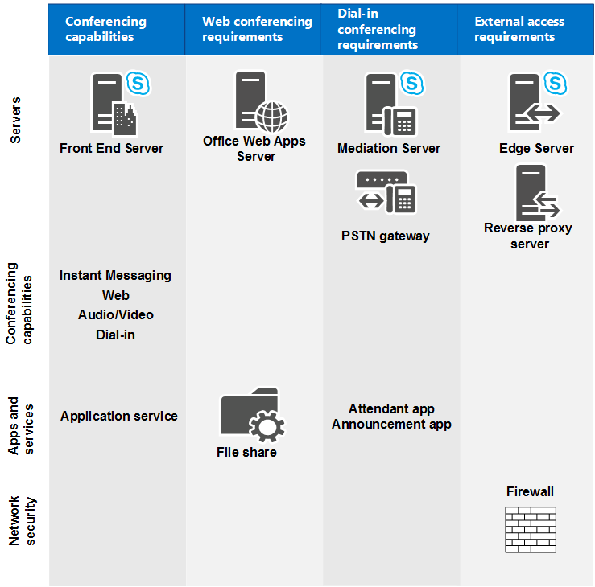

# Hardware and software requirements for conferencing in Skype for Business Server

**Summary:** Read this topic to learn about hardware and software requirements for conferencing in Skype for Business Server.

This section describes the hardware and software requirements for web conferencing, audio and video (A/V) conferencing, dial-in conferencing, and instant messaging (IM) conferencing. All conferencing capabilities run on Front End Servers; there are additional requirements for different types of conferencing, as shown in the following diagram.

For example, if you want to allow dial-in conferencing, you'll need to deploy a Mediation Server and a gateway for connecting to the public switched telephone network (PSTN). If you want to allow web conferencing, you'll need to ensure Skype for Business Server can connect to an Office Web Apps Server. If you want to allow external users to participate in conferences, you'll need to deploy an Edge Server.

**Conferencing capabilities and requirements**

 For more information about topology considerations, see [Plan your conferencing topology for Skype for Business Server](conferencing-topology.md).

## Hardware and software requirements for Front End Servers

Because web conferencing, A/V conferencing, dial-in conferencing, and IM conferencing are all collocated with the Front End Server, the server hardware and software requirements are the same as for the Front End Servers. For details about these requirements, see [Server requirements for Skype for Business Server 2015](../../plan-your-deployment/requirements-for-your-environment/server-requirements.md) and [Environmental requirements for Skype for Business Server 2015](../../plan-your-deployment/requirements-for-your-environment/environmental-requirements.md) or [Server requirements for Skype for Business Server 2019](../../../SfBServer2019/plan/system-requirements.md).

## Requirements for web conferencing

If you have chosen to enable web conferencing, you need to plan for the following:

- Access to the file store, which is used for storing web conferencing content.

- Integration with Office Web Apps Server, which is necessary in order to share PowerPoint files during a conference.

### File Store

The Skype for Business Server web conferencing service stores content shared during meetings in the file store. As part of deployment, you must specify a file share to be used as the file store for the Standard Edition server or Enterprise Edition Front End pool. You can use an existing file share for the file store, or you can specify a new file share by specifying the fully qualified domain name (FQDN) of the file server on which the file share is to be located and a folder name for the new file share. For more information, see [Create a file share in Skype for Business Server](../../deploy/install/create-a-file-share.md). The web conferencing service encrypts the content before it stores the content in the file store.

Skype for Business Server supports using file shares on either direct attached storage (DAS) or a storage area network (SAN), including Distributed File System (DFS), and on a redundant array of independent disks (RAID) for file stores. After the Skype for Business Server Deployment Wizard has defined the location of the file share, Skype for Business Server creates a folder structure within the file share similar to:

- 1-ApplicationServer-1

- 1-CentralMgmt-1

- 1-WebServices-1

  - CollabContent

  - CollabMetadata

  - DataConf

The web conferencing service then stores content such as PowerPoint slides, whiteboards, polls, and attachments in the CollabContent and CollabMetadata folders, located in the WebServices folder.

### Office Web Apps Server

In order to use web conferencing capabilities, you must install Office Web Apps Server and configure Skype for Business Server to communicate with Office Web Apps Server.

Office Web Apps Server should be installed on a stand-alone computer that is not running Skype for Business Server, SQL Server, or any other server application. (You must not have any version of Office installed on that computer.) Any computer used to run Office Web Apps Server must also have a specific set of software installed (including .NET Framework 4.5 and Windows PowerShell 3.0). These requirements, along with information about configuring certificates and Internet Information Services (IIS), are discussed in detail in the [Microsoft Office Web Apps Deployment website](https://go.microsoft.com/fwlink/p/?linkid=257525).

For information about how to configure Skype for Business Server to work with Office Web Apps Server, see [Configure integration with Office Web Apps Server in Skype for Business Server](../../deploy/deploy-conferencing/office-web-app-server.md).

## Requirements for audio and video conferencing

To plan for A/V conferencing, you need to understand the network bandwidth required by the type of conferencing media that your organization requires. This could include audio, video, and panoramic video. Without sufficient network bandwidth, the user experience may be severely degraded.

For information about audio and video capacity planning for conferences, see [Plan network requirements for Skype for Business](../../plan-your-deployment/network-requirements/network-requirements.md).

You can use call admission control (CAC) to manage the network bandwidth used by A/V conferencing. This is important for restricted networks, such as limited bandwidth links between central and branch sites. For details, see [Plan for call admission control in Skype for Business Server](../../plan-your-deployment/enterprise-voice-solution/call-admission-control.md).

If you deploy audio conferencing in your network, your users will need audio devices such as headsets to participate in an audio conference. If you deploy video conferencing, you need to deploy video devices, such as webcams for users. For both audio and video devices, device deployment and user training are important steps for you to consider. For more information, see [Plan for clients and devices](../../plan-your-deployment/clients-and-devices/clients-and-devices.md). Microsoft recommends that you use unified communications (UC) devices that are certified by Microsoft for all device types, to ensure an optimal user experience. For details about UC-certified devices, see [Phones and devices for Skype for Business](https://go.microsoft.com/fwlink/?LinkId=619916).

## Requirements for dial-in conferencing

Dial-in conferencing is an optional feature of the Skype for Business Server conferencing workload that includes a variety of components. Some of the components are specific to dial-in conferencing and some are Enterprise Voice components. This section describes the requirements for the components that are needed for dial-in conferencing. For details about Mediation Server and public switched telephone network (PSTN) gateway requirements, see [Mediation Server component in Skype for Business Server](../../plan-your-deployment/enterprise-voice-solution/mediation-server.md) and [Deploy a Mediation Server in Topology Builder in Skype for Business Server](../../deploy/deploy-enterprise-voice/deploy-a-mediation-server.md).

### Required components

You will need to install the following Skype for Business Server components before you can configure dial-in conferencing:

- Unified Communications Application Service (UCAS) (called the Application service)

- Conferencing Attendant application

- Conferencing Announcement application

- Dial-in Conferencing Settings webpage

- At least one Mediation Server and at least one PSTN gateway

For dial-in conferencing, Application service, Conferencing Attendant application, and Conferencing Announcement application have the same operating system requirements as Front End Servers. For details, see [Server requirements for Skype for Business Server 2015](../../plan-your-deployment/requirements-for-your-environment/server-requirements.md).

Conferencing Attendant application and Conferencing Announcement application require that Windows Media Format Runtime is installed on Front End Servers. Windows Media Format Runtime is required to play Windows Media audio (WMA) files that are used for music on hold, recorded names, and prompts. If you are installing on Windows Server 2012 or Windows Server 2012 R2 (which we recommend), you'll need to install Microsoft Media Foundation to get Windows Media Format Runtime. If you are installing on any version of Windows Server prior to Windows 2012, you need to make sure the Windows Desktop Experience is installed to get Windows Media Format Runtime.

### Audio file requirements for dial-in conferencing

Skype for Business Server does not support customization of voice prompts and music for dial-in conferencing. However, if you have a strong business need that requires you to change the default audio files, see Microsoft Knowledge Base article 961177, [How to customize voice prompts or music files for dial-in audio conferencing](https://go.microsoft.com/fwlink/p/?linkid=3052&amp;kbid=961177).

You can also use the [Microsoft Lync Server Conferencing Attendant Custom Voice Prompts](https://go.microsoft.com/fwlink/p/?LinkId=396880) management utility, which enables administrators to replace the default voice prompts used when a phone caller joins a Skype for Business meeting with custom prompts to provide a different meeting entry experience. The custom voice prompts can be installed on either an Enterprise or Standard Edition server.

Conferencing Attendant application and Conferencing Announcement application have the following requirements for music on hold, recorded name, and audio prompt files:

- Windows Media Audio (WMA) file format

- 16-bit mono

- 48 kbps 2-pass CBR (constant bit rate)

- Speech level at -24DB

### User requirements for dial-in conferencing

Dial-in conferencing users must have a unique phone number or extension assigned to their account. This requirement supports authentication during dial-in conferencing. Enterprise users (that is, users who have Active Directory Domain Services credentials and Skype for Business Server accounts within your organization) enter their phone number (or extension) and a personal identification number (PIN) to dial in to conferences as an authenticated user.

## Port requirements for conferencing

In order to use the conferencing features, Skype for Business Server requires that certain ports are open. The following table lists port requirements for conferencing. For details about all port requirements, see [Port and protocol requirements for servers](../../plan-your-deployment/network-requirements/ports-and-protocols.md).

**Required server ports**

|**Server role**|**Service name**|**Port**|**Protocol**|**Notes**|
|:-----|:-----|:-----|:-----|:-----|
|Front End Servers    |Skype for Business Server IM Conferencing service    |5062    |TCP    |Used for incoming SIP requests for instant messaging (IM) conferencing.    |
|Front End Servers    |Skype for Business Server Web Conferencing service    |8057    |TCP (TLS)    |Used to listen for Persistent Shared Object Model (PSOM) connections from client.    |
|Front End Servers    |Skype for Business Server Web Conferencing Compatibility service    |8058    |TCP (TLS)    |Used to listen for Persistent Shared Object Model (PSOM) connections from the Live Meeting client and previous versions of Skype for Business Server.    |
|Front End Servers    |Skype for Business Server Audio/Video Conferencing service    |5063    |TCP    |Used for incoming SIP requests for audio/video (A/V) conferencing.    |
|Front End Servers    |Skype for Business Server Audio/Video Conferencing service    |57501-65535    |TCP/UDP    |Media port range used for video conferencing.    |
|Front End Servers    |Skype for Business Server Conferencing Attendant service (dial-in conferencing)    |5064    |TCP    |Used for incoming SIP requests for dial-in conferencing.    |
|Front End Servers    |Skype for Business Server Conferencing Attendant service (dial-in conferencing)    |5072    |TCP    |Used for incoming SIP requests for Attendant (dial in conferencing).    |
|Front End Servers    |Skype for Business Server Application Sharing service    |5065    |TCP    |Used for incoming SIP listening requests for application sharing.    |
|Front End Servers    |Skype for Business Server Application Sharing service    |49152-65535    |TCP    |Media port range used for application sharing.    |
|Front End Servers    |Skype for Business Server Conferencing Announcement service    |5073    |TCP    |Used for incoming SIP requests for the Skype for Business Server Conferencing Announcement service (that is, for dial-in conferencing).    |
|All internal servers    |Various    |49152-57500    |TCP/UDP    |Media port range used for audio conferencing on all internal servers. Used by all servers that terminate audio: Front End Servers (for Skype for Business Server Conferencing Attendant service, Skype for Business Server Conferencing Announcement service, and Skype for Business Server Audio/Video Conferencing service), and Mediation Server.    |
|Office Web Apps Servers    ||443    ||Used by Skype for Business Server to connect to Office Web Apps Server.    |

**Required client ports**

|**Port**|**Protocol**|**Notes**|
|:-----|:-----|:-----|
|443    |TCP (PSOM/TLS)    |Used for external user access to web conferencing sessions.    |
|443    |TCP (STUN/MSTURN)    |Used for external user access to A/V sessions and media (TCP)    |
|3478    |UDP (STUN/MSTURN)    |Used for external user access to A/V sessions and media (UDP)    |
|1024-65535 \*    |TCP/UDP    |Audio port range (minimum of 20 ports required)    |
|1024-65535 \*    |TCP/UDP    |Video port range (minimum of 20 ports required).    |
|1024-65535 \*    |TCP    |Application sharing.    |

