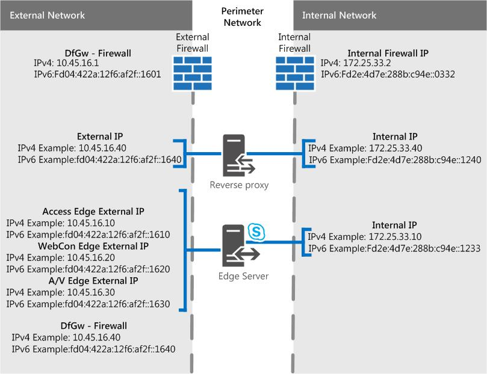
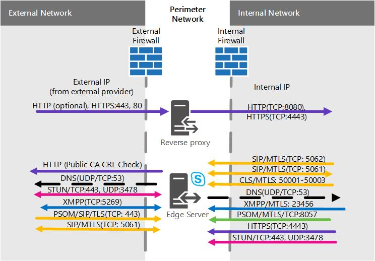
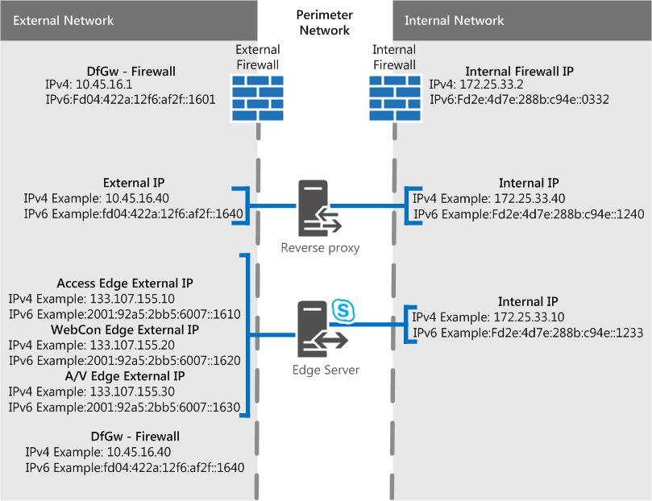
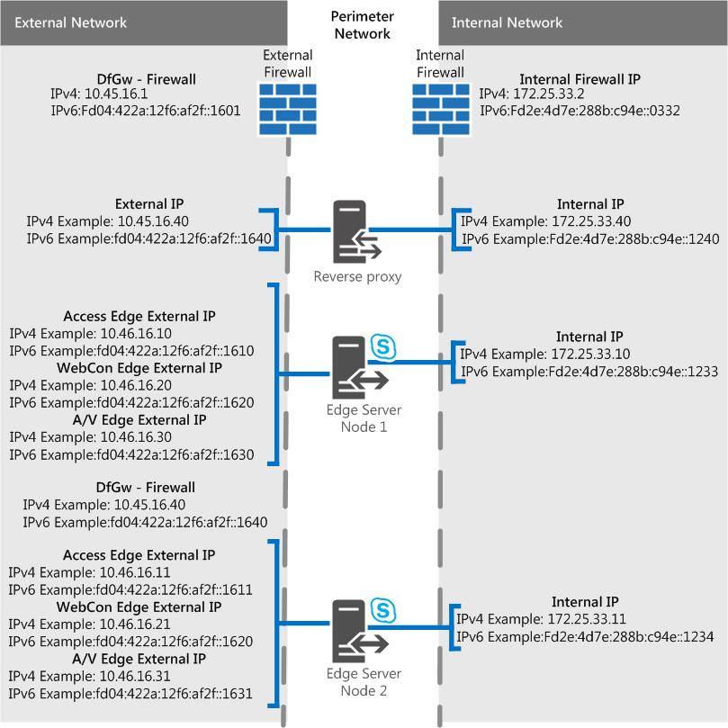
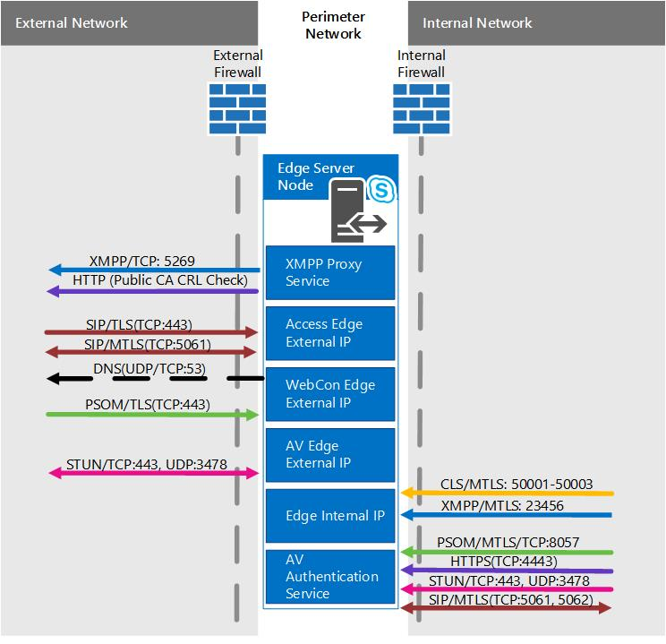
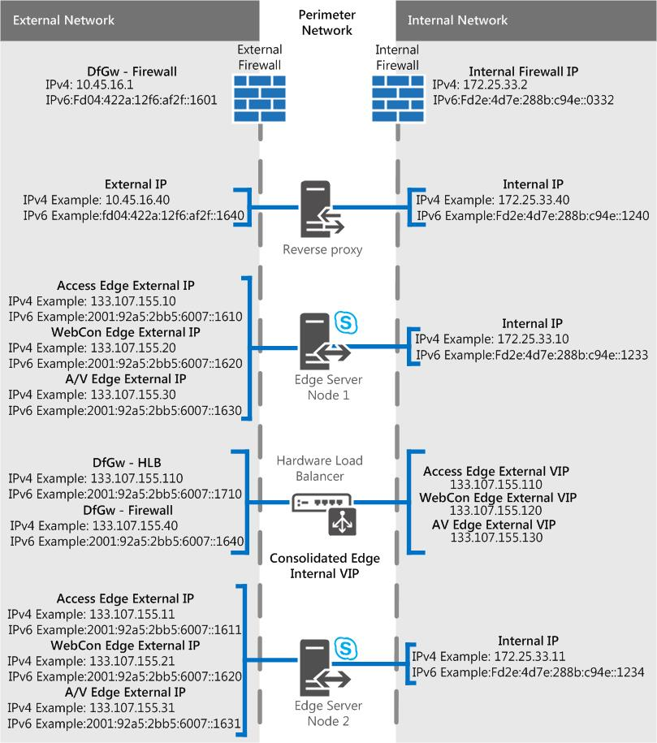

# Edge Server scenarios in Skype for Business Server
 
**Summary:** Review these scenarios to help you plan your Edge Server topology in Skype for Business Server.
  
We have some scenarios diagrams to assist with visualizing and deciding on what Skype for Business Server Edge Server topology you want to implement. Once you've picked a good candidate, you can go read up on the environmental requirements you'll need to address. The following is applicable to any of the scenarios, so we're mentioning it first.
  
These figures, which are shown for example purposes only (and as such contains sample IPv4 and IPv6 data), don't represent the actual communication flow, but rather a high-level view of your possible traffic. Port details can also be seen in the Port diagrams for each scenario below.
  
The diagrams show .com for the external interface and .net for the internal, which is also sample material; of course your own entries may be quite different when you're putting together your own final Edge plan.
  
We don't include the Director (which is an optional component) in any of the diagrams, but you can read about that separately (it's mentioned in other Planning topics).
  
As noted above, there is sample IPv6 data in the diagrams. Most of the documentation in [Plan for Edge Server deployments in Skype for Business Server](edge-server-deployments.md) will refer to IPv4, but you are certainly supported if you want to use IPv6. Note that you'll need IPv6 addresses in your assigned address space, and they'll need to work with internal and external addressing, as with IPv4 IPs. You can, thanks to Windows, employ the dual stack feature, which is a separate and distinct network stack for IPv4 and IPv6. This will, if you need, allow you to assign IPv4 and IPv6 addresses concurrently.
  
There are NAT devices that allow for NAT64 (IPv6 to IPv4) and NAT66 (IPv6 to IPv6)), and this is valid for use with Skype for Business Server.
  
> [!IMPORTANT]
> If you're using Call Admission Control (CAC) you do have to use IPv4 on the internal interface for it to work. 
  
## Single consolidated Skype for Business Server Edge Server with private IP addresses and NAT

With this scenario, there is no option for high availability. This will mean you spend less on hardware and have a simpler deployment. If high availability is a must, check out the Scaled consolidated scenarios below.
  

  
### Port diagram

We also have a diagram for ports for single consolidated Edge Servers.
  

  
## Single consolidated Skype for Business Server Edge Server with public IP addresses

With this scenario, there is no option for high availability. This will mean you spend less on hardware and have a simpler deployment. If high availability is a must, check out the Scaled consolidated scenarios below.
  

  
### Port diagram

We also have a diagram for ports for single consolidated Edge Servers.
  

  
## Scaled consolidated Skype for Business Server Edge pool, with DNS load balancing, and private IP addresses and NAT

With this scenario, you are able to have high availability in your Edge deployment, which gives you the advantages of scalability and failover support.
  

  
### Port diagram

We also have a diagram for scaled consolidated Edge pools with DNS load balancing.
  

  
## Scaled consolidated Skype for Business Server Edge pool, with DNS load balancing and public IP addresses

With this scenario, you are able to have high availability in your Edge deployment, which gives you the advantages of scalability and failover support.
  

  
### Port diagram

We also have a diagram for scaled consolidated Edge pools with DNS load balancing.
  

  
## Scaled consolidated Skype for Business Server Edge pool, with hardware load balancing

With this scenario, you are able to have high availability in your Edge deployment, which gives you the advantages of scalability and failover support.
  

  
### Port diagram

We also have a diagram for scaled consolidated Edge pools with hardware load balancing
  

  

