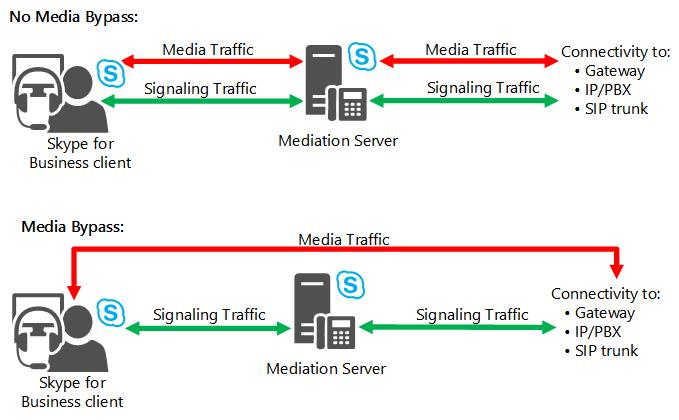
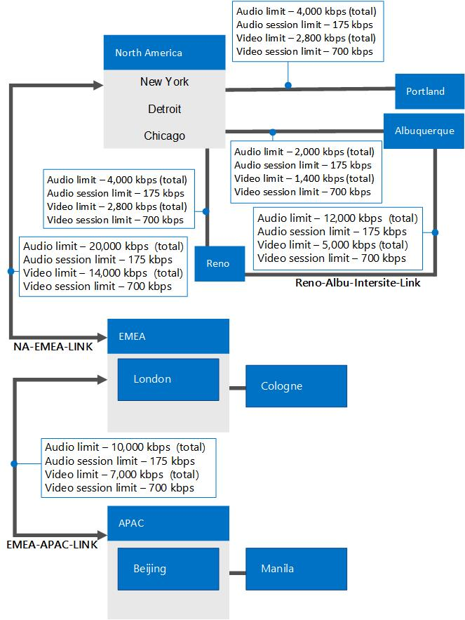

# Plan for call admission control in Skype for Business Server

Learn about call admission control, which can prevent calls from taking place if they would have poor media quality, in Skype for Business Server Enterprise Voice.

For IP-based applications such as telephony, video, and application sharing, the available bandwidth of enterprise networks is not generally considered to be a limiting factor within LAN environments. However, on WAN links that interconnect sites, network bandwidth can be limited.

When network traffic oversubscribes a WAN link, current mechanisms such as queuing, buffering, and packet dropping are used to resolve the congestion. The extra traffic is typically delayed until the network congestion eases or, if necessary, the traffic is dropped. For conventional data traffic in such situations, the receiving client can recover. However, for real-time traffic such as unified communications, network congestion cannot be resolved in this manner, because the unified communications traffic is sensitive to both latency and packet loss. Congestion on the WAN can result in a poor Quality of Experience (QoE) for users. For real-time traffic in congested conditions, it is actually better to deny calls than to provide connections with poor quality.

Call admission control (CAC) determines whether there is sufficient network bandwidth to establish a real-time session of acceptable quality. In Skype for Business Server, CAC controls real-time traffic only for audio and video, but it does not affect data traffic. If the default WAN path does not have the required bandwidth, CAC can attempt to route the call through an Internet path or the public switched telephone network (PSTN).

This section describes the call admission control functionality and explains how to plan for CAC.

> [!NOTE]
> Skype for Business Server has three advanced Enterprise Voice features: call admission control (CAC), emergency services (E9-1-1), and media bypass. For an overview of planning information that is common to all three of these features, see [Network settings for the advanced Enterprise Voice features in Skype for Business Server](network-settings-for-advanced-features.md).

The CAC design in Skype for Business Server offers four main attributes:

- It is simple to deploy and manage without requiring additional equipment, such as specially configured routers.

- It addresses critical unified communications use cases, such as roaming users and multiple points of presence. CAC policies are enforced according to where the endpoint is located, not where the user is homed.

- In addition to voice calls, it can be applied to other traffic, such as video calls and audio/video conferencing sessions.

- Provides the flexibility to enable representation of various kinds of network topologies.

If a new voice or video session exceeds the bandwidth limits that you have set on a WAN link, the session is either blocked or (for phone calls only) rerouted to the PSTN.

CAC controls real-time traffic for voice and video only. It does not control data traffic.

Administrators define CAC policies, which are enforced by the Bandwidth Policy Service that is installed with every Front End pool. CAC settings are automatically propagated to all Skype for Business Server Front End Servers in your network.

For calls that fail because of CAC policies, the order of precedence for rerouting the call is as follows:

1. Internet

2. PSTN

3. Voice mail

Call detail recording (CDR) captures information about calls that are rerouted to the PSTN or to voice mail. CDR does not capture information about calls that are rerouted to the Internet, because the Internet is treated as an alternate path rather than a secondary option.

> [!NOTE]
> Voice mail deposits will not be denied because of bandwidth constraints.

The Bandwidth Policy Service generates two types of log files in comma separated values (CSV) format. The **check failures** log file captures information when bandwidth requests are denied. The **link utilization** log file captures a snapshot of the network topology and the WAN link bandwidth utilization. Both of these log files can assist you in fine-tuning your CAC policies based on utilization.

## Call Admission Control Considerations

The administrator selects to install the Bandwidth Policy Service on the first pool configured in the central site. Since there is a single central site per network region, there is only one Bandwidth Policy Service per network region, which manages bandwidth policy for that region, its associated sites and the links to those sites. The Bandwidth Policy Service runs as part of the Front End Servers, and therefore high availability is built-in within that pool. The Bandwidth Policy Service running on each Front End Server synchronizes every 15 seconds. If the Front End pool fails, CAC policies are no longer enforced for that site until the Front End pool and consequently the Bandwidth Policy Service becomes operational again. This implies that all calls will go through for the duration the Bandwidth Policy Service is out of service. Therefore there is the possibility of bandwidth oversubscription of your links during this period

The Bandwidth Policy Service provides high availability within a Front End pool; however, it does not provide redundancy across Front End pools. The Bandwidth Policy Service cannot failover from one Front End pool to another. Once service to the Front End pool is restored, the Bandwidth Policy Service is resumed and can enforce bandwidth policy checks again.

### Network Considerations

Although bandwidth restriction for audio and video is enforced by the Bandwidth Policy Service in Skype for Business Server, this restriction is not enforced at the network router (layer 2 and 3). CAC cannot prevent a data application, for example, from consuming the entire network bandwidth on a WAN link, including the bandwidth that is reserved for audio and video by your CAC policy. To protect the necessary bandwidth on your network, you can deploy a Quality of Service (QoS) protocol such as Differentiated Services (DiffServ). Therefore, a best practice is to coordinate the CAC bandwidth policies you define with any QoS settings that you might deploy.

### Media and Signaling Paths over VPN

If your enterprise supports media through VPN, ensure that either both the media stream and the signaling stream go through the VPN or both are routed through the internet. By default, the media and signaling streams go through the VPN tunnel.

### Call Admission Control of Outside Users

Call admission control is not enforced beyond the limits of the Skype for Business Server organization. CAC cannot be applied to the media traffic traversing the Internet, which is not managed by Skype for Business Server. CAC checks will be performed on the portion of the call that flows through the enterprise network if the called endpoint belongs to the organization, and the Edge Server has been added to the network configuration, as described in [Call admission control deployment: final checklist for Skype for Business Server](../../deploy/deploy-enterprise-voice/final-checklist.md). If the called endpoint doesn't belong to the organization, such as a federated or PIC user, no bandwidth policy checks are performed and the outgoing call will ignore any CAC restrictions.

### Call Admission Control of PSTN Connections

Call admission control is enforceable on the Mediation Server regardless of whether it is connected to an IP/PBX, a PSTN gateway, or a SIP trunk. Because the Mediation Server is a back-to-back user agent (B2BUA), it terminates media. It has two connection sides: a side that is connected to Skype for Business Server and a gateway side, which is connected to PSTN gateways, IP/PBXs, or SIP trunks. For details about PSTN connections, see [Plan for PSTN connectivity in Skype for Business Server](pstn-connectivity-0.md).

CAC can be enforced on both sides of the Mediation Server unless media bypass is enabled. If media bypass is enabled, the media traffic doesn't traverse the Mediation Server but instead flows directly between the Skype for Business client and the gateway. In this case, CAC is not needed. For details, see [Plan for media bypass in Skype for Business](media-bypass.md).

The following figure illustrates how CAC is enforced on PSTN connections with and without media bypass enabled.

**Call admission control enforcement on connections to the PSTN**

## Defining your requirements for call admission control

Planning for call admission control (CAC) requires detailed information about your enterprise network topology. To help plan your call admission control policies, follow these steps.

1. Identify the hubs/backbones (called network regions) within your enterprise network.

2. Identify the offices or locations (called network sites) within each network region.

3. Determine the network route between every pair of network regions.

4. Determine the bandwidth limits for each WAN link.

    > [!NOTE]
    > Bandwidth limits refer to how much of the bandwidth on a WAN link is allocated to Enterprise Voice and audio/video traffic. When a WAN link is described as "bandwidth-constrained," the WAN link has a bandwidth limit that is lower than the expected peak traffic over the link.

5. Identify the IP subnets that are assigned to each network site.

To explain these concepts, we'll use the example network topology shown in the following figure.

**Example topology for call admission control**

> [!NOTE]
> All network sites are associated with a network region. For example, Portland, Reno, and Albuquerque are included in the North America region. In this figure, only WAN links that have CAC policies applied are shown, with bandwidth limits. The network sites of Chicago, New York, and Detroit are shown inside the North America region oval because they are not bandwidth-constrained, and therefore do not require CAC policies.

The components of this example topology are explained in the following sections. For details about how this topology was planned, including the bandwidth limits, see [Example: Gathering requirements for call admission control in Skype for Business Server](example-gathering-requirements.md).

### Identify Network Regions

A network region represents a network backbone or a network hub.

A network backbone or hub is a part of computer network infrastructure that interconnects different parts of the network, providing a path for the exchange of information between different LANs or subnets. A backbone can tie together diverse networks from a small location to a wide geographic area. The backbone's capacity is typically greater than that of the networks that connect to it.

Our example topology has three network regions: North America, EMEA, and APAC. A network region contains a collection of network sites (see the definition of network sites later in this topic). Work with your network operations team to identify your network regions.

### Associating a Central Site with each Network Region

CAC requires that a Skype for Business Server central site is defined for each network region. The central site is selected with the best network connectivity and highest bandwidth to all the other sites within that network region. The preceding example of network topology shows three network regions, each with a central site that manages CAC decisions. From the preceding example, the appropriate association is shown in the following table.

> [!NOTE]
> Central sites do not necessarily correspond to network sites. In the examples in this documentation, some central sites—Chicago, London, and Beijing—share the same name as the network sites. However, even if a central site and network site share the same name, the central site is an element of the Skype for Business Server topology, whereas the network site is a part of the overall network in which the Skype for Business Server topology resides.

**Network regions, central sites, and network sites**

|**Network Region**|**Central Site**|**Network Sites**|
|:-----|:-----|:-----|
|North America    |Chicago    |Chicago    New York    Detroit    Portland    Reno    Albuquerque    |
|EMEA    |London    |London    Cologne    |
|APAC    |Beijing    |Beijing    Manila    |

### Identify Network Sites

A network site represents a location where your organization has a physical venue—for example, offices, a set of buildings, or a campus. A physical venue with a LAN and has WAN connectivity to other sites is considered a network site. Start by inventorying all of your organization's offices. In our example topology, the North America network region consists of the following network sites: New York, Chicago, Detroit, Portland, Reno, and Albuquerque.

You must associate every network site with a network region. Depending on whether the network site has a constrained WAN link, a bandwidth policy is associated with the network site. For details about CAC policies and the bandwidth that you allocate by using them, see "Define Bandwidth Policies" later in this topic. To configure CAC, you associate network sites with network regions, and then you create bandwidth-allocating policies to apply to the bandwidth-constrained connections between a given site or region and the WAN connections between the sites and regions.

### Identify Network Links

Network links represent connections to the physical WAN that links different regions and sites. In our example topology, there are two regional network links, five network links between regions and sites, and one network link between two sites.

The two regional links are between North America and EMEA, represented as NA-EMEA-LINK, and between APAC and EMEA, represented as EMEA-APAC-LINK.

The site links are indicated by the lines connecting Portland, Reno, and Albuquerque to the North America region, Manila to the APAC region, and Cologne to the EMEA region. The line between Reno and Albuquerque shows a direct network link between these two sites.

### Define Bandwidth Policies

Work with your network operations team to determine how much WAN bandwidth is available for real-time audio and video traffic across the WAN links in your organization. Bandwidth policies are typically applied to WAN links if the bandwidth usage is constrained; that is, if it expected to be more than the bandwidth that can be allocated for audio and video modalities.

CAC bandwidth policies define the maximum bandwidth that can be reserved for real-time audio and video modalities. Since CAC does not limit the bandwidth of other traffic, it cannot prevent other data traffic such as a large file transfer, music streaming, from using up all of the network bandwidth.

CAC bandwidth policies can define any or all of the following:

- Maximum total bandwidth allocated for audio.

- Maximum total bandwidth allocated for video.

- Maximum bandwidth allocated for a single audio call (session).

- Maximum bandwidth allocated for a single video call (session).

> [!NOTE]
> All CAC bandwidth values represent the maximum  *unidirectional*  bandwidth limits.

> [!NOTE]
> The Skype for Business Server Voice Policy features provide the ability to override bandwidth policy checks for incoming calls to the user (not for outgoing calls that are placed by the user). After the session is established, the bandwidth consumption will be accurately accounted for. This setting should be used sparingly. For details, see [Create or modify a voice policy and configure PSTN usage records in Skype for Business](../../deploy/deploy-enterprise-voice/voice-policy-and-pstn-usage-records.md) or [Modify a Voice Policy and Configure PSTN Usage Records](https://technet.microsoft.com/library/6c53aaf5-218b-4bd4-8cea-31bc9d53f1bd.aspx) in the Deployment documentation.

To optimize bandwidth utilization on a per-session basis, consider the type of audio and video codecs that will be used. In particular, avoid allocating insufficient bandwidth for a codec that you expect to be used frequently. Conversely, if you want to prevent media from using a codec that requires more bandwidth, you should set the maximum bandwidth per session low enough to discourage such use. For audio, not every codec is available for every scenario. For example:

- Peer-to-peer audio calls between Skype for Business endpoints will use either RTAudio (8kHz) or RTAudio (16kHz) when you factor in the bandwidth and prioritization of codecs.

- Conference calls between Skype for Business endpoints and the A/V Conferencing service will use either G.722 or Siren.

- Calls to the public switched telephone network (PSTN) either to or from Skype for Business endpoints will use either G.711 or RTAudio (8kHz).

Use the following table to help optimize the maximum per-session bandwidth settings.

**Bandwidth utilization by codecs**

|**Codec**|**Bandwidth requirement with no forward error correction (FEC)**|**Bandwidth requirement with forward error correction (FEC)**|
|:-----|:-----|:-----|
|RTAudio (8kHz)    |49.8 kbps    |61.6 kbps    |
|RTAudio (16kHz)    |67 kbps    |96 kbps    |
|Siren    |57.6 kbps    |73.6 kbps    |
|G.711    |102 kbps    |166 kbps    |
|G.722    |105.6 kbps    |169.6 kbps    |
|RTVideo (CIF 15 fps)    |260 kbps    |Not applicable    |
|RTVideo (VGA 30 fps)    |610 kbps    |Not applicable    |

> [!NOTE]
> Bandwidth requirements take into account overhead for the following: Ethernet II, IP, User Datagram Protocol (UDP), RTP (real-time transport protocol), and SRTP (secure real-time transport protocol). They also include 10 kbps for RTCP overhead.

The G.722.1 and Siren codecs are similar, but they offer different bit rates.

G.722, the default codec for Skype for Business Server conferencing, is completely different from the G.722.1 and Siren codecs.

The Siren codec is used in Skype for Business Server in the following situations:

- If the bandwidth policy is set too low for G.722 to be used.

- If a Communications Server 2007 or Communications Server 2007 R2 client connects to a Skype for Business Server conferencing service (because those clients do not support the G.722 codec).

**Bandwidth utilization by scenario**

|**Scenario**|**Bandwidth requirement optimized for quantity (kbps)**|**Bandwidth requirement for Balanced mode (kbps)**|**Bandwidth requirement optimized for quality (kbps)**|
|:-----|:-----|:-----|:-----|
|Peer-to-peer audio calls    |45 kbps    |62 kbps    |91 kbps    |
|Conference calls    |53 kbps    |101 kbps    |165 kbps    |
|PSTN calls (between Skype for Business and PSTN gateway, with media bypass)    |97 kbps    |97 kbps    |161 kbps    |
|PSTN calls (between Skype for Business and Mediation Server, without media bypass)    |45 kbps    |97 kbps    |161 kbps    |
|PSTN calls (between Mediation Server and PSTN gateway, without media bypass)    |97 kbps    |97 kbps    |161 kbps    |
|Skype for Business - Polycom calls    |101 Kbps    |101 Kbps    |101 Kbps    |

### Identify IP Subnets

For each network site, you will need to work with your network administrator to determine what IP subnets are assigned to each network site. If your network administrator has already organized the IP subnets into network regions and network sites, then your work is significantly simplified.

In our example, the New York site in the North America region is assigned the following IP subnets: 172.29.80.0/23, 157.57.216.0/25, 172.29.91.0/23, 172.29.81.0/24. Suppose Bob, who typically works in Detroit, travels to the New York office for training. When he turns on his computer and connects to the network, his computer will get an IP address in one of the four ranges reserved for New York, for example 172.29.80.103.

> [!CAUTION]
> The IP subnets specified during network configuration on the server must match the format provided by client computers in order to be properly used for media bypass. A Skype for Business client takes its local IP address and masks the IP address with the associated subnet mask. When determining the bypass ID associated with each client, the Registrar will compare the list of IP subnets associated with each network site against the subnet provided by the client for an exact match. For this reason, it is important that subnets entered during network configuration on the server are actual subnets instead of virtual subnets. (If you deploy call admission control, but not media bypass, call admission control will function properly even if you configure virtual subnets.) For example, if a client signs in on a computer with an IP address of 172.29.81.57 with an IP subnet mask of 255.255.255.0, Skype for Business will request the bypass ID associated with subnet 172.29.81.0. If the subnet is defined as 172.29.0.0/16, although the client belongs to the virtual subnet, the Registrar will not consider this a match because the Registrar is specifically looking for subnet 172.29.81.0. Therefore, it is important that the administrator enters subnets exactly as provided by Skype for Business clients (which are provisioned with subnets during network configuration either statically or by DHCP.)

## Best practices for call admission control

To enhance performance and facilitate deployment, apply the following best practices when you deploy call admission control:

- Ensure that WANs are adequately provisioned for current and anticipated media traffic.

    > [!NOTE]
    > We recommend that you factor in a buffer to your bandwidth limits. There are scenarios such as race conditions that affect the total bandwidth used and can result in situations where the bandwidth limit is exceeded. For example, if two calls try to start while media traffic is approaching a bandwidth limit, one of them may be denied because the other managed to start first.

- Monitor network usage and call detail records so that you can choose optimal CAC settings and update CAC settings as network usage changes.

- Use CAC bandwidth policies to complement QoS settings.

- If you want to re-route blocked calls onto the PSTN, verify PSTN functionality and capacity. For details, see [Planning Outbound Call Routing](https://technet.microsoft.com/library/37c55fa4-175a-4190-b9e4-c2e5ac7b9261.aspx).

    > [!NOTE]
    > Capacity refers to the number of ports you need to open to support potential PSTN re-routing.

