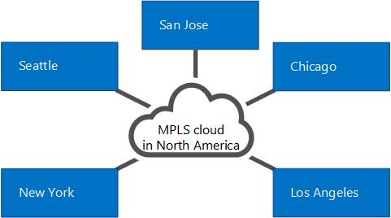
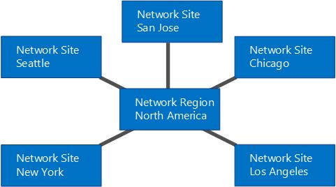
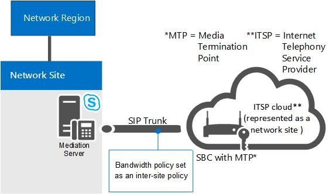
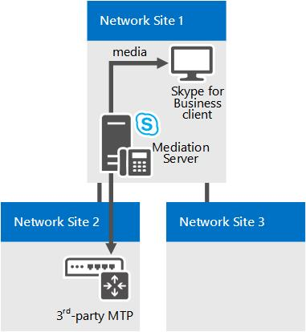

# Components and topologies for call admission control in Skype for Business

Planning for call admission control (CAC) if you have an MPLS network, a SIP trunk, or a third-party PSTN gateway or PBX. Applies to Skype for Business Server Enterprise Voice.

The topics in this section provide information about special considerations for deploying call admission control (CAC) with various types of network topologies.

## Call admission control on an MPLS network

In a Multiprotocol Label Switching (MPLS) network, all sites are connected by a full-mesh. That is, all sites are connected directly to the MPLS backbone of the Internet service provider, and each site is provisioned bandwidth to be used across a WAN link to the MPLS cloud. There is no network hub or central site to control IP routing. The following figure shows a simple network based on MPLS technology.

**Example MPLS network**

To deploy call admission control (CAC) in an MPLS network, you create a network region to represent the MPLS cloud, and create a network site to represent each MPLS satellite site. The following figure illustrates how the network region and network sites should be configured to represent the example MPLS network in the previous figure. The overall bandwidth limits and bandwidth session limits are then based on the capacity of the WAN link from each network site to the network region that represents the MPLS cloud.

**Network region and network sites for an MPLS network**

## Call admission control on a SIP trunk

To deploy call admission control (CAC) on a SIP trunk, you create a network site to represent the Internet telephony service provider (ITSP). To apply bandwidth policy values on the SIP trunk, you create an inter-site policy between the network site in your enterprise and the network site that you create to represent the ITSP.

The following figure shows an example CAC deployment on a SIP trunk.

**CAC configuration on a SIP trunk**

To configure CAC on a SIP trunk, you will have to perform the following tasks during CAC deployment:

1. Create a network site to represent the ITSP. Associate the network site to an appropriate network region, and allocate bandwidth of zero for audio and video for this network site. For details, see [Configure Network Sites for CAC](https://technet.microsoft.com/library/afcea38f-5789-45ec-97af-c6e38364950c.aspx) in the Deployment documentation.

    > [!NOTE]
    > For the ITSP, this network site configuration is not functional. Bandwidth policy values are actually applied in step 2.

2. Create an inter-site link for the SIP trunk using the relevant parameter values for the site you created in step 1. For example, use the name of the network site in your enterprise as the value of the NetworkSiteID1 parameter, and the ITSP network site as the value of the NetworkSiteID2 parameter. For details, see [Create network intersite policies in Skype for Business Server](../../deploy/deploy-enterprise-voice/create-network-intersite-policies.md) in the Deployment documentation, and [New-CsNetworkInterSitePolicy](https://docs.microsoft.com/powershell/module/skype/new-csnetworkintersitepolicy?view=skype-ps).

3. Get the IP address of the Session Border Controller's (SCB) Media Termination Point from your ITSP. Add that IP address with a subnet mask of 32 to the network site that represents the ITSP. For details, see [Associate a Subnet with a Network Site](https://technet.microsoft.com/library/aa69e3ac-542a-4ba1-9582-2e6bee29f633.aspx).

## Call admission control with a third-party PSTN gateway or PBX

This topic describes examples of how call admission control (CAC) can be deployed on the link between the Mediation Server's gateway interface and a third-party public switched telephone network (PSTN) gateway or private branch exchange (PBX).

### Case 1: CAC between the Mediation Server and a PSTN gateway

CAC can be deployed on the WAN link from the Mediation Server's gateway interface to a third-party PBX or PSTN gateway.

**Case 1: CAC between the Mediation Server and a PSTN gateway**

In this example, CAC is applied between the Mediation Server and a PSTN gateway. If a Skype for Business client user at Network Site 1 places a PSTN call through the PSTN gateway in Network Site 2, the media flows through the WAN link. Therefore, two CAC checks are performed for each PSTN session:

- Between the Skype for Business client application and the Mediation Server

- Between the Mediation Server and the PSTN gateway

This works for both incoming PSTN calls to a client in Network Site 1, and for outgoing PSTN calls originating from a client application in Network Site 1.

> [!NOTE]
> Make sure that the IP subnet that the PSTN gateway belongs to is configured and associated with Network Site 2.

> [!NOTE]
> Make sure that the IP subnet that both interfaces of the Mediation Server belong to is configured and associated with Network Site 1.

> [!NOTE]
> For details, see [Associate a Subnet with a Network Site](https://technet.microsoft.com/library/aa69e3ac-542a-4ba1-9582-2e6bee29f633.aspx).

### Case 2: CAC between the Mediation Server and a third-party PBX with Media Termination Point

This configuration is similar to Case 1. In both the cases, the Mediation Server knows what device terminates media at the opposite end of the WAN link, and the IP address of the PSTN gateway or PBX with Media Termination Point (MTP) is configured on the Mediation Server as the next hop.

**Case 2: CAC between the Mediation Server and a third-party PBX with MTP**

In this example, CAC is applied between the Mediation Server and the PBX/MTP. If a Skype for Business client user at the Network Site 1 places a PSTN call through the PBX/MTP located in Network Site 2, the media flows through the WAN link. Therefore, for each PSTN session two CAC checks are performed:

- Between the Skype for Business client application and the Mediation Server

- Between the Mediation Server and the PBX/MTP

This works for both incoming PSTN calls to a client in Network Site 1, and outgoing PSTN calls originating from a client in Network Site 1.

> [!NOTE]
> Make sure that the IP subnet that the MTP belongs to is configured and associated with Network Site 2.

> [!NOTE]
> Make sure that the IP subnet that both interfaces of the Mediation Server belong to is configured and associated with Network Site 1.

> [!NOTE]
> For details, see [Associate a Subnet with a Network Site](https://technet.microsoft.com/library/aa69e3ac-542a-4ba1-9582-2e6bee29f633.aspx).

### Case 3: CAC between the Mediation Server and a third-party PBX without a Media Termination Point

Case 3 is slightly different from the first two cases. If there is no MTP on the third-party PBX, for an outgoing session request to the third-party PBX the Mediation Server does not know where media will terminate in the PBX boundary. In this case, the media flows directly between the Mediation Server and the third-party endpoint device.

**Case 3: CAC between the Mediation Server and a third-party PBX without MTP**

In this example, if a Skype for Business client user at Network Site 1 places a call to a user through the PBX, the Mediation Server is able to perform CAC checks only on the proxy leg (between the Skype for Business client application and Mediation Server). Because the Mediation Server does not have information about the endpoint device while the session is being requested, CAC checks cannot be performed on the WAN link (between the Mediation Server and the third-party endpoint) prior to call establishment. After the session is established, however, the Mediation Server facilitates in accounting for the bandwidth used on the trunk.

For calls that originate from the third-party endpoint, the information about that endpoint device is available at the time of session request and CAC check can be performed on both the sides of the Mediation Server.

> [!NOTE]
> Make sure that the IP subnet that the endpoint devices belong to is configured and associated with Network Site 2.

> [!NOTE]
> Make sure that the IP subnet that both interfaces of the Mediation Server belong to is configured and associated with Network Site 1.

> [!NOTE]
> For details, see [Associate a Subnet with a Network Site](https://technet.microsoft.com/library/aa69e3ac-542a-4ba1-9582-2e6bee29f633.aspx).

